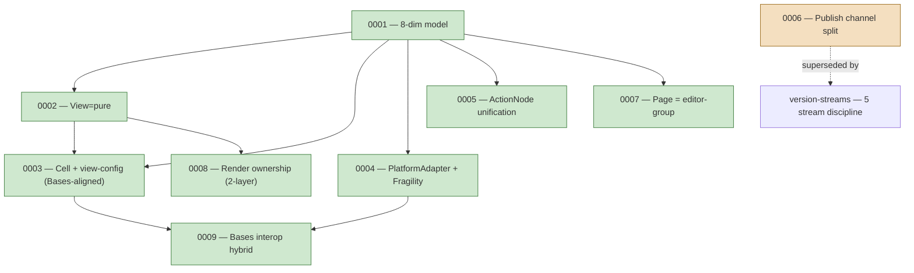

# Decision Graph

Cross-reference map of architecture decisions: ADRs (Accepted), their dependencies, and any supersessions. Per [[docs/architecture/agent-memory-routing-best-practices|agent-memory-routing-best-practices]] (P1 seed) — prevents re-litigating settled decisions; clarifies the chain.

Sub-decisions (changes that didn't warrant a new ADR) live in [[docs/work/hardening/research/2026-05-25-architecture-foundation-discovery/decision-changelog|decision-changelog]].

## ADRs (current state)

| ID | Title | Status | Depends on | Superseded by |
|---|---|---|---|---|
| 0001 | Eight-dimension architecture model | Accepted | — | — |
| 0002 | View = pure renderer | Accepted | 0001 | — |
| 0003 | Cell + view-config, Bases-aligned | Accepted | 0001, 0002 | — |
| 0004 | PlatformAdapter + Fragility Registry | Accepted | 0001 | — |
| 0005 | ActionNode unification | Accepted | 0001 | — |
| 0006 | Publish channel split (2-channel predecessor) | Superseded as active guidance | — | version-streams (`main=stable`, `dev=beta/nightly`, `sandbox=canary`) |
| 0007 | Page = editor-group | Accepted | 0001 | — |
| 0008 | Render ownership: data-plane vs shared runtime | Accepted | 0002, 0001 | — |
| 0009 | Bases interop strategy: native-primary + opt-in `registerBasesView` add-on | Accepted | 0003, 0004 | — |

## Dependency graph

## Supersessions (within the ADR set)

ADR 0006 is superseded as active publish guidance by [[docs/work/hardening/research/2026-05-27-version-streams-distillation/index|version-streams]]:
`main=stable`, `dev=beta/nightly`, `sandbox=canary`. The ADR remains the historical predecessor for the stable-user-protection principle; current branch/channel mechanics belong to `version-streams` + the `publish` initiative.

## Sub-decision pointers

Routine refinements (not ADR-worthy) tracked elsewhere:
- [[docs/work/hardening/research/2026-05-25-architecture-foundation-discovery/decision-changelog|decision-changelog]] — chronological supersession trail (FilterGroup vs serviceGroup · proto stream direction · Bases OUT shape · Bases interop strategy).
- [[docs/work/hardening/research/2026-05-25-architecture-foundation-discovery/decision-ledger|decision-ledger]] — current locked state across all axes.
- [[docs/architecture/pending-decisions|pending-decisions]] — dev-blocked decisions (S-1..S-11+).

## Process

- When a new ADR is Accepted: add a row + a `flowchart` node + edges to its dependencies.
- When an ADR is superseded: change status to Superseded; add the superseding ADR; draw the supersession edge.
- Keep the graph minimal — link to the ADRs for full prose; don't restate decision content here.

## Status

Seed 2026-05-28. Update on every ADR Accepted / Superseded event.
