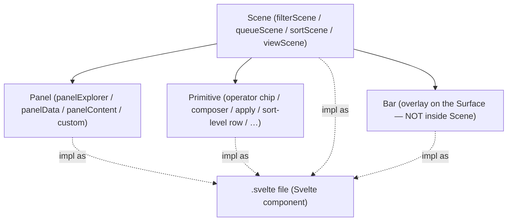

# Developer Glossary

Onboarding-flavored glossary that disambiguates **two layers**: VM domain terms (the architecture's own
vocabulary) and technical terms (Svelte / TypeScript / Obsidian implementation vocabulary). Designed for
the dev, the agent, and external contributors. For full definitions see the canonical
[[docs/architecture/glossary|architecture glossary]] — this doc focuses on disambiguation + layer mapping
so we stop confusing roles with file types.

Pair with: [[docs/architecture/zoom-out-map|zoom-out-map]] · [[docs/architecture/operational-watch-list|operational-watch-list]]
· [[docs/architecture/research-inventory|research-inventory]] · [[docs/architecture/pending-decisions|pending-decisions]]
· [[docs/architecture/tooling-libraries|tooling-libraries]] · [[docs/architecture/vaultman-identity|vaultman-identity]].

## The two layers

| Layer | Describes | Example |
|---|---|---|
| **VM domain (architecture)** | the ROLE a piece of UI/logic plays in the model | `panelExplorer` = a Panel that renders nodes via an engine |
| **Technical (implementation)** | the FILE / CODE form the piece takes | `panelExplorer.svelte` = a Svelte 5 component file |

Every UI piece in VM is a Svelte component at the **file** level; its **role** is a domain term
(Scene · Panel · Primitive · Bar · Cell · …). The two never collapse — "component" describes the file,
"Panel / Scene / Primitive" describes the role. **Do not mix them in design discussion.**

## Scene · Component · Primitive — the disambiguation

The exact confusion you flagged. Clean cut:

- **Scene** (VM domain) — the **logical composition unit** that orchestrates Panels + Primitives on a
  Surface. A Scene is a self-contained "page of UI" with a role: filter builder · operation queue ·
  sort/group-by editor · view-config editor. Preset-agnostic; the floating-island LOOK is the polish
  preset only. Examples: `filterScene`, `queueScene`, `sortScene`, `viewScene`. Implemented as a
  Svelte component file but the word "Scene" refers to the role/orchestration, not the file.
- **Panel** (VM domain) — a **rendering atom**: `{engine + provider + config}`. Renders data via an
  engine (Linear / Geometry / Table / Canvas). Kinds: `panelExplorer` (nodes), `panelData` (widgets),
  `panelContent` (live-preview embed), `custom-panel`. Lives INSIDE a Scene; exposes a `PanelHandle`.
  Implemented as a Svelte component.
- **Primitive** (VM domain) — a **small interactive UI building block** that a Scene slots alongside
  its Panels. Examples: an operator-cycle chip (AND/OR/NONE), a filter composer, a Sort-level row, an
  apply button, a FAB action chip, a search input. Primitives are NOT Bars — Bars are overlays on the
  Surface/Page (toolbar, statusbar, ribbon, popover), Primitives live inside a Scene's internal layout.
  Implemented as Svelte components, but THE WORD "Primitive" refers to its small, slot-able role.
- **Component** (technical) — any `.svelte` file. Every Scene, Panel, Primitive, Bar, Cell-renderer is a
  component in the Svelte sense. **Component = file form; the others = role.**

**Rule of thumb:** in code talk → say "component" (file). In design talk → say Scene / Panel / Primitive /
Bar / Cell / Engine etc. The word "component" is too generic for design discussion.

## Other frequent disambiguations

- **Provider** (VM data axis: `logicFiles` / `logicProps` / `logicTags` / `serviceBasesInterop` / future
  `FilterProvider`) vs **provider** (generic / Svelte `setContext` DI). Use "DI context" or "Svelte
  context" when the technical sense is meant.
- **Mark** (`serviceMark`, durable view-state) vs **Decoration** (`serviceDecorate`, transient).
- **Surface** (mount host: tab · modal · pop-up · cmenu · codeblock) vs **screen** (avoid — ambiguous).
- **Engine** (VM render engine: Linear / Geometry / Table / Canvas) vs **renderer** (DOM-level drawer).
- **Mode** (engine variant: tree-indent / flat-list / tiles / miller / cards / etc.) vs **state**
  (Svelte 5 `$state`).
- **Operation** (`OperationNode`, queued change) vs **Action** (`ActionNode`, command/macro). Actions
  produce Operations.
- **Button** (user-facing UI label) vs **ActionNode** (internal architecture contract). It is OK for
  user-facing copy to say "button"; design/spec/code discussions should keep `ActionNode` when the item
  is bindable, routable, renderable in menus/bars/FABs/gestures, or produced by the ActionProvider.
- **Bar** (overlay) vs **Primitive** (inside Scene).
- **FilterGroup** (predicate composition tree — and/or/none over filter rules) vs **serviceGroup**
  (node-display grouping → ContainerNodes). Both materialize as ContainerNode trees; different
  producers. (See ADR 0009 + bases-interop-findings.)
- **Bases-IN** (read `.base` → render in our shells) vs **Bases-OUT** (`registerBasesView` add-on, ADR 0009).
- **ForeignEmbed** (opaque foreign leaf hosted in our tile via PlatformAdapter) vs **Bases-registered**
  (we register OUR shells INTO Bases; we never host THIRD-PARTY Bases views).

## Technical terms that come up often

- **Rune** — Svelte 5 reactivity primitive (`$state`, `$derived`, `$effect`, `$props`, `$bindable`).
- **Service** — VM long-lived module under `src/services/` (e.g. `serviceQueue`, `serviceTheme`,
  `serviceMark`).
- **Adapter** / **PlatformAdapter** — module wrapping a fragile/private integration (monkey-patches,
  private API). Probe + fallback + `serviceUnload` revert (ADR 0004).
- **Axon** — VM cross-scope reusable Logic engine instantiated per scope (Selection · Dnd). Instances
  at panel scope (nodes) and at workspace scope (Scenes + layout-edit tiles).
- **Snapshot** — pure-data result of provider + projection input. DOM-free.
- **Render-projection** — DOM-free output of the projection step (order, indices, cell-placement,
  decoration descriptors, applied size-marks). Layer 1 of ADR 0008.
- **Render-runtime** — shared View-side DOM layer (virtualizer · scroll · measure · resizer · dnd-kit ·
  tanstack-table). Layer 2 of ADR 0008.
- **PanelHandle** — uniform contract a Panel exposes to its Scene + the WorkspaceMediator.
- **InteractionPolicy** — stateless `(sourcePayload, target) → Operation | reject`. The one drop-routing
  layer (ADR 0008-aligned).
- **WorkspaceMediator** — workspace-level singleton, stateless. Resolves active-context + scope; routes
  cross-panel / scene / editor interaction via `InteractionPolicy`.

## Gesture terms (2026-05-28 intake)

- **Drag:** continuous pointer movement with a payload or displaced element; may reorder, move, resize,
  or drop.
- **Swipe:** short velocity/threshold directional gesture, usually without dragging a persistent object.
- **Slide:** constrained drag along a track until a completion threshold; useful for deliberate commands
  like process-queue or mode-switch.
- **Long-press:** time threshold that starts a mode, selection, or alternate command on touch devices.
- **Shake/agitate:** repeated oscillating motion pattern; likely an advanced InputBinding, platform-gated.
- **Accelerometer/gyroscope gesture:** sensor-driven input; mobile availability must be researched and
  gated before becoming a default.

## Status

Created 2026-05-27 at dev request ("hacer otro glosario, pero para el dev"). Grow over time — pair with
the canonical architecture glossary for full definitions; this doc disambiguates + onboards.
