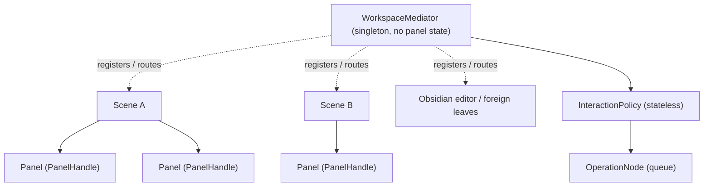

# Surfaces + Interaction Tiers

How panels compose into surfaces, and how interaction flows across panels, scenes, and the Obsidian editor. From the 2026-05-26 grill (tier model LOCKED, Q9). Term defs: [[docs/architecture/glossary|glossary]]. Decision status:
[[docs/work/hardening/research/2026-05-25-architecture-foundation-discovery/decision-ledger|decision-ledger]].

## Tiers

| Tier | Owns | Holds state? | Notes |
|---|---|---|---|
| **Panel** | its provider + view-config + 3-4 panel-scoped controllers; exposes a `PanelHandle` | yes (per `provider.id`) | self-contained, movable; never reached into from outside except via `PanelHandle` |
| **Scene** | composition of panels via a tile-tree layout; declares wanted primitives/bars | layout only | thin coordinator — **no interaction logic, no panel state**; movable between surfaces; kinds: explorer / settings / (proposed) editor |
| **Surface** | a mount host + layout region + lifecycle | host lifecycle | tab(leaf) · modal · pop-up · cmenu · codeblock; each hosts ONE Scene |
| **Workspace** | `WorkspaceMediator` (singleton) | **none** (routes only) | registers Scenes + foreign surfaces; resolves active-context + scope; routes ALL interaction via `InteractionPolicy`; bridges Obsidian workspace events; hosts new-leaf/hometab override |

Key rule: the **Mediator and Scene-coordinator hold no panel state** — they route via `PanelHandle` + the stateless `InteractionPolicy`. State lives only in the Panel. This is what stops either tier from becoming the next `panelExplorer` god-object.



## Two tiling levels (no hardcoded shells)

`Dashboard3Column` (hardcoded 3-col responsive shell, gated ≥800px) is **deprecated**.
Layout becomes data:

1. **Native split** — `page` = editor-group of Obsidian leaves (ADR 0007). Splitting a leaf splits a **surface**; each leaf hosts one Scene. OS-level resize + detach + popout.
2. **Scene tile-tree (ours)** — recursive h/v splits **inside one surface**. Leaf tiles host a `Panel` OR a `ForeignEmbed`. Moves atomically with the Scene; works in non-leaf surfaces (modal/codeblock). Differentiator vs native: a surface holds a tab-set and can **maximize one tile while the others stay split**, or split only a chosen subset — Obsidian's leaf model forces all-split-or-separate-leaf and cannot maximize-one-within-a-split.

Panel kinds, the input→action layer, the unified mutation pipeline, and the LayoutBuilder/profiles brainstorm live in [[docs/architecture/explorer-model/04-panels-axons-mutation-layout|04 panels / axons / mutation / layout]].

`ForeignEmbed` = a tile mounting non-Vaultman content (Obsidian graph, an md-editor, another plugin's leaf) via a **PlatformAdapter** (ADR 0004; hover-editor `WorkspaceLeaf`-patch pattern). If native-leaf embedding proves too fragile, fall back to our own window-manager (user-accepted). Precursor (tab-level): [[docs/work/polish/specs/2026-05-11-detachable-layout-workspace-tabs/index|detachable-layout-workspace-tabs]].

## Interaction — one scene-agnostic mechanism

`InteractionPolicy` is stateless: `(sourcePayload, target) → Operation | reject`. The **target may be foreign** — the Obsidian editor and other leaves are first-class drop targets, not only our panels:

| Source (drag payload) | Target | Resulting action (an `OperationNode`, preview-before-commit) |
|---|---|---|
| node(s) from a `PanelHandle` | another `PanelHandle` | set/move/group per provider pair (e.g. tag-nodes → file-nodes = `set tag→files`) |
| tag-node | editor caret | insert inline `#tag` exactly at the drop position |
| prop / value-node | editor (note) | add to that note's frontmatter |
| file-node(s) | editor-group (leaf) | open as tabs in the editor-group where dropped |
| style-node (CSS-snippet child) | editor (note) | append the style's class to the `cssclasses` frontmatter |

Same mechanism whether source/target panels are in the **same Scene or different Scenes** — intra-scene is just the special case. The drop-compatibility matrix is keyed by `NodeKind × target-surface`. Generalizes the tab-level `serviceLayout`/`serviceDnd` classification from detachable-layout-workspace-tabs to NodeKind granularity.

Requirement surfaced: the **CSS-snippet provider must expose style-nodes** = which defined classes alter a note's look, so the `cssclasses` drop knows what to write.

## Active-context + scope (overlay / toolbar targeting)

Overlays (cmenu/island/pop-up — *bars/toolbars reclassified 2026-07-10 NIB grill: they are `panelWidget` children of a Scene, not overlays; same active-context/scope resolution applies to them as panels*) ask the Mediator who they act on:

- **active-context** = the focused Scene/Panel (point actions: a cmenu item, a fab).
- **scope** = the span for broadcast actions (a toolbar searchbox / view / sort menu).
  Default = **focused-scene** (last-scene-focused). Opt-in override primitive = `{ focused · selected-scenes · all }`. `selected-scenes` implies Scenes become **selectable entities** (selection logic applied to Scenes, not only nodes) — a later capability, not v1.

## Obsidian-workspace bridge (inbound)

The Mediator subscribes to `active-leaf-change` / `file-open` / editor focus and drives:

- **auto-reveal-current-file** — reveal the active file in the relevant Scene's list (the prototype button).
- **live Scene-outline** — real-time outline, fixing today's `taboutline` that only refreshes when the frame is focused.
- **Hometab** (PROPOSED) — override Obsidian "new tab / new window" empty leaf to mount a configured Vaultman `page` (`HometabAdapter` = PlatformAdapter; ref: the "Home tab" plugin).

## Editor-as-Scene (PROPOSED, late roadmap)

Treat active-editor content as a Scene of Content/paragraph **adopted-nodes** (the outline chain `container→metadata→files→outline→content` already in the ledger), rendered per edit mode (source / live-preview / reading). Adds:

- a **columns codeblock** with the `columns`-plugin semantics, but authored **visually/live** and compiled back to markdown (research the `columns` plugin first — it forces manual, complex per-column syntax; we let the user arrange visually and emit the codeblock).
- **draggable paragraphs** — dnd reorder writes markdown; dragging a paragraph beside another auto-creates a new column.

Driver doc: [[docs/work/polish/plans/2026-05-11-ui-modernization-vertical-threads/index|ui-modernization-vertical-threads]] (thread-engine-views + ecosystem-interception).

## `PanelHandle` (LOCKED — core + optional capabilities)

The contract for "Scene composes panels" and Mediator routing. **Minimal core** (every kind) + **optional capability members** gated by panel-kind (mirrors capability-profiles);
exact signatures finalized when the first non-explorer kind (`panelData`) ships.

```text
PanelHandle = {
  // core (all kinds)
  id; kind; providerId?;
  focus(); produceDragPayload(): payload; acceptsDrop(intent): boolean; revealNode?(id);
  // optional, gated by panel-kind capability
  selection?: { read(); select(cmd); clear() };
  projection?();              // current render-projection (read)
  expansion?: { read(); toggle(id) };
}
```

## Foreign surfaces = PlatformAdapters (ADR 0004)

| Adapter | Wraps | Risk | Fallback |
|---|---|---|---|
| `EditorSurfaceAdapter` | drop into editor (caret insert / frontmatter) | editor internals | reject drop, no-op |
| `ForeignEmbedAdapter` | mount a native leaf in our tile | `WorkspaceLeaf` patch | own window-manager |
| `HometabAdapter` | new-tab / new-window override | empty-view hook | leave Obsidian default |

## Status

Tier model + one-mechanism interaction + two tiling levels + grid-drill-no-defer = **LOCKED** (2026-05-26). Editor-as-Scene + columns codeblock + Hometab = **PROPOSED**.
Overlay/toolbar scope + `PanelHandle` shape + remaining `panelExplorer` concern placement = **OPEN**. Per-item status: the decision-ledger.
