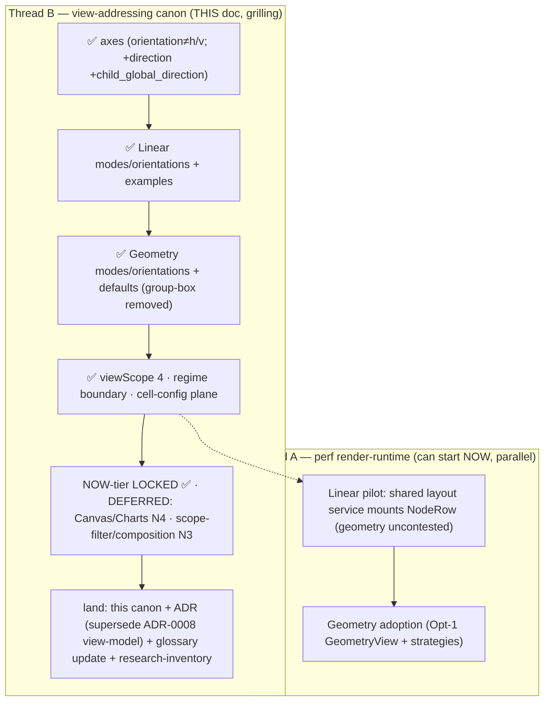

# View Addressing Canon

> **LIVING canonical reference — filled mid-grill (definir y detallar).** This is the single source
> of truth for the view-addressing taxonomy. Supersedes (IN PROGRESS) the engine/mode/orientation
> model in `explorer-model/02-render-and-data.md` (engine table), `glossary.md` L129-130, and
> `typeViewConfig.ts` (tracer). Those carry a STALE `orientation = h/v` model; they will be archived
> to `docs/archive/` **per section as each section here stabilizes** (archive-superseded discipline —
> non-destructive until stable). Items tagged **LOCKED** (dev-confirmed grill 2026-06-17/18) /
> **OPEN** (still grilling) / **DEFERRED** (designed-for, later tier).

## Axes (the addressing model)

A view is the resolved tuple, **computed never pre-enumerated** (D-C-8):

`engine · mode · orientation · direction · child_global_direction · viewScope · flags`

- **LOCKED:** `orientation` is **NOT** horizontal/vertical. h/v moved to **`direction`**. orientation =
  arrangement semantics (how a parent shows/hides/focuses children), engine-specific.
- **LOCKED:** `direction` (custom-direction control, UI behaves like proto `custom_size` — pushes other
  buttons out of frame until collapsed) affects **`direction`** (level-1 nodes, default) AND
  **`child_global_direction`** (their children). Both are DIRECTIONS, not behaviors.
- **LOCKED — `child_global_direction` value model:** RELATIVE — expressed in the same H/V (Column/Row)
  toggle vocabulary as `direction`, chosen independently via the control's child-arrows:
  ∈ `{V (up/down), H (left/right), mediator}`. NOT absolute, NOT forced-opposite. (tree: parent V=down,
  child V=down · miller: parent V=down, child H=right · dock: child=mediator.)
- **LOCKED:** expand = **mostrar** (show); collapse = **ocultar** (hide). expand/collapse/drill are
  **SASI/NIB actions**, not mere view state.
- **LOCKED:** `regime` (slot | coordinates) = the engine boundary. slot = virtualizable
  (Linear/Geometry shared runtime, Fenwick). coordinates = free xy+size+z = Canvas (spatial culling).
  No mixing regimes in one virtualized view.
- **LOCKED — regime-flip:** the manual-sort "free" toggle flips `regime` slot→coordinates →
  re-resolves the ViewConfig → re-routes to the **Canvas runtime**. The chosen engine (e.g. cards)
  becomes Canvas-backed when it goes full-free; slot-based manual-sort stays Linear/Geometry.
- **LOCKED — validity:** **compose-free** — any orientation may apply to any mode; each mode has a
  sensible DEFAULT orientation; user override is free. NO strict legal/illegal matrix (avoids the
  combinatorial explosion the tracer feared).

## Engines

**LOCKED:** `Linear · Geometry · Canvas · Charts`. (Charts = canary placeholder; renderer N4.)
Engine ≠ renderer (renderer = the DOM-level drawer). Engine = reusable layout family.

### Linear  (1D ordered/hierarchical stack; fixed-height; shared runtime)
- **modes (LOCKED):** `flat` · `indent` · `cascade` · `detail`
  - `flat` = flat-list · `indent` = tree-indent · `cascade` = column-per-level base (miller's base)
  - `detail` (LOCKED) = **NN-style master-detail** (ref: Notebook Navigator list+detail panes;
    half-modeled in proto). **col1** = master = parent/container tree (indent-collapse among parents);
    selecting a col1 node **drills via NIB** to scope **col2**. **col2** = detail pane = the selected
    node's children (active filter = `in_folder`/`in_parentnode` of the col1 selection), flat-list-drill,
    optionally grouped (grandparents = default/manual groups) + grandchildren (leaves). col1 may host
    **>1 provider** (NN quality) → implies `in_explorer` filters beyond surface mediation. Sort hits
    col1 vs col2 per **`sortScope` (mediator)**.
- **orientations (LOCKED):** `list` · `collapsible` · `accordion` · `drill`
- **default orientation per mode (LOCKED):** flat→`list` · indent→`collapsible` · cascade→`drill` ·
  detail→`drill` (col1 internal = collapse; col1→col2 = drill via NIB).
- **direction (LOCKED):** custom-direction control = toggle **H** (left/right) / **V** (up/down) +
  divider + active-direction arrow + opposite arrow + divider + two arrows for
  `child_global_direction` (child V/H opposite **or** `mediator`) + collapse button.
- **canonical examples (LOCKED):**
  - **tree** = Linear · indent · collapsible · direction V=down · child=down · +sticky-rows
  - **miller** = Linear · cascade · drill · V=down · child=right · +breadcrumb-bar (each level = a column)
  - **breadcrumb** = Linear · flat · drill · H=right · child=down
  - **dock-drawer** = Linear · flat · drill · V=up · child=mediator (surface) · +own-animation

### Geometry  (2D positional cells; variable-height + lanes; shared runtime)
- **modes (LOCKED):** `grid` · `cards` · `masonry` · `table`  — **`group-box` REMOVED** (it is a
  viewBuilder + viewScope COMPOSITION, not a primitive mode).
  - `grid` = slot-outline · `cards` = no outline (else ~same as grid) · `masonry` = node-size→column-width
    · `table` = Bases column layout
- **orientations (LOCKED):** `list` (show all) · `section` (parent → Linear-flat-expand in-scene;
  the proto view/sort-menu section transform) · `drill` (focus explorer on children = the Nautilus
  folder behavior) · `container` (hide children behind an action_expand via mediator/overlay)
  - **default orientation per mode (LOCKED):** grid→`drill` · cards→`container` · masonry→`container`
    · table→`list`
- **direction (LOCKED):** columns/rows (default column=down, row=right) — Geometry's custom-direction.

### Canvas  (free spatial + edges; coordinates regime; separate runtime — DEFERRED N4)
- modes: `mindmap` · `graph` · (json-canvas). orientation: dynamic/static. **OPEN/DEFERRED** shape.

### Charts  (scales/axes/marks viz; LayerChart; separate runtime — DEFERRED)
- modes: `chart` (canary placeholder). `form` = OPEN (Table/transpose orientation vs Charts mode).

## viewScope  (LOCKED, 4)

`per_panel · per_level · per_parent · per_node`. **DEFERRED generalization:** viewScope behaves like
a **filter/predicate** over which nodes get which view, routed via the mediator; generalizes to
per-provider filters/ops (incl. `data_config` providers, not just `file_storage`) — possibly a
`filterScene` per_surface distinct from the fileScene's. (N3.)

## Cell-config plane  (distinct from view addressing)

**LOCKED:** the position/order of slots **inside** a node cell (NodeRow slots: media · leading · label
· fields · metric · badges · trailing) = the **`specific_view`** map (role→slot/order per engine+mode).
Editing it (e.g. moving a badge within the node) → expressed as **CSS pseudo-snippets** (`order`,
`grid-template-areas`) per the UPV principle ("todo estilo = pseudo-snippets"), PSS-persisted at the
chosen scope. Domain = N.R (NodeRow) + UPV, NOT the render-runtime. (May shard into its own cell-canon.)

**CSS-translatable split (LOCKED):** visual/positional config (slot order/position, size, spacing,
outline, direction columns/rows, gap) → pseudo-snippets CSS. Structural/behavioral (which
engine/mode/orientation mounts; drill/go_to; child=mediator opening a surface; expand/collapse) →
ViewConfig + ActionNode, NOT CSS.

## Canon status

**NOW-tier = LOCKED** (grill 2026-06-17/18): axes · engines (Linear/Geometry full; Canvas/Charts
placeholder) · modes · orientations + per-mode defaults · validity (compose-free) · direction +
child_global_direction (relative) · viewScope (4) · regime + regime-flip · cell-config plane · examples.

**DEFERRED (later tiers, not blocking the NOW-tier):**
- Canvas modes/orientations final shape — N4.
- Charts modes + `form` placement — N4.
- viewScope-as-filter generalization + `in_explorer` filters + multi-provider col1 (NN) + per_surface
  filterScene — N3.
- per-scope COMPOSITION (homescreen = panel default + per-container + per-node overrides) — scoped-views N3.

**Landing TODO (canonical-homes discipline):** ADR superseding ADR-0008 view-model · glossary L129-130
update → point here · research-inventory entries for the DEFERRED items · archive stale shard-02 table
when this stabilizes.

## Grill / thread status

## Provenance

Grill 2026-06-17/18 (dev ↔ claude-opus-4-8). Decision trail + perf-runtime planning:
[[docs/work/hardening/specs/2026-06-17-vd-shared-render-runtime/index|V.D shared render-runtime]].
Grounded against: `glossary.md`, `dev-glossary.md` (Engine≠renderer), `02-render-and-data.md` (stale
engine table), `typeViewConfig.ts` (stale tracer), function-union-ledger `02-views-renderers-taxonomy`,
ADR 0008/0011, umbrella shards (WSA/PLPZRR/UPV/PSS), N.R plan (NodeRow slots).
