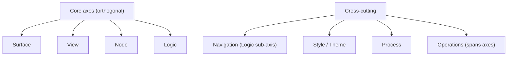
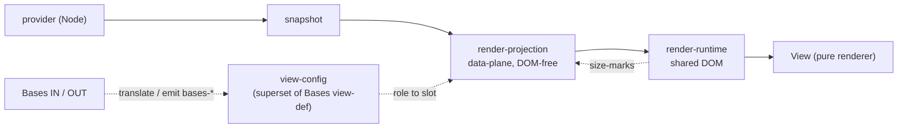
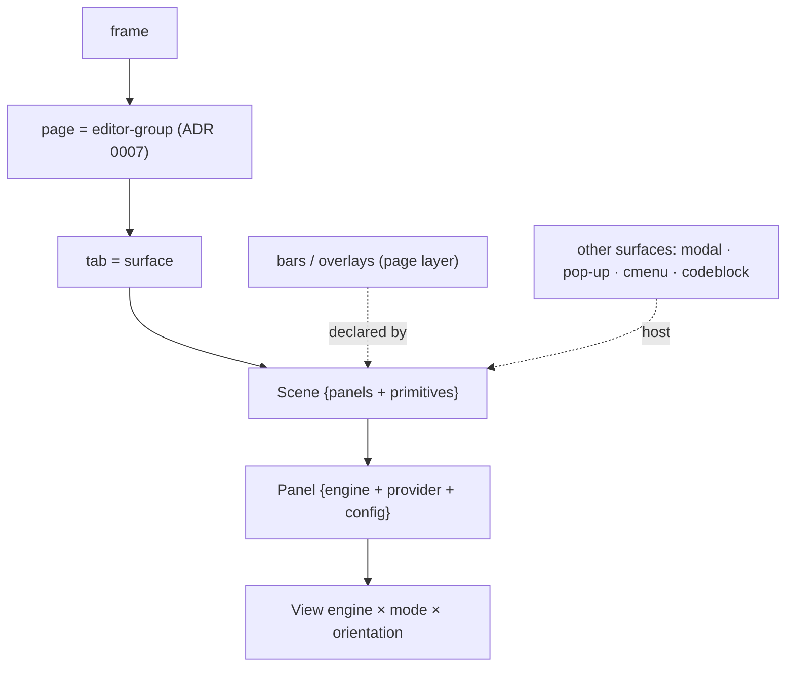
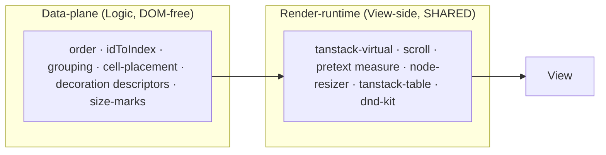

# Explorer Model — Visual Map

## Sources

- [explorer-model](../index.md) · [responsibility map](../01-responsibility-map.md) · [render + data](../02-render-and-data.md)
- [decision ledger](../../../work/hardening/research/2026-05-25-architecture-foundation-discovery/decision-ledger.md)
- [ADRs](../../adr/README.md) · [glossary](../../glossary.md)

## 8 dimensions

## Data flow (render pipeline)

## Composition stack

## Render ownership (ADR 0008, Accepted)

## Status

| Decision | Status | Source |
| --- | --- | --- |
| 8-dimension model | accepted | [ADR 0001](../../adr/0001-eight-dimension-model.md) |
| View = pure renderer | accepted | [ADR 0002](../../adr/0002-view-pure-renderer.md) |
| Cell + view-config (Bases-aligned) | accepted | [ADR 0003](../../adr/0003-cell-view-config-bases-aligned.md) |
| PlatformAdapter + Fragility Registry | accepted | [ADR 0004](../../adr/0004-platform-adapter-fragility-registry.md) |
| ActionNode unification | accepted | [ADR 0005](../../adr/0005-actionnode-unification.md) |
| Publish channel split | accepted | [ADR 0006](../../adr/0006-publish-channel-split.md) |
| Page = editor-group | accepted | [ADR 0007](../../adr/0007-page-editor-group.md) |
| Render ownership 2-layer | accepted | [ADR 0008](../../adr/0008-render-ownership-two-layer.md) |

Detailed responsibility ownership (current → target) is the table in
[01-responsibility-map](../01-responsibility-map.md), not duplicated here.
