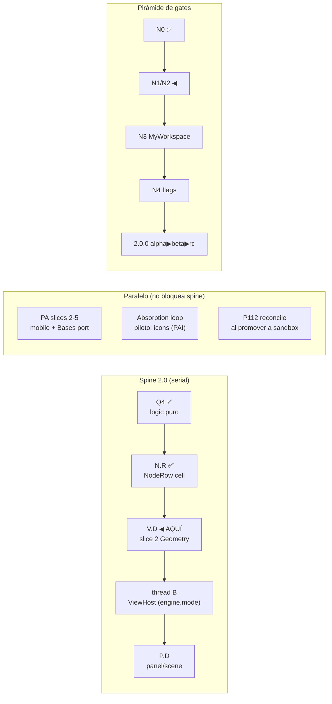

# Norte (roadmap-at-a-glance)

> **Propósito:** UNA página para re-orientar al dev en <2 minutos: en qué fase estamos,
> por qué se está haciendo/discutiendo lo actual, y qué valor aporta. Se actualiza SOLO
> en fronteras de wave/checkpoint (obligación del coordinador que cierra la wave).
> No es fuente de detalle — cada línea enlaza a su source record.

## La meta (no cambia)

**`2.0.0` = la unión proto-v12 × sandbox × stable-1.1.1**, entregada como línea nueva.
Tesis por capas (ledger Fase B, 8/8 clusters):

| Capa | Fuente canónica |
|---|---|
| Policy / comportamiento correcto de usuario | **stable 1.1.1** (oráculo D3, hotfix-only) |
| Arquitectura / contratos / servicios | **sandbox** (canary, autoridad) |
| Vocabulario / diseño / canon visual polish | **proto v12** (nunca mergea — se TRADUCE) |

Iniciativa rectora: [[docs/work/hardening/specs/2026-06-10-vaultman-2-0-synthesis-umbrella/index|Synthesis Umbrella v2]].
Dominios pilares: **Symbiont Explorer** (riqueza de explorers, ~N0-N2) y
**MyWorkspace** (control del workspace UI, ~N1+N3).

## Dónde estamos HOY (2026-07-02)

- **Fase D** (ejecución por waves). Fases A (alineación), B (ledger ~595 filas) y
  C-lite (specs wave 1 + PSS grill D-PSS-1..10) están CERRADAS.
- **Wave 1 (N0) COMPLETA** + arranque N1/N2: Q4 ✅ · PA slice 1 ✅ · tracer ✅ ·
  N.R ✅ · **V.D slice 1 ✅** (p99 tree 124ms, era ~1051ms).
- **Spine: Q4 → N.R → V.D ◀ slice 2 AQUÍ → thread B → P.D.**
- sandbox @ `2.0.0-alpha.1`, ~1113 unit tests, respaldado en `origin/sandbox` (2026-07-02).
- Canon LOCKED: view-addressing ([[docs/architecture/explorer-model/05-view-canon|05-view-canon]] + ADR 0012).

## Valor de lo en vuelo (por qué importa cada cosa)

| Qué | Por qué importa | Gate |
|---|---|---|
| **V.D slice 2 (Geometry)** | El lever real de perf — la razón del abandono de 1.1.0-beta.1. Las 4 vistas Geometry (grid/cards/masonry/table) son donde vive el look del proto; casi toda absorción UI pasa por aquí | N2; strict blank-frame |
| **Absorption loop — piloto icons** ([[docs/work/hardening/issues/proto-absorption-icons/index|PAI]]) | Primer sistema UI/UX del proto entrando a producto; además prueba el formato de issues AFK/HITL que escala al resto de la absorción | N2 |
| **PA slices 2-5** | Mobile gate (gap de los 3 streams) + port `basesMultiSelectOperations` de stable | N0/N1 |
| **P112 reconcile** | Hotfixes de codex en stable tocaron `viewTreeBehavior`/CSS que V.D slice 1 migró — divergencia crece si no se reconcilia al promover | D3 paridad |
| **Duales sandbox** (queue/VFS · diff espejo · 4 caminos DnD) | DO_NOT_PROMOTE_AS_IS — gatean N1/N2 antes de cualquier beta | N1 |

## Próximos gates (orden)

1. ~~PAI-001~~ ✅ **done 2026-07-02** (`a38c731`): resolver v12 + tracer tree, paridad
   probada, formato AFK/HITL VALIDADO. Bonus: reparó el build roto del baseline
   (6 type-errors del upgrade de toolchain).
2. V.D slice 2 Geometry: verify + gate STRICT + paridad stable (SDF-011/016).
3. PAI-002 (overrides) ∥ PAI-004 (rollout) — despachables AFK ya.
4. P112 → sandbox con reconcile de `viewTreeBehavior`/`virtualScrollCssSource`.
5. Decisión dev pendiente: orden PA 2-5 vs siguiente sistema de absorción (f4/f5 del grill 2026-07-02).

**Canon raw proto**: `Downloads/vaultman/proto-vXX/` (v12 actual; `proto/` sin sufijo =
STALE v7). El "vertical read v12" citado en docs viejos ES el shard v7 — deltas por
sistema contra el raw al absorber.

## Workflow vigente (decisión 2026-07-02, research-backed)

**Absorption loop** por sistema proto: grill corto (solo decisiones contested, Fable) →
ledger rows → issues verticales tracer-bullet etiquetados **AFK** (DoD tool-checkable:
gates verdes; ejecutable sin dev, delegable a Sonnet/Codex) vs **HITL** (juicio
visual/UX del dev en plugin-dev) → worktree `C:/tmp` → verify → FF → actualizar este norte.
Evidencia y fuentes: session-log 2026-07-02. Regla anti-sobre-ingeniería: slice vertical
delgado end-to-end primero, ensanchar solo con critical path funcionando; spec-delta por
slice, nunca master-spec.

## Leyenda de códigos (los que siempre se olvidan)

- **Q4** — extracción de lógica pura fuera de god-providers (N0, hecho).
- **N.R** — NodeRow: la celda unificada de todos los explorers (hecho).
- **V.D** — view shells + shared render-runtime (virtualización compartida).
- **P.D** — panel/scene decomposition (WorkspaceMediator, N3).
- **PA** — PlatformAdapter + Fragility Registry (seams anti-fragilidad Obsidian).
- **PSS** — Presets Saving System (facetas×cascada×4 clases de storage; D-PSS-1..10).
- **LUPA** — load/unload de módulos internos como virtual plugins.
- **UPV** — UI Primitives & Variables (token/component layer del chameleon).
- **WSA** — Workspace Surface Abstraction (paginate X|Y, Z layers, Live Redesign).
- **NIB** — Node Input Binding (evento→binding→ActionNode→Operation).
- **SASI** — Services/Commands/Scripts Indexing (registro interno).
- **PAI** — Proto Absorption: Icons (piloto del absorption loop).
- Glosario completo: [[docs/architecture/glossary|glossary]] · [[docs/architecture/dev-glossary|dev-glossary]].
