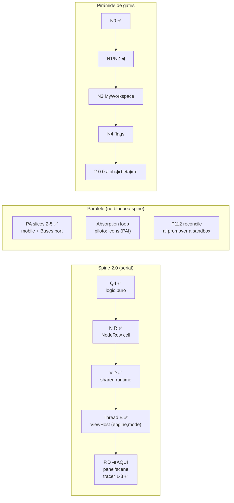

# Norte (roadmap-at-a-glance)

> **Propósito:** UNA página para re-orientar al dev en <2 minutos: en qué fase estamos,
> por qué se está haciendo/discutiendo lo actual, y qué valor aporta. Se actualiza SOLO
> en fronteras de wave/checkpoint (obligación del coordinador que cierra la wave).
> No es fuente de detalle — cada línea enlaza a su source record.

## La meta (no cambia)

**`2.0.0` = la unión proto-v12 × sandbox × stable-1.1.1**, entregada como línea nueva.
Tesis por capas (ledger Fase B, 8/8 clusters):

| Capa | Fuente canónica |
|---|---|
| Policy / comportamiento correcto de usuario | **stable 1.1.x** (oráculo D3, hotfix-only — línea ya en **1.1.6**; docs/ledger citan 1.1.1: re-baseline D4 PENDIENTE, despriorizado por dev 2026-07-02 a favor de absorber proto) |
| Arquitectura / contratos / servicios | **sandbox** (canary, autoridad) |
| Vocabulario / diseño / canon visual polish | **proto v12** (nunca mergea — se TRADUCE) |

Iniciativa rectora: [[docs/work/hardening/specs/2026-06-10-vaultman-2-0-synthesis-umbrella/index|Synthesis Umbrella v2]].
Dominios pilares: **Symbiont Explorer** (riqueza de explorers, ~N0-N2) y **MyWorkspace** (control del workspace UI, ~N1+N3).

## Dónde estamos HOY (2026-07-08)

- **Fase D** (ejecución por waves). Fases A (alineación), B (ledger ~595 filas) y C-lite (specs wave 1 + PSS grill D-PSS-1..10) están CERRADAS.
- **Wave 1 spine:** Q4 ✅ · PA 1-5 ✅ · tracer ✅ · N.R ✅ · V.D ✅ · Thread B ✅ · shim/deps cleanup ✅ · **P.D tracer slices 1-3 ✅** (contracts + mediator + InputRouter + selection ports; primer código N3/MyWorkspace).
- **Spine: Q4 → N.R → V.D → Thread B → P.D ◀ AQUÍ (tracer ✅, ensanchamiento pendiente).**
- sandbox local @ `9a56172` (`2.0.0-alpha.1`; `origin/sandbox` @ `18465c2`, push del resto pendiente de dev). Gate integrado 2026-07-08: check 0/0 · **unit 178 files / 1303 tests (0 flakes)** · build ✓; audit high/moderate = 0, 1 low dev residual (task_020).
- Canon LOCKED: view-addressing ([[docs/architecture/explorer-model/05-view-canon|05-view-canon]] + ADR 0012).

## Valor de lo en vuelo (por qué importa cada cosa)

| Qué | Por qué importa | Gate |
|---|---|---|
| **P.D panel/scene** | Primer tracer N3/MyWorkspace: convierte el Explorer ya estabilizado en panel componible vía `PanelHandle`, `Scene`, `WorkspaceMediator`, `InteractionPolicy` e `InputRouter`, sin reescribir la UI | N3; parity-first |
| **Absorption loop — piloto icons** ([[docs/work/hardening/issues/proto-absorption-icons/index|PAI]]) | Primer sistema UI/UX del proto entrando a producto; además prueba el formato de issues AFK/HITL que escala al resto de la absorción | N2 |
| **PA slices 2-5** | ✅ Cerrado: registry + 4 adapters + inventario mobile. Siguiente uso real: P.D/SF consumen esos seams al tocar superficies Obsidian | N0/N1 |
| **P112 reconcile** | Hotfixes de codex en stable tocaron `viewTreeBehavior`/CSS que V.D slice 1 migró — divergencia crece si no se reconcilia al promover | D3 paridad |
| **Duales sandbox** (queue/VFS · diff espejo · 4 caminos DnD) | DO_NOT_PROMOTE_AS_IS — gatean N1/N2 antes de cualquier beta | N1 |

## Próximos gates (orden)

1. ~~PAI-001~~ ✅ **done 2026-07-02** (`a38c731`): resolver v12 + tracer tree, paridad probada, formato AFK/HITL VALIDADO. Bonus: reparó el build roto del baseline (6 type-errors del upgrade de toolchain).
2. ~~PAI-002 ∥ PAI-004~~ ✅ **done 2026-07-02** (`9c3ae29`): overrides con persistencia PSS-shaped + rollout completo del resolver. Pendiente micro: smoke live al reabrir Obsidian. **El subsistema de iconos AFK está COMPLETO** — queda PAI-003 (picker, HITL, necesita al dev) y PAI-005 (packs, DEFER N4).
3. ~~V.D 2a~~ ✅ + ~~2b table/grid/cards~~ ✅ **done 2026-07-05** (`398dfdb`): **ADOPCIÓN GEOMETRY COMPLETA** — table+grid+cards las tres sobre el runtime compartido. Gates STRICT PASS (blank=0 · flicker=0): table p99 17ms · grid p99 55ms · cards p99 153ms (⚠ cards maxDelay 37s single outlier = watch-item, re-correr en idle). Resizers 1.1.6 (SDF-011) en table. **NEXT = thread B** (ViewHost switchea `(engine,mode)` de ViewConfig resuelto, retira enum flat `ExplorerViewMode`) → luego P.D (panel/scene, N3). Masonry diferido (no existe la vista).
   En el camino: eslint full-repo reparado (verify entero verde) + PA slice 2 (Codex, aterrizada).
4. ~~Thread B + PA-5 + glossary + shim + deps~~ ✅ **done 2026-07-06** (`7107b1a`): B2 `ViewHost` usa `(engine,mode)`; PA registry cableado; shims legacy removidos; deps high/moderate cerradas, con 1 low dev residual (`diff` via `mocha`, major transitive).
5. ~~P.D tracer slices 1-3~~ ✅ **done 2026-07-06/08** (`fcf895e`+`18465c2`+`0359780`, gate integrado verde 178f/1303t): contracts + policy pura + mediator stateless + InputRouter (focus/select-visible/clear-selection) + puertos files-tab, parity-first sin rewrite visual.
   Plan: [[docs/work/hardening/plans/2026-07-06-pd-panel-scene-decomposition/index|P.D kickoff]].
   Nota: +2 comandos palette aditivos (gated) — juicio dev pendiente.
6. **P.D ensanchamiento**: focus/reveal por node-id o bridge `ActionProvider -> ActionNode`;
   grill corto ANTES si toca contrato contested. ∥ Codex: B3 enum flat (task_019) · deps residual (task_020).
7. P112 → sandbox con reconcile de `viewTreeBehavior`/`virtualScrollCssSource`.
8. PAI-003 icon picker sigue HITL; requiere juicio visual del dev.

**Canon raw proto**: `Downloads/vaultman/proto-vXX/` (v12 actual; `proto/` sin sufijo = STALE v7). El "vertical read v12" citado en docs viejos ES el shard v7 — deltas por sistema contra el raw al absorber.

## Workflow vigente (decisión 2026-07-02, research-backed)

**Absorption loop** por sistema proto: grill corto (solo decisiones contested, Fable) → ledger rows → issues verticales tracer-bullet etiquetados **AFK** (DoD tool-checkable:
gates verdes; ejecutable sin dev, delegable a Sonnet/Codex) vs **HITL** (juicio visual/UX del dev en plugin-dev) → worktree `C:/tmp` → verify → FF → actualizar este norte.
Evidencia y fuentes: session-log 2026-07-02. Regla anti-sobre-ingeniería: slice vertical delgado end-to-end primero, ensanchar solo con critical path funcionando; spec-delta por slice, nunca master-spec.

## Leyenda de códigos (los que siempre se olvidan)

- **Q4** — extracción de lógica pura fuera de god-providers (N0, hecho).
- **N.R** — NodeRow: la celda unificada de todos los explorers (hecho).
- **V.D** — view shells + shared render-runtime (virtualización compartida).
- **P.D** — panel/scene decomposition (WorkspaceMediator, N3).
- **PA** — PlatformAdapter + Fragility Registry (seams anti-fragilidad Obsidian).
- **PSS** — Presets Saving System (facetas×cascada×4 clases de storage; D-PSS-1..10).
- **LUPA** — load/unload de módulos internos como virtual plugins.
- **UPV** — UI Primitives & Variables (token/component layer del chameleon).
- **WSA** — Workspace Surface Abstraction (paginate X|Y, Z layers, Live Redesign).
- **NIB** — Node Input Binding (evento→binding→ActionNode→Operation).
- **SASI** — Services/Commands/Scripts Indexing (registro interno).
- **PAI** — Proto Absorption: Icons (piloto del absorption loop).
- Glosario completo: [[docs/architecture/glossary|glossary]] · [[docs/architecture/dev-glossary|dev-glossary]].
