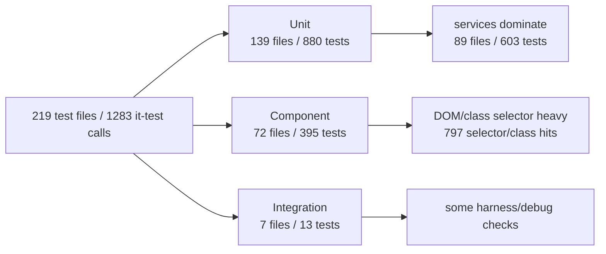
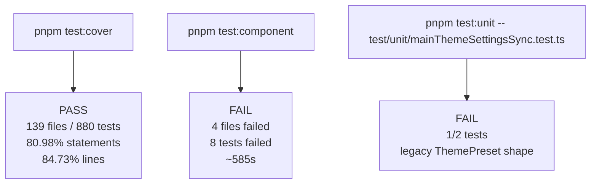
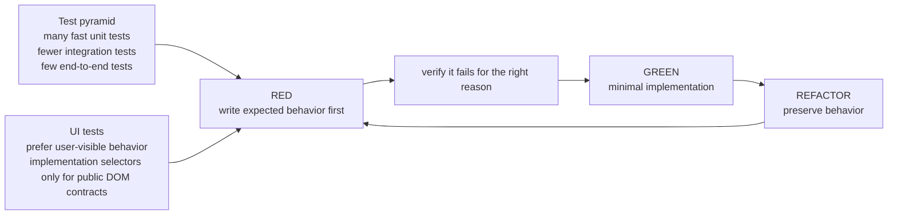
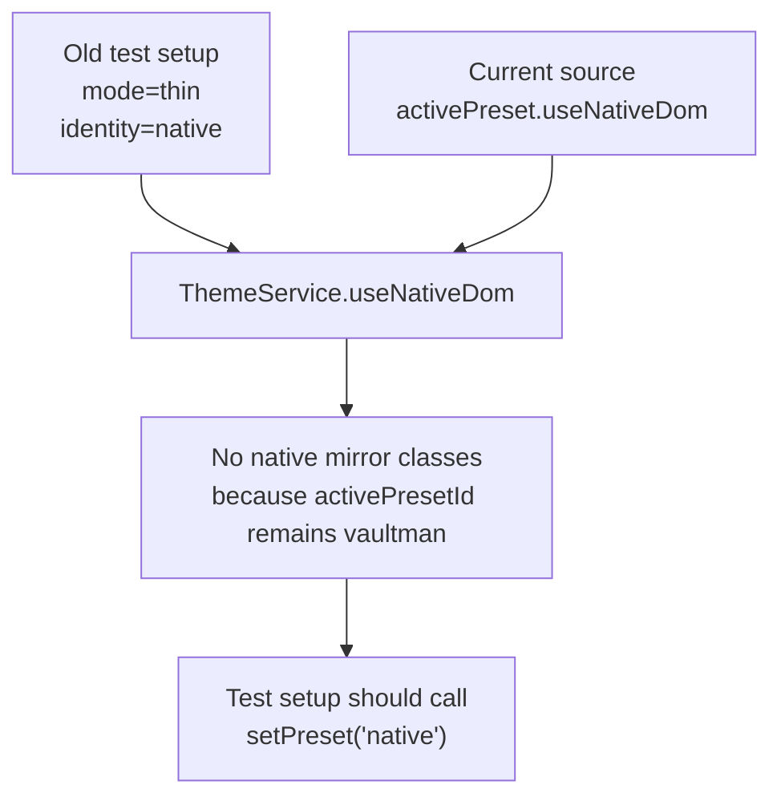
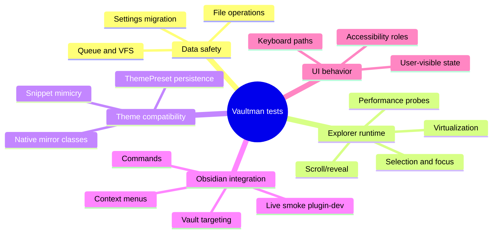
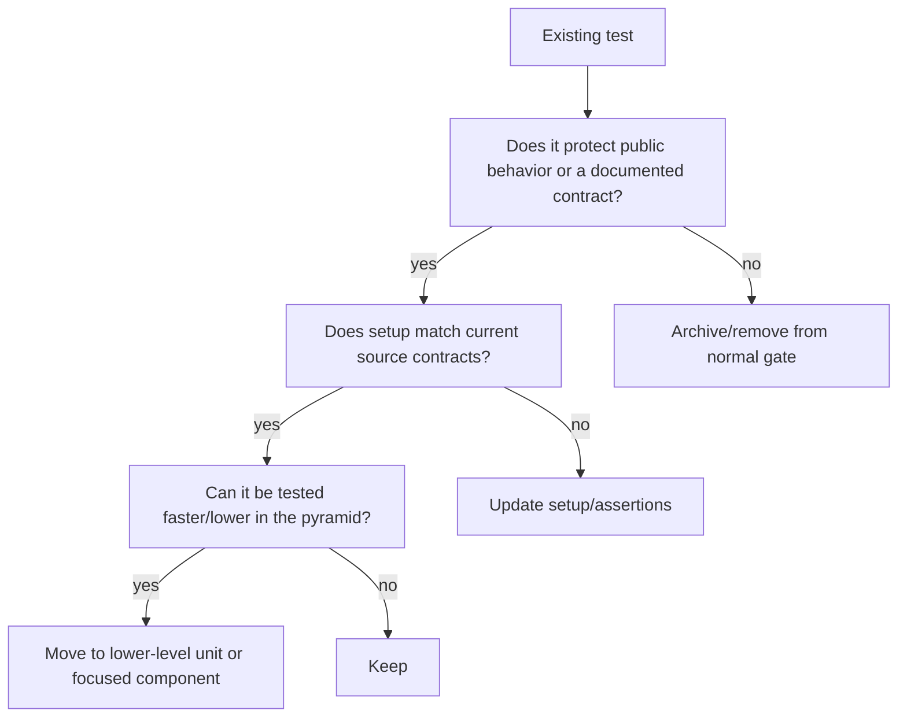

# Vaultman Test Audit

Related canvas: [[docs/work/hardening/research/2026-05-17-test-audit/test-audit.canvas|test-audit.canvas]].

## Scope

Read-only audit of the current test suite, focused on whether the tests still
match Vaultman's active contracts and whether the suite supports fast TDD.

The audit intentionally did not modify existing tests or source files because
the worktree already had unrelated dirty files.

## Suite Snapshot

## Verification Evidence

## Current Best-Practice Frame

Sources used:

- [GDS Test-driven development](https://gds-way.digital.cabinet-office.gov.uk/standards/test-driven-development.html)
- [Vitest Testing in Practice](https://vitest.dev/guide/learn/testing-in-practice)
- [Martin Fowler, Practical Test Pyramid](https://martinfowler.com/articles/practical-test-pyramid.html)
- [Testing Library, Svelte Testing Library](https://testing-library.com/docs/svelte-testing-library/intro/)
- [Playwright Best Practices](https://playwright.dev/docs/best-practices)
- [Google Engineering Practices, looking at tests](https://google.github.io/eng-practices/review/reviewer/looking-for.html)

## Findings

### F1 - Mirror-class tests are stale against ThemePreset semantics

Affected tests:

- `test/component/snippetMimicry.test.ts`
- `test/component/viewNodeMirrorClasses.test.ts`
- `test/component/viewNodeTableHeightmap.test.ts`
- `test/component/viewTreeAdoptedNodes.test.ts`

These tests configure `theme.mode = 'thin'` and `theme.identity = 'native'` or
`outline`, then expect native Obsidian mirror classes such as `nav-file`,
`nav-file-title`, `tree-item`, `tree-item-self`, `tree-item-inner`, and
`metadata-property`.

Current source says `ThemeService.useNativeDom` derives from
`activePreset.useNativeDom`, not from `mode` or `identity`. Therefore these
tests appear to preserve an old contract. They are not useless; the mirror-class
behavior is still product-relevant because snippets and native-theme mimicry are
public compatibility behavior. The repair is to update setup to activate the
`native` preset when that behavior is the target.

### F2 - New theme settings sync test uses a legacy custom preset shape

Affected test:

- `test/unit/mainThemeSettingsSync.test.ts`

The test defines a `ThemePreset` using fields such as `label`,
`density: "compact"`, `dock.enabled`, `tabs.style`, and object-shaped
`viewModes`. Current `ThemePreset` requires `source`, `displayName`,
`useNativeDom`, tokenized `density`, `dock.visible`, `tabs.presentation`, and a
view mode array. `ThemeService.registerCustomPreset` rejects presets whose
`source` is not `custom`, so the failing expectation is consistent with current
source.

### F3 - Component test loop is too slow for routine TDD

`pnpm test:component` took about 585 seconds in the observed run. The command is
valuable as a wider component gate, but it is not a practical inner TDD loop.
Focused component tests and unit tests should be the default red/green target;
full component and live smoke runs should remain verification gates.

### F4 - Some integration tests are harness diagnostics, not product contracts

Likely candidates to move out of normal product verification:

- `test/integration/manual-register.test.ts`
- `test/integration/debug-path.test.ts`

They validate test infrastructure or print environment state rather than
Vaultman behavior. They may still be useful as troubleshooting scripts, but they
should not have the same status as product regression tests.

### F5 - Coverage is healthy globally but uneven in risk areas

`pnpm test:cover` passed with global coverage above configured thresholds, but
some product-adjacent modules remain low or uncovered:

- `serviceCMenu.ts`
- `serviceSnippetsIndex.ts`
- `serviceSuggestModal.ts`
- `dropDAutoSuggestionInput.ts`
- `inputModal.ts`
- `serviceNodeFieldVisibility.ts`
- `serviceViewTableAdapter.ts`

Coverage alone should not drive work, but these modules touch user-visible
commanding, snippets, modals, and view contracts, so they are worth triage.

## Functional Risk Map

## Recommended Triage Policy

## Next Actions

1. Update the mirror-class component tests to activate the `native` preset
   explicitly, then rerun only those files.
2. Fix or discard `test/unit/mainThemeSettingsSync.test.ts` by using the current
   `ThemePreset` shape.
3. Move `manual-register` and `debug-path` out of the default integration
   product gate if they are only harness diagnostics.
4. Split component verification into named focused gates for Explorer, theme,
   navbar, and panels so TDD loops can run under a minute.
5. Add targeted tests for uncovered high-risk modules only after confirming the
   expected behavior from source or specs.

