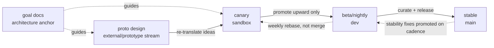
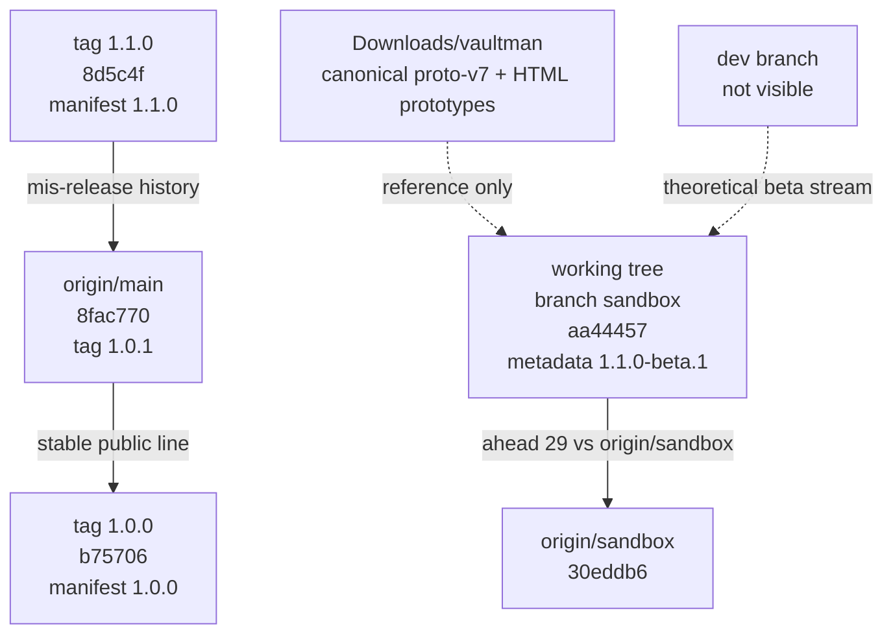

# 01 - Stream Taxonomy And Ground Truth

This shard names the core differences between Vaultman's version streams and
separates the intended model from the repository reality visible in this
workspace.

This is not yet the per-system vertical analysis. It is the grounding layer that
prevents later shards from saying "stable", "beta", "canary", or "proto" as if
those labels were already aligned.

## Sources Read

- `.agents/docs/work/hardening/research/2026-05-27-version-streams-distillation/index.md`
- `.agents/docs/architecture/adr/0006-publish-channel-split.md`
- `.agents/docs/work/publish/index.md`
- `.agents/docs/work/v1-stable/items/2026-05-25-release-1-1-0-beta-relabel.md`
- `.agents/docs/architecture/zoom-out-map.md`
- `.agents/docs/architecture/operational-watch-list.md`
- `.agents/docs/architecture/tooling-libraries.md`
- `.agents/docs/architecture/explorer-model/index.md`
- `.agents/docs/work/hardening/research/2026-05-25-architecture-foundation-discovery/roadmap-dispatch.md`
- `.agents/docs/work/hardening/specs/2026-05-19-explorer-merge-umbrella/index.md`
- `package.json`
- `manifest.json`
- `versions.json`
- `src/main.ts`
- `src/components/frame/frameVaultman.svelte`
- `src/components/containers/panelExplorer.svelte`
- `src/services/serviceExplorer.svelte.ts`
- Git refs: `sandbox`, `origin/sandbox`, `origin/main`, `1.0.0`, `1.0.1`, `1.1.0`
- Local proto folder listing: `C:\Users\vic_A\Downloads\vaultman`
- User update on 2026-05-31: `proto-v7` is the latest/canonical proto design
  stream for this research; `proto-v8` is expected but was not received/read.

## Executive Difference Map

| Stream | Theory | Practice in this workspace | Main mismatch |
|---|---|---|---|
| `goal` | Stable architecture target and north-star spec | Exists as docs under `.agents/docs/architecture` and hardening research | Not code; cannot be "merged", only implemented |
| `proto design` | Rolling design/prototype reference, never directly merged | Local folder has proto through user-confirmed canonical `proto-v7`, HTML prototypes, screenshots; `proto-v8` pending/not read | Different toolchain and multiple versions; needs mapping before adoption |
| `canary` | `sandbox`, creative, unstable, extraction/reference | Current branch is `sandbox`, ahead of `origin/sandbox`, with ~43k product LOC | Product metadata still says `1.1.0-beta.1`, not canary |
| `beta/nightly` | `dev`, toward-stable channel | No visible branch matching `dev`, `beta`, or `nightly` | The intended beta stream is conceptual, not materialized here |
| `stable` | `main`, curated, must work, protects users | `origin/main` is `1.0.1`; tag `1.1.0` exists as mis-release history | Local `main`, `origin/main`, and `Meibbo/main` are not identical refs |

## Diagram - Theoretical Flow



This is the theory. It says:

- design ideas travel from proto by translation, not by source merge;
- code travels upward from canary to beta to stable;
- stable fixes may be propagated back to beta/canary as stability promotion;
- downward feature merges are rejected;
- `goal` guides all streams but is not itself a release artifact.

## Diagram - Practical Ground Truth Observed



This is the practical map. It says:

- the active code stream is `sandbox`;
- stable is best represented by `origin/main` / `1.0.1`;
- the intended `dev` stream was not found as a branch;
- the `1.1.0` tag exists and carries stable-looking metadata even though docs
  say that release line should be treated as prerelease/beta history;
- proto exists locally and has advanced to user-confirmed canonical v7, while
  older docs cite a different proto path that is missing;
- proto-v8 has been mentioned as incoming but is not source-backed in this
  research yet, so it must not be analyzed until supplied.

## Difference 1 - Goal Is Not A Branch

### Theory

The `goal` stream is the north-star architecture. It is the slowest-changing,
most deliberate stream. It is where the desired target model is defined before
the code catches up.

The current goal layer includes:

- the 8-dimension Explorer model;
- ADRs for view purity, cell/view-config, PlatformAdapter, ActionNode,
  channel split, page/editor-group, render ownership, and Bases interop;
- system vocabulary such as Scene, Panel, Surface, Node, View, Logic,
  Operations, Axon, WorkspaceMediator, and InteractionPolicy;
- the version-streams distillation itself;
- the zoom-out map and operational watch list.

### Practice

The goal stream is present as docs, not as runtime modules. For example,
`explorer-model/index.md` defines the current target stack:

```text
provider (Node) -> snapshot -> render-projection (data-plane, DOM-free)
  -> render-runtime (shared, DOM: virtualize/scroll/measure/resize/dnd)
  -> View (pure renderer)
```

The current `sandbox` code already contains some matching pieces:

```ts
// src/main.ts
this.filesIndex = createFilesIndex(this.app);
this.tagsIndex = createTagsIndex(this.app);
this.propsIndex = createPropsIndex(this.app);
this.explorerDataPlaneService = new ExplorerDataPlaneService();
this.viewService = new ViewService({
  decorationManager: this.decorationManager,
  showMatchedFilterDecorations: () =>
    this.settings.explorerShowMatchedFilterDecorations === true,
});
```

That snippet shows the current code is partway toward the goal vocabulary:
indexes, data-plane service, and view service exist. But the goal model still
describes more than the code currently guarantees.

### Difference

The goal stream is not a release candidate. It is a specification and decision
ledger. Its job is not "what works today"; its job is "what should become true
after reconstruction".

### Product Implication

Agents must not treat goal docs as implemented product behavior. Later shards must inspect source before saying a product system is actually present in stable, canary, beta, or proto.

## Difference 2 - Proto Design Is A Translation Source, Not A Merge Source

### Theory

The version-stream record defines proto as "Claude-design, jsx / own toolchain".
The important design decision is that proto is never upstream code. It is an
inspiration and mapping stream.

The practical rule is:

- pin a proto snapshot when mapping;
- classify proto elements as adopt, reshape, map, add, fix, drop, defer, or
  supersede;
- re-translate into Svelte/Vaultman architecture;
- do not merge proto code into product source.

### Practice

The local proto path exists:

```text
C:\Users\vic_A\Downloads\vaultman
  components
  proto
  proto-v2
  proto-v3
  proto-v4
  proto-v5
  proto-v6
  proto-v7
  screenshots
  Vaultman Prototype v5.html
  Vaultman Prototype v6.html
  Vaultman Wireframes.html
```

The older umbrella spec cites:

```text
C:\Users\vic_A\Downloads\Vaultman (1)\
```

That path is missing locally. So later proto analysis must use the current
`Downloads/vaultman` path and treat older `Vaultman (1)` references as stale
path evidence unless the user provides that folder.

Second-pass correction: the current proto stream for this research is not a
generic "latest proto folder" guess. The user explicitly confirmed `proto-v7`
as the latest and canonical proto design stream, and shard 04 later verified the
v7 root/control files that were initially missing from the read. The user also
said `proto-v8` is incoming, but no v8 source has been supplied or inspected, so
v8 is a future input, not current evidence.

### Difference

Proto differs from all code streams because it is design-adjacent and
non-mergeable. Its value is visual/interaction research, not direct code
history.

### Product Implication

Proto may be ahead of `sandbox` in visual polish but behind or irrelevant in
runtime architecture. If a proto component recreates styles or behavior outside
Vaultman's Svelte services, the adoption cost is translation plus integration,
not a normal merge.

## Difference 3 - Canary Exists And Is The Current Workspace

### Theory

Canary is `sandbox`. It is the creative stream, allowed to break, used as an
extraction/reference stream. It should feed beta only through upward promotion.

### Practice

Git reports:

```text
## sandbox...origin/sandbox [ahead 29]
```

Practical divergence counts:

```text
origin/sandbox...sandbox = 0 behind, 29 ahead
origin/main...sandbox = 8 left, 32 right
origin/main...origin/sandbox = 8 left, 3 right
```

Source-tree size:

```text
sandbox product src: 271 files, 43411 LOC
origin/main product src: 66 files, 9809 LOC
```

So the canary line is not just a small branch. It is the large reconstructed
working line.

### Code Evidence

`sandbox` contains frame-level orchestration with multiple current product
systems wired through the plugin class:

```ts
// src/main.ts
filterService!: FilterService;
queueService!: OperationQueueService;
themeService!: ThemeService;
filesIndex!: IFilesIndex;
tagsIndex!: ITagsIndex;
propsIndex!: IPropsIndex;
contentIndex!: IContentIndex;
operationsIndex!: IOperationsIndex;
activeFiltersIndex!: IActiveFiltersIndex;
viewService!: IViewService;
explorerDataPlaneService!: ExplorerDataPlaneService;
```

The same stream mounts a richer frame:

```svelte
<!-- src/components/frame/frameVaultman.svelte -->
const overlays = new FrameOverlayController(
  plugin,
  ExplorerQueueComp,
  ExplorerActiveFiltersComp,
  { onImportBases: () => nav.enterBasesImport() },
);
const addonsIslandService = new AddonsIslandService();
const dashboardEnabled = $derived(
  resolveDashboardEnabled({
    width: frameViewportWidth,
    kind: dashboardViewportKind,
    mode: plugin.themeService.mode,
  }),
);
```

This is canary-shaped product code: featureful, integrated, and broad. It also has more surface area for regressions than stable.

### Difference

Canary is where most current product architecture exists, but it is not
therefore stable. Its breadth is exactly why promotion needs discipline.

### Product Implication

The canary stream is the best source for "where the product is going" but the worst source for "what stable users should receive without quarantine".

## Difference 4 - Beta/Nightly Is Defined But Not Materialized

### Theory

The current version-stream authority says:

```text
main = stable
dev = beta/nightly
sandbox = canary
```

Beta/nightly should be the middle stream:

- more stable than canary;
- less conservative than stable;
- receives promoted canary work;
- prepares work for stable release;
- likely owns prerelease labels after the publish track decides exact labels.

### Practice

Branch search found no branch matching:

```text
*dev*
*beta*
*nightly*
```

No local or remote `dev` branch appeared in the branch listing. That means the
beta/nightly stream is currently a target discipline, not an actual branch
available to this workspace.

### Difference

The theoretical stream count is five, but the practical branch count is four-ish:

- goal docs exist;
- proto folder exists;
- sandbox branch exists;
- main/origin-main stable exists;
- dev beta branch does not appear.

### Product Implication

There is no actual middle quarantine branch to receive canary promotions before stable. Any "sandbox to beta to main" plan must first create or locate `dev`, or explicitly choose an alternate branch name.

## Difference 5 - Stable Is `origin/main` In Practice, But Main Refs Need Care

### Theory

Stable is `main`. It must work. It protects installed users. It must contain no
AI workflow files.

The stable line is intended to be the `1.0.0` continuation with careful patch release behavior. The publish initiative says `1.0.1` is shipped and remaining work includes beta-channel CI, 5-stream reconcile, mobile gate, and security.

### Practice

The clean stable evidence is `origin/main`:

```json
{
  "id": "vaultman",
  "name": "Vaultman",
  "version": "1.0.1",
  "minAppVersion": "1.12.0",
  "description": "Files, content and frontmatter explorer like Bases with scoped queued changes list.",
  "isDesktopOnly": false
}
```

Tags show:

```text
1.0.0 -> manifest version 1.0.0
1.0.1 -> manifest version 1.0.1
1.1.0 -> manifest version 1.1.0
```

The current local branch listing also shows:

```text
origin/main 8fac770 ... release 1.0.1
main        11a96c2 ... docs: explain proper BRAT release process in memory
Meibbo/main 0290b49 ... Fix link reference for Filters section in README
```

So "main" must be qualified when researching. `origin/main` is the stable ref the publish docs cite. A local `main` branch also exists but is not the same as `origin/main`.

### Difference

Stable is conceptually simple but practically multi-ref:

- `origin/main` = stable evidence for this analysis;
- tag `1.0.1` = stable release evidence;
- tag `1.1.0` = mis-release evidence;
- local `main` and `Meibbo/main` exist and require careful treatment.

### Product Implication

Any stable-vs-canary comparison must name the ref used. Saying only "main" is too imprecise in this workspace.

## Difference 6 - The `1.1.0` Line Is The Practical Fault Line

### Theory

Docs say `1.1.0` shipped regressions and should not be treated as stable
end-user release material. The v1-stable relabel record says product metadata was changed from `1.1.0` to `1.1.0-beta.1`.

### Practice

Current workspace metadata:

```json
// package.json
{
  "name": "vaultman",
  "version": "1.1.0-beta.1"
}
```

```json
// manifest.json
{
  "id": "vaultman",
  "name": "Vaultman",
  "version": "1.1.0-beta.1",
  "minAppVersion": "1.12.0",
  "isDesktopOnly": false
}
```

But the tag remains:

```json
// git show 1.1.0:manifest.json
{
  "version": "1.1.0",
  "minAppVersion": "1.12.0",
  "isDesktopOnly": false
}
```

The publish index says the GitHub Release `1.1.0` is titled
`1.1.0-beta.1` and marked prerelease, while the Git tag remains `1.1.0`.

### Difference

This creates three realities:

1. The source metadata in `sandbox` says beta.
2. The tag object says stable-looking `1.1.0`.
3. The docs say the human-intended interpretation is prerelease/beta history.

### Product Implication

This is the core version-stream ambiguity. It affects user trust, BRAT behavior, future tag naming, and whether agents consider `1.1.0` a baseline, a quarantine line, or a superseded mistake.

## Difference 7 - Metadata Still Says Beta While Theory Says Canary

### Theory

The version-stream authority supersedes the older ADR mapping:

```text
main = stable
dev = beta/nightly
sandbox = canary
```

ADR 0006 originally said `sandbox = beta`; it now carries a supersession note.

### Practice

The active branch is `sandbox`, and the active metadata says:

```text
1.1.0-beta.1
```

There is no visible `dev` branch to own beta/nightly. So in practice, the
canary branch is wearing a beta label.

### Difference

The intended stream role and semver label are out of sync. The docs know this is open: prerelease labels and per-channel versioning remain pending in the publish/version-stream track.

### Product Implication

Until labels are decided, agents should avoid inventing a release label. The honest current phrase is:

```text
current sandbox/canary codebase carrying 1.1.0-beta.1 metadata
```

That phrase is ugly but accurate.

## Difference 8 - Stream Gap Is Architectural, Not Just Release Management

### Theory

The `pending-decisions` registry states that the work may need to be framed as reconstruction rather than refactor. It says stable `main` and `sandbox` differ abysmally in tooling, libraries, build process, and functions, and proto adds an ultra-complex translation step.

### Practice

The LOC and file-count gap backs that up:

```text
origin/main: 66 src files, 9809 product LOC
1.1.0:      268 src files, 42404 product LOC
sandbox:    271 src files, 43411 product LOC
```

The active canary code has systems that stable lacks or has in much smaller forms:

- provider/index split;
- explorer data plane;
- multiple view modes;
- overlay controllers;
- detached tab leaves;
- dashboard/addons hooks;
- theme service and elastic UI settings;
- queue/ops log integration;
- command routing hooks;
- native surface binding.

### Difference

The stream delta is not "stable with a few beta features". It is a large product surface migration. Stable is a much smaller, more conservative user line. Canary is a reconstruction workbench.

### Product Implication

Promotion cannot be a fast-forward. It must be a selected reconciliation:
choose product systems, isolate regressions, translate proto, preserve stable user expectations, and avoid shipping canary breadth as stable by accident.

## Product-System Consequence Matrix

| Product system | Stable implication                                 | Canary implication                                              | Proto implication                                         | Beta implication                          |
| -------------- | -------------------------------------------------- | --------------------------------------------------------------- | --------------------------------------------------------- | ----------------------------------------- |
| Explorer       | stable likely smaller and safer; full read pending | broad source surface with ViewHost, projections, multiple modes | supplies visual references for Nautilus/cards/tree polish | missing branch blocks middle validation   |
| Filters        | stable behavior must be verified from stable ref   | integrated into frame search, active filters, filter service    | likely design-heavy in proto islands                      | needs beta quarantine before stable       |
| Queue/Ops      | stable user safety matters most                    | queue service, ops log, diff/open hooks exist                   | proto may suggest UX, not mutation semantics              | should validate before stable             |
| Theme/Style    | stable must respect Obsidian theme                 | canary has theme service, elastic UI, preset mechanics          | proto contains style-heavy snapshots                      | needs careful style adoption order        |
| Layout/Surface | stable must not break mobile/Obsidian workspace    | canary has frame, dashboard, detached leaves, overlays          | proto may overreach into layout visual model              | beta needed for real workspace validation |
| API/Interop    | stable promises should be conservative             | canary has pieces of Bases/import/native binding                | proto cannot define plugin API                            | beta should harden public contracts       |
| Mobile         | stable manifest says mobile-capable                | canary has no obvious platform-gate proof yet                   | proto likely desktop/visual first                         | beta should catch mobile breakage         |

This matrix is preliminary. Shards 02, 03, and 04 have since replaced the
stable, canary, and proto rows with source-backed vertical reads. Shard 05
remains pending and should convert the row-level differences into a
system-by-system delta matrix.

## Read vs Pending

### Read Enough For Shard 01

- Current stream authority.
- Superseded ADR 0006.
- Publish/v1-stable relabel facts.
- Git branch/tag/metadata facts.
- High-level architecture docs.
- Initial canary code samples proving system breadth.
- Proto folder existence.
- User confirmation that `proto-v7` is canonical for the current proto read.

### Completed By Later Shards

- Stable source read from `origin/main` is now covered in shard 02.
- Current canary source read grouped by product systems is now covered in
  shard 03, with a second-pass addendum for FnR, diff, ops log, and badges.
- Canonical proto-v7 file-level read is now covered in shard 04.

### Still Pending

- Product-system diff matrix with concrete file references.
- Mobile/platform gate inspection in product code.
- Public API and Bases interop implementation state.
- Style/theme source reconciliation against actual SCSS/Svelte.

## Current Direct Answer

The principal differences are:

1. `goal` is truth-by-design: it defines where Vaultman should land.
2. `proto design` is truth-by-interface/visual-reference: `proto-v7` is the
   current canonical input, useful but not mergeable; `proto-v8` is pending and
   not yet evidence.
3. `sandbox` is truth-by-current-code: the richest and most current product
   source, but canary-grade.
4. `dev` is truth-by-intent only right now: the beta/nightly concept exists,
   but the branch was not visible in this workspace.
5. `origin/main` / `1.0.1` is truth-by-release: stable, smaller, and meant to
   protect users.
6. `1.1.0` is truth-by-incident: a real tag and release line that the project
   now treats as prerelease/beta history because it carried regressions.
7. Current metadata is truth-by-compromise: `sandbox` says `1.1.0-beta.1` even
   though current theory wants `sandbox` to be canary.

The honest practical name for the active codebase is therefore:

```text
sandbox canary code carrying beta metadata after the 1.1.0 mis-release repair.
```

That phrase should remain visible until publish decides exact prerelease labels
and materializes the beta/nightly stream.
