# Shard 04 - Proto Design v7 Vertical Read

## 00. Shard contract

- Shard: `04-proto-design-v7-vertical-read`.
- Stream covered: proto design.
- Canon for this shard: v7.
- Canon source folder: `C:/Users/vic_A/Downloads/vaultman/proto-v7/`.
- Canon HTML shell: `C:/Users/vic_A/Downloads/vaultman/Vaultman Prototype v7.html`.
- Shared v7 dependency read: `C:/Users/vic_A/Downloads/vaultman/proto/icons.jsx`.
- Prior proto versions are not canonical; v6 is no longer needed to explain root/control because v7 app/control files are now present and read.
- Product tests excluded by user request.
- Tooling excluded by user request.
- Runtime product code comparison allowed only to explain current product state and stream delta.
- Main comparison targets: stable `origin/main`/`1.0.1` and canary `sandbox`.
- This shard is not a migration plan.
- This shard is not a visual QA report.
- This shard is the vertical product/design read of the canonical proto design stream.

## 01. Direct answer

- The canonical proto design stream is v7.
- v7 is the latest proto design artifact in the local prototype bundle.
- v7 is the source of truth for the design vocabulary.
- v7 is not the same thing as stable runtime.
- v7 is not the same thing as current canary runtime.
- v7 is a high-density React/Babel design prototype.
- v7 is global-script based.
- v7 exports components and data through `window.*`.
- v7 encodes the product as a visual and interaction grammar first.
- v7 does not encode the product as an Obsidian/Svelte service graph.
- v7 has much more complete interaction ambition than stable.
- v7 overlaps heavily with canary concepts.
- v7 still exceeds canary in configurable view/sort/filter UX.
- Canary exceeds v7 in actual Obsidian integration, providers, services, indexes, commands, and persistent product boundaries.
- Stable exceeds v7 only in being a real shipped baseline.
- Stable is much smaller and less expressive than v7.
- v7 should be treated as the canonical proto-design target.
- v6 should not be treated as canonical design.
- The previously observed local gap is corrected: `proto-v7/app.jsx` and `proto-v7/control-island.jsx` are now present and were read.
- The honest phrase is now: `v7 is canonical proto design, with a complete local root/control bundle, but it remains a React/Babel prototype rather than an Obsidian/Svelte runtime implementation`.

## 02. Evidence inventory

| Path | Status | Lines measured | Role |
|---|---:|---:|---|
| `Vaultman Prototype v7.html` | read partial but targeted | large HTML/CSS shell | CSS tokens, theme classes, visual system, script load order |
| `proto-v7/data.jsx` | read | 330 | mock vault, operator catalog, recursive tree builders |
| `proto/icons.jsx` | read | small | shared Lucide-style inline SVG primitive |
| `proto-v7/popups.jsx` | read | 200 | older V2 popover/island set still used by desktop |
| `proto-v7/search-island.jsx` | read | 362 | advanced search/create/replace overlay |
| `proto-v7/stack-island.jsx` | read | 1219+ by measured file, exports at line 1286 by rg | V4 island shell, filters, queue, view, sort, settings panel |
| `proto-v7/views.jsx` | read | 253 | view engine matrix renderers |
| `proto-v7/explorer.jsx` | read | 379 | generic tab explorer, grouping, Niagara index, tree orientations |
| `proto-v7/pages.jsx` | read | 703 | stats, filters, tools pages |
| `proto-v7/nautilus.jsx` | read | 255 | GNOME/Nautilus-inspired icon and tile views |
| `proto-v7/sidebar.jsx` | read | 670+ measured, export at line 722 by rg | canonical sidebar/mobile shell |
| `proto-v7/desktop.jsx` | read | 229+ measured, export at line 246 by rg | big-picture desktop shell |
| `proto-v7/app.jsx` | read | 93 | root app state, theme/accent effects, Sidebar/Desktop mounting |
| `proto-v7/control-island.jsx` | read | 471 | Control FAB, mode/theme/accent/layout/behavior personalization |
| `proto-v6/app.jsx` | historical only | available | no longer needed for v7 root/control coverage |
| `proto-v6/control-island.jsx` | historical only | available | no longer needed for v7 control coverage |

## 03. Canon rule for proto stream

- v7 is the design canon.
- v7 defines the latest file/folder visual model.
- v7 defines the latest Nautilus grid direction.
- v7 defines the latest sidebar/dock/FAB direction.
- v7 defines the latest stack island direction.
- v7 defines the latest filter stack direction.
- v7 defines the latest queue stack direction.
- v7 defines the latest view engine ambition.
- v7 defines the latest sort/group/index ambition.
- v7 defines the latest stats page ambition.
- v7 defines the latest filters page ambition.
- v7 defines the latest tools page ambition.
- v7 defines the latest desktop big-picture direction.
- v7 defines the latest theme/control CSS vocabulary in the HTML shell.
- v6 is not canonical.
- v5 is not canonical.
- v4 is not canonical.
- v3 is not canonical.
- v2 is not canonical.
- The older versions are only historical development context.
- When a v7 file comment says `v4` or `v5`, that comment names ancestry, not current canonical status.
- Example: `proto-v7/data.jsx` starts with a `v4 data` style header, but it is still inside the v7 canonical bundle.
- Example: `proto-v7/desktop.jsx` says `v5 with Nautilus grid`, but in this shard it is v7 desktop evidence.
- Example: `proto-v7/sidebar.jsx` says `v4 Sidebar`, but in this shard it is v7 sidebar evidence.
- The local artifact is therefore canonical by location and shell load order, not by every internal comment label.

## 04. Executability status

- v7's HTML shell loads v7 scripts through Babel script tags.
- The v7 HTML shell explicitly references twelve v7/shared scripts.
- All referenced v7 implementation files now exist locally.
- One referenced shared file exists: `proto/icons.jsx`.
- The earlier missing-file caveat is superseded.
- `proto-v7/control-island.jsx` is present.
- `proto-v7/app.jsx` is present.
- The local v7 bundle now has enough root/control source to describe the intended standalone React/Babel prototype wiring.
- This still does not prove production-grade runtime behavior inside Obsidian.
- Evidence: `SidebarV4`, `DesktopV2`, `StackIsland`, `FiltersIslandV4`, `QueueIslandV4`, `ViewIslandV4`, `SortIslandV4`, `SearchIsland`, `TabExplorer`, Nautilus views, and page components exist in v7.
- Evidence: the HTML shell loads `proto-v7/control-island.jsx`.
- Evidence: the HTML shell loads `proto-v7/app.jsx`.
- Evidence: `proto-v7/app.jsx` defines `AppV4`, root state, theme/accent effects, and renders `ControlFab`, `ControlIsland`, `SidebarV4`, `DesktopV2`, and toast.
- Evidence: `proto-v7/control-island.jsx` defines `ControlFab`, `ControlIsland`, theme presets, accent presets, layout controls, behavior controls, and `resolveAccent`.
- Practical consequence: v7 can now be read as a complete standalone prototype bundle for root/control design, while still being non-mergeable into canary without retranslation.

### Load order snippet

```html
<script type="text/babel" src="proto-v7/data.jsx"></script>
<script type="text/babel" src="proto/icons.jsx"></script>
<script type="text/babel" src="proto-v7/control-island.jsx"></script>
<script type="text/babel" src="proto-v7/popups.jsx"></script>
<script type="text/babel" src="proto-v7/search-island.jsx"></script>
<script type="text/babel" src="proto-v7/stack-island.jsx"></script>
<script type="text/babel" src="proto-v7/views.jsx"></script>
<script type="text/babel" src="proto-v7/explorer.jsx"></script>
<script type="text/babel" src="proto-v7/pages.jsx"></script>
<script type="text/babel" src="proto-v7/nautilus.jsx"></script>
<script type="text/babel" src="proto-v7/sidebar.jsx"></script>
<script type="text/babel" src="proto-v7/desktop.jsx"></script>
<script type="text/babel" src="proto-v7/app.jsx"></script>
```

### Corrected file-presence proof

```text
C:/Users/vic_A/Downloads/vaultman/proto-v7/control-island.jsx  -> present, read, 471 lines
C:/Users/vic_A/Downloads/vaultman/proto-v7/app.jsx             -> present, read, 93 lines
```

## 05. Proto v7 dependency model

```mermaid
flowchart TD
  HTML[Vaultman Prototype v7.html] --> Data[data.jsx]
  HTML --> Icons[proto/icons.jsx]
  HTML --> Control[control-island.jsx]
  HTML --> Popups[popups.jsx]
  HTML --> Search[search-island.jsx]
  HTML --> Stack[stack-island.jsx]
  HTML --> Views[views.jsx]
  HTML --> Explorer[explorer.jsx]
  HTML --> Pages[pages.jsx]
  HTML --> Nautilus[nautilus.jsx]
  HTML --> Sidebar[sidebar.jsx]
  HTML --> Desktop[desktop.jsx]
  HTML --> App[app.jsx]
  Data --> WindowData[window.VAULT_FILES / TAGS / PROPS / TAB_TREES]
  Icons --> WindowIcon[window.Icon]
  Stack --> WindowStack[window.FiltersIslandV4 / QueueIslandV4 / ViewIslandV4 / SortIslandV4]
  Views --> WindowViews[window.FlatList / DataTable / GraphCanvas / JsonCanvas]
  Nautilus --> WindowNautilus[window.NautilusIconsGrid / NautilusTilesList]
  Explorer --> WindowExplorer[window.TabExplorer]
  Search --> WindowSearch[window.SearchIsland]
  Pages --> WindowPages[window.StatsPage / FiltersPage / ToolsPage]
  Sidebar --> WindowSidebar[window.SidebarV4]
  Desktop --> WindowDesktop[window.DesktopV2]
  Control --> WindowControl[window.ControlFab / ControlIsland / resolveAccent]
  App --> RootMount[ReactDOM root mount]
```



- Dependency style is not module imports.
- Dependency style is global registration.
- Most components assume `React` and hooks are globals.
- Most components assume shared symbols are on `window`.
- File order matters.
- `data.jsx` must run before explorer/page components need `TAB_TREES`.
- `proto/icons.jsx` must run before components render `<Icon />`.
- `views.jsx` must run before `explorer.jsx` selects renderers such as `DataTable`, `GraphCanvas`, and `JsonCanvas`.
- `nautilus.jsx` must run before `explorer.jsx` or `desktop.jsx` render icon/tile modes.
- `stack-island.jsx` must run before `sidebar.jsx` renders V4 islands.
- `search-island.jsx` must run before `pages.jsx` renders `SearchIsland`.
- `pages.jsx` must run before `sidebar.jsx` renders `StatsPage`, `FiltersPage`, and `ToolsPage`.
- `sidebar.jsx` and `desktop.jsx` must run before root app can mount those surfaces.
- `control-island.jsx` must run before `app.jsx` renders `ControlFab` and `ControlIsland`.
- `app.jsx` runs last and mounts the full prototype into `#root`.

## 06. HTML shell and CSS design tokens

### Purpose

- The v7 HTML file is the visual shell.
- It is not just a loader.
- It carries the CSS theme vocabulary.
- It carries the surface layout sizes.
- It carries the control island CSS used by the now-present v7 control island script.
- It carries the stack island CSS.
- It carries the search island CSS.
- It carries the Nautilus CSS.
- It carries the Niagara index CSS.
- It carries the device frame CSS for sidebar and desktop modes.

### Direct visual tokens

- `--background-primary` defines main panel background.
- `--background-secondary` defines secondary panel background.
- `--background-modifier-hover` defines hover layer.
- `--background-modifier-border` defines borders.
- `--text-normal` defines primary text.
- `--text-muted` defines secondary text.
- `--text-faint` defines faint text.
- `--color-accent` defines the primary interaction color.
- `--text-on-accent` defines text on accent surfaces.
- `--radius-s` defines small radius.
- `--radius-m` defines medium radius.
- `--radius-l` defines large radius.
- `--glass-blur` defines blur level for glass surfaces.
- `--nav-height` defines bottom navigation height.
- `--hairline` defines thin border behavior.

### Theme inventory

- `catppuccin-dark` is present.
- `catppuccin-light` is present.
- `gruvbox-dark` is present.
- `gruvbox-light` is present.
- `dracula` is present.
- `nord` is present.
- A generic `light` selector also appears.
- Theme choices are encoded in CSS.
- Runtime theme switching is expected through body `data-theme`.
- Accent switching is expected through CSS custom property mutation.
- That matches the now-present v7 `ControlIsland` and `AppV4` effects: `document.body.dataset.theme` is set from root state and accent variables are written through `resolveAccent`.

### Surface inventory

- `.device-sidebar` creates a 380px by 720px framed sidebar device.
- `.device-desktop` creates a 1100px by 720px desktop device.
- `.vm-control-fab` styles a top-left control launcher.
- `.vm-control-island` styles a control panel.
- `.vm-stack-island` styles top and bottom stackable islands.
- `.vm-search-island` styles the search/create/replace overlay.
- `.naut-*` styles the Nautilus file surface.
- `.vm-nia-index` styles the side index/scrubber.
- `.vm-bottom-nav` styles bottom navigation in the sidebar shell.
- `.vm-stack-subgroup` styles nested filter groups.
- `.vm-stack-search-chip` styles search-derived filter chips.

### Theory

- In theory, v7 wants a native-feeling Obsidian plugin UI with a stronger independent product identity.
- In theory, theme variables let the design bridge Obsidian themes and a Vaultman-specific theme system.
- In theory, the desktop and sidebar frames let one prototype exercise both mobile/sidebar density and full-width workbench density.
- In theory, the control island is the global personalization surface.
- In theory, stack islands are transient command surfaces for heavy edits.
- In theory, the Nautilus layer is the file/product surface that makes Vaultman feel like a real manager, not just a list of markdown abstractions.

### Practice

- In practice, the CSS is centralized in the HTML, not distributed by component.
- In practice, the CSS knows more about the complete design system than the individual JS files.
- In practice, the v7 JS files rely on CSS classes to carry most visual semantics.
- In practice, root-level theme and mode mutation is now visible in v7 source: `app.jsx` owns mode/theme/accent state and `control-island.jsx` provides the control UI.
- In practice, canary still has the stronger production model because `ThemeService` and settings contracts persist and apply these concerns inside Obsidian/Svelte.
- In practice, stable has far less theme/design depth than v7.

### Current product comparison

- Stable: real shipped plugin, smaller UI, simpler theme expectations.
- Canary: real runtime `ThemeService`, built-in presets, node element masks, view host styling, Svelte integration.
- Proto v7: broader CSS vocabulary, complete standalone root/control source, more complete visual ambition.
- Practical delta: canary should mine v7 CSS semantics and component behavior, but should not port the global CSS blob literally.

## 07. `proto/icons.jsx` - shared inline icon primitive

### Purpose

- This file defines a single `Icon` React component.
- It stores icon paths in a local object.
- It returns an inline SVG using `currentColor`.
- It assigns `window.Icon = Icon`.
- It is a global primitive for the rest of the prototype.

### Icon vocabulary

- `sliders`
- `bar-chart`
- `filter`
- `queue`
- `settings`
- `plus`
- `locate`
- `expand`
- `collapse`
- `play`
- `x`
- `check`
- `copy`
- `eye`
- `chevron`
- `search`
- `list`
- `grid`
- `cards`
- `rows`
- `sort`
- `edit`
- `trash`
- `move`
- `arrow-up`
- `arrow-down`
- `arrow-left`
- `arrow-right`
- `drawer`
- `file`
- `download`
- `package`
- `split-square`
- `folder`
- `tag`
- `grip`
- `layers`
- `group`
- `pin`

### Design meaning

- The icon vocabulary is small but product-specific.
- It centers on management actions: filter, queue, sort, move, trash, edit, copy.
- It also centers on layout/view actions: list, grid, cards, rows, drawer, split-square.
- It supports navigation direction with arrows.
- It supports command state with play, check, x, eye, pin.
- It supports domain nouns with file, folder, tag, package, group, layers.
- It is enough to make the prototype feel like an operational tool.

### Practical state

- This is not an icon library import.
- This is not lucide as a package dependency.
- It is a small inline mirror of Lucide-style paths.
- The prototype uses it because scripts are loaded directly in a standalone HTML environment.
- Canary should not copy this primitive directly if lucide/svelte icon patterns already exist.
- Canary should preserve the vocabulary mapping, not necessarily the implementation.

### Comparison

- Stable has simple UI icon usage and fewer action surfaces.
- Canary has richer UI components and can use a real icon system.
- Proto v7 has the clearest action vocabulary.
- Practical delta: v7 can seed an icon taxonomy for filter/queue/view/sort/navigation actions in canary.

## 08. `proto-v7/data.jsx` - mock vault and tree domain

### Purpose

- This file is the v7 mock data substrate.
- It creates tags.
- It creates properties.
- It creates files.
- It creates operators.
- It creates recursive trees for every tab.
- It exposes all of that through `window`.

### Primary exported globals

- `window.VAULT_TAGS`
- `window.VAULT_PROPS`
- `window.VAULT_FILES`
- `window.OPERATORS`
- `window.TAB_TREES`
- `window.flattenTree`
- `window.leavesOf`

### Data shapes

- `VAULT_TAGS` models tag hierarchy.
- `VAULT_PROPS` models property types and values.
- `VAULT_FILES_BASE` models seed files.
- `_VF` models generated additional files.
- `VAULT_FILES` combines seed files and generated files.
- `OPERATORS` models legal operations by data type.
- `TAB_TREES` gives each explorer tab a recursive node tree.

### Domain categories

- Tags include project-like categories.
- Tags include area-like categories.
- Tags include status-like categories.
- Tags include type-like categories.
- Tags include priority-like categories.
- Properties include tags, status, priority, dates, author, related links, rating, word count, review state, kind, and language.
- Files include path, name, folder, extension, status, author, modified date, priority, tags, and content-ish metadata.
- Content tree nodes represent matches beneath files.

### Operators

- Tag operators exist.
- List operators exist.
- Select operators exist.
- Text operators exist.
- Number operators exist.
- Date operators exist.
- Checkbox operators exist.
- Folder operators exist.
- Link operators exist.
- The operator catalog is important because it lets the UI render domain-aware filter rows.

### Core builders

```jsx
const TAB_TREES = {
  files: buildFileTree(),
  tags: buildTagTree(),
  props: buildPropTree(),
  content: buildContentTree()
};
```

- `buildFileTree()` turns flat files into a folder/file tree.
- `buildTagTree()` deepens tag nodes to create visible hierarchy.
- `buildPropTree()` turns properties and property values into nodes.
- `buildContentTree()` turns file/content matches into nodes.
- `flattenTree(nodes)` returns all nodes in traversal order.
- `leavesOf(nodes)` returns terminal nodes.

### Theory

- In theory, every product domain can become a recursive explorer tree.
- In theory, Files, Tags, Props, and Content are not separate UI inventions.
- In theory, they are projections into a shared node system.
- In theory, operators can be generated from property/value type.
- In theory, the same filter/queue/view/sort shells can operate across all tabs.

### Practice

- In practice, this is mock data.
- In practice, there is no Obsidian vault API here.
- In practice, generated data hides real-world index invalidation problems.
- In practice, every object is available synchronously.
- In practice, there are no async boundaries.
- In practice, there is no persistence layer.
- In practice, there is no file adapter.
- In practice, there is no cache invalidation.
- In practice, there is no frontmatter parsing.
- In practice, there is no content indexing cost.
- In practice, the domain model is still valuable because it captures the desired cross-tab common denominator.

### Stable comparison

- Stable has direct runtime tabs and data logic.
- Stable does not have this complete shared recursive node ambition.
- Stable has filters and queue but with smaller domain integration.
- Stable is closer to shipped behavior.
- Stable is farther from v7's universal explorer theory.

### Canary comparison

- Canary has real provider classes for Files, Tags, Props, Content, Plugins, Snippets, Outlines, and Bases import.
- Canary has `ExplorerProvider<TMeta>`.
- Canary has `logicExplorerSnapshot`.
- Canary has `serviceExplorerDataPlane`.
- Canary has `ViewHost`.
- Canary has `serviceExplorerProjection`.
- Canary has real Obsidian indexes.
- Canary therefore implements the service-side version of the v7 recursive-node idea more seriously than v7 itself.
- Canary does not yet implement every v7 UX projection.
- Practical delta: v7 is the design grammar; canary is the runtime architecture that should host it.

## 09. Root app and global state

### Evidence in v7

- `proto-v7/app.jsx` is referenced.
- `proto-v7/app.jsx` is present and read.
- `proto-v7/control-island.jsx` is referenced.
- `proto-v7/control-island.jsx` is present and read.
- `proto-v7/app.jsx` defines `AppV4`.
- `AppV4` is the root React component.
- `AppV4` owns mode/theme/accent/control state.
- `AppV4` owns the shared UI state object used by sidebar and desktop.
- `AppV4` applies theme and accent side effects to `document.body`.
- `AppV4` renders `ControlFab`.
- `AppV4` renders `ControlIsland`.
- `AppV4` renders `SidebarV4` when mode is `sidebar` or `both`.
- `AppV4` renders `DesktopV2` when mode is `desktop` or `both`.
- `AppV4` renders the toast element.
- `ReactDOM.createRoot(document.getElementById('root')).render(<AppV4 />)` mounts the prototype.
- Present v7 components expect a `state` object and `setState` callback in several places.
- `SidebarV4` expects `{ state, setState }`.
- `DesktopV2` expects `{ state, setState }`.
- `FiltersPage` expects many state slices as props.
- `ToolsPage` expects active tab and enqueue callback.
- Stack islands expect `stack`, `setStack`, view, sort, focus, height, and action positioning props.

### Root app code shape

```jsx
const AppV4 = () => {
  const [mode, setMode] = React.useState('sidebar');
  const [theme, setTheme] = React.useState('catppuccin-dark');
  const [accent, setAccent] = React.useState('mauve');
  const [customAccent, setCustomAccent] = React.useState('#cba6f7');
  const [controlOpen, setControlOpen] = React.useState(false);
  const [state, setState] = React.useState({ /* pages, islands, filters, queue, sort, view, settings */ });
};
```

### Inference boundary

- It is no longer necessary to infer root state from v6.
- The v7 root state is directly visible in `proto-v7/app.jsx`.
- It is still fair to treat the root as prototype state, not production architecture.
- It is still not fair to claim Obsidian persistence or plugin lifecycle integration from this file.
- It is still not fair to claim full accessibility or runtime robustness from the root.
- It is fair to claim v7 has complete root/control design wiring in the local bundle.

### Actual v7 root state from `app.jsx`

- `mode`: sidebar, desktop, or both.
- `theme`: one of CSS theme names.
- `accent`: preset or custom.
- `customAccent`: raw color value for custom accent.
- `controlOpen`: control island open state.
- `page`: stats, filters, or tools.
- `pageOrder`: ordering for pages.
- `filterTab`: files, tags, props, or content.
- `toolsTab`: curator, linter, template, or layout.
- `openIsland`: legacy/null island field.
- `topIsland`: search, view, sort, or null.
- `bottomIsland`: filters, queue, or null.
- `focusedIsland`: top, bottom, or null.
- `azOpen`: side index overlay state.
- `openSettings`: settings panel flag.
- `drawerOpen`: drawer nav state.
- `filterStack`: grouped filter row state.
- `queueStack`: grouped queue row state.
- `filterTabOrder`: ordering for filter tabs.
- `sort`: multi-level sort/group/index state.
- `view`: engine, mode, size, orientation, and visibility state.
- `settings`: nav layout, pill style, drawer position, row suggestions, toolbar behavior.
- `ctx`: context menu state.
- `toast`: transient feedback state.
- `navCollapsed`: bottom nav collapsed state.
- `navReorder`: reorder mode state.
- `toolbar`: search/tool placement and hidden toolbar state.
- `toolbarReorder`: toolbar reorder mode.
- `toolCtx`: toolbar context menu state.
- `topIslandH`: top island height.
- `bottomIslandH`: bottom island height.

### Theme/accent side effects

```jsx
React.useEffect(() => {
  document.body.dataset.theme = theme;
}, [theme]);

React.useEffect(() => {
  const c = resolveAccent(accent, customAccent);
  document.body.style.setProperty('--color-accent', c);
  document.body.style.setProperty('--interactive-accent', c);
}, [accent, customAccent]);
```

- Theme is applied through `document.body.dataset.theme`.
- Accent is resolved through `resolveAccent`.
- Accent writes both `--color-accent` and `--interactive-accent`.
- Toast state auto-clears after 1800ms.

### Product meaning

- v7 root state is conceptually a UI operating system.
- It coordinates pages.
- It coordinates islands.
- It coordinates nav.
- It coordinates tabs.
- It coordinates filter and queue state.
- It coordinates view and sort state.
- It coordinates theme and layout personalization.
- It coordinates context menus and toasts.
- Stable never reaches this OS-like UI control plane.
- Canary has parts of this control plane split across services, frame controllers, settings, and components.

## 09A. `proto-v7/control-island.jsx` - global personalization panel

### Purpose

- `control-island.jsx` defines the global settings/control surface for v7.
- It is loaded before `app.jsx`.
- It exports the control FAB.
- It exports the control island.
- It exports theme presets.
- It exports accent presets.
- It exports `resolveAccent`.
- It merges layout settings, theme settings, accent settings, and behavior toggles into one top-left command panel.

### Exports

- `window.ControlFab`
- `window.ControlIsland`
- `window.THEMES`
- `window.ACCENT_PRESETS`
- `window.resolveAccent`

### Theme presets

- `catppuccin-dark`
- `catppuccin-light`
- `gruvbox-dark`
- `gruvbox-light`
- `dracula`
- `nord`

### Accent presets

- mauve
- blue
- teal
- green
- yellow
- peach
- pink
- red
- orange
- purple
- custom color picker

### Layout controls

- Mode can be sidebar, desktop, or both.
- Bottom navigation layout can be pill, dual FAB, or drawer.
- Pill style can be pill background or circles.
- Drawer corner can be bottom-left or bottom-right.
- Drawer direction can be up, down, left, or right.
- Island action buttons can be side row or center.
- Suggestion row cap can be 2, 3, 4, 5, 6, or 8.
- Toolbar tabs can render as dropdown chip.
- Search can render as button.
- Toolbar alignment can be left, center, or right.
- Tab chip style can be v4 pill or boxed.
- Hidden bars/items can be restored.
- Islands can be resizable.
- Islands can be non-modal/no-backdrop.
- Tab-bar and pill items can be swapped.

### Behavior controls

- Sticky parent rows.
- Compact density.
- Show counts.
- These mutate the shared `view` object.

### Practice

- In practice, the control island makes v7 more complete than the earlier shard text claimed.
- In practice, it proves the root/control design exists locally.
- In practice, it still remains a prototype control surface.
- It mutates React state directly through `setMode`, `setTheme`, `setAccent`, `setSettings`, and `setView`.
- It closes on outside mousedown and Escape.
- It uses inline style snippets for several glyphs and text layouts.
- It does not use a persistent settings adapter.
- It does not use a formal focus-trap abstraction.
- It does not prove production accessibility.

### Canary comparison

- Canary has `ThemeService`, settings contracts, and frame services.
- Canary should preserve those runtime boundaries.
- v7 control island is the UX target for visible personalization density.
- Practical delta: retranslate the control island into settings-backed Svelte surfaces rather than copying the React global-state implementation.

## 10. `proto-v7/sidebar.jsx` - canonical sidebar/mobile shell

### Purpose

- This is the main v7 sidebar shell.
- It renders a framed sidebar device.
- It manages bottom navigation.
- It manages page swiping by transform.
- It manages filter and queue FAB behavior.
- It manages stack island open states.
- It bridges search events into filter chips.
- It bridges replace events into queue rows.
- It bridges tools operations into the queue stack.
- It renders stats, filters, and tools pages.

### Main export

- `window.SidebarV4 = SidebarV4`.
- Internal name `SidebarV4` is historical.
- In this shard it is v7 sidebar evidence.

### Inputs

- `state`
- `setState`

### Important state dependencies

- `state.page`
- `state.pageOrder`
- `state.filterTab`
- `state.toolsTab`
- `state.topIsland`
- `state.bottomIsland`
- `state.focusedIsland`
- `state.azOpen`
- `state.drawerOpen`
- `state.filterStack`
- `state.queueStack`
- `state.filterTabOrder`
- `state.sort`
- `state.view`
- `state.settings`
- `state.ctx`
- `state.navCollapsed`
- `state.navReorder`
- `state.toolbar`

### Event listeners

```jsx
window.addEventListener('vm-queue-replace', onQueueReplace);
window.addEventListener('vm-search-submit', onSearchSubmit);
```

- `vm-queue-replace` turns search/replace intent into queued operations.
- `vm-search-submit` turns search text into chips.
- `keydown` listens for Escape to exit reorder mode.
- `vm-toggle-expand-all` is dispatched by nav actions and handled by filters page.

### Navigation systems

- Bottom nav pill.
- Dual bottom actions.
- Drawer navigation.
- Collapsed nav tab.
- Page icons.
- Page order.
- Drag/drop reorder mode.
- Long-press reorder entry.
- Dock tools.
- Filter FAB.
- Queue FAB.
- Double-click clear behaviors.
- Long-press behaviors.

### Page system

- Stats page is one page.
- Filters page is one page.
- Tools page is one page.
- Pages are arranged by `pageOrder`.
- Active page is transformed into view.
- Page labels and icons are derived locally.
- Page order can be customized.
- This is not just tab switching.
- It is a navigation layout editor.

### Filter integration

- `addFilter(f)` converts a simple filter action into a stack row.
- It uses `OPERATORS` to pick a default operator.
- It adds the row to the last filter group.
- `clearFilterStack()` clears groups.
- `activeFilters` is derived by flattening filter stack rows.
- `searchChips` are derived from active filters.
- `setSearchChips` diffs chip removal back into filter stack.
- This creates a two-way relationship between visual chips and structured filter rows.

### Queue integration

- `queueReplaceOp` receives replace events and appends queue rows.
- `enqueue(q)` receives tools page operations and appends queue rows.
- `clearQueue` clears queued groups/orphans.
- `totalQueue` counts rows.
- Queue rows are visual but also carry operation kind/pattern/replacement/scope.
- This is a product command staging surface, not a simple list.

### Island integration

- Top island can open search, view, sort, and related overlays.
- Bottom island can open filters and queue.
- Focused island raises z-index and interaction priority.
- Island height and resizable state are managed through props.
- Island action placement is part of settings.
- Backdrop behavior is part of settings.

### Theory

- In theory, the sidebar shell is the compact command center for the entire product.
- It lets the user switch between overview, filtering, and operations.
- It lets the user stage filters and operations without leaving the current page.
- It treats filter and queue as first-class persistent objects.
- It makes navigation itself configurable.
- It makes toolbar placement configurable.
- It makes the product feel like a workspace, not a dialog.

### Practice

- In practice, this is local React state and `window` events.
- In practice, there is no persistence for nav layout choices.
- In practice, drag/drop is DOM-level and prototype-grade.
- In practice, row updates are object-copy operations inside state callbacks.
- In practice, queue execution is represented by callbacks/toasts, not real vault writes.
- In practice, filters operate over mock tree data.
- In practice, the shell proves desired interactions but not production architecture.

### Stable comparison

- Stable has a smaller frame and fewer reconfigurable navigation systems.
- Stable has filter and queue ideas, but not this density of island/nav/dock interaction.
- Stable does not have the same bottom-nav operating model.
- Stable does not have the same grouped filter-stack UX.
- Stable is easier to reason about.
- v7 is much more ambitious.

### Canary comparison

- Canary has `FrameDashboardShell`, `FrameNavbarShell`, frame navigation services, frame overlays, popups, and detached leaves.
- Canary has real Svelte state and service boundaries.
- Canary has `FrameNavReorderController`.
- Canary has `FrameOverlayController`.
- Canary has page-level filters and tools surfaces.
- Canary partially implements the shell ambition.
- Canary does not fully match v7 bottom-nav/dock/FAB polish.
- Canary does not fully match v7 reorderable toolbar behavior.
- Canary has stronger runtime correctness.
- Practical delta: v7 sidebar is the UX target; canary frame services are the implementation host.

## 11. `proto-v7/stack-island.jsx` - reusable island shell

### Purpose

- This file defines the core overlay/island model.
- It defines the shell wrapper.
- It defines row and group primitives.
- It defines filters island.
- It defines queue island.
- It defines view island.
- It defines sort island.
- It defines settings panel.
- It defines A-Z index overlay.

### Main exports

- `window.StackIsland`
- `window.StackRow`
- `window.StackGroup`
- `window.FiltersIslandV4`
- `window.QueueIslandV4`
- `window.ViewIslandV4`
- `window.SortIslandV4`
- `window.SettingsPanelV4`
- `window.AZIndexOverlay`
- `window.newRowId`
- `window.newGroupId`

### StackIsland signature

```jsx
const StackIsland = ({
  open,
  onClose,
  title,
  count,
  squircles,
  footer,
  children,
  anchor = 'bottom',
  actionPos,
  focused,
  onFocus,
  resizable,
  height,
  onResize,
  backdrop = true
}) => { /* ... */ }
```

### Shell responsibilities

- Open/closed state.
- Close action.
- Title.
- Count badge.
- Footer.
- Squircles/action chips.
- Top or bottom anchor.
- Focused z-index behavior.
- Backdrop behavior.
- Resizing.
- Pointer/touch drag resize.
- Height clamping.
- Header/body/footer layout.
- Action position.

### Interaction model

- Islands are not simple popovers.
- Islands are command workspaces.
- Islands can be stacked.
- Islands can be top anchored.
- Islands can be bottom anchored.
- Islands can be resizable.
- Islands can be focused.
- Islands can have independent backdrops.
- Islands can expose footer actions.
- Islands can expose side/center action buttons.

### Theory

- In theory, stack islands are the product's command-surface abstraction.
- In theory, filters, queue, view, and sort are all variants of one island shell.
- In theory, command surfaces stay spatially consistent even when content changes.
- In theory, stackable islands let the user compose search/filter/sort/queue without losing context.

### Practice

- In practice, resizing is implemented with `window.addEventListener` for mouse/touch move/up.
- In practice, focus is just state/class priority.
- In practice, there is no formal focus trap.
- In practice, keyboard accessibility is thin.
- In practice, backdrop layering is CSS-heavy and root-state-dependent.
- In practice, the shell is a strong design target but production needs a more formal overlay manager.

### Canary comparison

- Canary has `FrameOverlayController`.
- Canary has layout overlay components.
- Canary has popups and Svelte overlay state.
- Canary does not yet expose all v7 island affordances as a shared component grammar.
- Practical delta: create a production-grade `StackIsland` equivalent in Svelte only if it can be backed by the existing frame overlay system.

## 12. Filters stack system

### Purpose

- `FiltersIslandV4` is the v7 structured filter composer.
- It is the most detailed filter UX in the prototype.
- It models filters as rows.
- It models groups.
- It models subgroups.
- It supports AND/OR/NONE logic.
- It supports drag/drop row moves.
- It supports drag/drop group moves.
- It supports manual text parsing.
- It supports templates.
- It supports clear/apply actions.

### State shape

- `stack.groups` holds named groups.
- `stack.orphans` can hold ungrouped rows.
- Each group has `id`.
- Each group has `op`.
- Each group has `rows`.
- Each group may have `subgroups`.
- Each row has `id`.
- Each row has `kind`.
- Each row has `label`.
- Each row has `op`.
- Each row has `value`.
- Each row has optional scope/type metadata.

### Row behavior

- `StackRow` renders a single filter or queue-like row.
- It supports operator selection.
- It supports name suggestions.
- It supports custom edit.
- It supports value edit.
- It supports drag handle.
- It supports removal.
- It supports display by row kind.

### Group behavior

- `StackGroup` renders group headers and group bodies.
- It supports group logic cycling.
- It supports nested subgroup rendering.
- It supports group-level row drop.
- It supports subgroup insertion.
- It supports group removal.
- It supports empty-state messaging.

### Manual composer

- `parseManualFilter` converts typed text into row-like filter objects.
- `FilterComposer` provides a visual composer.
- Manual filters can be added outside groups.
- Manual filters can be added inside groups.
- Manual filters can be added inside subgroups.
- This is important because the design supports both structured and freeform filter entry.

### Theory

- In theory, filters are first-class editable objects.
- In theory, filters should not be only temporary text.
- In theory, filters should support boolean grouping.
- In theory, filters should be templateable.
- In theory, filters should be draggable and reorderable.
- In theory, filters should bridge chips, rows, groups, and search queries.

### Practice

- In practice, filter rows are local JS objects.
- In practice, no real query compiler is present in this file.
- In practice, no persistent saved template storage is present here.
- In practice, drag/drop is prototype-level.
- In practice, operator validity is sourced from mock `OPERATORS`.
- In practice, applying filters is a callback to root state.
- In practice, runtime filtering is mostly performed in `TabExplorer` through simple search matching, not through a full structured filter evaluator.

### Stable comparison

- Stable has active filters.
- Stable does not expose this nested group composer.
- Stable does not expose this level of visual filter object manipulation.
- Stable's simpler model is safer but less expressive.

### Canary comparison

- Canary has `FilterService`.
- Canary has `typeFilter`.
- Canary has `indexActiveFilters`.
- Canary has active filter presentation.
- Canary has overlay projection for active filters.
- Canary therefore has a better production data layer.
- Canary does not yet fully match v7's grouped/subgrouped visual composer.
- Practical delta: port the composer semantics, not the local-state implementation.

## 13. Queue stack system

### Purpose

- `QueueIslandV4` is the v7 operation staging surface.
- It groups queued actions.
- It auto-buckets orphan rows by action kind.
- It supports custom groups.
- It supports run/apply actions.
- It supports group-level execution.
- It supports clear-all behavior.
- It supports rename of custom groups.

### Action vocabulary

- rename
- move
- tag
- prop
- add
- delete
- custom
- replace/search operations can enter through `vm-queue-replace`.

### Queue grouping

- Orphan rows are grouped by action kind.
- Custom groups can exist.
- Action meta determines labels/icons/tones.
- Group play button triggers `onExecuteGroup`.
- Apply all triggers `onApply`.
- Clear all triggers `onClear`.

### Theory

- In theory, queue is the product's safety layer.
- In theory, dangerous operations should be staged before execution.
- In theory, operations should be visible by action family.
- In theory, replace operations should flow from search into queue.
- In theory, curator tools should flow into queue.
- In theory, queue groups make large vault operations legible.

### Practice

- In practice, this file does not write to a vault.
- In practice, queue rows are local UI objects.
- In practice, execution is delegated to callbacks.
- In practice, preview/diff behavior is not implemented here.
- In practice, undo/rollback is not implemented here.
- In practice, operation validation is shallow.
- In practice, grouped presentation is more advanced than execution semantics.

### Stable comparison

- Stable has an operation queue.
- Stable can stage real changes in the runtime product.
- Stable's queue UX is smaller.
- Stable's queue is closer to real behavior.
- v7's queue UX is broader and more legible.

### Canary comparison

- Canary has `OperationQueueService`.
- Canary has `indexOperations`.
- Canary has `serviceQueuePresentation`.
- Canary has operation scope resolution.
- Canary has pending change models.
- Canary has queue details modal.
- Canary therefore has a real execution-oriented queue foundation.
- Canary does not fully present v7's grouped island UX.
- Practical delta: preserve canary queue service and adopt v7 grouping/presentation where it clarifies staged operations.

## 14. View island and engine matrix

### Purpose

- `ViewIslandV4` is the v7 view selector.
- It exposes engines.
- It exposes modes.
- It exposes size controls.
- It exposes orientation controls.
- It exposes visibility toggles.
- It exposes reset behavior.

### Engine matrix

```jsx
const VM_ENGINES = {
  lineal: ['tree', 'flat-list', 'tiles'],
  grid: ['matrix', 'cards', 'widgets'],
  matrix: ['table', 'chart', 'form'],
  canvas: ['graph', 'mindmap', 'json-canvas']
};
```

### Design meaning

- `lineal` means ordered/hierarchical reading.
- `grid` means visual scanning.
- `matrix` means structured data inspection.
- `canvas` means relationship/spatial exploration.
- `tree` is recursive.
- `flat-list` is flattened.
- `tiles` is Nautilus-like row/tile browsing.
- `matrix` grid is dense cells.
- `cards` is object cards.
- `widgets` is dashboard-like cards.
- `table` is tabular inspection.
- `chart` is aggregate visualization.
- `form` is record editing.
- `graph` is node-link relationship view.
- `mindmap` is branching map.
- `json-canvas` is freeform canvas/cards.

### Orientation controls

- Down tree.
- Up tree.
- Side/Miller columns.
- Drill view.
- These are meaningful because the same tree can be explored in different mental models.

### Size controls

- Icon size presets.
- Tile size presets.
- Custom size slider.
- Compact/large presentation adaptation.
- This maps directly to the Nautilus direction.

### Visibility controls

- Show folder.
- Show status.
- Show priority.
- Show modified.
- Show tags.
- Other element visibility toggles.
- These are proto equivalents of canary node element masks and field visibility.

### Theory

- In theory, view is not a single enum.
- In theory, view is a matrix of engine, mode, orientation, sizing, and visible fields.
- In theory, each data domain can reuse the same view matrix.
- In theory, users should be able to reshape information density without changing task context.

### Practice

- In practice, not every renderer is production-ready.
- In practice, several renderers are visual sketches.
- In practice, data transformation into each renderer is simple.
- In practice, state is local and shallow.
- In practice, no provider declares its own supported view subset.
- In practice, the engine matrix is stronger as a design taxonomy than as direct runtime code.

### Canary comparison

- Canary has `serviceViewHost`.
- Canary has `typeViewHost`.
- Canary has `ViewHost.svelte`.
- Canary has `EXPLORER_PLATFORM_VIEW_MODES` currently around tree/list/table/grid/cards.
- Canary has node element masks.
- Canary has node field visibility.
- Canary has table adapters.
- Canary has card/row measurement.
- Canary has markmap outside the normal ViewHost flow.
- Canary is a partial production implementation of v7's view matrix.
- Practical delta: expand canary view host deliberately, not by blindly adding every v7 renderer at once.

## 15. Sort island and side index

### Purpose

- `SortIslandV4` is the v7 sorting/grouping/index control.
- It supports multi-level sort.
- It supports direction changes.
- It supports grouping.
- It supports manual sort.
- It supports A-Z side index.

### Sort fields

- name
- modified
- created
- size
- priority
- author
- wordCount

### Grouping options

- none
- folder
- status
- priority
- author
- kind
- first-char
- first-num
- modified-day

### Side index

- Side index can be enabled.
- Side index works with first character or group key.
- `AZIndexOverlay` exists as a separate overlay.
- `NiagaraIndex` exists in explorer for direct side scrubbing.

### Theory

- In theory, sort and group are separate but adjacent controls.
- In theory, grouping should feed sectioned visual layouts.
- In theory, side index should make large lists navigable by fast scrub.
- In theory, manual sort should coexist with automatic sort.

### Practice

- In practice, sorting is mostly local state.
- In practice, grouping is implemented in explorer helper functions.
- In practice, manual sort is not deeply connected to persistent data.
- In practice, side index interaction is prototype-level.
- In practice, haptic feedback uses `navigator.vibrate` when available.

### Canary comparison

- Canary has sorting services and provider sort targets.
- Canary has explorer projections.
- Canary has virtual scroll geometry.
- Canary does not yet have a v7-equivalent Niagara side index as a universal pattern.
- Practical delta: side index belongs after data-plane/view-host scroll geometry is stable.

## 16. `proto-v7/search-island.jsx` - search/create/replace overlay

### Purpose

- `SearchIsland` is the v7 advanced search overlay.
- It supports search mode.
- It supports create mode.
- It supports tabs/scopes.
- It supports chips.
- It supports suggestions.
- It supports replace controls.
- It supports advanced find options.
- It emits events for search and queue.

### Props

- `open`
- `onClose`
- `activeTab`
- `setActiveTab`
- `search`
- `setSearch`
- `chips`
- `setChips`
- `mode`
- `activeFilters`
- `onCommitCreate`
- `suggestRows`
- `showInlineInput`

### Modes

- `search`
- `create`

### Search scopes

- props
- files
- tags
- content

### Replace options

- regex
- caseSensitive
- wholeWord
- fuzzy

### Event outputs

```jsx
window.dispatchEvent(new CustomEvent('vm-search-submit', {
  detail: { query: search.trim(), tab: activeTab }
}));

window.dispatchEvent(new CustomEvent('vm-queue-replace', {
  detail: { find, replace, options, scope }
}));

window.dispatchEvent(new CustomEvent('vm-add-columns', {
  detail: { filters: activeFilters, tab: activeTab }
}));
```

### Suggestion behavior

- Tags suggestions come from `VAULT_TAGS`.
- Props suggestions come from `VAULT_PROPS`.
- Files suggestions include folders and files.
- Content suggestions include recent/syntax-like searches.
- Freeform Enter can create a query chip.
- In create mode, active filters can become template chips.

### Theory

- In theory, search is not only a text field.
- In theory, search is a scoped command overlay.
- In theory, search creates chips.
- In theory, chips can become filters.
- In theory, active filters can become columns.
- In theory, replace operations should flow into queue for safety.
- In theory, create mode bridges discovery into object/template creation.

### Practice

- In practice, search suggestions use mock data.
- In practice, dispatch is global event bus.
- In practice, replace does not execute directly.
- In practice, there is no real content index in the prototype.
- In practice, advanced options are captured but not evaluated here.
- In practice, accessibility is minimal.

### Stable comparison

- Stable has search/filter mechanics but not this overlay depth.
- Stable's search is less command-centered.
- Stable does not show the full create/search/replace/chip integration.

### Canary comparison

- Canary has content index infrastructure.
- Canary has find/replace operation types.
- Canary has command routing and queue staging.
- Canary has frame search state.
- Canary has active filter indexes.
- Canary does not yet match v7's full search island UX.
- Practical delta: v7 search island should inform the canary search shell, but queue integration should use canary `OperationQueueService`, not `window.dispatchEvent`.

## 17. `proto-v7/explorer.jsx` - generic tab explorer

### Purpose

- `TabExplorer` is the v7 generic explorer renderer.
- It consumes `TAB_TREES[kind]`.
- It supports files, tags, props, and content through the same component.
- It supports tree orientations.
- It supports group/sort.
- It supports side index.
- It dispatches into renderer engines.

### Exports

- `window.TabExplorer`
- `window.NiagaraIndex`
- `window.vmGroupList`
- `window.vmIndexGlyph`
- `window.vmFirstChar`

### Core input

```jsx
const TabExplorer = ({
  kind,
  search,
  view,
  sort,
  sideIndex,
  onContext,
  addFilter,
  expanded,
  setExpanded
}) => {
  const nodes = (window.TAB_TREES && window.TAB_TREES[kind]) || [];
  /* ... */
};
```

### Search behavior

- Search matches node name.
- Search keeps a node if the node itself matches.
- Search keeps a parent if a descendant matches.
- Search is recursive.
- Search is local.
- Search is synchronous.

### Tree renderers

- `TreeCells` renders recursive cells.
- `TreeRows` renders recursive rows.
- `MillerColumns` renders side-oriented columns.
- `DrillView` renders breadcrumb/drill navigation.
- Orientation is selected from view state.

### Non-tree renderers

- `FlatList`
- `NautilusIconsGrid`
- `NautilusTilesList`
- card grid
- `WidgetsGrid`
- `DataTable`
- `DataChart`
- `RecordForm`
- `GraphCanvas`
- `MindmapCanvas`
- `JsonCanvas`

### Group helpers

- `vmFirstChar`
- `vmGroupKey`
- `vmGroupList`
- `vmIndexGlyph`
- `MODIFIED_ORDER`
- These let the side index and grouped layout share group labels.

### Niagara index

- It is a vertical side scrubber.
- It shows group glyphs.
- It tracks scrubbing pointer/touch movement.
- It highlights active group.
- It shows a bubble.
- It can vibrate lightly.
- It is a mobile-scale large-list navigation idea.

### Theory

- In theory, one explorer should render all domains.
- In theory, the tree is the universal data shape.
- In theory, view engine selection should not be hard-coded to domain.
- In theory, grouping and index navigation should be cross-domain.
- In theory, tabs differ in provider data, not in their whole UI stack.

### Practice

- In practice, all data is loaded from `window.TAB_TREES`.
- In practice, renderer selection is a chain inside one component.
- In practice, provider capability checks are absent.
- In practice, domain-specific rendering is shallow.
- In practice, large-list virtualization is absent.
- In practice, pointer and touch event handling is direct.
- In practice, this component is conceptually strong but would be too monolithic for production.

### Stable comparison

- Stable has separate simpler runtime surfaces.
- Stable does not achieve this universal explorer matrix.
- Stable has less view flexibility.

### Canary comparison

- Canary's `panelExplorer.svelte` is a large central integration component.
- Canary has provider classes.
- Canary has `ViewHost`.
- Canary has data plane/projection services.
- Canary has selection and keyboard services.
- Canary has virtual scroll and measurement services.
- Canary is architecturally stronger.
- Canary still has centralization pressure in `panelExplorer.svelte`.
- v7's `TabExplorer` centralization is acceptable for prototype, not for production.
- Practical delta: canary should keep provider/data-plane separation and use v7 to check UX coverage.

## 18. `proto-v7/views.jsx` - view renderers

### Purpose

- This file implements the visual renderer matrix used by `TabExplorer`.
- It gives concrete prototypes for non-tree modes.
- It is the design proof for v7's view ambition.

### Exports

- `FlatList`
- `WidgetsGrid`
- `DataTable`
- `DataChart`
- `RecordForm`
- `GraphCanvas`
- `MindmapCanvas`
- `JsonCanvas`

### FlatList

- Renders flat rows.
- Emphasizes simple scanning.
- Works as fallback when tree structure is not desired.
- Useful for content search results and all-node lists.

### WidgetsGrid

- Groups by folder.
- Uses widget sizes.
- Lets clicking cycle widget size.
- Supports drag reorder.
- Feels dashboard-like.
- It is the roughest but most ambitious grid renderer.

### DataTable

- Renders rows and columns.
- Supports structured inspection.
- Maps naturally to Props and Files.
- It is closer to canary `ViewNodeTable`.

### DataChart

- Renders a bar chart.
- Groups by status or folder.
- Gives aggregate view.
- This is dashboard/analytics behavior, not just explorer behavior.

### RecordForm

- Shows one record at a time.
- Supports previous/next.
- Shows editable-ish fields.
- Maps to property or file detail editing.

### GraphCanvas

- Builds a radial relationship graph.
- Uses folders/groups as relationship anchors.
- Represents node-link exploration.
- It is a sketch, not a graph engine.

### MindmapCanvas

- Creates left-anchored branches.
- Represents hierarchical map exploration.
- It overlaps with markmap direction.

### JsonCanvas

- Renders cards on a freeform canvas.
- Supports pan/zoom-style state.
- Draws SVG edges.
- Maps directly to Obsidian Canvas mental model.

### Theory

- In theory, Vaultman data should be view-polymorphic.
- In theory, the same node set can become list, table, chart, graph, form, or canvas.
- In theory, view choice should serve the user's task, not the product's internal data shape.
- In theory, a PKM manager needs both operational views and knowledge-map views.

### Practice

- In practice, renderers use mock data and simple layout math.
- In practice, graph/canvas behavior is illustrative.
- In practice, there is no advanced layout engine.
- In practice, there is no persistence for canvas positions.
- In practice, there is no keyboard model per renderer.
- In practice, there is no virtualization.
- In practice, there is no data capability negotiation.

### Stable comparison

- Stable has much less renderer diversity.
- Stable is closer to a practical file/tag/prop manager.
- v7 is closer to a design system for many future views.

### Canary comparison

- Canary currently has tree/list/table/grid/cards and markmap-related view work.
- Canary has node table adapter.
- Canary has node card layout.
- Canary has view size presets.
- Canary has `ViewMarkmap.svelte`.
- Canary does not have v7 widgets/chart/form/graph/json-canvas fully integrated.
- Practical delta: treat v7 renderers as an expansion map for ViewHost, not as immediate parity requirements.

## 19. `proto-v7/nautilus.jsx` - Nautilus file surface

### Purpose

- This file is the v7-specific visual leap.
- It brings GNOME Files/Nautilus-inspired file browsing into Vaultman.
- It defines folder icons.
- It defines file icons.
- It defines icon grid view.
- It defines tile list view.
- It defines pathbar.
- It defines top-level folder synthesis.

### Exports

- `window.FolderIconAdwaita`
- `window.FileIconAdwaita`
- `window.NautilusIconsGrid`
- `window.NautilusTilesList`
- `window.NautilusPathBar`
- `window.buildNautilusEntries`
- `window.NAUT_ICON_SIZES`
- `window.NAUT_TILE_SIZES`

### Size presets

- Icon sizes exist.
- Tile sizes exist.
- Presets include multiple density levels.
- Custom size can be driven by view state.

### Entry builder

- `buildNautilusEntries(files)` synthesizes folders from file paths.
- It adds folder entries before files.
- It turns flat vault files into a familiar file manager surface.
- It does not walk a real filesystem.
- It does not implement folder open navigation deeply.

### Icon grid behavior

- `NautilusIconsGrid` uses CSS grid auto-fill.
- It renders folders/files with large icons.
- It shows labels.
- It shows status/folder/meta depending on view flags.
- It supports selected ids.
- It supports toggle callbacks.
- It supports context menu callback.

### Tile list behavior

- `NautilusTilesList` renders rows with icons and metadata.
- It supports selected ids.
- It supports toggle callbacks.
- It supports context menu callback.
- It exposes status/priority/modified metadata as pills.

### Pathbar behavior

- `NautilusPathBar` renders breadcrumb-like path controls.
- It renders counts.
- It gives the file surface a native explorer feel.

### Theory

- In theory, Vaultman is not only a metadata table.
- In theory, vault files should be browsable as tangible objects.
- In theory, folders should appear as first-class visual entries.
- In theory, users should recognize file management patterns immediately.
- In theory, icon and tile density should be user-controlled.

### Practice

- In practice, this is a visual simulation.
- In practice, folder navigation is shallow.
- In practice, there is no file system adapter here.
- In practice, icons are handcrafted SVG-ish React shapes.
- In practice, selection is local state controlled by parent.
- In practice, no keyboard grid navigation is implemented here.
- In practice, no virtualization exists.

### Stable comparison

- Stable does not have this Nautilus-inspired file surface.
- Stable's files experience is more utilitarian.
- v7 gives a stronger product identity.

### Canary comparison

- Canary has grid/cards views.
- Canary has media cache and node card layout services.
- Canary has file provider metadata.
- Canary has selection service.
- Canary does not yet match the Adwaita/Nautilus-specific visual treatment.
- Practical delta: the canary file provider and ViewHost can host a production Nautilus-like mode once selection, keyboard, and virtualization are aligned.

## 20. `proto-v7/pages.jsx` - page-level product flows

### Purpose

- This file defines page bodies.
- It defines stats page.
- It defines filters page.
- It defines tools page.
- It defines toolbar/tab reorder behavior.
- It integrates `TabExplorer`.
- It integrates `SearchIsland`.

### Exports

- `window.StatsPage`
- `window.FiltersPage`
- `window.ToolsPage`

## 21. StatsPage

### Purpose

- `StatsPage` is the v7 PKM dashboard.
- It summarizes vault object counts.
- It shows writing velocity.
- It shows today/average/streak.
- It shows link density/read/write strips.
- It shows hubs.
- It shows orphans.
- It shows stale notes.
- It shows activity heatmap.
- It shows tag cloud.
- It shows metadata island.

### Theory

- In theory, Vaultman should not only manipulate files.
- In theory, Vaultman should help users understand vault health.
- In theory, dashboard cards should expose actionable PKM signals.
- In theory, stats should live beside filtering and tooling, not in a separate product.

### Practice

- In practice, StatsPage is visual/mock-heavy.
- In practice, the numbers are derived from mock arrays or local constants.
- In practice, no live vault analytics engine is present here.
- In practice, heatmap and tag cloud are design artifacts.
- In practice, actionability is suggested but not implemented.

### Stable comparison

- Stable has statistics page concepts but smaller surface.
- Stable is less visually analytical.
- v7 is richer and more PKM-specific.

### Canary comparison

- Canary has dashboard shell and page concepts.
- Canary has indexes that could feed stats.
- Canary does not yet fully deliver v7's dashboard analytics ambition.
- Practical delta: v7 stats define desired dashboard vocabulary, while canary indexes define feasible data sources.

## 22. FiltersPage

### Purpose

- `FiltersPage` is the densest page in v7.
- It hosts the four domain tabs.
- It hosts search.
- It hosts tab order customization.
- It hosts toolbar customization.
- It hosts `TabExplorer`.
- It hosts search island.
- It mediates view/sort/filter island opening.

### Domain tabs

- props
- files
- tags
- content

### Tab behavior

- Tabs can be reordered.
- Tabs can be represented as chips.
- Tabs have icons.
- Tabs have counts.
- Long press can enter reorder mode.
- Drag/drop updates order.

### Toolbar behavior

- Tools can be ordered.
- Tools can be hidden.
- Toolbars can be hidden.
- Search can be inside toolbar.
- Search can be a button.
- View/sort/locate/expand can be nested inside search.
- Tools can be dragged to dock.
- Toolbar context menu can hide/move/reset.

### Search behavior

- Inline search updates local state.
- Submitted search can dispatch global search event.
- Effective search may come from raw search or active chip.
- Search island opens for full search/create/replace.

### Expansion behavior

- `expandedMap` tracks expanded node ids by tab.
- `toggleExpandAll` listens to `vm-toggle-expand-all`.
- Parent ids are collected recursively per active tab.
- Expand/collapse all is tab-local.

### Explorer integration

- FiltersPage calls `TabExplorer`.
- It passes active tab kind.
- It passes search.
- It passes view.
- It passes sort.
- It passes side index.
- It passes context menu callback.
- It passes add filter callback.
- It passes expansion state.

### Theory

- In theory, filters page is the main object browser.
- In theory, each domain should share browsing controls.
- In theory, toolbar customization is part of the product, not a settings afterthought.
- In theory, search, view, sort, locate, expand, and dock actions should be configurable.
- In theory, the user can shape the control surface to match their workflow.

### Practice

- In practice, this is a very large page component.
- In practice, toolbar customization is local state.
- In practice, tab reorder is local state unless root persists it.
- In practice, drag/drop is prototype-grade.
- In practice, there is no robust command registry.
- In practice, the page knows too much about toolbar semantics.
- In practice, the page is an excellent UX spec and a poor production boundary.

### Stable comparison

- Stable filters page is simpler.
- Stable has fewer toolbar customization axes.
- v7 has more complete user-workflow configurability.

### Canary comparison

- Canary has `pageFilters.svelte`.
- Canary has `PanelExplorer`.
- Canary has `ViewHostService`.
- Canary has frame filter search state.
- Canary has overlay menus.
- Canary has more production architecture.
- Canary's `pageFilters.svelte` still centralizes substantial UI orchestration.
- Practical delta: v7 FiltersPage should be decomposed into canary frame services, toolbar state, view host controls, and provider-bound explorers.

## 23. ToolsPage

### Purpose

- `ToolsPage` models operational tools.
- It has tabs for curator, linter, template, and layout.
- Curator is implemented.
- Linter is placeholder.
- Template is placeholder.
- Layout is placeholder.

### Curator behavior

- Operation can be rename.
- Operation can be move.
- Operation can be tag.
- Operation can be prop.
- Operation can be delete.
- Pattern input exists.
- Replacement input exists.
- Preview area exists.
- Queue action exists.

### Theory

- In theory, tools are specialized batch-operation workbenches.
- In theory, curator is one tool among several.
- In theory, linter/template/layout tools are adjacent product systems.
- In theory, tools should stage operations into queue.

### Practice

- In practice, only curator has meaningful UI.
- In practice, linter/template/layout are roadmap placeholders.
- In practice, preview is illustrative.
- In practice, queue handoff is callback-based.
- In practice, no real lint/template/layout engine is present.

### Stable comparison

- Stable has operational queue behavior but not this full tools-tab ambition.
- Stable may be more honest about implemented capabilities.
- v7 shows the future product shelf.

### Canary comparison

- Canary has operation services and queue staging.
- Canary has command routing and file/tag queue builders.
- Canary has page tools layout.
- Canary can implement curator more credibly than v7.
- Canary does not yet implement all v7 tool tabs as complete user-facing systems.
- Practical delta: curator maps to existing operation queue; linter/template/layout need separate product specs before implementation.

## 24. `proto-v7/popups.jsx` - V2 popups retained in v7

### Purpose

- This file defines older-style popovers and islands.
- It is still loaded by v7.
- Desktop uses `SortPopoverV2`, `ViewPopoverV2`, `FiltersIslandV2`, `QueueIslandV2`, and `ContextMenuV2`.
- This creates a mixed-generation design artifact inside v7.

### Exports

- `window.SortPopoverV2`
- `window.ViewPopoverV2`
- `window.QueueIslandV2`
- `window.FiltersIslandV2`
- `window.ContextMenuV2`

### SortPopover

- Sort fields: name, modified, created, size, priority.
- Sort scope: all, folder, filtered.
- Direction toggle exists.
- It is smaller than `SortIslandV4`.

### ViewPopover

- Modes: list, grid, icons, tiles.
- Size presets: XS, S, M, XL.
- Visibility flags: folder, status, priority, modified, tags.
- It maps to Nautilus density and file metadata display.
- It is smaller than `ViewIslandV4`.

### QueueIsland and FiltersIsland

- They are simpler V2 variants.
- They use small row lists.
- They have clear/apply/close actions.
- They are not as structurally rich as V4 stack islands.

### ContextMenu

- Actions include open, rename, move, tag, prop, duplicate, queue, delete.
- It is a direct object action surface.
- It reinforces that the file/object explorer should expose batch/action commands.

### Theory

- In theory, desktop and sidebar may have different overlay treatments.
- In theory, desktop can use compact popovers while sidebar uses stack islands.
- In theory, V2 popovers remain useful for wide-screen quick operations.

### Practice

- In practice, v7 mixes V2 and V4 overlay generations.
- In practice, the naming is confusing.
- In practice, some popups duplicate stack island responsibilities.
- In practice, production should consolidate the conceptual model.

### Canary comparison

- Canary already has overlay menus and frame popups.
- Canary should avoid shipping both V2 and V4 names as user-visible architecture.
- Practical delta: distinguish compact popover presentation from stack island presentation under one command-surface model.

## 25. `proto-v7/desktop.jsx` - big-picture desktop shell

### Purpose

- `Desktop` is the v7 wide-screen shell.
- It renders a workbench-like file surface.
- It includes ribbon tabs.
- It includes toolbar controls.
- It includes active filter chips.
- It includes selected count.
- It includes queue button.
- It includes right-side properties inspector.
- It uses Nautilus icon/tile views when selected.

### Main export

- `window.DesktopV2 = Desktop`.
- Internal name `Desktop` and export name `DesktopV2` are historical.
- In this shard it is v7 desktop evidence.

### Inputs

- `state`
- `setState`

### Local state

- `propsCol`
- `selected`
- `currentPath`
- `ribbonTab`

### Ribbon tabs

- props
- files
- tags
- content
- curate
- settings

### Content modes

- If `state.view.mode` is `icons`, render Nautilus pathbar and icon grid.
- If `state.view.mode` is `tiles`, render Nautilus pathbar and tile list.
- Otherwise render legacy table/list/grid surface.

### Desktop toolbar

- Filter button.
- Sort button.
- View button.
- Search pill.
- Active filter chips.
- Selected count.
- Queue button.
- Context menu integration.

### Properties column

- Collapsible.
- Shows common properties.
- Uses `VAULT_PROPS`.
- Acts as object inspector.
- This is closer to a file manager with details pane.

### Theory

- In theory, desktop mode is the full workbench.
- In theory, sidebar mode is compact command center.
- In theory, both modes share filters, queue, sort, and view state.
- In theory, desktop emphasizes browsing and inspection.
- In theory, sidebar emphasizes command composition.

### Practice

- In practice, desktop uses older V2 popups.
- In practice, desktop has local selection.
- In practice, desktop does not deeply integrate the V4 stack islands.
- In practice, desktop's file navigation is shallow.
- In practice, property inspector reads mock props.
- In practice, desktop is a visual concept, not a full runtime product.

### Stable comparison

- Stable has one real plugin frame.
- Stable does not have this dual sidebar/desktop design ambition.
- v7's desktop mode is richer but less real.

### Canary comparison

- Canary has frame/dashboard shells and detached leaves.
- Canary can support full-width Obsidian panes.
- Canary has actual providers and services.
- Canary does not mirror this exact desktop shell.
- Practical delta: use v7 desktop as high-level wide-workbench direction, not as a literal component port.

## 26. Event bus and interaction wiring

### Events observed

- `vm-search-submit`
- `vm-queue-replace`
- `vm-add-columns`
- `vm-toggle-expand-all`

### Event producers

- `SearchIsland` produces `vm-search-submit`.
- `SearchIsland` produces `vm-queue-replace`.
- `SearchIsland` produces `vm-add-columns`.
- `FiltersPage` can produce `vm-search-submit`.
- `SidebarV4` can produce `vm-toggle-expand-all`.

### Event consumers

- `SidebarV4` consumes `vm-queue-replace`.
- `SidebarV4` consumes `vm-search-submit`.
- `FiltersPage` consumes `vm-toggle-expand-all`.
- A consumer for `vm-add-columns` is not proven in the read v7 files.

### Theory

- In theory, event names create loose coupling between overlay components and shell state.
- In theory, search can queue replace operations without importing queue code.
- In theory, nav actions can expand/collapse explorer nodes without direct page refs.

### Practice

- In practice, global events are fragile.
- In practice, event payloads are informal.
- In practice, no TypeScript contract validates them.
- In practice, no cleanup problem is visible for basic listeners, but event naming collisions are possible.
- In practice, missing consumers can leave dead affordances.
- In practice, this is acceptable for a prototype and risky for product code.

### Canary comparison

- Canary has services and command routing.
- Canary has typed operation contracts.
- Canary has Svelte state/context.
- Canary should not copy global CustomEvent wiring directly.
- Practical delta: convert v7 events into typed command/service calls.

## 27. State ownership map

| Concern | v7 owner | Persistence in v7 | Canary owner candidate |
|---|---|---:|---|
| Theme | `AppV4` state + `ControlIsland` UI + body `data-theme` effect | local only | `ThemeService`, settings |
| Accent | `AppV4` state + `resolveAccent` + CSS variable effect | local only | `ThemeService`, theme preset settings |
| Mode sidebar/desktop/both | `AppV4` mode state + `ControlIsland` selector | local only | frame/nav layout settings |
| Active page | root/sidebar state | not proven | frame navigation service |
| Page order | root/sidebar state | not proven | frame settings |
| Filter tab | root/sidebar state | not proven | page filters state or frame service |
| Filter tab order | root/sidebar state | not proven | settings + page state |
| Filters | `filterStack` in root/sidebar | not proven | `FilterService`, `typeFilter` |
| Queue | `queueStack` in root/sidebar | not proven | `OperationQueueService` |
| View mode | root view object | not proven | `ViewHostService`, settings |
| Sort/group/index | root sort object | not proven | explorer provider/data-plane sort state |
| Search chips | filters page/sidebar derived state | not proven | active filter/search state |
| Selection | local desktop/explorer state | not proven | `NodeSelectionService` |
| Context menu | root/sidebar/desktop state | not proven | frame popups/row action service |
| Island focus | root state | not proven | overlay controller |
| Island height | root/settings state | not proven | overlay layout state |
| Toolbar customization | FiltersPage local/root props | not proven | toolbar settings/service |
| Tool queue handoff | callback/event | not proven | queue service/command routing |

## 28. Product systems covered by v7

### Files

- Present as mock `VAULT_FILES`.
- Present as `TAB_TREES.files`.
- Present in Nautilus grid.
- Present in Nautilus tiles.
- Present in desktop shell.
- Present in filter tab.
- Present in view modes.
- Present in context menu actions.
- Not connected to real Obsidian file APIs.

### Tags

- Present as `VAULT_TAGS`.
- Present as hierarchical `TAB_TREES.tags`.
- Present in filters.
- Present in queue/tag action vocabulary.
- Present in search suggestions.
- Not connected to real frontmatter updates.

### Props

- Present as `VAULT_PROPS`.
- Present as `TAB_TREES.props`.
- Present in property inspector.
- Present in filter operators.
- Present in prop action vocabulary.
- Not connected to real property manager APIs.

### Content

- Present as `TAB_TREES.content`.
- Present as search/content domain.
- Present in replace queue event.
- Not connected to real content index.
- Not connected to markdown parsing or file writes.

### Filters

- Present as stack composer.
- Present as search chips.
- Present as active filter chips.
- Present as mock operator rows.
- Not connected to a full query compiler.

### Queue

- Present as operation stack.
- Present as grouped action queue.
- Present as search replace destination.
- Present as curator destination.
- Not connected to real vault execution.

### Views

- Present as engine matrix.
- Present as renderers.
- Present as view island.
- Present as desktop mode switch.
- Not connected to production provider capability contracts.

### Sort/group

- Present as sort island.
- Present as grouping helpers.
- Present as side index.
- Not connected to persistent sort profiles.

### Search/create/replace

- Present as full overlay.
- Present as inline search.
- Present as chips.
- Present as queue replace events.
- Not connected to a real content search engine.

### Stats

- Present as dashboard.
- Present as PKM health concepts.
- Not connected to real metrics.

### Tools

- Curator present.
- Linter placeholder.
- Template placeholder.
- Layout placeholder.
- Not connected to real engines.

### Theme/layout settings

- CSS shell present.
- Control island CSS present.
- v7 control JS present and read.
- v7 app root present and read.
- `ControlIsland` exposes mode, theme, accent, layout, toolbar, island, and behavior controls.
- `AppV4` applies theme/accent effects and passes settings/view setters into the control island.
- Canary has stronger runtime theme service.

## 29. v7 versus stable in theory

- Stable is a shipped product stream.
- v7 is a design stream.
- Stable optimizes for real plugin operation.
- v7 optimizes for desired interaction breadth.
- Stable exposes fewer surfaces.
- v7 exposes a full operating environment.
- Stable has simpler filters.
- v7 has grouped/subgrouped filters.
- Stable has a smaller queue.
- v7 has grouped visual queue staging.
- Stable has less view polymorphism.
- v7 has a view engine matrix.
- Stable has less dashboard ambition.
- v7 has PKM health dashboard ambition.
- Stable has no canonical Nautilus file surface.
- v7 centers Nautilus icon/tile browsing.
- Stable has fewer personalization controls.
- v7 makes nav, toolbar, view, sort, theme, and layout configurable.
- Stable is easier to ship.
- v7 is harder to ship.
- Stable is safer as baseline.
- v7 is better as product vision.

## 30. v7 versus stable in practice

- Stable can run as an Obsidian plugin.
- v7 local bundle now has the referenced root/control files, but it is still a standalone browser React/Babel prototype rather than an Obsidian plugin.
- Stable uses real app integration.
- v7 uses mock data.
- Stable can affect real vault state.
- v7 can only stage mock/intended operations.
- Stable has smaller code and fewer moving pieces.
- v7 has many independent visual subsystems.
- Stable has less mismatch between UI and real behavior.
- v7 has multiple placeholder areas.
- Stable has less future-facing design debt.
- v7 has more product-design signal.

## 31. v7 versus canary in theory

- Canary is the current integration stream.
- v7 is the canonical proto design stream.
- Canary is implementation-oriented.
- v7 is interaction-oriented.
- Canary has providers, indexes, services, and Svelte components.
- v7 has React components, mock data, and global events.
- Canary has a real product data plane.
- v7 has a design data plane.
- Canary partially implements v7's universal explorer idea.
- v7 more completely describes desired controls around explorer.
- Canary partially implements v7's view host idea.
- v7 more broadly describes view modes.
- Canary implements queue service mechanics.
- v7 more clearly presents grouped queue UX.
- Canary implements filter service mechanics.
- v7 more clearly presents grouped filter composer UX.
- Canary implements theme service mechanics.
- v7 more broadly describes themes/control surface, but lacks v7 control JS locally.

## 32. v7 versus canary in practice

- Canary can read real Obsidian data.
- v7 cannot.
- Canary can persist settings.
- v7 persistence is not proven.
- Canary can stage real operations.
- v7 cannot execute real operations.
- Canary has type contracts.
- v7 has informal object shapes.
- Canary has Svelte reactive boundaries.
- v7 has React local state.
- Canary has services such as `OperationQueueService`, `FilterService`, `ThemeService`, `ViewHostService`, `NodeSelectionService`, and frame overlay controllers.
- v7 has UX shells for the same concerns.
- Canary still has centralization in `panelExplorer.svelte`.
- v7 has centralization in `TabExplorer`, `FiltersPage`, and `SidebarV4`.
- Canary's centralization is production risk.
- v7's centralization is acceptable as prototype.
- Canary should not chase literal parity file-by-file.
- Canary should map v7 systems into service-backed Svelte boundaries.

## 33. File-by-file practical verdict

### `Vaultman Prototype v7.html`

- Verdict: canonical visual shell.
- Use as source for tokens, themes, stack island CSS, Nautilus CSS, and device layout.
- Do not port as monolithic CSS without pruning.
- Must account for prototype script ordering and global `window.*` exports.

### `proto/icons.jsx`

- Verdict: vocabulary source, not production implementation.
- Use to confirm action/icon taxonomy.
- Replace with production icon system in canary.

### `proto-v7/data.jsx`

- Verdict: domain mock and tree-shape spec.
- Use for understanding desired cross-domain tree projections.
- Do not use as real data model.

### `proto-v7/sidebar.jsx`

- Verdict: canonical compact shell UX.
- Use for nav/dock/FAB/stack-island behavior.
- Do not port as one large Svelte component.

### `proto-v7/stack-island.jsx`

- Verdict: strongest reusable interaction spec in v7.
- Use for filters/queue/view/sort command surfaces.
- Production should split shell, row model, filter composer, queue presentation, and command actions.

### `proto-v7/search-island.jsx`

- Verdict: canonical search/create/replace overlay concept.
- Use for search-chip-queue integration.
- Replace event bus with typed services.

### `proto-v7/explorer.jsx`

- Verdict: generic explorer concept spec.
- Use for cross-domain explorer behavior and side index.
- Do not port monolithic renderer dispatch.

### `proto-v7/views.jsx`

- Verdict: view expansion map.
- Use to prioritize future ViewHost modes.
- Treat graph/canvas/chart/form as design sketches until scoped.

### `proto-v7/nautilus.jsx`

- Verdict: canonical v7 file surface.
- Use as visual target for file provider views.
- Implement on canary selection/keyboard/virtualization foundations.

### `proto-v7/pages.jsx`

- Verdict: page flow spec.
- Use StatsPage/FiltersPage/ToolsPage as product-system map.
- Split filters toolbar customization into smaller runtime contracts.

### `proto-v7/popups.jsx`

- Verdict: legacy/compact overlay set retained by desktop.
- Use for compact desktop popover affordances.
- Consolidate naming with V4 island concepts before production.

### `proto-v7/desktop.jsx`

- Verdict: wide-workbench concept.
- Use as desktop/product layout reference.
- Avoid literal local-state implementation.

### `proto-v7/app.jsx`

- Verdict: present root app.
- Owns mode, theme, accent, control open state, root UI state, and toast clearing.
- Applies body theme and accent CSS variables.
- Mounts `ControlFab`, `ControlIsland`, `SidebarV4`, and `DesktopV2`.
- Strong design evidence for the v7 UI operating-system state model.
- Not production architecture because it is React local state and browser DOM effects, not an Obsidian/Svelte lifecycle/service implementation.

### `proto-v7/control-island.jsx`

- Verdict: present global personalization panel.
- Defines control FAB, mode selector, theme selector, accent selector, layout controls, toolbar controls, island controls, behavior toggles, and accent resolution.
- Strong design evidence for v7 personalization density.
- Not production architecture because settings persistence, focus-trap rigor, and Obsidian integration are not implemented here.

## 34. Design systems and adjacent systems

### Command surfaces

- v7 has compact popovers.
- v7 has stack islands.
- v7 has search island.
- v7 has context menus.
- v7 has bottom FABs.
- v7 has control FAB.
- v7 has drawer nav.
- v7 has dock tools.
- These are adjacent and interdependent.
- A production implementation needs a unified command-surface taxonomy.

### Object surfaces

- v7 has tree rows.
- v7 has tree cells.
- v7 has Nautilus icons.
- v7 has Nautilus tiles.
- v7 has cards.
- v7 has widgets.
- v7 has table.
- v7 has chart.
- v7 has form.
- v7 has graph.
- v7 has mindmap.
- v7 has JSON canvas.
- These are not independent features.
- They are alternative projections of one node model.

### Navigation surfaces

- v7 has page nav.
- v7 has tab nav.
- v7 has bottom nav.
- v7 has drawer nav.
- v7 has collapsed nav.
- v7 has side index.
- v7 has pathbar.
- v7 has drill breadcrumb.
- These are layered navigation systems.
- Production needs clear priority rules to avoid collisions.

### Staging systems

- v7 stages filters.
- v7 stages queue operations.
- v7 stages replace operations through queue.
- v7 stages create-template chips.
- v7 stages view/sort choices before apply/close.
- This is a core product philosophy: large changes should be composed before execution.

### Personalization systems

- v7 personalizes theme.
- v7 personalizes accent.
- v7 personalizes mode.
- v7 personalizes nav layout.
- v7 personalizes pill style.
- v7 personalizes drawer position.
- v7 personalizes toolbar order.
- v7 personalizes tab order.
- v7 personalizes view density.
- v7 personalizes visible fields.
- Production needs settings boundaries and reset/restore behavior.

## 35. What v7 proves

- v7 proves the product can be more than a simple Obsidian panel.
- v7 proves a unified explorer grammar across files/tags/props/content.
- v7 proves filters and queue should be visible object systems.
- v7 proves search should be a command overlay, not just a text box.
- v7 proves desktop and sidebar modes need different presentation densities.
- v7 proves a Nautilus-like file surface is central to the latest design direction.
- v7 proves view mode should be a matrix, not a flat enum.
- v7 proves grouping/index navigation matters for large vaults.
- v7 proves toolbar/nav personalization is part of the desired product.
- v7 proves PKM stats are part of the product vision.
- v7 proves tools/curator operations should stage into queue.
- v7 proves old compact popovers and new stack islands coexist in design history.
- v7 proves the root/control surface exists locally and is not just inferred from CSS.

## 36. What v7 does not prove

- v7 does not prove real Obsidian integration.
- v7 does not prove file write safety.
- v7 does not prove frontmatter mutation correctness.
- v7 does not prove content indexing performance.
- v7 does not prove provider cache invalidation.
- v7 does not prove queue execution correctness.
- v7 does not prove filter evaluator correctness.
- v7 does not prove settings persistence.
- v7 does not prove keyboard accessibility.
- v7 does not prove focus trapping.
- v7 does not prove virtualization.
- v7 does not prove desktop/sidebar responsive behavior in production.
- v7 does not prove every view engine is viable.
- v7 does not prove persisted settings even though root/control source exists.
- v7 does not prove Obsidian lifecycle integration even though root/control source exists.

## 37. Migration implications for canary

- Keep canary provider architecture.
- Keep canary service boundaries.
- Keep canary queue service.
- Keep canary filter service.
- Keep canary theme service.
- Keep canary ViewHost direction.
- Keep canary frame overlay direction.
- Use v7 as UX target.
- Do not port v7 global events literally.
- Do not port v7 mock data literally.
- Do not port v7 monolithic components literally.
- Extract v7 concepts into typed canary contracts.
- Start with shared command-surface vocabulary.
- Then map stack islands to frame overlay controller.
- Then map filter stack composer to `FilterService` and `typeFilter`.
- Then map queue grouping to `OperationQueueService` and queue presentation.
- Then map ViewIsland matrix to `ViewHostService`.
- Then map Nautilus mode to file provider views.
- Then map search island to content index and operation queue.
- Then map StatsPage to real indexes.
- Then map ToolsPage curator to real operation builders.
- Leave linter/template/layout as separate future specs.

## 38. Risk register

### Risk: treating v7 as executable truth

- Evidence: v7 root/control scripts are now present, but they implement a standalone React/Babel prototype with local state and DOM effects.
- Impact: false claims about working behavior.
- Mitigation: treat v7 as design canon and standalone prototype source, not as mergeable product runtime.

### Risk: porting monoliths

- Evidence: `SidebarV4`, `FiltersPage`, `TabExplorer`, and `stack-island.jsx` centralize many responsibilities.
- Impact: canary architecture could regress into large hard-to-test components.
- Mitigation: map concepts into services and smaller components.

### Risk: duplicating command surfaces

- Evidence: v7 has V2 popups and V4 stack islands.
- Impact: product can feel inconsistent.
- Mitigation: define compact popover vs stack island roles before implementation.

### Risk: view matrix overreach

- Evidence: v7 includes chart/form/graph/mindmap/json-canvas sketches.
- Impact: chasing parity could dilute core file/filter/queue work.
- Mitigation: prioritize tree/list/table/grid/cards/Nautilus before advanced canvas/analytics modes.

### Risk: global event semantics

- Evidence: `vm-search-submit`, `vm-queue-replace`, `vm-add-columns`, and `vm-toggle-expand-all` are informal.
- Impact: hidden coupling and dead events.
- Mitigation: typed command bus or service methods.

### Risk: toolbar/nav customization before stable contracts

- Evidence: FiltersPage has many local toolbar/dock mutation paths.
- Impact: persistence and reset behavior become messy.
- Mitigation: define settings schema before implementation.

### Risk: mock data hiding scale problems

- Evidence: all v7 data is synchronous arrays/trees.
- Impact: real vaults can expose render, index, and cache invalidation costs.
- Mitigation: implement on canary data-plane/virtualization foundations.

## 39. Practical state by system

| System | v7 state | Stable state | Canary state | Honest read |
|---|---|---|---|---|
| Root app | present React `AppV4` | real shipped root | real plugin root | v7 root design is verified, product runtime still canary/stable |
| Theme/control | CSS + `ControlIsland` + app effects | basic/real | service-backed | v7 best UX density, canary best runtime model |
| Data model | mock tree globals | real but smaller | providers/indexes | canary best runtime base |
| Sidebar shell | detailed UX | smaller real UI | partial frame shell | v7 best UX reference |
| Desktop shell | detailed wide mock | no equivalent depth | dashboard/detach pieces | canary can host it later |
| Filters | rich grouped composer | simpler real filters | service-backed filters | combine v7 UX with canary service |
| Queue | rich grouped queue UI | real queue basics | real queue service | combine v7 presentation with canary execution |
| Search | rich overlay | smaller search | content/index/ops present | v7 UX target, canary backend |
| Explorer | universal mock renderer | simpler runtime | provider/ViewHost/data-plane | canary architecture, v7 controls |
| Views | broad matrix | limited | partial ViewHost | v7 expansion map |
| Nautilus | canonical visual mode | absent/smaller | not exact | future canary file mode |
| Stats | visual dashboard | smaller stats | dashboard/index pieces | future analytics build |
| Tools | curator only, placeholders | operational basics | queue/commands/tools page | curator feasible, others specs |
| Context menus | prototype actions | real smaller menus | row action routing | canary should type actions |

## 40. Coverage notes

- Read all present files in `proto-v7`.
- Read shared `proto/icons.jsx` because v7 HTML loads it.
- Read v7 HTML shell selectively for theme/surface CSS and script order.
- Did not treat `components/` shared folder as canonical v7 because v7 HTML does not load it directly.
- Did not treat screenshots as canonical source because source files are available and richer.
- Updated after user added `proto-v7/app.jsx` and `proto-v7/control-island.jsx`; both are now read.
- v6 app/control are no longer needed for root/control coverage.
- Did not use tests or tooling.
- Still did not claim production executable behavior because v7 remains a standalone React/Babel prototype, not an Obsidian/Svelte runtime.

## 41. Next shard handoff

- Shard 05 should use this shard plus shards 02 and 03 to build a system-by-system delta matrix.
- Shard 05 should compare Stable vs Canary vs Proto v7 by product system.
- Shard 05 should not re-litigate whether v7 is canonical.
- Shard 05 should treat v7 as canonical proto design.
- Shard 05 should mark root/control as `canonical design root/control present locally, prototype-only implementation`.
- Shard 05 should separate theoretical stream role from practical implementation state.
- Shard 05 should include direct migration/reconciliation consequences.
- Shard 05 should keep tests/tooling out of scope.
