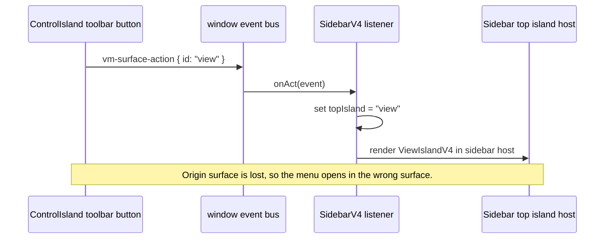
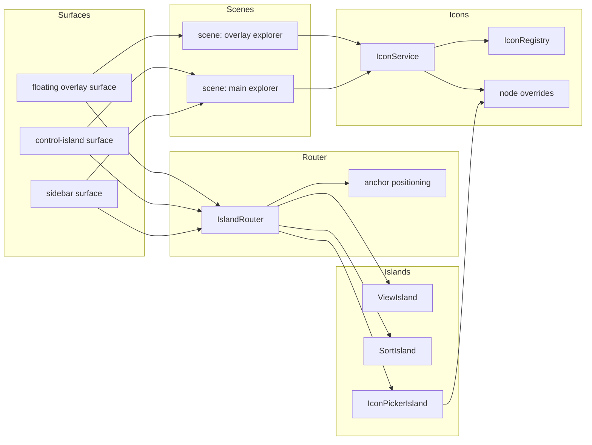
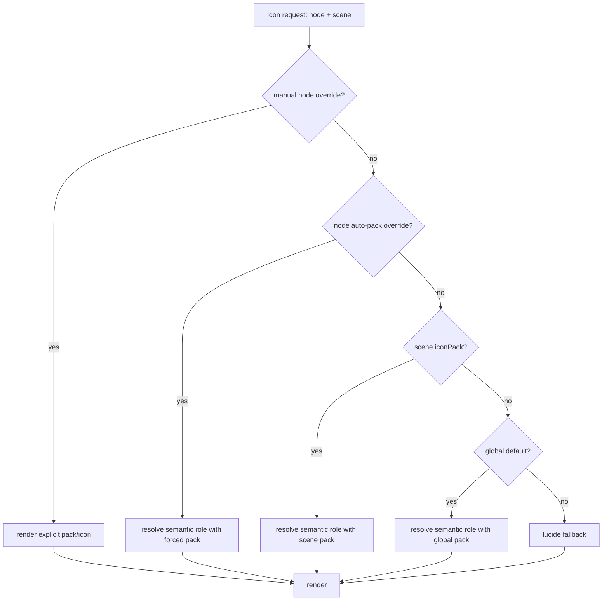
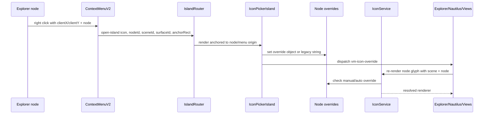
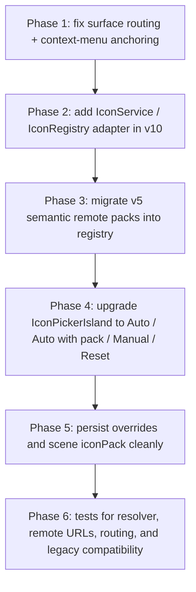

# Vaultman v10 icon-pack update research

## Scope

This note captures the update path discussed for bringing the stronger v5 icon-pack system into v10 without discarding v10's newer interaction model.

The important architectural distinction is:

- `Surface`: a host/container. Examples: sidebar frame, floating overlay, control island, bottom/top island shell. It owns position, size, z-index, focus, drag/resize/collapse, and visual chrome.
- `Scene`: the operational content inside a surface. A scene owns tab, explorer, view mode, layout, sort, filters, grouping, selection, icon pack, cell order, and viewport state.
- `Island`: a tool/menu/editor opened against a scene and anchored from a surface. Examples: view, sort, icon picker, filters, queue.

## Current findings

- v10 already has a node context-menu action named `Change icon...` in `proto-v10/popups.jsx`.
- v10 already has `IconPickerIsland` and per-node icon overrides through `window.__vmIconOverrides`.
- v10's current override format is a string: Lucide name, `adw:<kind>`, or `emoji:<char>`.
- v10's Nautilus pack logic supports `lucide`, custom `adwaita`, and `emoji`.
- v5's stronger system lives in `proto/icons.jsx`: semantic node resolution, remote packs, Papirus/Reversal/Adwaita sources, and fallbacks.
- The context-menu position bug comes from fixed offsets in v10: the sidebar stores `x: e.clientX - 60` and `y: e.clientY - 100`.
- The control-island toolbar currently dispatches `vm-surface-action` with only `{ id }`. The sidebar listener opens the regular top island, so view/sort menus launched from the control island appear in the sidebar frame.

## Current broken routing



## Target routing contract

Every command that opens or manipulates an island should include origin and scene context.

```js
{
  type: "open-island",
  island: "view",
  sceneId: "main",
  surfaceId: "control-island",
  anchorRect: { left, top, width, height },
  anchorNodeId: null
}
```

For node icon selection:

```js
{
  type: "open-island",
  island: "icon",
  sceneId: "main",
  surfaceId: "sidebar",
  anchorRect: { left, top, width, height },
  anchorNodeId: "node-id"
}
```

## Target architecture



## Scene-owned icon state

The proposed priority order:



Recommended override object format:

```js
{
  "node-id": {
    mode: "manual",
    packId: "papirus",
    iconId: "text-x-markdown"
  }
}
```

Automatic per-node pack override:

```js
{
  "node-id": {
    mode: "auto",
    packId: "reversal"
  }
}
```

Keep compatibility with existing string overrides:

- `file`
- `adw:folder`
- `emoji:📁`

## Node context-menu to icon-picker flow



## Implementation phases



### Phase 1 acceptance

- Node context menu opens at the click point or a clamped viewport-safe position.
- `Change icon...` remains available from the explorer node context menu.
- Control-island toolbar actions include origin metadata.
- View/sort/search launched from the control island are routed to a control-island host, not the sidebar frame.
- Existing sidebar toolbar behavior still opens the regular top islands.

### Phase 2 acceptance

- All current v10 calls to `Icon`, `NodeGlyph`, and `nautPackArt` keep working.
- Existing string overrides remain valid.
- New object overrides are accepted but not required yet.
- The service can resolve by node role: folder, file, markdown, pdf, image, canvas, base, tag, property, content, match.

### Phase 3 acceptance

- Registry includes current v10 packs: `lucide`, `adwaita-v10`, `emoji`.
- Registry adds remote inherited packs: `papirus`, `reversal`, optionally `adwaita-v5`.
- Remote pack fallback chain is: exact asset -> pack fallback -> lucide equivalent -> letter/type fallback.
- Failed remote URLs are cached in memory to avoid repeated broken fetches.

## Recommended first code move

Start with Phase 1, not with the icon resolver. The picker already exists; the immediate problem is that menus and commands are not routed with enough scene/surface context. If routing is fixed first, the future icon-pack picker can open from the node cmenu, control island, sidebar, or floating overlay without special cases.
