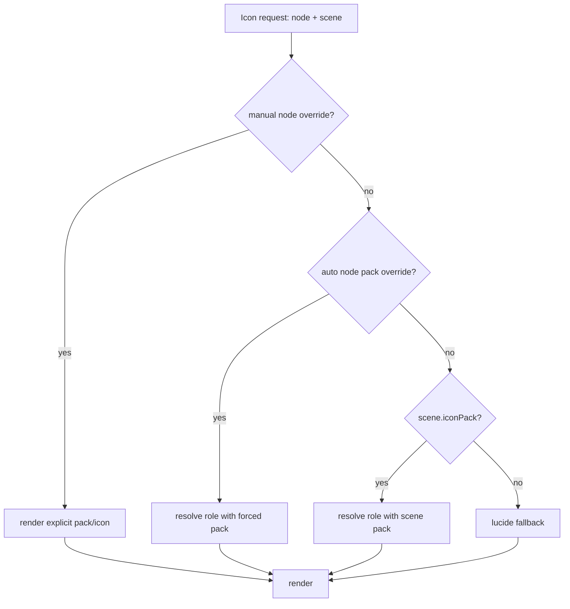
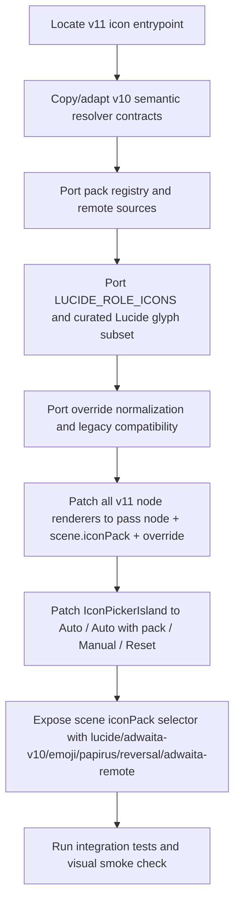

# Vaultman icon system migration spec: v10 to v11

## Purpose

This spec captures the icon-system work implemented in v10 and now ported into the newer v11 prototype.

Current v11 targets:

- `proto-v11/icons.jsx`
- `proto-v11/explorer.jsx`
- `proto-v11/nautilus.jsx`
- `proto-v11/views.jsx`
- `proto-v11/popups.jsx`
- `proto-v11/control-island.jsx`
- `Vaultman Prototype v11.html`

## v11 port status

Applied in v11:

- `Vaultman Prototype v11.html` now loads `proto-v11/icons.jsx` instead of the shared `proto/icons.jsx`.
- `proto-v11/icons.jsx` carries the semantic resolver, remote pack registry, curated Lucide role map, special canvas/base icons, and override normalization.
- `proto-v11/control-island.jsx` exposes scene-level `lucide`, `adwaita-v10`, `emoji`, `papirus`, `reversal`, and `adwaita-remote` packs.
- `proto-v11/popups.jsx` uses the enriched icon picker: Auto, Auto with pack, Manual icon, Reset to scene, and runtime `Icon` previews.
- `proto-v11/explorer.jsx`, `proto-v11/nautilus.jsx`, `proto-v11/views.jsx`, and `proto-v11/desktop.jsx` pass real node context plus active scene pack and overrides into `Icon`.
- `proto-v11/sidebar.jsx`, `proto-v11/desktop.jsx`, and `Vaultman Prototype v11.html` keep the context menu fixed-position and remove the old click offsets.

Do not replace v11 modules wholesale from v10 after this port. V11 contains newer view behavior, especially in `proto-v11/views.jsx` masonry/content flow. Future changes should preserve those v11-specific sections and patch icon calls locally.

## Implemented v10 advances

### 1. Semantic icon service

The public component stays simple:

```jsx
<Icon
  name={node.icon || 'file'}
  node={node}
  size={14}
  packOverride={scene.iconPack}
  override={(window.__vmIconOverrides || {})[node.id]}
/>
```

Internally, `proto-v10/icons.jsx` resolves a semantic role from node context before choosing a pack renderer.

Relevant exported contracts:

- `window.resolveIconPackKey`
- `window.getIconSource`
- `window.normalizeIconOverride`
- `window.ICON_PACK_SOURCES`
- `window.LUCIDE_ROLE_ICONS`
- `window.Icon`

### 2. Pack registry

Current pack ids:

- `lucide`: curated inline Lucide subset for UI and node roles.
- `adwaita-v10`: existing local/custom Adwaita renderer.
- `emoji`: text emoji renderer.
- `papirus`: remote Papirus assets.
- `reversal`: remote Reversal assets.
- `adwaita-remote`: remote GNOME Adwaita assets from the v5 system.

Do not merge `adwaita-v10` and `adwaita-remote`; they are intentionally separate.

### 3. Node role resolution

The resolver inspects:

- `node.kind`
- `node.type`
- `node.nodeType`
- `node.fileType`
- `node.ext`
- filename extension from `node.name`
- explicit `name`
- explicit `kind`, `fileName`, `ext` props

Core semantic roles:

```js
folder
file
md
txt
json
img
pdf
canvas
base
tag
prop
value
content
match
```

The important bugfix is that `node.type` has priority for value-like and special nodes, so tags/properties/content/value nodes do not collapse to markdown/file icons.

### 4. Curated Lucide role map

Lucide now has richer node-role mapping instead of collapsing everything to `file`, `search`, or `sliders`.

```js
const LUCIDE_ROLE_ICONS = {
  folder: 'folder',
  file: 'file',
  md: 'file-text',
  txt: 'file-text',
  json: 'file-code',
  img: 'file-image',
  code: 'file-code',
  sheet: 'table',
  canvas: 'workflow',
  base: 'database',
  pdf: 'file-type',
  tag: 'tags',
  prop: 'sliders-horizontal',
  value: 'list-check',
  content: 'scan-text',
  match: 'search-check',
};
```

The inline Lucide renderer now includes the role glyphs needed by this map:

- `file-text`
- `notebook-text`
- `file-type`
- `file-code`
- `file-image`
- `folder-open`
- `folder-tree`
- `workflow`
- `network`
- `blocks`
- `database`
- `table`
- `tags`
- `sliders-horizontal`
- `list-filter`
- `list-check`
- `binary`
- `braces`
- `scan-text`
- `search-check`
- `badge-check`

These names were checked against the official Lucide source. Avoid inventing Lucide ids such as `file-type-2` or `file-json`; they were not present in the source checked for this pass.

### 5. Override model

Legacy string overrides remain supported:

```js
"file"
"adw:folder"
"emoji:📁"
```

New object overrides:

```js
{
  mode: "auto",
  packId: "papirus"
}
```

```js
{
  mode: "manual",
  packId: "lucide",
  iconId: "file-text"
}
```

Priority:



### 6. Picker behavior

`IconPickerIsland` now supports:

- Auto: clear override and follow scene pack.
- Auto with pack: force a pack for this node but keep semantic role resolution.
- Manual icon: choose an exact role/icon id within a pack.
- Reset to scene.

Lucide manual choices now include the richer curated subset, not only generic file/search/sliders.

### 7. Surfaces that must pass node context

Any renderer showing real Vaultman nodes must pass `node`, active scene pack, and override into `Icon`.

Implemented v10 surfaces:

- `proto-v10/explorer.jsx`
- `proto-v10/nautilus.jsx`
- `proto-v10/views.jsx`
- `proto-v10/desktop.jsx` legacy file table
- `proto-v10/popups.jsx` previews

Do not regress to:

```jsx
<Icon name="file" />
```

for a real node row, card, tile, canvas node, or preview.

## Migration sequence for v11



## v11 port checklist

- `proto-v11/icons.jsx` exports the same resolver globals as v10.
- `lucide`, `adwaita-v10`, `emoji`, `papirus`, `reversal`, and `adwaita-remote` are visible as pack ids.
- `tag`, `prop`, `value`, `content`, and `match` render distinct icons in every pack that has them.
- `pdf`, `canvas`, and `base` are distinct from markdown/file.
- `IconPickerIsland` uses runtime `Icon` previews, not hand-drawn fake previews.
- Existing string overrides still work.
- Object overrides support `mode`, `packId`, and `iconId`.
- All explorer engines pass full node context into `Icon`.
- Context-menu `Change icon...` still opens from node cmenu.
- Control-island View/Sort routing must not reintroduce local island mounting unless v11 has a stable surface router.

## Suggested tests to port

Use v10 tests as source:

- `tests/check-v10-icon-pack-integration.mjs`
- `tests/check-node-icon-resolution.mjs`
- `tests/check-icon-pack-urls.mjs`
- `tests/check-v10-surface-routing.mjs`

For v11, duplicate or adapt names to:

- `tests/check-v11-icon-pack-integration.mjs`
- `tests/check-v11-surface-routing.mjs`

The most important assertions:

- Resolver reads `node.type`.
- Lucide role map does not collapse node roles to `file/search/sliders`.
- Explorer, Nautilus, Views, and desktop/list surfaces pass `node + iconPack + override`.
- Remote pack URLs remain reachable.
- `ControlIsland` does not mount `ViewIslandV4` / `SortIslandV4` directly unless v11 has a proper router.

## Current implementation files in v10

- `proto-v10/icons.jsx`
- `proto-v10/explorer.jsx`
- `proto-v10/nautilus.jsx`
- `proto-v10/views.jsx`
- `proto-v10/popups.jsx`
- `proto-v10/control-island.jsx`
- `proto-v10/desktop.jsx`
- `tests/check-v10-icon-pack-integration.mjs`
