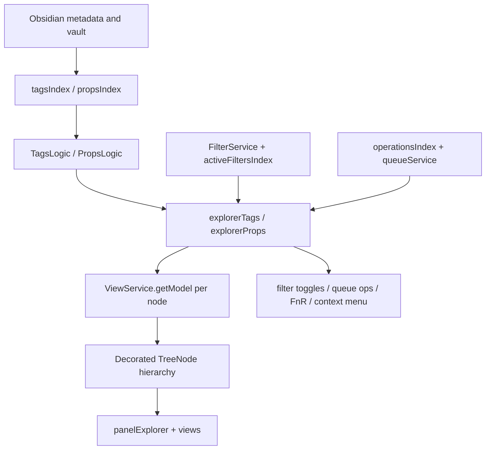

# Wave 2 Tags And Props Vertical Spec

## Evidence Read

- Docs: current status, current handoff, engineering context, structural
  taxonomy, and Explorer data-plane transition PRD.
- Source: `src/index/indexTags.ts`, `src/index/indexProps.ts`,
  `src/index/utilPropIndex.ts`, `src/index/indexActiveFilters.ts`,
  `src/logic/logicTags.ts`, `src/logic/logicProps.ts`,
  `src/providers/explorerTags.ts`, `src/providers/explorerProps.ts`,
  `src/components/containers/explorerTags.ts`,
  `src/components/containers/explorerProps.ts`,
  `src/components/pages/tabTags.svelte`,
  `src/components/pages/tabProps.svelte`,
  `src/components/pages/pageFilters.svelte`,
  `src/services/serviceFilter.svelte.ts`,
  `src/services/serviceViews.svelte.ts`, `src/types/typeNode.ts`,
  `src/types/typeProp.ts`, `src/types/typeExplorer.ts`,
  `src/types/typeContracts.ts`, and `src/types/typeViews.ts`.
- Tests inspected: `test/unit/components/explorerTags.test.ts`,
  `test/unit/services/serviceActiveFiltersIndex.test.ts`, and targeted
  searches through `explorerProps`, `pageFilters`, `cmenuSetAction`, and
  `cmenuCreateBindingNote` tests.
- Note: requested `test/unit/index/indexActiveFilters.test.ts` does not exist;
  actual coverage is `test/unit/services/serviceActiveFiltersIndex.test.ts`.

## Current Responsibilities

`indexTags` and `indexProps` publish flat source records through
`createNodeIndex`: nodes, revisions, lookup maps, subscriptions, and search
buffers. These indexes are the source-record seed for Tags and Props snapshots.

`utilPropIndex` is a separate live property autocomplete index. It duplicates
property discovery semantics, tracks file properties, and grows values
monotonically between rebuilds. It needs an explicit ownership split from
`indexProps` before source semantics are hardened.

`logicTags` and `logicProps` turn flat metadata/index facts into `TreeNode`
hierarchies. They own hierarchy construction, search filtering, and local cache
invalidation.

`explorerTags` and `explorerProps` own too much of the data plane today:
structural tree projection, search mode, sorting, per-node `ViewService`
decoration calls, quick-action badges, filter toggles, context-menu
registration, queue operation construction, FnR handoff, operation-scope
resolution, and direct metadata reads.

`tabTags` and `tabProps` are thin lifecycle wrappers. `pageFilters` is broader:
it coordinates toolbar state, tab routing, FnR island, operation scope,
expansion commands, Bases import mode, and provider bindings.

## Data Flow

The main fault line is that structural tree building and decorative overlay
projection are interleaved inside provider `getTree()` paths, especially
recursive `_decorateTree()` work.

## Target Seams

- Move structural projection from `TagsLogic`/`PropsLogic` plus provider
  search/sort into a data-plane snapshot builder.
- Keep providers as action adapters for context menu, FnR handoff, queue
  operations, binding-note actions, content search, and provider-specific action
  scope until alternatives are ready.
- Move recursive decoration into a batch overlay pipeline using
  `ViewService.getModel()` over visible rows.
- Treat `operationsIndex.revision` and `activeFiltersIndex.revision` as
  decorative revisions so queue/filter changes do not rebuild structural
  tag/prop trees.
- Resolve the ownership drift between `indexProps` and `PropertyIndexService`
  with either a shared source contract or explicit non-overlapping roles.
- Keep `TreeNode` compatibility while tabs, providers, and panel routing still
  expect that shape.

## Risks

- Per-node `ViewService.getModel({ nodes: [node] })` in provider decoration
  preserves the old render hot path.
- Providers read filter state, selected files, queue indexes,
  active-filter indexes, settings, metadata cache, Iconic, and context menus
  directly.
- Tags and Props are similar but not identical; migrations that assume one
  provider family can be copied into the other can preserve drift.
- Active filter highlighting is feature-flagged by
  `showMatchedFilterDecorations`, so the data plane must preserve default-off
  behavior for value-node decorations.
- Property casing and value serialization are subtle. Existing tests cover
  casing-different frontmatter and JSON/string conversion.

## Test Gates

- Snapshot tests for Tags/Props structural rows: ids, parent links, visible
  order, lookup maps, search mode, and sort target.
- Decorative invalidation tests proving queue/filter revisions update layers
  without rebuilding source trees.
- Batch `ViewService` parity tests against current per-node provider decoration.
- Provider/data-plane seam tests for filter toggles, queue ops, FnR handoff,
  context menus, and binding-note actions from snapshot-backed rows.
- Regression tests for `indexProps` versus `PropertyIndexService`, including
  value removal, object values, casing, and autocomplete expectations.
- Component tests for `pageFilters` with snapshot-backed Tags/Props providers.

