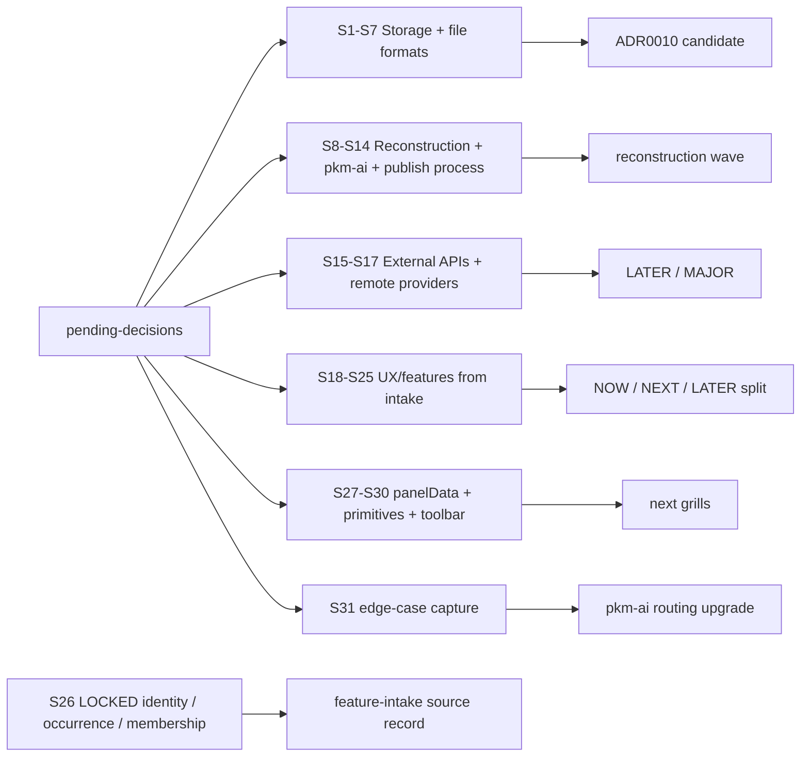
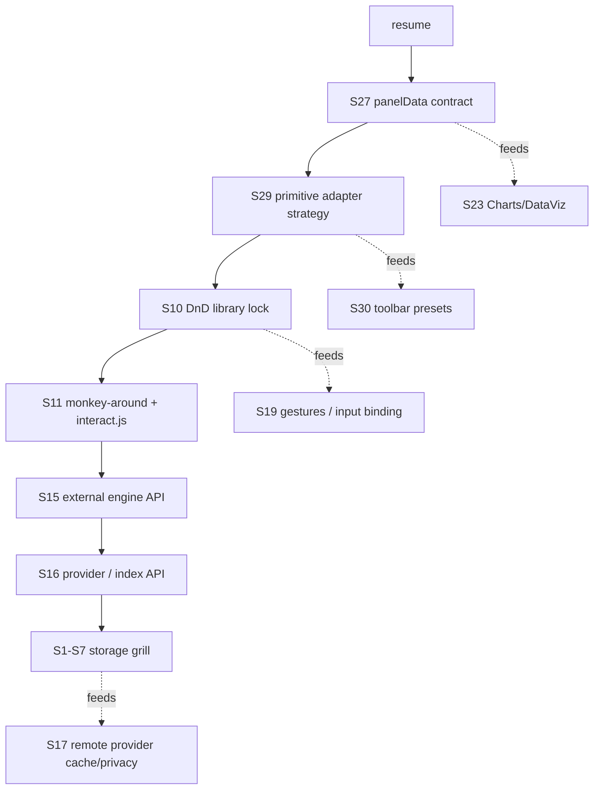
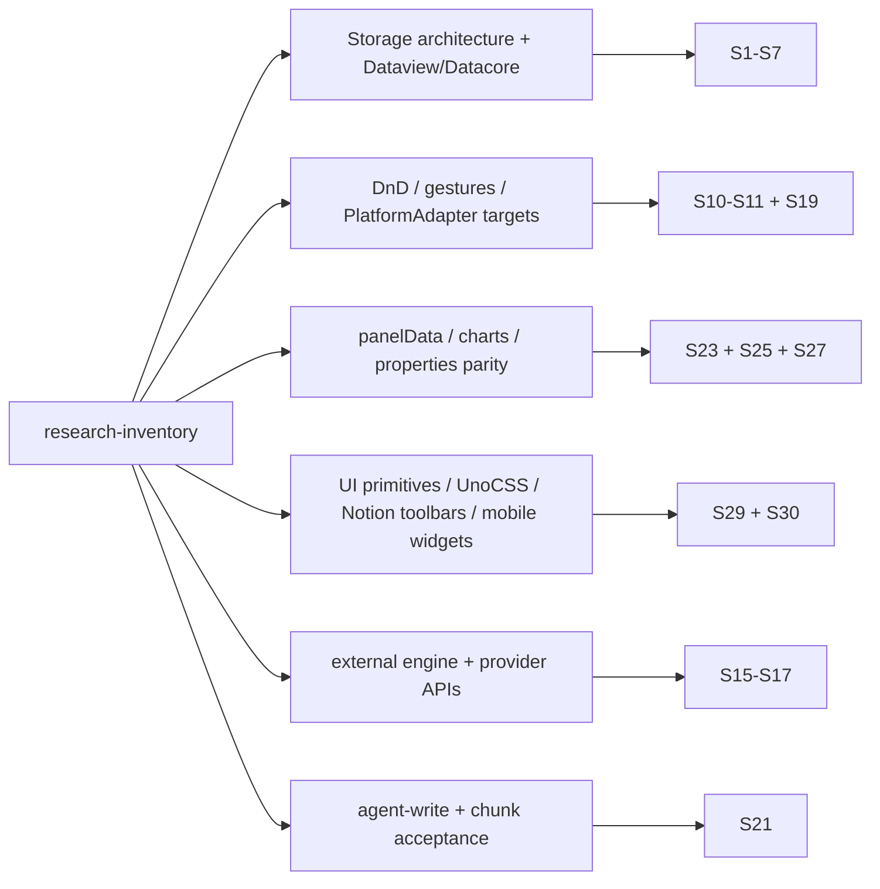
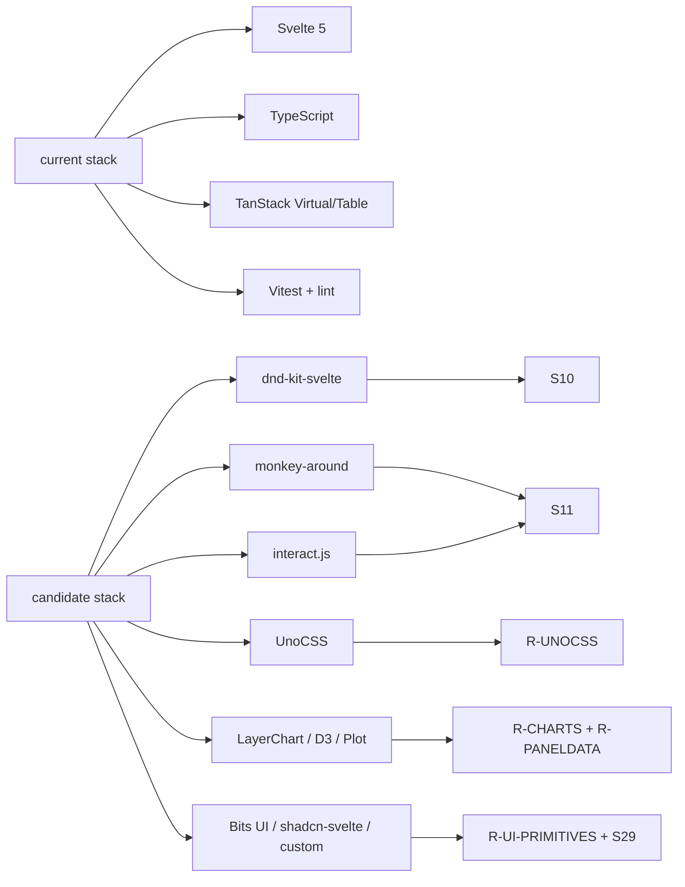
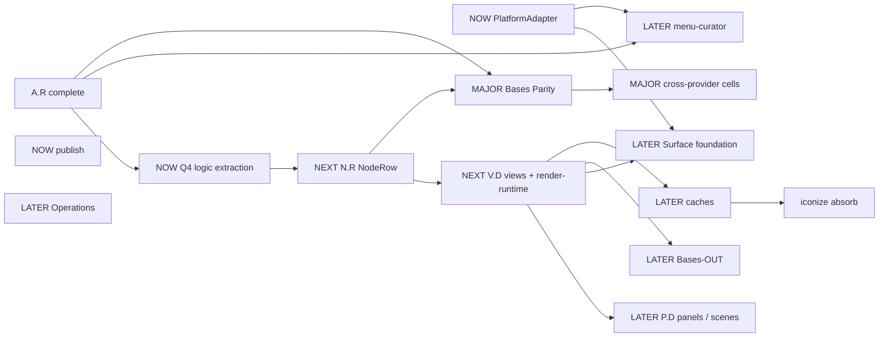
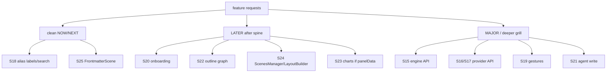
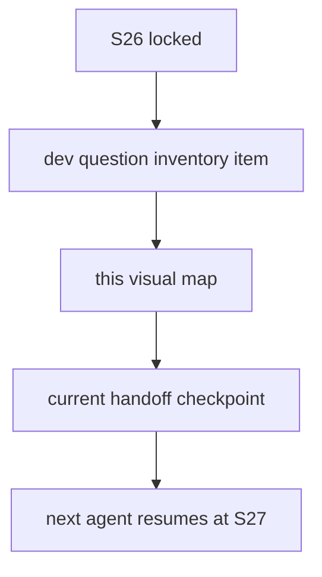

# Pending Decisions, Research, Tooling, Subsystems, Roadmap Map — 2026-05-29

Source-backed visual checkpoint for the current architecture grill state.

## Sources

- [[docs/architecture/pending-decisions|pending-decisions]]
- [[docs/architecture/research-inventory|research-inventory]]
- [[docs/architecture/tooling-libraries|tooling-libraries]]
- [[docs/architecture/zoom-out-map|zoom-out-map]]
- [[docs/work/hardening/research/2026-05-25-architecture-foundation-discovery/roadmap-dispatch|roadmap-dispatch]]
- [[docs/work/hardening/research/2026-05-28-feature-request-architecture-fit/index|feature-request architecture fit]]
- [[docs/work/hardening/research/2026-05-28-feature-request-architecture-fit/01-api-patterns-paneldata-membership|API patterns and repeated membership]]
- [[docs/work/hardening/research/2026-05-28-feature-request-architecture-fit/02-identity-occurrence-membership-cases|identity, occurrence, membership cases]]
- [[docs/work/hardening/research/2026-05-28-feature-request-architecture-fit/03-paneldata-primitives-presets|PanelData, primitive adapters, presets]]
- [[docs/work/hardening/items/2026-05-29-dev-pending-question-inventory|dev pending question inventory]]

## Vertical Coverage

| Area | Source | Status |
|---|---|---|
| Pending decisions | `pending-decisions.md` | covered |
| Feature-grill questions | `feature-request-architecture-fit/` | covered |
| Pending research | `research-inventory.md` | covered |
| Tooling/libraries | `tooling-libraries.md` | covered |
| Subsystems | `zoom-out-map.md` | covered |
| Roadmap DAG | `roadmap-dispatch.md` | covered |
| Product code files | `src/` | not in scope for this checkpoint |

## Decision Inventory Map

## Question Order For Next Session

## Pending Research Map

## Tooling / Library Decision Map

## Subsystems + Roadmap DAG

## Feature Intake Placement

## Checkpoint State

## Verification

| Check | Status | Source |
|---|---|---|
| Mermaid fences balanced | passed | 14 Mermaid/code fences counted; even fence count |
| Source paths exist | passed | all listed source paths exist |
| `git diff --check` | passed | touched docs only; LF-to-CRLF warnings only |
| Feature-intake shard line caps | passed | continuation shards are 123, 192, and 116 lines |
| Full doc health | failed | pre-existing hard line caps/parent-shape/timestamp/glossary issues remain; current docs show soft warnings |
