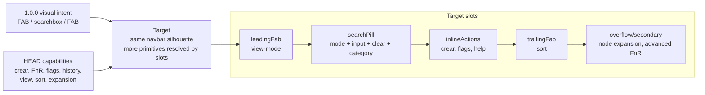

# Adaptation Plan

## Adaptacion conceptual recomendada

Objetivo: que el toolbar recupere la composicion visual de `navbarFilters` sin
perder los botones nuevos ni romper handlers existentes.



## Primitive order target

El orden objetivo debe ser:

| Slot | Primitive | Estilo recomendado | Razon |
| --- | --- | --- | --- |
| `leadingFab` | `view-mode` | FAB circular accent, 2.25em, como `vaultman-nav-fab`. | Recupera el ancla izquierda de `1.0.0`. |
| `center` | `search` | Search pill inline, flexible, `height: 26px`, `border-radius: 999px`. | Devuelve search al centro visual. |
| `center:leading` | `fnr-mode` | Chip pequeno dentro del pill, no boton externo. | Mantiene FnR sin crear otro boton lateral. |
| `center:main` | `search-input` | Input transparente, `flex: 1`. | Replica el searchbox de navbarFilters. |
| `center:trailing` | `clear`, `category`, `flags`, `help` | Iconos/chips mini dentro del pill o visibles solo en focus. | Conserva funciones sin romper la silueta. |
| `center:action` | `crear` | Plus chip compacto dentro o pegado al pill; evitar texto grande fijo. | No perder crear, pero bajar peso visual. |
| `trailingFab` | `sort` | FAB circular accent, 2.25em. | Recupera el ancla derecha de `1.0.0`. |
| `overflow` | `node-expansion`, extras futuros | Mini overflow o secondary slot contextual. | Evita volver al cluster feo de un costado. |

## Regla de UI

El toolbar puede tener mas botones que `1.0.0`, pero su silueta no debe parecer
"botones pegados al costado". La capa superior debe leerse asi:

```text
[ view FAB ] [ search pill with inline controls and crear ] [ sort FAB ]
```

Los comandos adicionales viven dentro del pill, aparecen por foco/contexto, o
se van a overflow. No deben desplazar el search ni reemplazarlo por un icono.

## Que debe hacer el siguiente agente

### 1. Crear un test de contrato visual antes de tocar UI

Agregar o reemplazar pruebas para expresar el contrato nuevo:

- El header renderiza, en orden, `view-mode`, `search pill`, `sort`.
- El search input esta visible inline sin abrir popover.
- `crear`, category, flags/help y node expansion siguen presentes o accesibles.
- `openViewMenuHook`, `openSortMenuHook` y search/FnR siguen funcionando.

El test actual `toolbarMenuPlacement.test.ts` hoy exige lo contrario: view/sort
despues de `crear` dentro de `.vm-toolbar-menu-min`. Ese test debe migrarse, no
saltarse.

### 2. Separar layout de capabilities

No agregar mas condicionales directos en `Toolbar.svelte`. Usar el criterio del
research anterior [[docs/work/polish/research/2026-05-17-toolbar-architecture/index|Toolbar architecture]]:

- `ToolbarPrimitive`: `view-mode`, `search`, `sort`, `crear`, `node-expansion`,
  `fnr-mode`, `search-flags`, `help`, `category`.
- `filtersToolbarAdapter`: conserva los handlers actuales.
- `resolveToolbarModel`: decide slots y orden.
- `ToolbarRenderer`: pinta regiones, no decide reglas de negocio.

### 3. Restaurar la silueta de navbarFilters

Reusar la intencion de estilos de `1.0.0`:

- `.vm-navbar-filters`: sticky top, max-width `520px`, centered.
- `.vm-filters-header`: flex row, gap `6px`, padding `6px 8px 4px`.
- FABs de borde: circulares, 2.25em, accent filled, icono 1em.
- `.vm-filters-header-search-pill`: `flex: 1`, min-width 0, border pill,
  background form/secondary, `height: 26px`.

Adaptar nombres actuales `vm-*`; no volver a `vaultman-*` si el sistema ya fue
migrado a tokens/SCSS actuales.

### 4. Convertir search island en estado avanzado, no default

El search normal debe estar inline. El popover/island debe reservarse para:

- rename/replace expandido;
- errores o help avanzado;
- history si no cabe en el pill;
- mobile/very narrow fallback.

Esto conserva `FnRIslandService` sin hacer que el search principal desaparezca.

### 5. Mantener botones nuevos sin romper nada

No eliminar primitives. Reubicarlas:

- `crear`: chip/plus compacto en el search pill o action slot pegado al pill.
- `node-expansion`: overflow/secondary mini control; visible solo si
  `nodeExpansionSummary.canToggle`.
- `search flags`: dentro del pill cuando hay foco o en popover avanzado.
- `help`: dentro del search body, no al lado de FABs.
- `operationScope` y resets por mouse gesture: conservar handlers de
  `handleViewButtonClick` y `handleSortButtonClick`.

## Checklist de implementacion futura

- [ ] Crear test rojo para orden `view -> search -> sort`.
- [ ] Crear test rojo para search inline visible.
- [ ] Crear test que pruebe que `crear` sigue invocando `onCrear`.
- [ ] Crear test que pruebe que `nodeExpansionSummary.canToggle` sigue
      exponiendo expansion.
- [ ] Crear test que pruebe que FnR mode/flags siguen conectados al servicio.
- [ ] Refactorizar `Toolbar.svelte` hacia slots o resolver antes de mover
      estilos de forma agresiva.
- [ ] Reemplazar `.vm-toolbar-menu-min { margin-left: auto; }` por regiones
      explicitas.
- [ ] Mover `.vm-toolbar-search-island` a fallback/advanced state, no default.
- [ ] Correr `pnpm run test:component -- test/component/toolbarMenuPlacement.test.ts test/component/searchboxIsland.test.ts test/component/toolbarClickWeights.test.ts`.
- [ ] Correr `pnpm check` y `git diff --check`.
