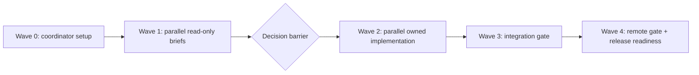

# Release 1.0.2 Parallel Dispatch Plan

## Purpose

Convert the rigid `1.0.2` checklist into dependency-aware work that multiple
agents can run without overwriting each other. Source inventory:
[[docs/work/publish/items/2026-06-04-release-1-0-2-gate-delta-inventory|Release 1.0.2 gate delta inventory]].

## Hard Rules

- Coordinator owns sequencing, branch hygiene, and final integration.
- No agent may push, tag, retag, merge, publish, or edit GitHub Release state.
- Stable implementation must stay on the `1.0.x` line; do not merge canary UI.
- `main` / stable release branches must contain zero AI workflow files.
- One owner edits a shared file at a time. Shared files include `package.json`,
  lockfiles, `.github/workflows/*`, `manifest.json`, and `versions.json`.
- Research agents may work read-only in parallel. Implementation agents need
  isolated worktrees or strictly assigned file ownership.

## Dependency Graph

## Wave 0 - Coordinator Only

- Confirm target worktree/branch: `hotfix/1.0.2-css-scorecard` or a fresh
  successor worktree from that branch.
- Snapshot dirty state and protect unrelated user/agent changes.
- Confirm no AI files are present in the stable candidate.
- Create a short dispatch packet for each agent with file ownership, source
  links, and forbidden actions.
- Decide whether implementation agents return patches only or edit isolated
  worktrees.

## Wave 1 - Parallel Read-Only Briefs

These can run concurrently because they do not edit files.

| Agent | Scope | Output |
| --- | --- | --- |
| A1 Tooling | pnpm migration, Node 24 pin, stable lockfile strategy, esbuild retention. | Exact file list, risk, implementation order. |
| A2 Lint/Format | `eslint-plugin-obsidianmd`, `eslint.config.mts`, Prettier/oxc feasibility. | Version decision, rule activation, findings forecast. |
| A3 CSS Gate | `test:scorecard`, possible narrow `stylelint`, CSS release-risk patterns. | Blocking CSS rules and defer list. |
| A4 Security | CodeQL #64, `SECURITY.md`, workflow permissions, Dependabot PR triage, Scorecard fixable/admin split. | Fix list split by code/config/admin. |
| A5 Metadata | `CHANGELOG.md`, `manifest.json`, `versions.json`, `minAppVersion` evidence. | Metadata patch plan and evidence gaps. |
| A6 CI/Release | CI/release workflows, release assets, SBOM/attestation decision, release-please conflict. | Workflow patch plan and release-blockers. |

## D1 - Decision Barrier

Coordinator resolves these before code edits:

- `pnpm` for `1.0.2`: yes/no.
- Node policy: expected answer is Node `24` locally and in CI.
- Build policy: expected answer is keep esbuild for stable `1.0.2`.
- `stylelint`: release-blocking narrow gate vs explicit deferral.
- `format:check`: CI gate vs local-only gate.
- `eslint-plugin-obsidianmd`: update target and whether new findings block.
- `SECURITY.md`: add now unless maintainer rejects the policy text.
- `minAppVersion`: keep `1.12.0` unless evidence justifies change.

## Wave 2 - Parallel Owned Implementation

Run only after D1. Each agent owns listed files; cross-file requests go through
the coordinator.

| Agent | Owns | Must not edit | Deliverable |
| --- | --- | --- | --- |
| B1 Tooling Gate | `package.json`, package lockfile, `.node-version`, optional `pnpm-workspace.yaml`. | Workflows, product UI, manifest. | pnpm/Node/esbuild gate patch. |
| B2 Lint/Format | `eslint.config.mts`, formatter config files, lint docs. | `package.json` unless B1 delegates dependency edits. | Obsidian ESLint/format gate patch. |
| B3 CSS Gate | `scripts/scorecard-regression-check.mjs`, optional `stylelint.config.*`, CSS gate docs. | Broad `styles.css` rewrite unless scoped by hotfix. | CSS/Scorecard prevention patch. |
| B4 Security | `SECURITY.md`, `src/modals/modalQueueDetails.ts`, security notes. | Workflows unless B6 delegates. | CodeQL #64 + security policy patch. |
| B5 Metadata | `CHANGELOG.md`, `manifest.json`, `versions.json`, compatibility note. | Package/tooling files. | Release metadata patch with evidence. |
| B6 CI/Release | `.github/workflows/*.yml`. | `package.json` and lockfiles. | CI/release command/cache/permissions patch. |

If two agents need the same file, the coordinator serializes that file or turns
one agent's work into a patch proposal.

## Wave 3 - Coordinator Integration Gate

- Merge/compose Wave 2 patches in dependency order:
  B1 package manager first, then B2/B3 gates, then B4/B5 docs/source, then B6
  workflows.
- Regenerate lockfile exactly once after all dependency decisions.
- Run the local release gate with the selected package manager and Node version.
- Run `git diff --check`.
- Confirm release assets: `main.js`, `manifest.json`, `styles.css`.
- Confirm no AI files are present in the stable candidate.
- Record any failures back into this initiative before retrying.

## Wave 4 - Remote Gate And Release Readiness

- Open or update the PR to `main` only after local gates pass.
- Wait for required checks: `verify` and `Analyze (javascript-typescript)`.
- Recheck Dependabot alerts, Code Scanning alerts, and Scorecard SARIF.
- Confirm release-please is not preparing the wrong `1.1.0` stable release.
- Prepare release notes and asset expectations.
- Stop before tag/release creation until the maintainer gives explicit approval.

## Prompt Seeds

Use these as short dispatch prompts, adding exact branch/worktree paths at run
time.

- A1/B1: "Work only on the stable `1.0.2` gate. Decide and implement pnpm + Node
  24 while keeping esbuild. Do not import Vite/Vite+ or canary UI."
- A2/B2: "Audit `eslint-plugin-obsidianmd` and format gates. Confirm active
  rules and propose/update the narrow release-blocking lint/format gate."
- A3/B3: "Prevent recurrence of Obsidian Scorecard CSS findings. Extend the
  custom scan and decide whether narrow stylelint belongs in `1.0.2`."
- A4/B4: "Fix code/config security items only: CodeQL #64 and `SECURITY.md`.
  Classify Scorecard admin/maturity findings separately."
- A5/B5: "Prepare `1.0.2` metadata. Do not change `minAppVersion` without
  evidence; document whether `1.12.0` is tested or inherited."
- A6/B6: "Update CI/release workflows to match the selected package manager and
  Node pin. Do not change release tags or GitHub release state."

