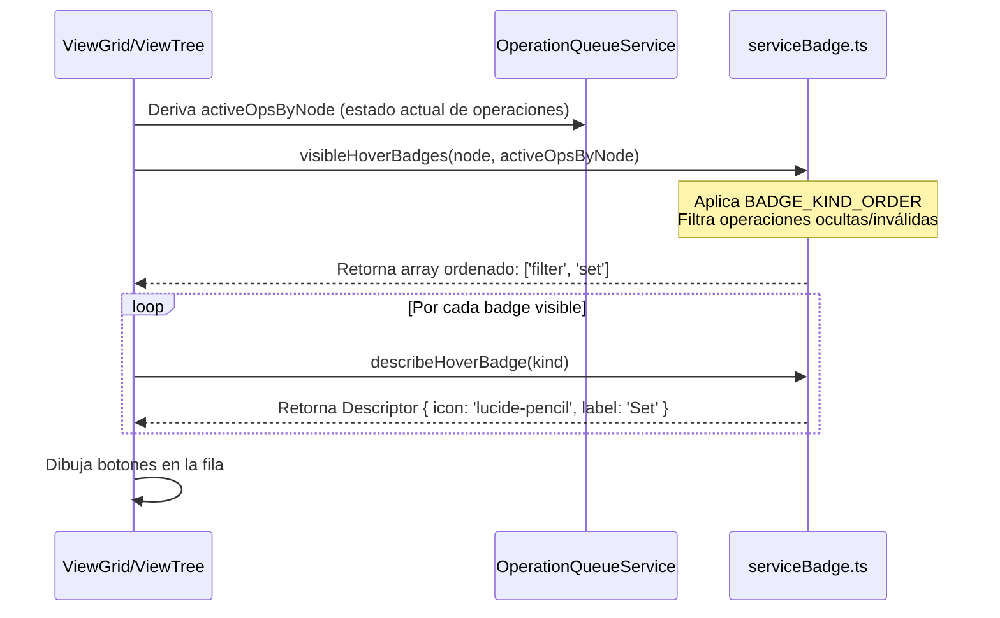

# Batch 1: Primitivas y Badges

## `src/components/primitives` - Componentes Base de Interfaz Svelte 5

### Propósito
Provee los bloques de construcción visuales más fundamentales de Vaultman (botones, insignias, cajas de texto, toggles). Son componentes estrictamente presentacionales ("dumb components") construidos sobre **Svelte 5 Runes**. Su propósito principal es estandarizar la interacción visual aislando la complejidad de las variables CSS de Obsidian y proporcionando interfaces `$bindable` predecibles para los componentes de mayor jerarquía.

### Dependencias
- **IN**: Svelte 5 Core (`$props`, `$bindable`, `$derived`), API de Obsidian (`setIcon` extraído directamente de la librería nativa para inyectar SVG en el DOM).
- **OUT**: Ninguna dependencia hacia servicios de estado o de negocio. Son consumidos transversalmente por toda la capa de UI (`pageFilters`, `navbarPillFab`, `ViewNodeTable`, modales).

### Flujo de datos
```mermaid
graph TD
    Parent[Componentes de Contenedor/Vista] -->|Pasa $props (ej. disabled, icon)| Primitive[Primitiva (Svelte)]
    Parent <-->|$bindable (Two-way)| Primitive
    Primitive -->|Calcula clases CSS con $derived| DOM[DOM Render]
    Primitive -->|Ejecuta use:action| ObsAPI[Obsidian setIcon API]
    DOM -- "onclick / onchange" --> EventBus[Llamada a callbacks de Parent]
```

### Issues/Mejoras (Perspectiva shadcn-svelte)
- **Modificación directa del DOM vs Framework Reactivity:** En `BtnSquircle.svelte`, el icono se inyecta "por la fuerza" usando un Svelte action (`use:attachIcon`) que invoca `setIcon(node, name)` de Obsidian, saltándose el árbol virtual de Svelte. En shadcn, esto debe ser refactorizado para usar la librería `lucide-svelte` y mantener el renderizado puro.
- **Estilos Inline Dinámicos (Fricción con Tailwind):** `Badge.svelte` inyecta variables CSS dinámicamente (`style="--badge-accent: var..."`). Tailwind y shadcn confían en un sistema de utilidades y `class-variance-authority` (cva), por lo que estas inyecciones deberán pasarse a mapas de clases de Tailwind extendidas en el `tailwind.config.js`.
- **Accesibilidad (A11y):** Actualmente manejan `aria-label` manualmente, pero carecen de manejo de enfoque (Focus Trap) o interacciones de teclado robustas. shadcn resuelve esto de base gracias a `Bits UI`.

### Código clave
```svelte
// Inyección agresiva de SVG nativo en BtnSquircle.svelte
function attachIcon(node: HTMLElement, name: string) {
    setIcon(node, name);
    return {
        update(n: string) { setIcon(node, n); },
        destroy() { node.empty(); }
    };
}

// Composición de clases derivada reactivamente
let classes = $derived(`vm-btn-squircle vm-btn-squircle-${size}${isActive ? ' is-active' : ''}${disabled ? ' is-disabled' : ''}`);
```

---

## `src/badges/serviceBadge.ts` - Diccionario Core de Operaciones e Insignias

### Propósito
Actúa como la fuente única de verdad (Single Source of Truth) para todo el vocabulario visual e interaccional de las operaciones encoladas en Vaultman (`set`, `rename`, `convert`, `delete`, `filter`). Separa completamente la lógica de negocio (qué iconos mostrar, en qué orden, y qué contradicciones existen) de la capa de renderizado, permitiendo que las tablas y rejillas simplemente pregunten "qué pinto aquí" basado en el estado.

### Dependencias
- **IN**: Cero dependencias externas. Usa puramente TypeScript estructural.
- **OUT**: Exporta funciones utilitarias puras (`visibleHoverBadges`, `detectBadgeContradictions`) consumidas por `viewTree`, `ViewNodeGrid` y el analizador de la cola de operaciones.

### Flujo de datos


### Issues/Mejoras (Perspectiva de Arquitectura/Sharding)
- **Acoplamiento de Iconografía:** Aunque es agnóstico a la vista, tiene "hardcodeado" el nombre de los íconos de Obsidian (`icon: 'lucide-trash-2'`). Al migrar a `shadcn-svelte`, si decidimos cambiar de librería de íconos, tendríamos que refactorizar estos strings por referencias a los componentes Svelte reales.
- **Reglas de Negocio incrustadas en UI Logic:** La función `visibleHoverBadges` tiene una regla de negocio embebida: `if (active.has('delete')) return ['filter'];`. Es muy eficiente, pero si la lógica de contradicciones muta, este archivo requiere mantenimiento constante.
- **Performance de Lookup:** La función de lookup usa un `Set` inmutable o convierte Arrays a Sets en tiempo real. Esto es crítico porque se ejecuta *por cada nodo en cada renderizado virtual de la tabla*.

### Código clave
```typescript
// Prevención transversal de estados corruptos: Mapeo de contradicciones lógicas
export function detectBadgeContradictions(kinds: Iterable<BadgeKind>): BadgeContradiction[] {
	const ordered = sortByOrder(kinds);
	if (!ordered.includes('delete')) return [];

    const conflicts = ordered.filter((kind) => MUTATING_KINDS.includes(kind));
	if (conflicts.length === 0) return [];

    return [{
        code: 'delete-with-mutation',
        severity: 'warning',
        badgeKinds: sortByOrder([...conflicts, 'delete']),
        message: 'Delete conflicts with set or rename operations on the same node.',
    }];
}
```
