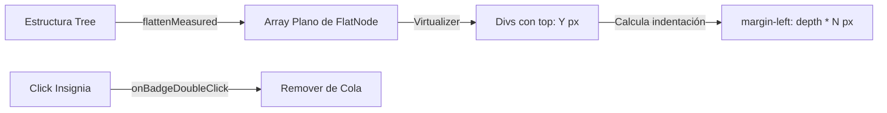

# Batch 3: Vistas y Virtualización

## `src/components/views/ViewNodeGrid.svelte` - Rejilla Virtualizada de Alto Rendimiento

### Propósito
Provee una vista de rejilla (grid) altamente optimizada para visualizar miles de nodos. Implementa **virtualización manual de filas** mediante TanStack Virtual, soportando además una **jerarquía "inline"** y selección por caja (box selection) con puntero. Es el componente con mayor densidad lógica de la capa de presentación.

### Dependencias
- **IN**: `@tanstack/svelte-virtual`, `serviceMouse`, `serviceViewSize`, `serviceBadge`.
- **OUT**: Emite eventos de interacción (`onTileClick`, `onBoxSelect`, `onToggleExpand`).

### Flujo de datos
```mermaid
graph TD
    Nodes[Array de TreeNode] -->|buildGridRows| Rows[GridRow[] con alturas dinámicas]
    Rows -->|Virtualizer| Visible[Visible VirtualItems]
    Visible -->|Render| Snippet[nodeTile / inlinePanel]
    UI[User Drag] -->|PointerEvent| Box[SelectionBox State]
    Box -->|intersectingTileIds| Select[onBoxSelect callback]
```

### Issues/Mejoras
- **Complejidad de Altura**: En el modo `inline`, la altura de una fila virtual no es constante. Esto obliga al virtualizador a realizar múltiples pasadas de medición.
- **Acoplamiento de Layout**: La lógica de cálculo de columnas (`columnsForWidth`) está dentro del componente. Debería externalizarse a un servicio de layout.

---

## `src/components/views/viewTree.svelte` - Árbol Virtualizado con Decoraciones

### Propósito
Implementa el explorador jerárquico principal. Realiza un **aplanado recursivo** (`flattenMeasured`) de los nodos visibles antes de pasarlos al virtualizador, permitiendo que un árbol profundo se renderice como una lista plana manteniendo la indentación visual.

### Dependencias
- **IN**: `serviceVirtualizer`, `HighlightText`, `serviceMouse`, `PerfMeter`.
- **OUT**: Interactúa con `activeOpsByNode` para mostrar insignias de estado de la cola.

### Flujo de datos


### Issues/Mejoras
- **Sincronización de Altura**: Lee variables CSS vía `getComputedStyle`, lo que causa reflows. Debería ser un flujo de datos puramente TS/Svelte.
- **Input Inline**: Riesgo de fugas de foco al reciclar filas virtualizadas durante una edición activa.

---

## `src/services/serviceViewTableAdapter.ts` - Transformador de Datos para TanStack Table

### Propósito
Actúa como la capa de traducción entre los modelos de dominio (`TreeNode`) y el modelo tabular de **TanStack Table**. Define esquemas dinámicos de columnas basados en el proveedor activo.

### Dependencias
- **IN**: `@tanstack/table-core`, tipos de contrato de Vaultman.
- **OUT**: `ColumnDef[]` consumidos por `ViewNodeTable.svelte`.

### Código clave
```typescript
export function nodeTableColumnsForProvider<TMeta>(providerId: string): ViewColumn<TreeNode<TMeta>>[] {
	const columns =
		providerId === 'props' ? PROP_NODE_TABLE_COLUMNS :
		providerId === 'tags' ? TAG_NODE_TABLE_COLUMNS :
		providerId === 'files' ? FILE_NODE_TABLE_COLUMNS :
		providerId === 'content' ? CONTENT_NODE_TABLE_COLUMNS :
		DEFAULT_NODE_TABLE_COLUMNS;
	return [...columns] as ViewColumn<TreeNode<TMeta>>[];
}
```
