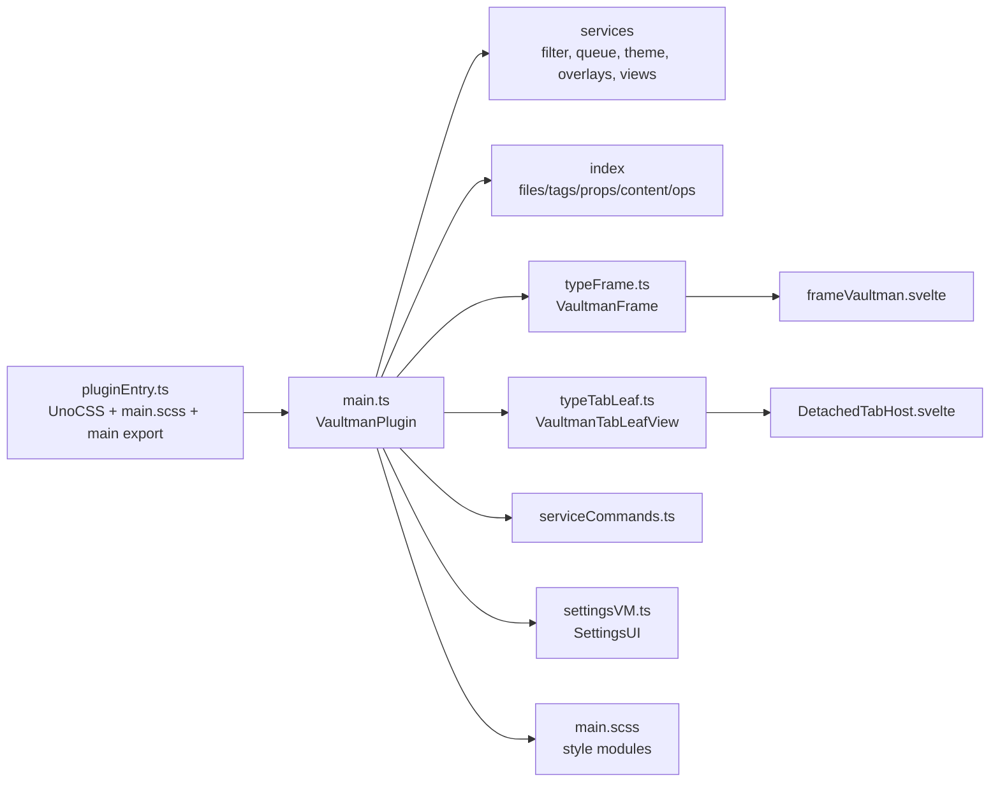

# Source Runtime Spine

## Scope

Phase 2 maps the runtime trunk below the root build layer:

- `src/pluginEntry.ts`
- `src/main.ts`
- `src/main.scss`
- `src/settingsVM.ts`
- `src/svelte.d.ts`
- first-level runtime bridges that `main.ts` uses to reach UI, services,
  commands, settings, views, tab leaves, theme, layout, and perf probes.

It does not yet map every component, service, provider, or test file. Those are
children of this runtime spine and should attach to this phase in later maps.

## Shards

- [[02a-entrypoint-lifecycle|02a-entrypoint-lifecycle]]: build entry,
  `VaultmanPlugin`, onload/onunload/settings/view lifecycle.
- [[02b-runtime-bridges|02b-runtime-bridges]]: frame, detached leaves,
  commands, settings tab, tab registry, contracts, theme/layout/perf bridges.
- [[02c-style-and-directory-surface|02c-style-and-directory-surface]]:
  `main.scss`, first-level `src/` directories, and next mapping targets.

## Runtime Spine Map

## Key Finding

`src/main.ts` is the runtime service container and Obsidian integration point.
It owns plugin lifecycle, service construction, index refresh, event hooks,
view registration, command registration, settings hydration, performance probe
installation, and workspace leaf orchestration. Later component/service maps
should attach to the services, indexes, frame, commands, settings, and styles
branches rather than re-reading the root layer.

## Visual

- [[visuals/phase-02-src-runtime-spine.canvas|Phase 02 source runtime spine canvas]]
