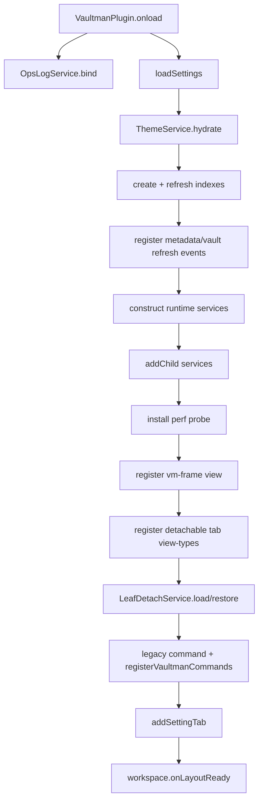
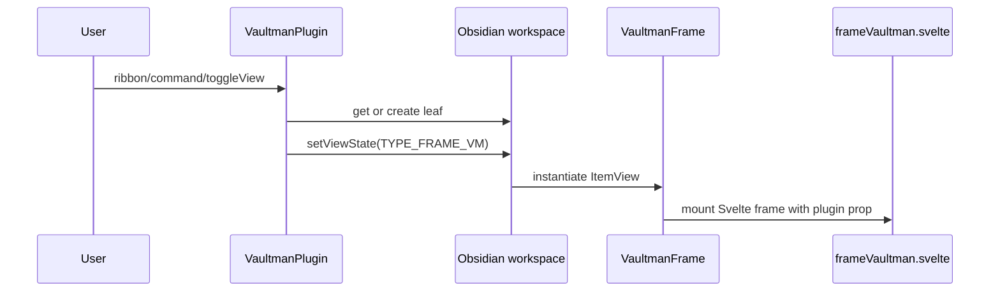

# Source Entrypoint Lifecycle

## `src/pluginEntry.ts`

`pluginEntry.ts` is the Vite library entry from `vite.config.ts`. It has three
jobs:

```ts
import 'virtual:uno.css';
import './main.scss';

export { default } from './main';
```

This means runtime loading starts by including generated UnoCSS, loading the
SCSS tree, then exporting the default plugin class from `src/main.ts`.

## `src/main.ts`

`main.ts` exports `VaultmanPlugin extends Plugin` and then exports it as
default. It is the runtime container for the plugin:

| Runtime area | Evidence in `main.ts` | Connection |
| --- | --- | --- |
| Settings | imports `VaultmanSettings`, `DEFAULT_SETTINGS`, `VaultmanSettingsTab`; defines `loadSettings()` and `saveSettings()` | Bridges persistent plugin data to `typeSettings`, layout normalization, theme settings, and Settings UI. |
| Core services | constructs `FilterService`, `OperationQueueService`, `ThemeService`, `IconicService`, `ContextMenuService`, `ExplorerDataPlaneService`, etc. | Makes service instances available to frame/components through the plugin object. |
| Index services | creates files, tags, props, content, operations, active filters, snippets, plugins, templates indexes. | Builds data providers used by explorers and frame surfaces. |
| Obsidian events | registers metadata/vault `changed`, `create`, `delete`, `rename`, `resolved` callbacks. | Refreshes indexes and search/filter metadata when vault data changes. |
| UI view | registers `TYPE_FRAME_VM` as `VaultmanFrame`. | Opens the main Vaultman frame through Obsidian workspace leaves. |
| Detached tabs | loops `ALL_TAB_IDS`, registers `VaultmanTabLeafView` for each `viewTypeFor(tabId)`. | Allows independent leaf views for detachable tabs. |
| Commands | preserves legacy `apply-queue`; calls `registerVaultmanCommands`. | Connects Obsidian commands to frame hooks, queue, FnR, and active panel APIs. |
| Performance | creates `PerfMeter` marks and installs `createPerfProbe` globally. | Enables live scroll/performance smoke tooling. |
| Lifecycle cleanup | `onunload()` disposes theme, perf probe, ops log, and filter service. | Prevents long-lived runtime state from surviving plugin unload. |

## Onload Flow



## View Open Flow



## Settings Flow

`loadSettings()` deep-copies `DEFAULT_SETTINGS`, overlays saved data, resolves
layout settings through `resolveLayoutSettings()`, normalizes elastic UI
settings, and runs a one-time tab-label migration.

`saveSettings()` writes active theme preset/custom preset state back into
`settings.elasticUi` before `saveData()`. This means `ThemeService` is not only
visual state; it is part of persisted settings.
