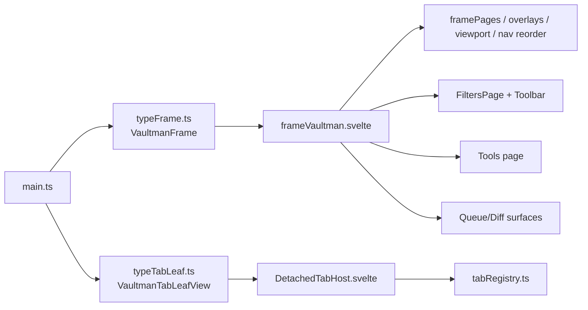
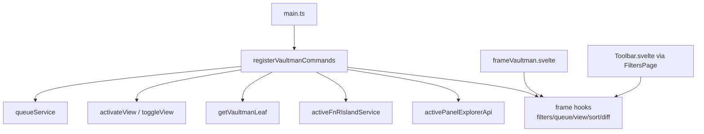
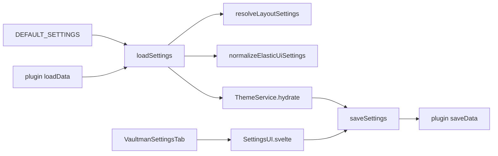

# Runtime Bridges

## Bridge Inventory

| Bridge | Role | Runtime connection |
| --- | --- | --- |
| `src/types/typeFrame.ts` | Obsidian `ItemView` wrapper for the main Vaultman frame. | Registers `TYPE_FRAME_VM = 'vm-frame'`; mounts `frameVaultman.svelte` with `{ plugin }`; unmounts on close. |
| `src/components/frame/frameVaultman.svelte` | Main Svelte frame shell. | Receives the plugin object and coordinates page order, nav, overlays, frame tabs, filters search state, queue/diff hooks, and layout surfaces. |
| `src/types/typeTabLeaf.ts` | Obsidian `ItemView` wrapper for detachable tab leaves. | Uses `viewTypeFor(tabId)`; mounts `DetachedTabHost.svelte` with `{ plugin, tabId }`. |
| `src/components/frame/DetachedTabHost.svelte` | Host for detached tabs. | Maps canonical `TabId` back to tab/page content and reuses Filters search state where needed. |
| `src/registry/tabRegistry.ts` | Canonical tab identity registry. | Defines `TabId`, `ALL_TAB_IDS`, `DETACHABLE`, `viewTypeFor`, `tabIdFromInner`, and `innerFromTabId`. |
| `src/services/serviceCommands.ts` | Command registration bridge. | Exports command ids and `registerVaultmanCommands()`, wiring Obsidian commands to queue, frame hooks, FnR service, panel APIs, and perf marks. |
| `src/settingsVM.ts` | Settings tab wrapper. | Mounts `SettingsUI.svelte` into Obsidian settings using the plugin object. |
| `src/types/typeSettings.ts` | Settings schema and defaults. | Defines `VaultmanSettings`, `iVaultmanPlugin`, and `DEFAULT_SETTINGS`; imports layout defaults, mouse config, operation scope, elastic UI defaults. |
| `src/types/typeContracts.ts` | Cross-layer interfaces. | Defines index node shapes, service contracts, overlay contracts, router contracts, and explorer interface. |
| `src/services/serviceLayout.ts` | Layout model and drop actions. | Defines layout settings, resolves raw settings, and applies detach/attach/reorder drop actions. |
| `src/services/serviceTheme.svelte.ts` | Theme preset runtime state. | Hydrates active preset/custom presets and is persisted by `saveSettings()`. |
| `src/dev/perfProbe.ts` | Runtime performance probe. | Installs global `__vaultmanPerfProbe` used by scroll smoke scripts and live diagnostics. |

## UI Bridge Flow

`main.ts` never mounts `frameVaultman.svelte` directly. It registers an
Obsidian view class. The view class owns Svelte mount/unmount. This keeps
Obsidian workspace lifecycle separate from Svelte component lifecycle.

## Command Bridge Flow

The command bridge is deliberately callback-based. `main.ts` owns command
registration, but frame/toolbar components populate hooks so commands can
operate on the currently mounted UI without hard subscriptions.

## Settings And Theme Bridge

Settings have three bridge points: static defaults, runtime normalization, and
Svelte settings UI. Theme state also participates in persistence, so style
maps should treat theme as runtime state rather than only SCSS.

## Contracts Bridge

`typeContracts.ts` is the cross-layer vocabulary that keeps providers,
services, explorers, overlays, and operations from using component-specific
types directly. It defines:

- node interfaces for files, tags, props, content, queue changes, active
  filters, snippets, plugins, templates, and Bases import targets;
- index interfaces such as `IFilesIndex`, `ITagsIndex`, `IPropsIndex`,
  `IContentIndex`, `IOperationsIndex`, and `IActiveFiltersIndex`;
- service interfaces for filters, queue, decorations, routing, overlays, and
  explorers.

Later maps for providers/services should attach to these interfaces first,
then to concrete implementations.
