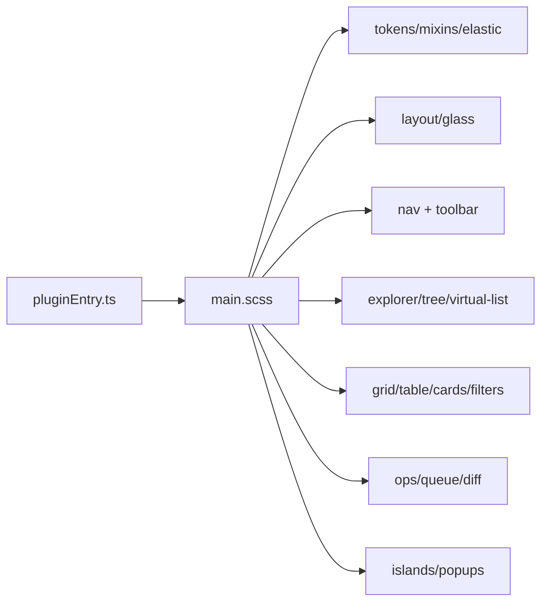
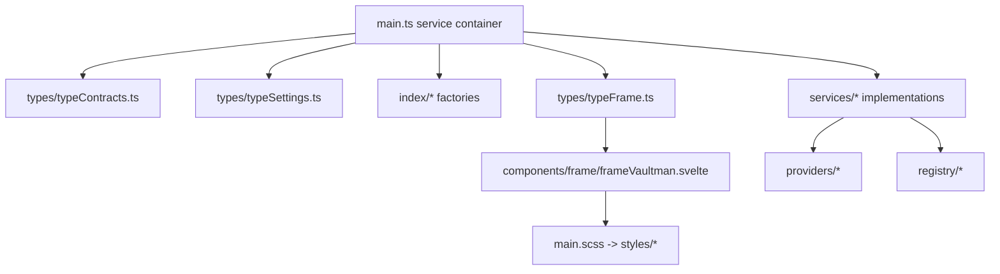

# Style And Directory Surface

## `src/main.scss`

`main.scss` is the style entry imported by `pluginEntry.ts`. It uses an ITCSS-
like order:

| Layer | Imports |
| --- | --- |
| Settings/tools | `styles/tokens`, `styles/mixins`, `styles/elastic` |
| Generic | `styles/global`, `styles/animations` |
| Layout | `styles/layout/layout`, `v3-layout`, `glass` |
| Components | badges, primitives, modals, sidebar, curator, statistics, settings |
| Navigation | `styles/nav/v3-nav`, `tab-bar`, `toolbar`, navbar, tabs |
| Explorer | explorer, tree, virtual-list, tags, cards, explorer-ui |
| Data | grid, table, cards, filters, filters-page, file-list |
| Panels | ops, queue, content-ops, diff-view |
| Popups | islands, v3-popups, sort-popup, viewmode-popup |

The style spine is broad. Later UI maps should attach component style concerns
back to `main.scss` imports rather than treating SCSS files as unrelated.

## First-Level Directory Surface

| `src/` directory | Files | Runtime role | Next-phase status |
| --- | ---: | --- | --- |
| `api/` | 1 | Public/provider API surface, currently `explorerProvider.ts`. | Map with providers. |
| `badges/` | 1 | Badge service surface. | Map with services/UI badges. |
| `components/` | 75 | Svelte UI, frame, pages, layout, containers, views, primitives. | Phase 03 candidate. |
| `config/` | 1 | Built-in theme presets. | Map with theme/settings. |
| `dev/` | 1 | Perf probe live diagnostics. | Map with scripts/smoke. |
| `index/` | 14 | Data index factories and utilities for files/tags/props/content/ops. | Phase 04 with providers/services. |
| `logic/` | 6 | Pure explorer/keyboard/props/files/tags logic. | Phase 04. |
| `modals/` | 5 | Obsidian modal surfaces for file/property/queue/template flows. | Map after components/services. |
| `providers/` | 7 | Explorer data providers for content, files, outline, plugins, props, snippets, tags. | Phase 04. |
| `registry/` | 2 | Runtime registries for add operations and tab identity. | Phase 04. |
| `services/` | 67 | Runtime domain services and stateful Svelte services. | Phase 04. |
| `styles/` | 40 | SCSS modules imported by `main.scss`. | Cross-cutting; map with UI layers. |
| `types/` | 22 | Contracts, settings, frame, ops, explorer, theme, tab, Obsidian extension types. | Phase 04 contract surface. |
| `utils/` | 9 | Autocomplete, filter evaluator, debounce, explorer expansion, layer helpers. | Phase 04. |

## Runtime Ownership Pattern

The dominant pattern is a central plugin object that constructs services and
indexes, then passes itself into Svelte frame/settings surfaces. Components can
reach services through the plugin object or through props/hooks registered by
the frame.

## Next Mapping Recommendation

Continue with `src/components/` as Phase 3 only after pinning the frame trunk:

1. Map `components/frame/` first: `frameVaultman.svelte`, frame controllers,
   overlays, pages, search state, active filters, moves.
2. Then map `components/pages/` and `components/layout/`.
3. Then map `components/containers/` and `components/views/`.

This order matches runtime flow: plugin view -> frame shell -> pages/layout ->
containers/views.
