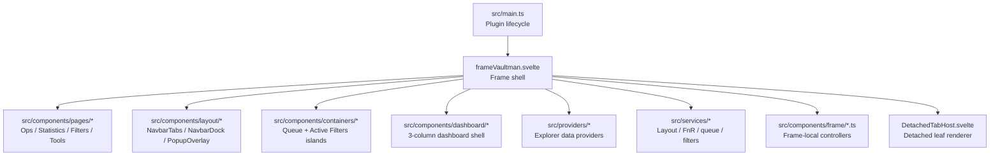

# Phase 03 - `src/components/frame/`

This phase maps the frame shell layer: the Svelte root frame, detached tab host, local frame controllers, overlay routing, page FAB definitions, filter search state, viewport sliding, nav reorder, and move queue helpers.

## Files In This Phase

| File | Role | Downstream Surface |
|---|---|---|
| `src/components/frame/frameVaultman.svelte` | Primary frame shell and orchestration component. | Pages, navbar/dock, dashboard, popup islands, overlays, explorer providers. |
| `src/components/frame/DetachedTabHost.svelte` | Standalone renderer for detached tabs/leaves. | Detached tools, detached filters, detached queue. |
| `src/components/frame/framePages.ts` | Canonical frame page IDs, labels, icons, default order, page FABs. | Navbar/dock page model and left/right FAB behavior. |
| `src/components/frame/frameOverlays.svelte.ts` | Overlay and popup controller. | Queue island, filter island, search overlay, command hooks. |
| `src/components/frame/frameNavReorder.svelte.ts` | Pointer-driven page order controller. | Reorder mode, nav pill binding, saved page order. |
| `src/components/frame/frameViewport.ts` | Sliding viewport controller. | Page index translateX and resize reapplication. |
| `src/components/frame/frameFiltersSearch.ts` | Per-tab search state and history. | Props/files/tags/content/outline search routing. |
| `src/components/frame/frameActiveFilters.ts` | Filter tree counters and human-readable rule collection. | Active filters popup, filter badge counts, rule deletion UI. |
| `src/components/frame/frameMoves.ts` | Move preview and queued move change factory. | Move popup and queue service transactions. |
| `src/components/frame/frameSearchSources.ts` | Search semantics reference links. | Documentation bridge for search behavior. |

## Layer Position

## Key Conclusion

`frameVaultman.svelte` is the current user-facing shell. It does not merely render pages; it coordinates page identity, detached tab state, overlay lifetime, dashboard mode, filter search routing, active filter summaries, move transactions, and command hook integration.

The frame helper files keep the shell from absorbing every primitive directly, but this layer remains the densest coordination point discovered so far. The next layer should follow the frame's outgoing edges into `src/components/pages/`, `src/components/layout/`, `src/components/containers/`, and `src/components/dashboard/` before moving deeper into services.

## Shards

- `03a-frame-shell.md` - detailed map of `frameVaultman.svelte`.
- `03b-frame-controllers.md` - controller/helper files under `src/components/frame/`.
- `03c-detached-and-surfaces.md` - detached tabs and external surfaces touched by the frame.

## Canvas

- `visuals/phase-03-components-frame.canvas`
