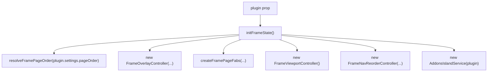
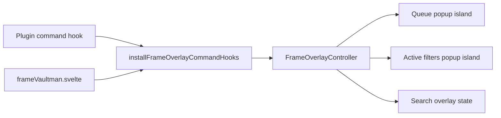

# Phase 03a - `frameVaultman.svelte`

`src/components/frame/frameVaultman.svelte` is the application shell below the plugin lifecycle. It receives the plugin instance, binds settings/services into Svelte state, renders the active page surfaces, and owns the frame-level interaction model.

## Source Imports

The shell imports from these major groups:

| Group | Imports |
|---|---|
| Obsidian and Svelte runtime | `onMount`, `untrack`, `setIcon`, `TFile`, `VaultmanPlugin`. |
| Explorer providers | `explorerFiles`, `explorerProps`, `explorerTags`. |
| Pages | `pageStats.svelte`, `pageFilters.svelte`, `pageTools.svelte`. |
| Layout | `navbarDock.svelte`, `navbarTabs.svelte`, `layoutOverlay.svelte`, `overlayIsland.svelte`. |
| Containers | `explorerQueue.svelte`, `explorerActiveFilters.svelte`. |
| Dashboard | `Dashboard3Column.svelte`, `AddonsMarkdownPane.svelte`. |
| Frame helpers | `frameActiveFilters`, `framePages`, `frameViewport`, `frameNavReorder`, `frameOverlays`, `frameMoves`, `frameFiltersSearch`, `frameSearchSources`. |
| Services/types | `serviceFnR`, `fileSuggestModal`, `serviceOperationScope`, `serviceLayout`, `FTabs`, `ExplorerSortTarget`, `tabRegistry`, `LeafDetachState`, `AddonsIslandService`. |

## Initialization

The shell derives page state from settings, instantiates overlay and navigation controllers, and keeps local state for dashboard mode, viewport kind, filter tabs, detached tabs, move previews, stats preview, and search state.

## Navigation Responsibilities

| Responsibility | Behavior |
|---|---|
| `navigateTo(page)` | Switches active frame page, closes queue/filter islands and active-filter popup, and exits base choose mode when leaving filters. |
| Base import mode | Forces the filters page and files tab so the import flow keeps its required context. |
| Statistics note open | Uses file suggest modal, then switches the statistics page into preview mode. |
| Diff view open | Closes islands/popups, switches to ops, activates tools tab `file_diff`, and exposes this path through `plugin.openDiffViewHook`. |
| Page surfaces | Converts either frame pages or filter tabs into the same navbar/dock item contract. |

## Overlay And Island Ownership

The frame installs overlay command hooks with `installFrameOverlayCommandHooks(plugin, overlays)`. That makes queue/filter popup behavior callable from outside the component while keeping actual popup state local to the frame controller.

## Filter Search Routing

The frame owns a per-tab search state and routes the active term into the active explorer or index:

| Active Tab | Destination |
|---|---|
| Props | `propExplorer?.setSearchTerm(term)`. |
| Tags | `tagsExplorer?.setSearchTerm(term, mode)`. |
| Files | `fileList?.setSearchFilter(...)` and `plugin.filterService.setSearchFilter(...)`. |
| Content | `plugin.contentIndex.setQuery(term)`. |
| Outline | No direct route in this layer. |

## Runtime Subscriptions

`onMount` wires the frame to filter service changes, detached leaf state, queue changes, and metadata cache resolution events. Cleanup unregisters listeners and clears frame-owned hooks.

## Render Contract

The template has four major render paths:

| Render Path | Purpose |
|---|---|
| Top navbar tabs | Optional top surface for frame pages or filter tabs. |
| Dashboard mode | Renders `Dashboard3Column` with filters, explorer, and addons panes. |
| Standard page viewport | Renders ops, statistics, and filters pages inside the sliding viewport. |
| Island and dock layer | Renders backdrop, popup island, `NavbarDock`, drawer state, nav reorder affordances, and FABs. |

## Risk Notes

- This file is a high-blast-radius coordination shell. Styling or toolbar work that touches it should preserve page routing, detached tab IDs, and overlay hook behavior.
- The shell already has local helper modules; future cleanup should move cohesive behavior out only when a helper can own a stable contract.
- Toolbar/navbar restoration work should treat `NavbarDock` and `NavbarTabs` as presentation surfaces, while leaving page/filter/search/FAB state ownership in this frame unless a broader refactor is planned.
