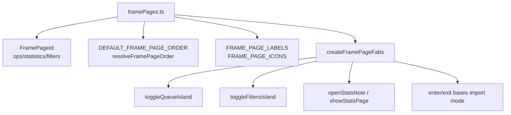
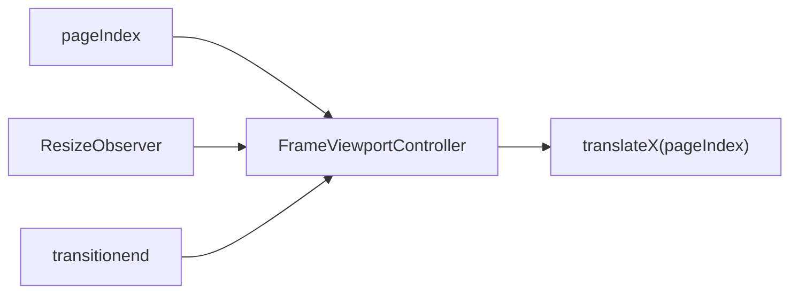

# Phase 03b - Frame Controllers

The non-Svelte and `.svelte.ts` files in `src/components/frame/` isolate repeated frame behavior from `frameVaultman.svelte`.

## Controller Map

| File | Main API | Role |
|---|---|---|
| `framePages.ts` | `FramePageId`, `DEFAULT_FRAME_PAGE_ORDER`, `resolveFramePageOrder`, `createFramePageFabs` | Defines canonical pages and page-specific left/right FABs. |
| `frameOverlays.svelte.ts` | `FrameOverlayController`, `installFrameOverlayCommandHooks` | Owns popup/island state and plugin hook installation. |
| `frameNavReorder.svelte.ts` | `FrameNavReorderController` | Handles pointer-driven page reorder and saves page order. |
| `frameViewport.ts` | `FrameViewportController` | Applies sliding page viewport transforms and resize corrections. |
| `frameFiltersSearch.ts` | `createFiltersSearchState`, `setFiltersSearchTerm`, `addFiltersSearchHistory` | Stores per-tab search terms and history. |
| `frameActiveFilters.ts` | `collectActiveFilterRules`, `countActiveFilterEntries`, `describeFilterNode` | Converts filter service trees into UI rule summaries. |
| `frameMoves.ts` | `createMovePreviews`, `createMoveChanges` | Converts selected files and target folder into move previews and pending queue changes. |
| `frameSearchSources.ts` | Search source metadata | Captures docs links/semantics for search behavior. |

## Page Model

`framePages.ts` is the source of truth for the frame page set. It should be checked before adding, renaming, reordering, or restyling page-level navigation primitives.

## Overlay Controller

`FrameOverlayController` keeps `activePopup`, `popupOpen`, queue/filter popup state, and search overlay state together. Queue and filter islands are mutually closed, so callers can request one without manually closing the other.

`installFrameOverlayCommandHooks(plugin, overlays)` connects plugin-level hooks to this local controller. That bridge is important because commands/services can open UI islands without owning their state.

## Nav Reorder Controller

`FrameNavReorderController` owns:

- Reorder mode.
- Active drag indices.
- Bound nav pill/root elements.
- Collapsed nav state.
- Pointer tracking.
- Saved page order through the plugin/settings path.

This controller is the frame's bridge between visual nav pills and durable page ordering.

## Viewport Controller

`FrameViewportController` applies page index movement with `translateX`, binds viewport/container elements, listens for resize, reapplies transform after measurement changes, and clears transition state after transitions complete.

## Search State

`frameFiltersSearch.ts` keeps search independent per filter tab. The frame shell then decides which runtime target receives the active term.

| Search Tab | State Source | Runtime Target |
|---|---|---|
| `props` | `filtersSearchByTab.props` | Props explorer. |
| `files` | `filtersSearchByTab.files` | File explorer and filter service. |
| `tags` | `filtersSearchByTab.tags` | Tags explorer. |
| `content` | `filtersSearchByTab.content` | Content index. |
| `outline` | `filtersSearchByTab.outline` | Reserved/no-op in this layer. |

## Active Filters And Moves

`frameActiveFilters.ts` traverses filter trees to count and describe active leaves. This backs popup content and badge counts.

`frameMoves.ts` translates user-selected files plus a target folder into both preview entries and `PendingChange` move operations for the queue service.

## Risk Notes

- Page and FAB styling must use `framePages.ts` as the primitive source, not duplicate page IDs in a visual component.
- Overlay fixes should preserve the hook boundary in `frameOverlays.svelte.ts`.
- Search UI work should preserve per-tab state from `frameFiltersSearch.ts`; a single global search string would regress current behavior.
