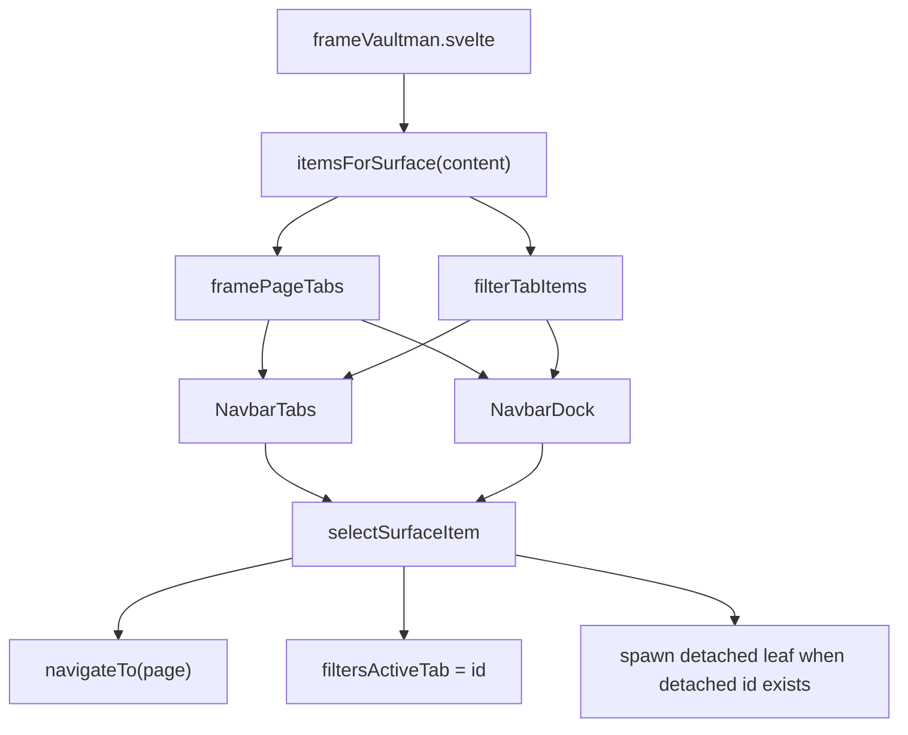

# Phase 03c - Detached Tabs And Surface Edges

The frame layer connects to multiple component families without fully owning their internals. This shard records those first-degree edges so later phases can descend into them deliberately.

## Detached Tab Host

`src/components/frame/DetachedTabHost.svelte` renders tabs that have been detached from the main frame into separate leaves. It imports:

| Import | Purpose |
|---|---|
| `createFnRState` | Local find/replace state for detached contexts. |
| `createFiltersSearchState` | Local search state mirror for detached filters. |
| `PageFilters` | Detached filters tab renderer. |
| `PageTools` | Detached tools tab renderer. |
| `ExplorerQueueComp` | Detached queue renderer. |

The host maps a `TabId` into the corresponding detached content path. This keeps detached leaves usable without requiring the whole `frameVaultman.svelte` shell.

## Surface Selection

`frameVaultman.svelte` normalizes frame pages and filter tabs into a shared surface item contract. That contract is consumed by top tabs and the dock.

## External Component Families

| Family | Files Seen From Frame | Why It Matters |
|---|---|---|
| Layout | `navbarDock.svelte`, `navbarTabs.svelte`, `layoutOverlay.svelte`, `overlayIsland.svelte` | Own visible navigation, toolbar/dock presentation, popup shell, and overlay placement. |
| Pages | `pageTools.svelte`, `pageStats.svelte`, `pageFilters.svelte` | Own the page-level content shown inside the frame viewport or detached host. |
| Containers | `explorerQueue.svelte`, `explorerActiveFilters.svelte` | Own popup island content for queue and active filters. |
| Dashboard | `Dashboard3Column.svelte`, `AddonsMarkdownPane.svelte` | Own dashboard mode layout and addon pane rendering. |
| Providers | `explorerFiles`, `explorerProps`, `explorerTags` | Supply explorer data/components consumed by the filters page path. |

## Toolbar/Navbar Implication

The toolbar regression research belongs directly on the edge between `frameVaultman.svelte` and layout components. The frame owns which primitives exist and when they are active; `navbarDock.svelte` and `navbarTabs.svelte` should own how those primitives are arranged and styled.

For restoring the old navbar feel without losing new capabilities:

- Keep the current primitive inventory from the frame.
- Rework the layout presentation so search returns to the same visual rail/strip as the dock controls.
- Preserve extra current buttons as grouped primitives instead of side-stacking them outside the navbar rhythm.
- Preserve detached tab routing, external tab IDs, and page/filter item selection semantics.

## Recommended Next Layer

Phase 04 should inspect layout and pages together:

1. `src/components/layout/` to map `NavbarDock`, `NavbarTabs`, overlay island placement, drawer behavior, and toolbar styling.
2. `src/components/pages/` to map what each frame page expects from the shell.
3. `src/components/containers/` only where layout/page surfaces embed queue or active-filter islands.

That route keeps the investigation aligned with the current toolbar/navbar concern while continuing the full codebase cluster in layers.
