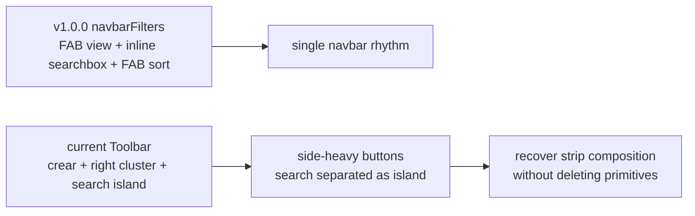
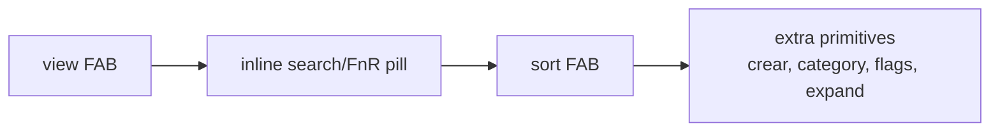

# Phase 04c - Toolbar Navbar Recovery Path

This shard connects the phase 04 architecture map with the earlier
toolbar/navbarfilters regression research.

## Current Primitive Inventory

The current toolbar has more behavior than the v1.0.0 `navbarFilters` surface:

| Primitive | Current Owner | Preserve? |
|---|---|---|
| View menu | `Toolbar.svelte` -> `overlayViewMenu.svelte` | Yes |
| Sort menu | `Toolbar.svelte` -> `overlaySortMenu.svelte` | Yes |
| Search/FnR trigger | `Toolbar.svelte` + `VmPopover` + `FnRIslandService` | Yes |
| Search input body | `Toolbar.svelte` snippet `fnrSearchIslandBody()` | Yes, but restyle/reseat. |
| Search category pill | `Toolbar.svelte` | Yes |
| FnR flags | `Toolbar.svelte` | Yes |
| Help links | `Toolbar.svelte` + `SEARCH_SEMANTICS_SOURCES` | Yes |
| Crear | `Toolbar.svelte` + `getAddOpBuilder` + `onCrear` | Yes |
| Node expansion | `Toolbar.svelte` + `pageFilters.svelte` expansion commands | Yes |
| Hidden/selected/manual DnD/scope | `overlaySortMenu.svelte` | Yes |
| Visible fields/add mode | `overlayViewMenu.svelte` | Yes |

## Why It Looks Wrong Now

Current evidence:

- `Toolbar.svelte` renders `crear`, then a `.vm-toolbar-menu-min` group.
- `.vm-toolbar-menu-min` uses `margin-left: auto`, so controls collect on the
  right edge.
- The search/FnR body is rendered through `VmPopover` or as
  `.vm-toolbar-search-island`, absolutely positioned below the toolbar.
- `.vm-navbar-filters` and `.vm-filters-header` still have the old navbar shell
  shape: sticky, centered, max width `520px`, flex row, small gaps.
- `.vm-filters-crear` lacks an inspected base style, so it does not clearly
  match the nav/icon/pill family.

## Safe Restoration Plan

1. Keep `pageFilters.svelte` bindings unchanged.
2. Keep `Toolbar.svelte` exports `openViewMenu()` and `openSortMenu()`.
3. Keep current primitive behavior: view, sort, search/FnR, crear, category,
   flags, help, node expansion, field pills, scope, DnD, hidden/selected files.
4. Change only presentation first:
   - make the collapsed search pill part of the toolbar strip again;
   - style `crear` as a compact navbar primitive;
   - split buttons into left/right groups only if the center search keeps the
     old inline navbar rhythm;
   - keep expanded rename/replace/FnR as a takeover or popover.
5. Move or consolidate toolbar styling near `src/styles/nav/_toolbar.scss` or
   `src/styles/data/_filters.scss`; avoid leaving core toolbar layout in
   `src/styles/explorer/_explorer.scss`.
6. Preserve opacity/pointer-events takeover behavior instead of `display: none`
   so virtualizer measurements are not invalidated.

## Suggested Visual Order

The important part is not literally returning to only two FABs. It is restoring
the old visual grammar: a compact navbar strip with search as the central
primitive and command buttons attached to the same rail.

## What Not To Do

- Do not remove current buttons to mimic v1.0.0.
- Do not move filter toolbar state into `frameVaultman.svelte` as a styling fix.
- Do not break `plugin.openViewMenuHook`, `plugin.openSortMenuHook`, or
  `plugin.openContentSearchHook` from `pageFilters.svelte`.
- Do not collapse all search/FnR state into one global string; phase 03 showed
  the app intentionally keeps per-tab search state.

## Implementation Entry Points

| Change | First File |
|---|---|
| DOM grouping/order | `src/components/layout/Toolbar.svelte` |
| Toolbar/nav strip style | `src/styles/data/_filters.scss` and `src/styles/nav/_toolbar.scss` |
| Right-cluster removal | `src/styles/explorer/_explorer.scss` |
| Crear visual parity | `src/styles/data/_filters.scss` or `src/styles/nav/_toolbar.scss` |
| Expanded FnR takeover | `src/styles/data/_filters-page.scss` and `Toolbar.svelte` |
| Regression tests | Existing toolbar/view/sort component tests, plus a targeted DOM-order test if available. |
