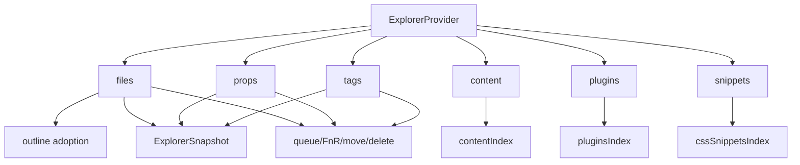

# Phase 05b - Explorer Providers

## Contract

`src/types/typeExplorer.ts` defines `ExplorerProvider<TMeta>`. Required provider
members are `id`, `getTree()`, `handleNodeClick`, and `handleContextMenu`.
Optional members cover files, structural trees and revisions, snapshots, empty
states, selection, secondary and tertiary actions, node type, subscription,
badges, hover badges, rename hooks, destroy hooks, and toolbar setter hooks.

`src/types/typeExplorerDataPlane.ts` defines snapshots, projection metadata, and
reveal targets. Providers can publish snapshot rows and stable IDs while views
consume projections and scroll targets without knowing provider internals.

## Provider Matrix

| Provider | File | Source Index/Logic | Main Actions |
|---|---|---|---|
| files | `explorerFiles.ts` | Vault files, active filters, hidden filters, `FilesLogic`, outline adoption | open, filter folder, rename, delete, move, set prop/tag, add links, property manager. |
| props | `explorerProps.ts` | `propsIndex`, `PropsLogic`, view layers | filter values, add/set prop, rename/delete prop or value, type changes, content search. |
| tags | `explorerTags.ts` | `tagsIndex`, `TagsLogic`, view layers | filter tags, set/add tag, rename/delete tag, binding note, content search. |
| content | `explorerContent.ts` | `contentIndex.nodes` grouped by file | search content, open files, delete file through queue. |
| plugins | `explorerPlugins.ts` | `pluginsIndex` | search/sort plugins, toggle community plugin, binding note. |
| snippets | `explorerSnippets.ts` | `cssSnippetsIndex` | search/sort snippets, toggle CSS snippet, binding note. |
| outline | `explorerOutline.ts` | Markdown headers, tasks, block IDs | Builds adopted children for file nodes. |

## Provider Edges

## Provider Patterns

- Files, props, and tags are the most action-heavy providers. They bind context
  menu actions, hover badges, filter toggles, rename/delete flows, operation
  scopes, and FnR handoffs.
- Content, plugins, and snippets are lighter index readers. They still expose
  provider search/sort hooks and node actions so `PanelExplorer` can treat them
  uniformly.
- Decoration is provider-owned but service-backed. Providers use view/model
  services to attach layers, icons, badges, deleted/conflict classes, and quick
  action badges before the view layer renders rows.
- Structural cache keys include source revisions, search/sort state, visibility
  toggles, and source statistics. This keeps provider reads stable enough for
  projected views and reveal targets.
- `explorerOutline.ts` is not a standalone tab provider in this layer. It is an
  adapter used by the files provider to attach adopted markdown child nodes.

## Compatibility Note

The similarly named files in `src/components/containers/` are compatibility
re-exports. New provider analysis should treat `src/providers/` as the source of
truth and use the container shims only when auditing import compatibility.
