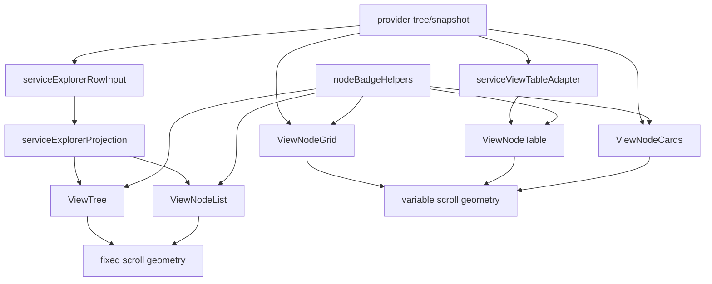

# Phase 05c - View Adapters And Contracts

## Rendered Views

| View | File | Input Shape | Important Contract |
|---|---|---|---|
| Tree | `viewTree.svelte` | Row inputs/projection and tree nodes | TanStack virtualizer, fixed scroll geometry, sticky rows, badges, keyboard, box select, tree roles. |
| List | `ViewNodeList.svelte` | Row inputs/projection | TanStack virtualizer, fixed scroll geometry, list/listbox roles, optional reorder/action/select/context. |
| Grid | `ViewNodeGrid.svelte` | Grid nodes plus hierarchy state | Variable geometry, row measurement, manual DnD, box selection, grid roles. |
| Table | `ViewNodeTable.svelte` | Table rows and columns | TanStack table plus variable geometry, selectable rows, column visibility, grid roles. |
| Cards | `ViewNodeCards.svelte` | Card nodes | Variable geometry, measured rows, selected/focused/active state, grid roles. |
| Markmap | `ViewMarkmap.svelte` | Recursive node tree | Non-virtual recursive tree with select/focus/context/secondary/tertiary key handling. |
| Empty | `viewEmptyLanding.svelte` | Empty/loading state | Shared empty or loading presentation for explorer bodies. |

## Supporting Views

| File | Role |
|---|---|
| `viewDiff.svelte` | Builds file, operation, or snapshot diffs and switches between only-changes and full-document bodies. |
| `viewDiffNavbar.svelte` | Diff navigation bar with file pills and previous/next file/change controls. |
| `viewOutlineExplorer.svelte` | Compact outline explorer surface used by outline/adoption flows. |
| `nodeBadgeHelpers.ts` | Normalizes own/inherited badges, titles, aria labels, actions, and badge press handling. |

## Contract And Service Edges

## Service Roles

- `serviceExplorerProjection.ts` converts row inputs into stable rows,
  `visibleIds`, ID/index maps, media descriptors, and projection metadata.
- `serviceExplorerRowInput.ts` converts snapshot rows, tree nodes, and view rows
  into a shared `ExplorerRowInput` shape and resolves reveal indexes.
- `serviceViewTableAdapter.ts` chooses table columns by provider ID and visible
  field overrides, then adapts trees into table rows.
- `serviceExplorerScrollGeometry.ts` provides fixed and variable geometry
  coordinators. Variable geometry uses measured row sizes and prefix indexing
  so Grid/Table/Cards can reveal rows without all-row fallback scans.

## View Risk Notes

- `ViewNodeList` is shared by main List mode and popup containers. List changes
  can affect queue and active-filter popups.
- Grid/Table/Cards depend on variable measurement and scroll-idle guardrails.
  Refactors should keep zero-blank live smoke coverage in those modes.
- Markmap is still a view component, but phase 04 evidence showed it is not a
  selectable mode in the current view menu.
- Badge helper changes affect every rendered explorer view because badges are
  normalized before row-level interactions fire.
