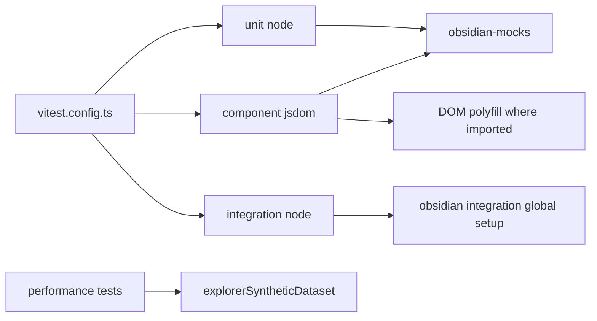

# Phase 07a - Test Harness And Config

## Vitest Projects

`vitest.config.ts` defines three projects:

| Project | Environment | Svelte plugin | Obsidian handling |
|---|---|---|---|
| integration | node | no | Uses `obsidian-integration-testing/vitest-global-setup`; setup file only logs that global setup owns temp vault registration. |
| component | jsdom | yes | Aliases `obsidian` to `test/helpers/obsidian-mocks.ts`; resolves browser conditions. |
| unit | node | yes | Aliases `obsidian` to `test/helpers/obsidian-mocks.ts`. |

Coverage is scoped to `src/utils/**`, `src/logic/**`, and `src/services/**`.
Svelte files and WIP service files are excluded from coverage.

## Package Scripts

| Script | Meaning |
|---|---|
| `test:unit` | Runs Vitest unit project. |
| `test:component` | Runs Vitest component project with `--fileParallelism=false`. |
| `test:integrity` | Runs Vitest integration project. |
| `test:cover` | Runs unit project with coverage. |
| `test:e2e` | Runs WebdriverIO. |
| `test:all` | Runs integration and e2e. |
| `verify` | Runs lint, check, build, unit, and component. Integration/e2e are not part of `verify`. |
| `smoke:scroll` / `smoke:scroll:stress` | Runs the Explorer scroll smoke script. |

## Harness Files

| File | Role |
|---|---|
| `test/helpers/obsidian-mocks.ts` | Main Obsidian unit/component mock: `TFile`, `TFolder`, `Component`, `Plugin`, `ItemView`, `Menu`, `Modal`, `MarkdownRenderer`, app/vault/metadata/file manager mocks, YAML helpers. |
| `test/helpers/dom-obsidian-polyfill.ts` | Adds Obsidian DOM helpers missing from jsdom: `addClass`, `removeClass`, `toggleClass`, `empty`, `createEl`, `createDiv`, `createSpan`, `setText`. |
| `test/support/explorerSyntheticDataset.ts` | Builds synthetic explorer nodes, row inputs, ID maps, selected/filter sets, and media descriptors for performance/view tests. |
| `test/helpers/gen-large-vault.ts` | Large vault fixture generator. |
| `test/helpers/bench-props.ts` | Property benchmark helper. |
| `test/obsidian-stub.ts` | Lightweight fallback stub. |
| `test/fixtures/snippets/vm-snippet-smoke.css` | CSS snippet fixture for snippets/plugin surfaces. |

## Harness Flow

## Risk Notes

- Component tests do not have a global component setup file in `vitest.config.ts`;
  individual tests must install globals or DOM polyfills they need.
- `verify` deliberately excludes integration and e2e. A branch can pass `verify`
  while still needing live Obsidian validation for plugin lifecycle or vault IO.
- The Obsidian mock is broad and useful, but it is still a mock. Behavior using
  undocumented Obsidian internals must be confirmed by integration or live smoke.
