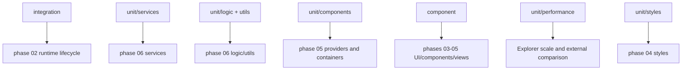

# Phase 07b - Test Suites By Contract

## Contract Map

## Runtime And Integration

`test/integration/plugin.test.ts` verifies plugin loading, vault file creation,
core service initialization, and context menu registration through
`evalInObsidian`. `fileCentricQueue.test.ts` verifies real queue behavior in an
Obsidian-backed vault. `explicit-vault.test.ts`, `manual-register.test.ts`,
`performance.test.ts`, `settingsMigration.test.ts`, and debug path tests cover
integration setup, vault targeting, performance, and settings migration.

## Services And Contracts

`test/unit/services/` is the largest suite. It covers queue, filters, commands,
selection, views, overlay projection, explorer data plane, projection, row
input, scroll geometry, table adapter, DnD, FnR, diff, layout, detach, theme,
node binding, field visibility, media cache, indexes, API facade, and utilities.

Examples:

- `serviceQueue.test.ts` validates YAML serialization, property ops, file ops,
  content/template/tag changes, native rename expansion, execution, and VFS
  materialization.
- `serviceViews.test.ts` validates view modes, render-model shape, selection
  authority, overlays, semantic layers, and performance probe integration.
- `serviceCommandsRegistration.test.ts` validates command IDs, enablement gates,
  queue command behavior, FnR commands, open/toggle behavior, and perf wrapping.
- `serviceExplorerScrollGeometry.test.ts` validates ID/index reveal, stale
  revision rejection, pending-intent priority, and variable-height geometry.

## Components And Views

`test/component/` mounts Svelte components in jsdom. It covers frame roots,
dashboard, detached host, nav dock/tabs, toolbar, popups, settings UI, page
tabs, queue/filter popups, `PanelExplorer`, and all major explorer views.

High-risk view coverage includes:

- `viewTreeSelection`, `viewTreeScrollFallback`, `viewTreeVisualContract`,
  `viewTreeDecorations`, `viewTreeGridRowInputContract`.
- `ViewNodeList`, `viewGridSelection`, `viewTableSelection`,
  `viewNodeVariableScrollFallback`, `viewNodeDynamicGeometry`,
  `viewNodeTableHeightmap`, `viewNodeScrollJank`, `viewNodeCards`.
- `toolbarMenuPlacement`, `toolbarClickWeights`, `overlayViewMenu`,
  `overlaySortMenu`, `searchboxIsland`, `searchboxIslandFlags`.

## Providers, Logic, Utils, Types

`test/unit/components/` covers provider-like modules and frame hooks:
explorer files, props, tags, content, plugins, snippets, tag snapshots, frame
pages, and frame overlay command hooks.

`test/unit/logic/` covers pure explorer, snapshot, keyboard, files, props, and
tags logic. `test/unit/utils/` covers filter evaluation, expansion, badge
bubbling, debounce, modals, and Obsidian autocomplete helpers. `test/unit/types`
pins theme, elastic UI, Obsidian wrapper, and immutable VFS contracts.

## Performance And External Comparison

`test/unit/performance/explorerNotebookNavigatorComparison.test.ts` compares
Vaultman projection/lookup behavior to Notebook Navigator list/folder helpers
at 50k rows. `explorerPlatformSynthetic.test.ts` and `stress.test.ts` exercise
synthetic Explorer scale behavior using `test/support/explorerSyntheticDataset`.

## Test Gaps

- Integration and e2e are separated from `verify`, so release confidence needs
  explicit integration/live smoke selection.
- Component tests mount many surfaces, but actual Obsidian workspace focus,
  multi-window behavior, and native plugin internals still need live checks.
- Style tests catch source/CSS string contracts but do not replace visual
  screenshot validation for polished toolbar/nav work.
