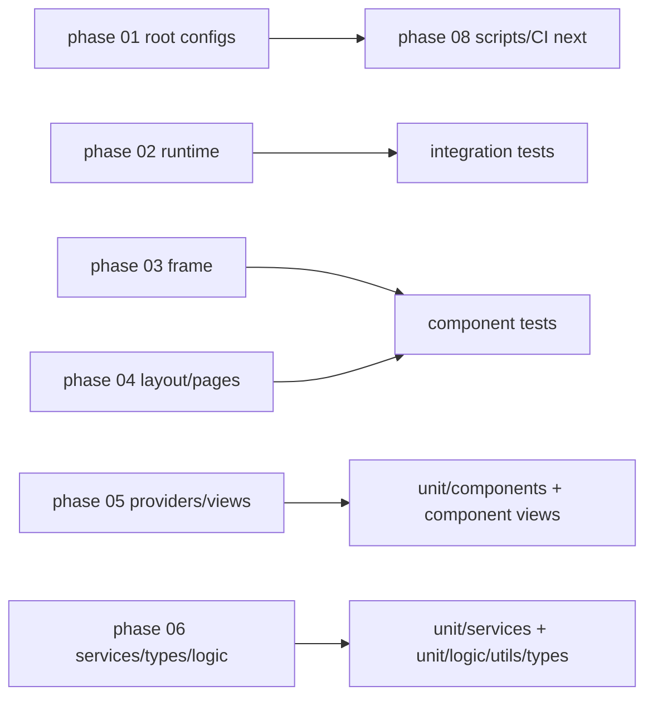

# Phase 07c - Test Risk And Coverage Map

## Strong Coverage Zones

| Zone | Evidence | Why it matters |
|---|---|---|
| Queue/VFS | `serviceQueue*`, `serviceVfsChain`, integration file-centric queue | Protects destructive operation staging and file writes. |
| View projection/geometry | `serviceExplorerProjection`, `serviceExplorerRowInput`, `serviceExplorerScrollGeometry`, view fallback tests | Protects Tree/List/Grid/Table/Cards from blanking and reveal regressions. |
| Toolbar/nav/popups | toolbar, navbar, overlay, searchbox, popover/dialog component tests | Protects phase 04 toolbar/navbar recovery work. |
| Commands/detach/layout | `serviceCommandsRegistration`, `serviceLeafDetach`, `serviceLayout*`, detached host tests | Protects command palette and independent leaf contracts. |
| FnR/diff/templates | `serviceFnR*`, `serviceDiff*`, page tools diff, view diff navbar | Protects search/replace, rename handoff, diff review, and template token paths. |
| Pure logic/utils | logic, utils, types suites | Good regression targets because they run fast and require little mocking. |

## Residual Risk Zones

| Zone | Risk | Recommended validation |
|---|---|---|
| Live Obsidian lifecycle | `verify` does not run integration/e2e. | Run `test:integrity` or targeted live Obsidian smoke when lifecycle/vault IO changes. |
| Toolbar visual polish | Existing tests pin DOM order and classes, not final visual rhythm. | Add screenshot or DOM geometry checks when restoring navbar style. |
| Multi-window focus/native surfaces | Mocks approximate Obsidian APIs. | Use live smoke for native workspace, focus, and plugin-internal behavior. |
| Large virtualized views | Unit/component tests cover bounded fallback and geometry, but live event-loop jank is environment-sensitive. | Keep `smoke:scroll` and perf probe records for scroll regressions. |
| Scripts/CI/release | Some script checks exist, but scripts/CI are a separate architecture layer. | Phase 08 should map scripts, workflows, audits, SBOM, release, and generated outputs. |

## Coverage Direction By Layer

## Regression Strategy

1. For service or pure contract changes, start with focused unit tests under the
   matching `test/unit/services`, `test/unit/logic`, `test/unit/utils`, or
   `test/unit/types` folder.
2. For mounted UI behavior, run the specific `test/component` file first, then
   the component project if the surface uses shared view or toolbar primitives.
3. For plugin lifecycle, vault writes, or Obsidian internals, run integration or
   live smoke explicitly because `verify` is not enough.
4. For scroll, run both focused geometry/component tests and the live scroll
   smoke harness because jank and blanking have separate failure modes.

## Phase 08 Handoff

The next phase should map `scripts/`, `.github/workflows/`, release assets,
security audit/SBOM scripts, build sync, smoke runners, and generated artifacts.
Phase 07 shows those are not just tooling: they decide what `verify`, release,
live smoke, integration, e2e, security, and generated outputs actually mean.
