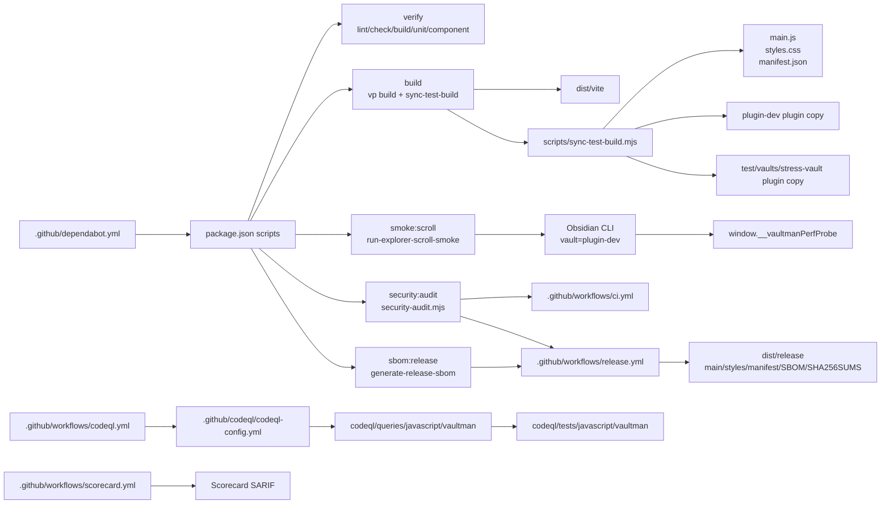

# Scripts CI Release Layer

## Scope

This phase maps the automation surface that turns source, tests, and runtime
contracts into build artifacts, smoke probes, security gates, and release
payloads.

Detailed shards:

- [[08a-scripts-and-package-gates|Scripts and package gates]]
- [[08b-ci-release-security-workflows|CI release security workflows]]
- [[08c-generated-artifacts-and-outputs|Generated artifacts and outputs]]
- [[08d-phase-08-inventory|Phase 08 inventory]]
- [[visuals/phase-08-scripts-ci-release.canvas|Phase 08 scripts CI release canvas]]

## Architecture Map

## Findings

- `package.json` is the automation router. Product code reaches CI and release
  mostly through package scripts, not direct workflow command duplication.
- `scripts/sync-test-build.mjs` is a local development bridge. It copies build
  outputs into the repo root, `dist/build`, `plugin-dev`, and the stress test
  vault after `pnpm run build`.
- `pnpm run build:plugin` deliberately avoids `sync-test-build.mjs`; release
  then stages files into `dist/release` explicitly.
- `scripts/run-explorer-scroll-smoke.mjs` is not a generic smoke harness. It is
  an Explorer scroll harness pinned to `plugin-dev` and the
  `window.__vaultmanPerfProbe` contract.
- Security is split across dependency audit, CodeQL custom queries, Scorecard,
  Dependabot, release checksums, SBOM, and artifact attestations.
- Root `main.js`, `styles.css`, `manifest.json`, and `versions.json` are release
  facing artifacts or metadata. They should be treated as outputs/metadata, not
  as the source layer that explains runtime behavior.

## Risk Boundaries

- Build and smoke commands have side effects outside `dist/`: root artifacts,
  `plugin-dev`, and `test/vaults/stress-vault` can all be overwritten.
- Release logic depends on nonempty `main.js`, `styles.css`, and `manifest.json`
  staged in `dist/release`.
- CodeQL custom query behavior is only reliable if query tests stay in sync with
  `codeql/queries/javascript/vaultman`.

## Recommended Next Layer

Phase 09 should be a residual source support sweep before claiming the codebase
cluster is complete: `src/index/`, `src/config/`, `src/badges/`,
`src/components/primitives/`, `src/components/settings/`,
`src/components/modals/`, `src/components/addons/`, dashboard support surfaces,
styles, and i18n.
