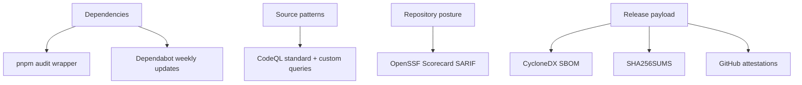

# CI Release Security Workflows

## CI

`.github/workflows/ci.yml` is the broad pull/push gate for active branches.

- Runs on pushes to `main`, `hardening`, `hardening-tests`,
  `hardening-audit`, and `hardening-refactor`.
- Runs on pull requests targeting `main` or `hardening`.
- Uses Node 24 through the Vite+ setup path.
- Installs dependencies through `vp install`.
- Runs `vp run security:audit`, `vp run lint`, `vp run check`,
  `vp run build`, and `vp run test:cover`.
- Uploads `coverage/` as a CI artifact.

## Release

`.github/workflows/release.yml` is stricter than normal build automation.

- Runs on tags matching `v*` and through manual dispatch.
- Manual dispatch supports a `dry_run` boolean.
- Requires a tag ref for publish paths that are not dry runs.
- Runs `vp run verify`, `vp run security:audit`, and `vp run build:plugin`.
- Stages `main.js`, `styles.css`, and `manifest.json` into `dist/release`.
- Checks that staged release files are nonempty.
- Runs `vp run sbom:release`.
- Writes `dist/release/SHA256SUMS`.
- Attests release subjects including build files, checksums, and SBOM.
- Uploads the release bundle and publishes files with `gh release create`.

## CodeQL

`.github/workflows/codeql.yml` covers both standard CodeQL suites and Vaultman
custom query tests.

- Uses `.github/codeql/codeql-config.yml`.
- Includes `security-extended` and `security-and-quality`.
- Adds `./codeql/queries/javascript/vaultman` as a local query pack.
- Runs custom query tests from `codeql/tests`.

Vaultman custom queries currently cover:

- Missing virtualizer item keys.
- Unsafe dynamic code path HTML.
- Unbounded vault reads with `Promise.all`.
- Trailing debounce Explorer refresh patterns.

## Scorecard And Dependabot

`.github/workflows/scorecard.yml` runs OpenSSF Scorecard weekly and on pushes to
`main` and `hardening`, then uploads SARIF.

`.github/dependabot.yml` schedules weekly update checks for npm and GitHub
Actions, with dependency/security labels and a limit of five open pull requests.

## Security Topology

