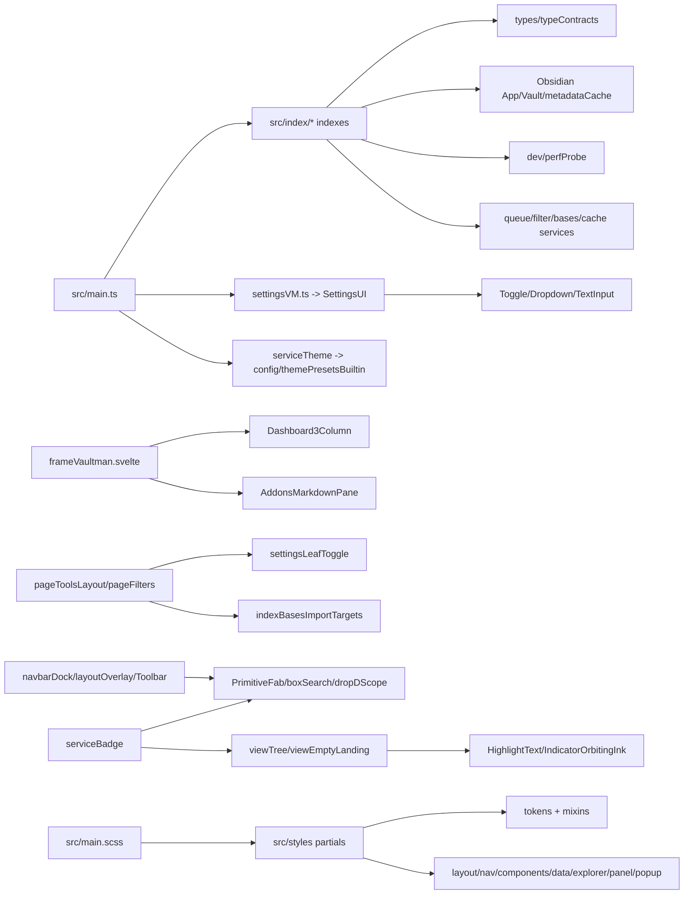

# Residual Src Support Layer

## Scope

This phase closes the main residual `src/` support surfaces that were not the
focus of phases 02-06: indexes, i18n, built-in theme config, badges, primitives,
settings, modal/addons/dashboard support components, and SCSS partials.

Detailed shards:

- [[09a-index-and-i18n-config|Index i18n and config]]
- [[09b-primitives-badges-settings-surfaces|Primitives badges settings surfaces]]
- [[09c-styles-dashboard-addons-modals|Styles dashboard addons modals]]
- [[09d-phase-09-inventory|Phase 09 inventory]]
- [[visuals/phase-09-residual-src-support.canvas|Phase 09 residual src support canvas]]

## Architecture Map

## Findings

- `src/index/` is the runtime read-model layer. Most indexes reuse
  `createNodeIndex`, which owns refresh versioning, `flatIds`, `byId`, search
  buffers, revision increments, subscribers, and optional perf probe measures.
- `indexContent.ts` is intentionally specialized because it performs async full
  content search with chunked reads, cache fingerprinting, and progress status.
- `utilPropIndex.ts` is a separate live autocomplete-oriented frontmatter index.
  Its own TODO states it is not the same thing as `indexProps.ts`.
- `src/index/i18n/lang.ts` is a static `en`/`es` translator with English as the
  hard-coded current language and raw-key fallback.
- `src/config/themePresetsBuiltin.ts` defines the built-in Native and Vaultman
  theme presets consumed by `serviceTheme.svelte.ts`.
- `src/components/primitives/` is split between general controls
  (`Toggle`, `Dropdown`, `TextInput`, `BtnSquircle`, `Badge`) and app-specific
  chrome primitives (`PrimitiveFab`, `boxSearch`, `dropDScope`).
- `src/badges/serviceBadge.ts` centralizes operation badge ordering, hover
  visibility, FAB badge counts, and delete/mutation contradiction detection.
- `src/styles/` is imported through `src/main.scss`. Tokens and mixins are the
  shared base; every category partial depends on them directly or through the
  main stylesheet.

## Source Gaps

This phase maps SCSS by import topology and file inventory. It does not perform
selector-level CSS audits for every partial. A selector audit should be a
separate visual pass only when the target is visual regression or theme drift.

## Recommended Next Layer

Phase 10 should be a coverage reconciliation pass: compare all `git ls-files`
source/config/test/doc paths against phases 01-09, mark any intentionally
excluded generated artifacts, and produce a final coverage matrix before calling
the codebase cluster complete.
