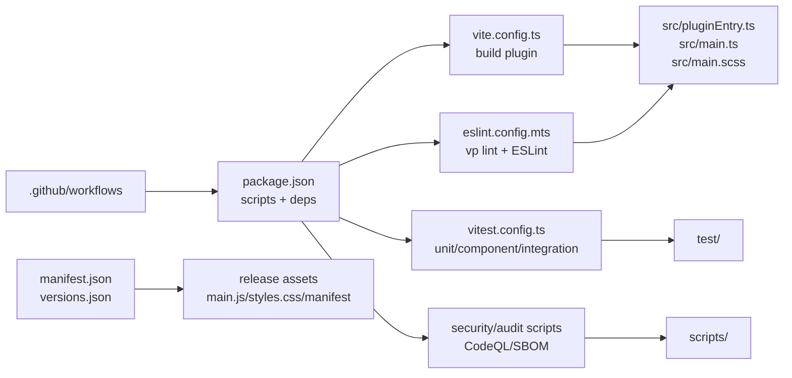

# Codebase Architecture Cluster

## Purpose

Build a layered visual map of the Vaultman codebase. Each phase adds a Markdown
record and, when useful, a child Canvas linked from the central Canvas.

Completed phases now cover the root layer, the source runtime spine, the
`src/components/frame/` shell layer, the layout/pages layer, the explorer
containers/providers/views layer, the shared services/types/logic layer, the
test architecture layer, the scripts/CI/release automation layer, and the
residual `src/` support layer. Later phases should keep adding one Markdown
record plus one child Canvas when the layer has enough branching structure to
justify a visual map.

## Visual Hub

- [[visuals/codebase-architecture-central.canvas|Central codebase architecture canvas]]
- [[visuals/phase-01-root-surface.canvas|Phase 01 root surface canvas]]
- [[visuals/phase-02-src-runtime-spine.canvas|Phase 02 source runtime spine canvas]]
- [[visuals/phase-03-components-frame.canvas|Phase 03 components frame canvas]]
- [[visuals/phase-04-layout-pages.canvas|Phase 04 layout and pages canvas]]
- [[visuals/phase-05-containers-providers-views.canvas|Phase 05 containers providers views canvas]]
- [[visuals/phase-06-services-types-logic.canvas|Phase 06 services types logic canvas]]
- [[visuals/phase-07-tests-architecture.canvas|Phase 07 tests architecture canvas]]
- [[visuals/phase-08-scripts-ci-release.canvas|Phase 08 scripts CI release canvas]]
- [[visuals/phase-09-residual-src-support.canvas|Phase 09 residual src support canvas]]

## Phases

| Phase | Status | Record | Scope |
| --- | --- | --- | --- |
| 01 | done | [[01-root-surface-layer|Root surface layer]] | Root configs, package scripts, release metadata, CI/security, top-level `src/`, `test/`, `scripts/`. |
| 02 | done | [[02-src-runtime-spine|Source runtime spine]] | `src/` entrypoints and first-level runtime modules. |
| 03 | done | [[03-components-frame-layer|Components frame layer]] | `src/components/frame/` shell, controllers, detached host, overlay/search/viewport/nav primitives. |
| 04 | done | [[04-components-layout-pages-layer|Components layout and pages layer]] | `src/components/layout/`, `src/components/pages/`, dashboard edge, toolbar/navbar recovery path. |
| 05 | done | [[05-containers-providers-views-layer|Containers providers views layer]] | `src/components/containers/`, `src/providers/`, and `src/components/views/`. |
| 06 | done | [[06-services-types-logic-layer|Services types logic layer]] | `src/services/`, `src/logic/`, `src/registry/`, `src/utils/`, `src/types/`. |
| 07 | done | [[07-tests-architecture-layer|Tests architecture layer]] | `test/` architecture and how tests bind to runtime layers. |
| 08 | done | [[08-scripts-ci-release-layer|Scripts CI release layer]] | `scripts/`, CI, release, security, generated artifacts. |
| 09 | done | [[09-residual-src-support-layer|Residual src support layer]] | Residual source support surfaces: `src/index/`, `src/config/`, badges, primitives, settings, modals, addons, dashboard support, styles, i18n. |
| 10 | done | [[docs/work/research/2026-05-25-codebase-orphan-files-audit|Orphan Files Audit]] | Audit of stray/unused/orphan files, unused dependencies, and knip configuration repair. |

## Root Layer Summary

## Decision Point

Recommended next phase: run a coverage reconciliation pass before claiming the
whole codebase cluster is complete. Phase 10 should compare all tracked
source/config/test/doc paths against phases 01-09, mark generated artifacts that
are intentionally excluded, and produce a final coverage matrix.
