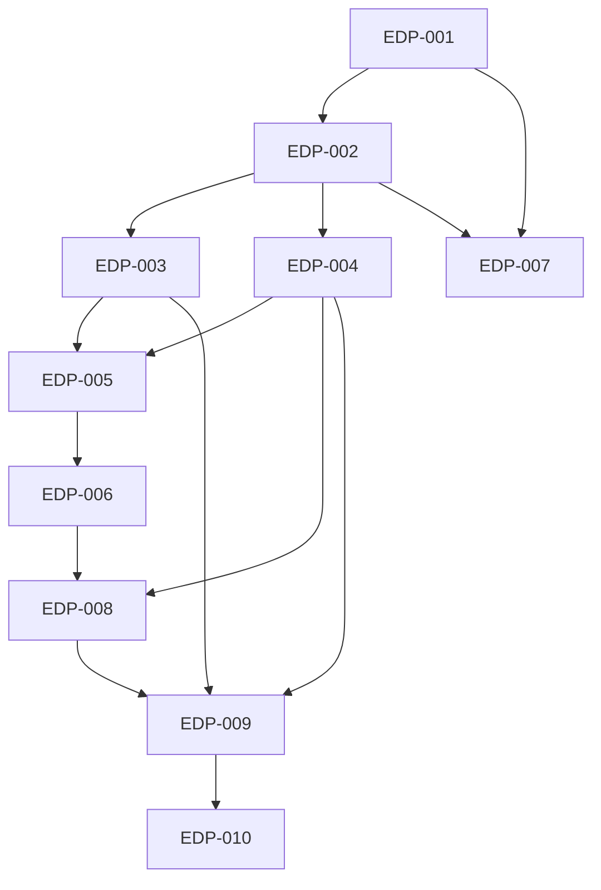

# Explorer Data Plane Local Issues

Local Markdown tracker for the Explorer data-plane transition. Source specs:

- [[docs/work/hardening/specs/2026-05-11-explorer-data-plane-transition/index|Explorer data plane transition]]
- [[docs/work/hardening/specs/2026-05-11-explorer-data-plane-structural-taxonomy/index|Explorer data plane structural taxonomy]]
- [[docs/work/hardening/specs/2026-05-11-explorer-data-plane-structural-taxonomy/19-wave-5-issue-prd-candidates|Wave 5 issue and PRD candidates]]

## Label Vocabulary

- `needs-triage`: maintainer needs to evaluate.
- `needs-info`: waiting on reporter or missing decision.
- `ready-for-agent`: fully specified AFK issue.
- `ready-for-human`: human implementation or review needed.
- `completed`: resolved local issue with no further action required.
- `wontfix`: will not be actioned.

## Issues

1. [[001-approve-issue-set-and-supersession-notes|EDP-001 Approve issue set and supersession notes]] - completed
2. [[002-files-snapshot-data-plane-foundation|EDP-002 Files snapshot data-plane foundation]]
3. [[003-files-panel-snapshot-compatibility-revisioned-reveal|EDP-003 Files panel snapshot compatibility and revisioned reveal]] - completed
4. [[004-batched-files-overlay-layers-viewservice|EDP-004 Batched Files overlay layers through ViewService]] - completed
5. [[005-files-data-plane-performance-gate|EDP-005 Files data-plane performance gate]] - completed
6. [[006-tags-props-snapshot-adapters|EDP-006 Tags and Props snapshot adapters]]
7. [[007-explorer-media-cache-database|EDP-007 Explorer media cache database]] - completed
8. [[008-overlay-projection-extraction|EDP-008 Overlay projection extraction]] - completed
9. [[009-adapter-row-contract-follow-up|EDP-009 Adapter row contract follow-up]]
10. [[010-selection-mirror-cleanup|EDP-010 Selection mirror cleanup]]

## Dependency Order

