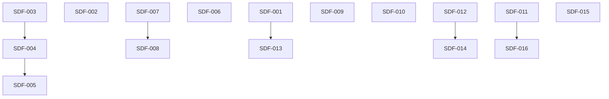

# Stable 1.1.0 Data/Files Parity Local Issues

Local Markdown tracker for the release-facing Data/Files parity follow-up after Task 6L.

## Source

- [[docs/work/hardening/specs/2026-06-05-stable-1-1-0-data-files-parity/index|Stable 1.1.0 Data/Files parity and native search adapter]]
- [[docs/work/hardening/plans/2026-06-05-stable-1-1-0-data-files-parity/index|Stable 1.1.0 Data/Files parity implementation plan]]

## Label Vocabulary

- `needs-triage`: maintainer needs to evaluate.
- `ready-for-agent`: fully specified AFK issue.
- `needs-research`: implementation must start with documented runtime or reference-product research.
- `completed`: resolved local issue with no further action required.
- `wontfix`: will not be actioned.

## Issues

1. [[001-native-extension-cell-polish|SDF-001 Native extension cell polish]] - completed
2. [[002-explorer-expand-state-header-action|SDF-002 Explorer expand state drives header action]] - completed
3. [[003-repair-files-explorer-sort-execution|SDF-003 Repair Files explorer sort execution]] - completed
4. [[004-split-date-sort-created-modified-cache|SDF-004 Split date sort into modified and created cache-backed sorts]] - completed
5. [[005-statistics-shared-cache-scoped-projections|SDF-005 Statistics shared cache with scoped projections]] - completed
6. [[006-zero-result-filters-warning-indicator|SDF-006 Zero-result filters warning indicator]] - completed
7. [[007-nested-flat-hierarchy-mode-all-explorers|SDF-007 Nested and flat hierarchy mode across explorers]] - completed
8. [[008-correct-tags-nested-simple-grouping|SDF-008 Correct Tags nested/simple grouping semantics]] - completed
9. [[009-content-active-tab-header-label|SDF-009 Content active tab header label]] - completed
10. [[010-content-explorer-core-search-parity|SDF-010 Content explorer parity with Core Search]]
11. [[011-bases-parity-table-view-layout|SDF-011 Bases-parity table view layout]] - completed
12. [[012-data-files-tab-menu-and-filter-fab-clear|SDF-012 Data Files tab menu and active-filter quick clear]] - completed
13. [[013-empty-folder-caret-and-extension-icons|SDF-013 Empty folder caret and extension-aware file icons]] - completed
14. [[014-data-tab-switch-performance-and-offset-regression|SDF-014 Data tab switch performance and vertical offset regression]] - completed
15. [[015-queue-duplicate-contradictory-operation-guards|SDF-015 Queue duplicate and contradictory operation guards]] - completed
16. [[016-explorer-view-parity-and-stat-card-routing|SDF-016 Explorer view parity and Statistics card routing]] - in progress

## Dependency Order

