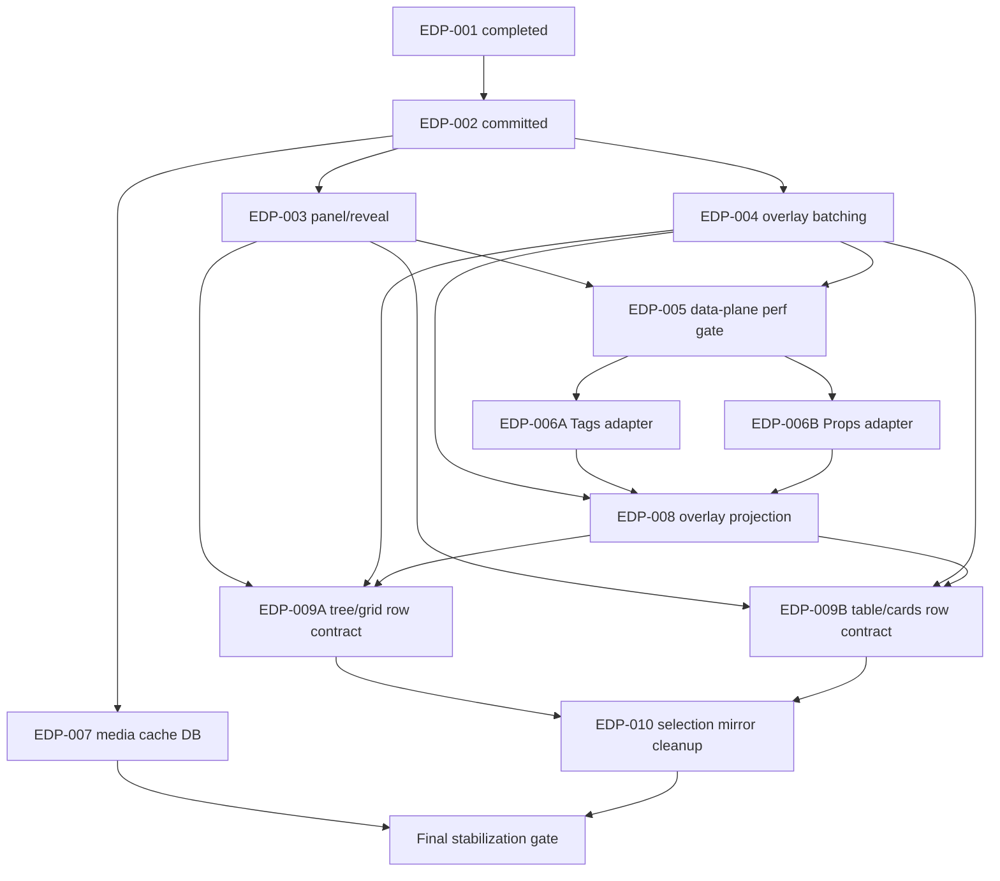

# EDP Parallel Agent Dispatch Index

Router for invoking parallel agents after EDP-002 landed on `claude/explorer`.

## Baseline

- Branch/worktree: `C:\Users\vic_A\Desktop\vaultman\.claude\worktrees\jovial-wilson-f81c67`
  on `claude/explorer`.
- Latest integrated commit: `5e2e7bc docs: update edp dispatch after wave 3 reconciliation`.
- EDP-001 is completed.
- EDP-002 is implemented and committed.
- EDP-003, EDP-004, and EDP-007 are implemented and integrated.
- Focused EDP-002 gates passed before this dispatch index: unit EDP tests,
  component EDP tests, `pnpm run check`, `pnpm run build:plugin`, and
  `git diff --check`.
- Known full-suite performance-threshold residuals are deferred to the final
  stabilization gate. Do not relax performance thresholds inside functional
  EDP slices.

## Every Agent Reads First

1. `AGENTS.md`
2. `.agents/docs/start.md`
3. `.agents/docs/current/status.md`
4. `.agents/docs/current/handoff.md`
5. [[docs/work/hardening/issues/explorer-data-plane/index|Explorer data plane local issues]]
6. [[docs/work/hardening/plans/2026-05-11-explorer-data-plane-transition/03-edp-002-wave-c-codex-continuation|EDP-002 Wave C Codex continuation]]
7. This dispatch index.
8. [[05-worker-operating-contract|EDP worker operating contract]]

Use one worktree per implementation agent. The exact worktree names, branch
names, start commands, ownership rules, verification expectations, and handoff
format live in [[05-worker-operating-contract|EDP worker operating contract]].
Stop and report if a task crosses ownership boundaries.

## Current Parallelism Rule

- Immediate next slice: Agent D / EDP-005. This is single-worker and must land
  before more parallel implementation starts.
- Next parallel split: Wave 3, Agents E1 and E2, after Agent D and the short
  E0 shared-contract coordinator land.
- Do not dispatch E1/E2 from `sandbox` or from pre-`5e2e7bc` branches.

## Dependency Map

## Wave 1 - Completed Parallel Start

These agents were originally safe to start in parallel after `f4cdbc7`; their
reconciled output is integrated in `d110fe6`.

### Agent A - EDP-003 Panel/Reveal

Status: completed in `d110fe6`.

- [[docs/work/hardening/issues/explorer-data-plane/003-files-panel-snapshot-compatibility-revisioned-reveal|EDP-003]]
- [[docs/work/hardening/specs/2026-05-11-explorer-data-plane-structural-taxonomy/16-wave-4-panel-reveal-compatibility|Wave 4 panel and reveal compatibility]]
- [[docs/work/hardening/plans/2026-05-11-explorer-data-plane-transition/reports/a2-panel-selection-reveal|Scout A2]]
- [[docs/work/hardening/plans/2026-05-11-explorer-data-plane-transition/reports/a3-tests-verification|Scout A3]]

Owns:
- `src/components/containers/panelExplorer.svelte`
- `src/components/views/viewTree.svelte`
- reveal, prune, range, box-selection, scroll integration helpers as needed
- `test/component/panelExplorerSelection.test.ts`
- focused tree/reveal/scroll tests discovered by `rg "viewTree|panelExplorer|selection|reveal" test`

Must not touch:
- `src/services/serviceViews.svelte.ts`
- media cache modules
- Tags/Props providers

Done when Files uses snapshot visible order where available, non-snapshot
providers keep fallback recursive paths, reveal targets are revision-aware, and
focused panel/tree/reveal tests pass.

Unlocks: EDP-005 and EDP-009 after EDP-004 also lands.

### Agent B - EDP-004 Overlay Batching

Status: completed in `d110fe6`.

- [[docs/work/hardening/issues/explorer-data-plane/004-batched-files-overlay-layers-viewservice|EDP-004]]
- [[docs/work/hardening/specs/2026-05-11-explorer-data-plane-structural-taxonomy/15-wave-4-viewservice-overlay-batching|Wave 4 ViewService overlay batching]]
- [[docs/work/hardening/plans/2026-05-11-explorer-data-plane-transition/reports/a4-viewservice-overlay-boundary|Scout A4]]
- [[docs/work/hardening/plans/2026-05-11-explorer-data-plane-transition/reports/a3-tests-verification|Scout A3]]

Owns:
- `src/services/serviceViews.svelte.ts`
- `src/types/typeView*`
- layer/overlay utilities used by `ViewService`
- Files layer compatibility tests in `test/unit/components/explorerFiles.test.ts`
- `test/unit/services/serviceViews.test.ts`

Must not touch:
- `panelExplorer.svelte`
- media cache modules
- Tags/Props providers except for type-only compatibility if unavoidable

Done when Files batches layer creation through `ViewService`, queue/filter-only
changes update layers without structural snapshot rebuilds, and batch parity
tests match current per-node decoration behavior.

Unlocks: EDP-005, EDP-008, and EDP-009 after their other blockers land.

### Agent C - EDP-007 Media Cache DB

Status: completed in `d110fe6`.

- [[docs/work/hardening/issues/explorer-data-plane/007-explorer-media-cache-database|EDP-007]]
- [[docs/work/hardening/specs/2026-05-11-explorer-data-plane-structural-taxonomy/17-wave-4-follow-up-slices#slice-f---media-cache-db-and-filenode-subscriptions|Wave 4 Slice F]]
- [[docs/work/hardening/specs/2026-05-11-explorer-data-plane-structural-taxonomy/05-notebook-navigator-react-to-svelte-research|Notebook Navigator research]]
- [[docs/work/hardening/specs/2026-05-11-explorer-data-plane-transition/index|Explorer data plane transition]]

Owns:
- new media-cache types/services/tests
- bounded in-memory blob LRU
- stale-key rejection tests
- file/node-level media subscription tests

Must not touch:
- structural snapshot persistence
- generic row-level subscriptions
- `panelExplorer.svelte`
- `serviceViews.svelte.ts`

Done when media metadata/blobs are separate, blob reads validate `mediaKey`,
and visible-row media updates do not rebuild structural snapshots or layers.

Unlocks: final stabilization gate. It does not block EDP-003 or EDP-004.

## Wave 2 - Performance Measurement

### Agent D - EDP-005 Data-Plane Perf Gate

Status: next unlocked slice.

Worker setup: see [[05-worker-operating-contract#Wave 2 - Agent D - EDP-005 Data-Plane Perf Gate|Agent D operating contract]].

Starts after: EDP-003 and EDP-004 are merged together.

- [[docs/work/hardening/issues/explorer-data-plane/005-files-data-plane-performance-gate|EDP-005]]
- [[docs/work/hardening/specs/2026-05-11-explorer-data-plane-structural-taxonomy/17-wave-4-follow-up-slices#slice-e---performance-gate-and-issue-prep|Wave 4 Slice E]]
- existing performance probe records under `docs/work/hardening/research/`
- current residuals in shard `03`

Owns:
- performance probe additions and records
- tests or scripts that measure snapshot creation, lookup-map creation, layer
  batching, reveal lookup, and total panel refresh cost

Must not:
- relax `stress.test.ts` or `viewTableStress.test.ts` thresholds as part of
  this slice
- mix functional adapter migrations into the measurement patch

Unlocks: EDP-006.

## Wave 3 - Tags/Props Parallel Adapters

Starts after: EDP-005 lands.

Dispatch the short E0 coordinator first if shared adapter contract ownership is
still ambiguous. After E0 lands, split:

- Agent E0: Shared snapshot contract coordinator.
- Agent E1: Tags snapshot adapter.
- Agent E2: Props snapshot adapter.

- [[docs/work/hardening/issues/explorer-data-plane/006-tags-props-snapshot-adapters|EDP-006]]
- [[docs/work/hardening/specs/2026-05-11-explorer-data-plane-structural-taxonomy/17-wave-4-follow-up-slices#slice-a---tags-and-props-snapshots|Wave 4 Slice A]]
- [[docs/work/hardening/specs/2026-05-11-explorer-data-plane-structural-taxonomy/07-wave-2-tags-props-vertical-spec|Wave 2 Tags/Props vertical spec]]

Agent E0 owns shared contracts. Agent E1 owns Tags provider/container/tests.
Agent E2 owns Props provider/container/tests. Only E0 may modify shared
data-plane contracts unless the coordinator explicitly hands off a type-only
compatibility patch.

Worker setup: see [[05-worker-operating-contract#Wave 3 - TagsProps Snapshot Adapters|Wave 3 operating contract]].

Unlocks: EDP-008 after both Tags and Props adapters land.

## Wave 4 - Overlay Projection

### Agent F - EDP-008 Overlay Projection

Starts after: EDP-004 and EDP-006 land.

Worker setup: see [[05-worker-operating-contract#Wave 4 - Agent F - EDP-008 Overlay Projection|Agent F operating contract]].

- [[docs/work/hardening/issues/explorer-data-plane/008-overlay-projection-extraction|EDP-008]]
- [[docs/work/hardening/specs/2026-05-11-explorer-data-plane-structural-taxonomy/17-wave-4-follow-up-slices#slice-b---overlay-projection-module|Wave 4 Slice B]]
- [[docs/work/hardening/specs/2026-05-11-explorer-data-plane-structural-taxonomy/08-wave-2-overlay-invalidation-spec|Wave 2 overlay invalidation spec]]

Owns overlay projection modules/tests. Must preserve `ViewLayers`,
`serviceBadge`, and `badgeRegistry` vocabulary.

Unlocks: EDP-009.

## Wave 5 - Adapter Row Contract

Starts after: EDP-003, EDP-004, and EDP-008 land.

Dispatch a coordinator to freeze row-input vocabulary, then split if write
scopes stay clean:

- Agent G1: tree/grid adapter row contract.
- Agent G2: table/cards adapter row contract.
- Agent G3: SVAR/compat bridge only if needed.

- [[docs/work/hardening/issues/explorer-data-plane/009-adapter-row-contract-follow-up|EDP-009]]
- [[docs/work/hardening/specs/2026-05-11-explorer-data-plane-structural-taxonomy/17-wave-4-follow-up-slices#slice-c---adapter-row-contract|Wave 4 Slice C]]
- existing Polish table/card source records named in the issue/spec.

Unlocks: EDP-010 after all adapter slices land.

Worker setup: see [[05-worker-operating-contract#Wave 5 - Adapter Row Contract|Wave 5 operating contract]].

## Wave 6 - Selection Mirror Cleanup

### Agent H - EDP-010 Selection Mirror Cleanup

Starts after: EDP-009 lands.

Worker setup: see [[05-worker-operating-contract#Wave 6 - Agent H - EDP-010 Selection Mirror Cleanup|Agent H operating contract]].

- [[docs/work/hardening/issues/explorer-data-plane/010-selection-mirror-cleanup|EDP-010]]
- [[docs/work/hardening/specs/2026-05-11-explorer-data-plane-structural-taxonomy/10-wave-2-selection-control-spec|Wave 2 selection control spec]]
- [[docs/work/hardening/plans/2026-05-04-serviceviews-implementation/index|historical serviceViews plan]]

Owns cleanup/deprecation of the remaining `ViewService` selection/focus mirror.
Tests must prove no divergence from `NodeSelectionService`.

Unlocks: final stabilization gate.

## Final Stabilization Gate

Run only after all functional EDP slices intended for this batch have landed.

Required checks: focused tests from all completed EDP agents,
`pnpm run test:unit`, `pnpm run test:component`, `pnpm run lint`,
`pnpm run check`, `pnpm run build:plugin`, `git diff --check`, and live
Obsidian smoke against `plugin-dev` if runtime behavior changed.

This is where the known performance-threshold residuals are diagnosed or
handled. Do not let earlier agents solve them by weakening thresholds.

Worker setup: see [[05-worker-operating-contract#Final Stabilization Agent|Final stabilization operating contract]].
