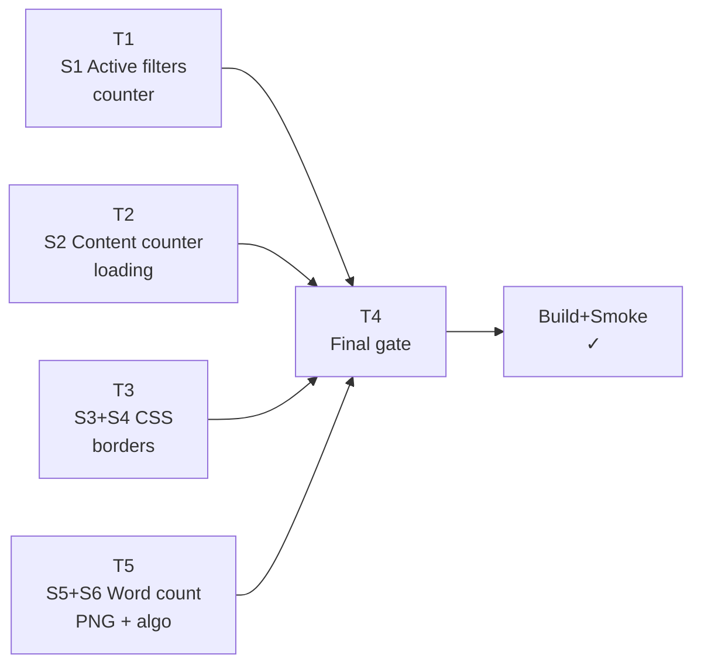

# P112 Content/Words/CSS Fixes — Implementation Plan

Branch: `p112-type-view-loop-fix` · Worktree: `hotfix-1.0.2-css-scorecard` Spec: [[docs/work/hardening/specs/2026-06-21-p112-content-words-css/index|spec]]



Tasks T1–T3 and T5 are independent. T4 is the final gate.

---

## T1 — Active filters counter fix (`explorerFiles.ts`)

**Spec:** S1

**Edit:** `src/components/containers/explorerFiles.ts:495`

```typescript
// Before
getDisplayedCount(): { filtered: number; total: number } {
    return {
        filtered: this.getVisibleFileCount(),
        total: this.plugin.filterService.filteredVaultFiles.length,
    };
}

// After
getDisplayedCount(): { filtered: number; total: number } {
    return {
        filtered: this.getVisibleFileCount(),
        total: this.plugin.app.vault.getFiles().length,
    };
}
```

**Test gate:** `pnpm run test:unit` — check tests in `explorerFiles` + `islandActiveFilters`.

**Commit:** `fix(filters): active-filters island shows filtered/totalVault not filtered/filtered`

---

## T2 — Content counter during loading (`pageFilters.svelte`)

**Spec:** S2

**Edit:** `src/components/pages/pageFilters.svelte:285-288`

```typescript
// Before
const resultFileCount =
    hasContentQuery && contentPreviewResult && !contentPreviewResult.isLoading
        ? contentPreviewMatchedFileCount(contentPreviewResult)
        : null;

// After
const resultFileCount =
    hasContentQuery && contentPreviewResult
        ? contentPreviewMatchedFileCount(contentPreviewResult)
        : null;
```

**Test gate:** `pnpm run check` (Svelte type check).

**Commit:** `fix(content): preview header shows matched-files count during loading`

---

## T3 — CSS: search + replace border-bottom (`styles.css`)

**Spec:** S3 + S4

**Target classes:**
- `.vaultman-content-search-container` = wraps the find input
- `.vaultman-content-replace-container` = wraps the replace input (additional class on same element)

**Strategy:** Both find and replace wrappers share `.vaultman-content-search-container` (which has `position: relative`). A single `::after` rule starting at `inset-inline-start: 30px` (= input `padding-inline-start`, where the placeholder text begins) gives both an underline that never covers the leading icon — satisfying both "add a border to find" and "replace border must not cover the icon" at once.
A `:focus-within` variant accents the line.

**Edit block added after `.vaultman-content-search-container .vaultman-content-input:focus` rule (~line 4020):**

```css
.vaultman-content-search-container::after {
  content: '';
  position: absolute;
  bottom: 0;
  inset-inline-start: 30px;
  inset-inline-end: 0;
  height: 1px;
  background: var(--background-modifier-border);
  pointer-events: none;
}

.vaultman-content-search-container:focus-within::after {
  background: var(--color-accent);
}
```

**Test gate:** `pnpm run stylelint` + visual check via obsidian-cli after build.

**Commit:** `fix(css): add border-bottom to content find/replace inputs`

---

## T5 — Word count: PNG skip + algorithm fix (`serviceStatisticsCache.ts`)

**Spec:** S5 + S6

### Change A — `getFileWordCount` skip non-md

```typescript
// src/services/serviceStatisticsCache.ts
getFileWordCount(file: TFile): number | null {
    if (file.extension !== 'md') return null;   // ← add
    const cached = this.fileStatsCache.get(file.path);
    if (this.isFreshCachedStats(file, cached)) return cached.words;
    return this.staleFileStatsCache.get(file.path)?.words ?? null;
}
```

### Change B — `computeSnapshot` skip content read for non-md

In the `for` loop at ~line 255, replace:
```typescript
const content = await this.app.vault.cachedRead(file);
fileStats = {
    path: file.path,
    ctime: file.stat.ctime,
    mtime: file.stat.mtime,
    size: file.stat.size,
    words: this.countWords(content),
    ...this.collectFileMetadata(file),
};
```
With:
```typescript
const content = file.extension === 'md'
    ? await this.app.vault.cachedRead(file)
    : null;
fileStats = {
    path: file.path,
    ctime: file.stat.ctime,
    mtime: file.stat.mtime,
    size: file.stat.size,
    words: content !== null ? this.countWords(content) : 0,
    ...this.collectFileMetadata(file),
};
```

### Change C — `countWords` algorithm (`\S+` → Unicode `[\p{L}\p{N}]+/gu`)

```typescript
// Before
private countWords(content: string): number {
    const withoutFrontmatter = content.replace(/^---[\s\S]*?---\s*/, '');
    const words = withoutFrontmatter.trim().match(/\S+/g);
    return words?.length ?? 0;
}

// After
private countWords(content: string): number {
    const withoutFrontmatter = content.replace(/^---[\s\S]*?---\s*/, '');
    const words = withoutFrontmatter.match(/[\p{L}\p{N}]+/gu);
    return words?.length ?? 0;
}
```

**Verification (2026-06-21, vs Obsidian `word-count` plugin `instance.wordCount`):**
- 2025-W46.md: Obsidian 181 · `\S+` 237 (bug) · `[\p{L}\p{N}]+` 179
- Unfolding the Napkin (accented prose): Obsidian 27 · `\w+` 25 · `[\p{L}\p{N}]+` **27 exact**

`\w+` was rejected: it splits accented Spanish words (`Díaz`→`D`+`az`). Unicode pattern handles accents and matches Obsidian on prose.

**Test-safety:** `test/unit/statisticsCacheService.test.ts` uses clean ASCII prose (`'one two three'`=3, `'four five'`=2) → Unicode pattern yields identical counts. `test/unit/fileWordCountCellSource.test.ts` source-guards still hold (the added `if (file.extension !== 'md')` line keeps `fileStatsCache.get`/`cached.words`, no `cachedRead`/`computeSnapshot` in the getter block).

**Test gate:** `pnpm run test:unit` — check `statisticsCache` tests if any; `pnpm run check`.

**Commit:** `fix(words): skip binary files in word count; use word-char regex to match Obsidian`

---

## T4 — Final gate

```powershell
# In worktree C:/Users/vic_A/Desktop/vaultman/.claude/worktrees/hotfix-1.0.2-css-scorecard
corepack pnpm run lint
corepack pnpm run check
corepack pnpm run stylelint
corepack pnpm run test:unit
corepack pnpm run build
```

Then reload:
```powershell
obsidian vault=plugin-dev plugin:reload id=vaultman
obsidian vault=plugin-dev dev:errors
```

DOM smokes:
1. Active filters: open filters island → header shows `N / M files` where M is total vault count
2. Content search: type "chao" → header shows matched-file count updating as results come in (not scope total)
3. CSS: Content tab → find input has underline; reveal → replace input has underline starting after icon
4. Words: PNG file in Files table → Words cell is empty; 2025-W46 Words cell shows ~179-181

---

## Commit Order

```
T5 → T1 → T2 → T3 → [final gate]
```

T5 first (most isolated, no Svelte). T1 next (single line). T2 (Svelte, one condition). T3 (CSS only).

---

## Result (2026-06-21, opus-4-8) — COMPLETE

**Gate:** `check` 0/0 · `stylelint` clean · `build`+sync OK · reload `dev:errors` clean.
`test:unit` 278/279 — the 1 failure is **pre-existing, not from this work** (see below).

**Live plugin-dev verification (obsidian-cli):**
- S1 — filter `file_name~chao`: old denom `filteredVaultFiles.length`=1, new denom `vault.getFiles().length`=11111. Counter now `1/11111`.
- S2 — typed `chao` in Content, sampled preview header: `4 in 3` → `5 in 4` → `6 in 5` → `14 in 13 file(s)` during load (was scope total 11058).
- S3/S4 — find + replace `.vaultman-content-search-container::after`: height 1px, `inset-inline-start` 30px; leading icon spans 8–24px so underline clears it.
- S5 — `vault_view.png` `getFileWordCount` → `null`.
- S6 — `2025-W46` recomputed 237 → 179 (Obsidian `word-count` plugin 181). Accented prose note = 27 = Obsidian exact.

**Commits (worktree `p112-type-view-loop-fix`, no push):**
`a59b82f` words · `09b46e9` filters · `0e38e24` content · `d4e896a` css.

### KNOWN-AJENO — pre-existing test failure (flagged, NOT fixed here)
`test/unit/filesLogic.test.ts` › *"preserves caller-provided sibling folder order for nested sorted results"* expects `['beta','alpha']`, gets `['alpha','beta']`. **Proved pre-existing** by stashing all four edits and re-running on clean HEAD (still 1 failed / 13 passed). Introduced by commit `275147f fix(sort): natural numeric sort for files, folders, and filter service`, which made `buildFileTree` sort folders — directly contradicting this older test's assertion. Needs a test-vs-logic reconciliation (decide whether folder siblings keep caller order or sort), which is its own slice outside these six bugs.
