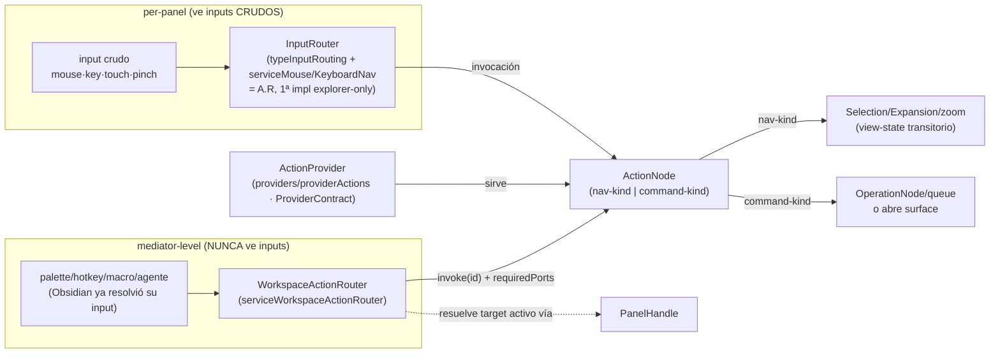

# NIB — Slices post-grill (2026-07-09/10)

Grill NIB cerrado (claude-fable-5 + dev, chat 2026-07-09/10). Canon aterrizado en: glossary
(InputRouter · WorkspaceActionRouter · panelWidget · Overlay corregido), shard 03/04 (notas
fechadas), [[docs/architecture/usage-workflows|usage-workflows]] W-001..003,
[[docs/work/hardening/research/2026-07-10-structural-refactor-dossier|structural-refactor dossier]].

## Pipeline (el Mermaid del plan)

## Locks del grill (D-NIB)

1. **D-NIB-1** Dos tiers por lo que VEN: `InputRouter` per-panel (único que ve inputs crudos;
   kind-agnóstico con capabilities) · `WorkspaceActionRouter` mediator-level (recibe
   invocaciones de ActionNodes). Relación con `WorkspaceMediator`: mediator = interacciones
   espaciales/continuas (payload×target); actionRouter = invocaciones discretas (target
   implícito = activo). Documentado aquí porque en una semana alguien preguntará por qué no
   es un método del mediator.
2. **D-NIB-2** nav-kind incluye `zoom`; un gesto resuelve POR TARGET (pinch nodos=resize/mark
   vs pinch frame=zoom transitorio); persistencia por faceta = opción del USER vía PSS.
   Gesture grammar + gesture-index (4º plano SASI) = research DEFERRED.
3. **D-NIB-3** `panelData`→**`panelWidget`**; bars = panelWidget (hijos de Scene); overlays =
   surface-kinds; jerarquía LOCKED surface>scene>panel>node>cell (W-003 = piedra Rosetta).
4. **D-NIB-4** ActionProvider = provider normal (interface **`ProviderContract`**, archivo
   `typeProvider.ts`) con dominio acciones; fuente inicial = comandos propios; **la palette se
   registra DESDE el provider** (consumidor real — anti tracer-teatro).
5. **D-NIB-5** Los 4 métodos hardcode del router del tracer migran a ActionNodes nav-kind con
   `invoke()` genérico + `requiredPorts` en la shape (las unhandled-reasons tipadas se
   PRESERVAN — no perder calidad existente).
6. **D-NIB-6** Naming: convención **capa-primero SE MANTIENE** (dominante y coherente; fuzzy
   search encuentra dominio en ambas); se arreglan solo FALSAS capas. `getTree()`→`getNodes()`
   (verificado libre). Regla anti-drift: vocabulario se alinea JUNTO y PRIMERO, por zona
   activa con catálogo (no big-bang repo-wide).
7. **D-NIB-7** Shape ActionNode mínima TreeNode-aligned + `requiredPorts`; shape canónica →
   mini-grill con tabla comparativa (TreeNode/PendingChange/IconNode/InputBindingNode) que
   DEBE incluir: **context-scoped actions** `getActionsFor(target)` (caso plugin file-menu ya
   interceptable por `fileMenuDelegationAdapter`; caso W-001 like-cell), composición/macros,
   effect-kind explícito.
8. **D-NIB-8** Disciplina refactor: post-wave como RECOMENDACIÓN (no norma) + a-petición
   (`improve-codebase-architecture`). Refactor-mandate del stream goal: ver dossier.

## Slice 0 — vocabulary alignment (mecánico puro, zona activa)

Renames sin cambio semántico, UN commit, gates = check 0/0 · unit verde · build ✓ · paridad:
`serviceWorkspaceInputRouter`→`serviceWorkspaceActionRouter` (+tipos/tests) ·
`'panelData'`→`'panelWidget'` (union `typePanelScene` + usos) ·
`typeActionRouting.ts`→`typeInputRouting.ts` (+imports) ·
`typeExplorer.ts` interface `ExplorerProvider`→**`ProviderContract`** en `typeProvider.ts`
(re-export temporal permitido para no tocar 6 providers en el mismo commit… o incluirlos:
decisión del ejecutor, catálogo completo) ·
`providers/explorer*`→`providers/provider*` (7 archivos + clases) · `getTree()`→`getNodes()`.

## Slice 0.5 — extraer los 2 providers-svelte (juicio + parity)

`containers/explorerActiveFilters.svelte` y `containers/explorerQueue.svelte` mezclan
provider(data)+render (señalado por dev): extraer provider TS puro a `providers/` (contrato
`ProviderContract`) y dejar el render a la abstracción de panel que corresponda
(panelExplorer sobre el provider extraído; widgets del island = panelWidget futuro). Parity
visual/behavioral estricta; RED/GREEN por extracción. NO es rename mecánico — worker con spec
propia, review coordinador.

## Slice 1 — NIB vertical real

`providers/providerActions.ts` (ProviderContract; subset implementado DOCUMENTADO — deuda ISP
del contrato gordo anotada en dossier, NO consagrar stubs como patrón) · migrar los 4 métodos
del router a ActionNodes nav-kind (D-NIB-5) · `serviceCommands` registra la palette iterando
el provider (D-NIB-4) · shape mínima D-NIB-7. DoD: focales router+provider · check 0/0 ·
build · **paridad palette observable** (misma lista de comandos, mismos efectos) · full unit
integrado por coordinador.

## Deferred (con dossier/pendientes como home)

Shape canónica (mini-grill, tabla YA comprometida) · slice 2 cmenu data-driven (verificar
`serviceRowAction` antes) · gesture grammar/InputBindingNode/gesture-index · menu-curator ·
SASI completo · desguace god-objects `provider*` (auditoría estructural, task room) ·
partición ProviderContract en capability-contracts (deuda ISP).
