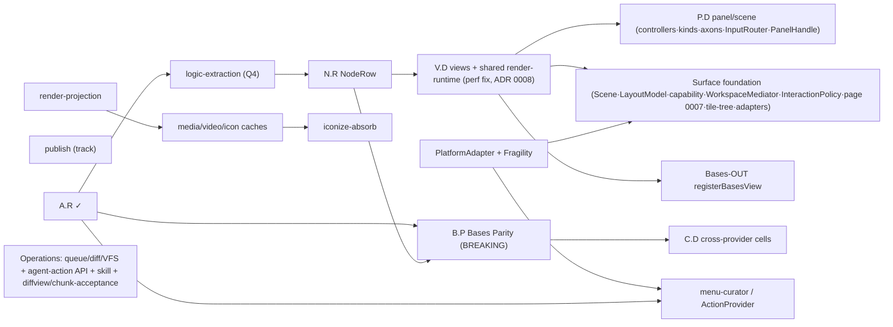

# Roadmap — Dispatch-Ready Action Order

Hardens [[docs/work/hardening/research/2026-05-25-architecture-foundation-discovery/roadmap-reslot|roadmap-reslot]]
into a dispatch-ready, dynamic action order. Method synthesized from 2026-05-26 read-only
web research (two agents: dynamic-roadmap frameworks + AI multi-agent dispatch). Supersedes
the fixed `v1.x` slot ordering for **sequencing**; version numbers attach at cut time (Q11).

## Method (from research)

- **Now / Next / Later** rolling tiers — NOT fixed version/date slots. Commit only to NOW;
  rebalance every ~2 weeks as dependencies unblock. SemVer assigned late; `sandbox`=beta,
  `main`=stable.
- **Priority = cost-of-unblock** (WSJF lens for a solo dev): score by how much finishing an
  item releases downstream, then weight by effort. One item that unlocks three is high-leverage
  — beats raw "value". Dependencies-first.
- **Vertical slices + critical-path DAG**: each sub-system is a self-contained slice with a
  task contract; the DAG says what is parallelizable.
- **Dispatch (orchestrator-worker)**: spawn parallel agents ONLY on truly-independent slices;
  serial pipelines triple token cost. **git worktree per agent**, narrow per-worker context,
  predefined output schema, validate no shared-file/state overlap before launch. Start **2–3
  agents**, scale only if coordination overhead stays < 15%. Topological sort auto-launches
  dependents; re-plan on failure (no full restart). 80% AI + human PR checkpoints.

Sources: now-next-later (aakashg.com), parallel AI refactors (tessl.io), critical-path (asana),
multi-agent coordination (claude.com), orchestration patterns (beam.ai).

## Dependency DAG



## Tiers + dispatch cards

Priority = cost-of-unblock (downstream released). ∥ = parallelizable lane. Channel: beta unless noted.

| Tier | ID | Slice | Depends on | ∥ | Priority | Urgency |
|---|---|---|---|---|---|---|
| **NOW** | publish | 1.1.0→beta · CI sandbox · mobile gate | — | ∥ (own track) | unblocks safe shipping | **URGENT** (stable safety) |
| **NOW** | PlatformAdapter | adapters + Fragility Registry (ADR 0004) | — | ∥ | unlocks SF/MC/iconize/ForeignEmbed | HIGH |
| **NOW** | Q4 logic-extraction | logicFiles/Props/Tags/Badge/FnR out of god-providers | A.R ✓ | serial (spine head) | **highest** (gates N.R→V.D→P.D→all) | HIGH |
| **NEXT** | N.R | NodeRow primitive (cell = node-element) | Q4 | serial | unlocks V.D + B.P | HIGH |
| **NEXT** | V.D | view shells (engines×modes×orient) + **shared render-runtime** | N.R | serial | **highest** (= the perf fix, 1051ms→fast) + unlocks SF/Bases-OUT | HIGH |
| **LATER** | P.D | panel/scene: panel-scoped controllers + kinds + axons + InputRouter + PanelHandle | V.D | serial (spine tail) | unlocks Scene composition | HIGH |
| **LATER** | SF (lane A) | Surface foundation → page=editor-group(0007) + tile-tree + WorkspaceMediator + InteractionPolicy + codeblock/pop-up/modal adapters | V.D/P.D + PA | ∥ A (biggest) | unlocks multi-surface + interaction | MED |
| **LATER** | Bases-OUT (lane B) | `registerBasesView` + emit `bases-*` | V.D + cell/view-config | ∥ B | non-breaking interop | MED |
| **LATER** | caches (lane C) | render-projection → media/video/icon caches → iconize-absorb | render-projection (V.D) | ∥ C | unblocks visual NodeElements | MED |
| **LATER** | menu-curator (lane D) | ActionProvider over Obsidian menu surfaces | A.R ✓ + ActionNode | ∥ D | dedupe/curate menus | MED |
| **LATER** | Operations (lane E) | queue/diff/VFS + agent-action API + skill + **diffview/chunk-acceptance** | own spec | ∥ E | unlocks agentic mutation UX | MED |
| **cont.** | T.G | test invariant gates (spec-anchored anti-drift) | A.R contract | ∥ continuous | protects every slice | HIGH |
| **MAJOR** | B.P | Bases Parity (namespaced IDs) — **BREAKING** | A.R + N.R + 4-I | serial-ish | unlocks C.D | LATER |
| **MAJOR** | C.D | cross-provider cell data | B.P | serial-ish | feature breadth | LATER |

**Parallelism**: NOW = up to 3 agents (publish ∥ PlatformAdapter ∥ logic-extraction). Spine
(Q4→N.R→V.D→P.D) is **serial** — shared mutable state (the god-object); one focused chain.
LATER lanes A–E = up to 5 independent agents once V.D/P.D stable; **launch 2–3 first**, add
more only if coordination stays cheap. MAJOR gated by a breaking release.

## Task-contract template (per dispatch)

Each spawned agent gets a self-contained card:

```yaml
id: <subsystem>
worktree: <isolated branch/worktree>          # no shared file state
input:   { pre-reads: [spec, plan, model shards], constraints: [...] }
output:  { schema: <expected files/exports>, channel: beta }
depends_on: [<ids that must be Done>]
parallelizable: <bool>                          # false if it mutates shared files
verify_gate: pnpm verify (+ T.G invariants) + live plugin-dev smoke
priority: <cost-of-unblock>  urgency: <window>
```

## Next-step to operationalize

1. Land research method (this doc) — done.
2. When dispatching: write each NOW/NEXT item's SPEC→PLAN→Issues (to-issues skill, tracer-bullet
   vertical slices) before spawning its agent. Do NOT pre-spec LATER items.
3. Reconcile `roadmap-overview` ad-hoc IDs (A.R/N.R/V.D/P.D/B.P/C.D) with this DAG; point its
   Reslot section here. Keep version columns for reference until first cut.

## Scope + known gaps (NOT yet in this roadmap)

This roadmap covers the **explorer-decomposition spine + interop + operations** — what the
2026-05-26 grill addressed. It is NOT the full product roadmap. Still living in
[[docs/work/roadmap-overview|roadmap-overview]] and NOT yet slotted here:

- **Style/Theme axis**: N (SCSS→UnoCSS), Theme Builder (#10), color governance (#8), bits-ui
  (#12), Settings UI (#5), snippet UX (#9).
- **Keyboard / API / NN**: K.B, public API, I.E (NN engine swap).
- **proto-v6 integration** (was v5 at umbrella time) — lives in
  `C:\Users\vic_A\Downloads\vaultman` (`proto-v6/` + `Vaultman Prototype v6.html` + `components/`
  + `screenshots/`), by Claude-design; mostly STYLE + some functional. **Needs its own
  brainstorm/grill**; classify components ADOPT/DROP/RESHAPE/MAP/DEFER, not verbatim
  (extends the [[docs/work/hardening/specs/2026-05-19-explorer-merge-umbrella/index|merge umbrella]], which was built against v5).

**Hard ordering constraint:** proto-v6's breaking, style-heavy changes MUST land **before N
(UnoCSS)** — doing N first forces a massive UnoCSS rewrite. So:
`proto-v6-integration (own grill) → N (UnoCSS)`. proto-v6 is also style/view-heavy → entangled
with V.D; its exact slot vs V.D is part of the proto-v6 grill.

## Status

Method + DAG + tiers + dispatch cards = ready for the decomposition spine. Pending: per-item
SPEC→PLAN→Issues at dispatch time (gated until the dev greenlights implementation), AND folding
in the gaps above (Style/Theme, Keyboard/API/NN, **proto-v6 integration**) for a unified
roadmap. Deferred items (minisearch H1, Bases interop order, EditorScene, Hometab,
LayoutBuilder/profiles, Nav3D, NN-interop) are NOT in these tiers yet.
