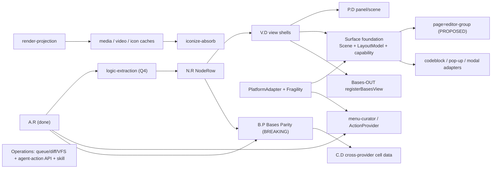

# Roadmap Reslot Proposal

PROPOSED restructure from the foundation brainstorm. Canonical roadmap stays
[[docs/work/roadmap-overview|roadmap-overview]]; this proposes how to reslot it.
The Q11 principle is LOCKED; the specific placement is a draft for review.

**Hardened (2026-05-26):** the live, dispatch-ready action order is
[[docs/work/hardening/research/2026-05-25-architecture-foundation-discovery/roadmap-dispatch|roadmap-dispatch]]
(DAG + Now/Next/Later + cost-of-unblock priority + task contracts). This file keeps the
dependency graph + change-type table as background.

## Principle (Q11, LOCKED)

- Classify each item by **change-type**: patch (fix) · minor (feat/refactor) ·
  major (breaking).
- Order = **dependency-driven + dynamic**. Version numbers are assigned late, at
  cut time, by what is actually stable — not fixed `v1.2.0…v2.0.0` slots.
- Channels: **`sandbox` = beta** (may break; BRAT), **`main` = stable**. The
  [[docs/work/publish/index|publish]] initiative owns the channel mechanics.

## Dependency graph

## Items × change-type × channel

| Item | Change-type | Depends on | Channel / note |
|---|---|---|---|
| publish (1.1.0→beta · CI sandbox · mobile) | fix/process | — | **NOW**, stable-safety |
| logic-extraction (logicFiles/Props/Tags/Badge/FnR) | refactor (minor) | A.R | beta — first structural move |
| N.R NodeRow primitive | feat (minor) | logic-extraction + A.R | beta |
| V.D view shells (engines × modes × orientation) | refactor (minor) | N.R | beta |
| P.D panel/scene orchestrators | refactor (minor) | V.D | beta |
| Surface foundation (Scene + LayoutModel + capability-profiles) | feat (minor) | V.D / P.D | beta |
| Bases-OUT (`registerBasesView` + `bases-*` DOM) | feat (minor, non-breaking) | V.D + cell/view-config | beta — can precede major |
| media / video / icon caches | feat (minor) | render-projection (descriptors) | beta |
| iconize-absorb (icon override + IconNode) | feat (minor) | icon cache | beta |
| menu-curator / ActionProvider | feat (minor) | A.R + ActionNode | beta |
| Operations (queue/diff/VFS + agent-action API + skill) | feat (minor) | own spec (special) | beta |
| page = editor-group + layout-config | feat (minor, PROPOSED) | Surface foundation | beta |
| PlatformAdapter + Fragility Registry | infra (minor) | — | beta — needed by floating-tile/menu-intercept/iconize |
| T.G test invariant gates | process | A.R contract | continuous |
| B.P Bases Parity (namespaced IDs) | **BREAKING (major)** | A.R + N.R + 4-I | major release |
| C.D cross-provider cell data | feat/breaking | B.P | major release |
| Controls/Input + InputBindingNode + Nav3D | feat (minor) | — | **DEFERRED** |
| minisearch search index | feat (minor) | — | **DEFERRED** (own vs Omnisearch-bridge, H1) |

## Reconciliation note

The umbrella's fixed `v1.2.0 → v2.0.0` table (in
[[docs/work/hardening/specs/2026-05-19-explorer-merge-umbrella/index|merge-umbrella]]
and roadmap-overview) is superseded for **ordering** by this dynamic model; the
dependency graph (real constraints) is kept. Version numbers attach at cut time
per change-type. Reslotting `roadmap-overview` tables is a follow-up after review.
