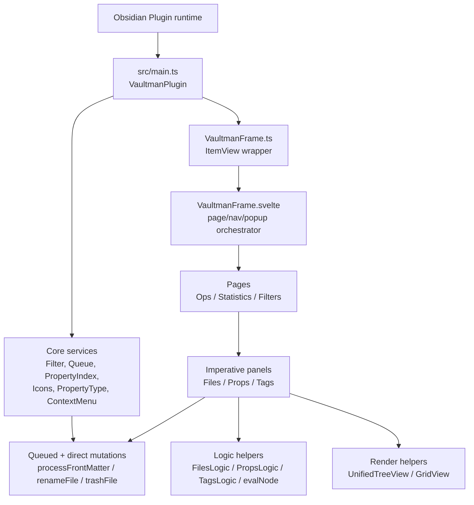
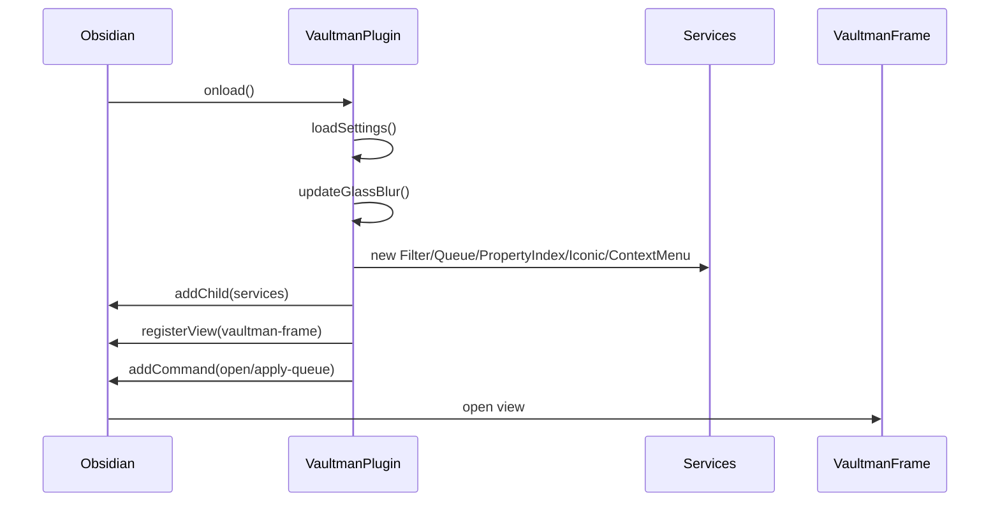
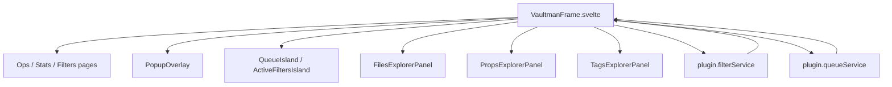
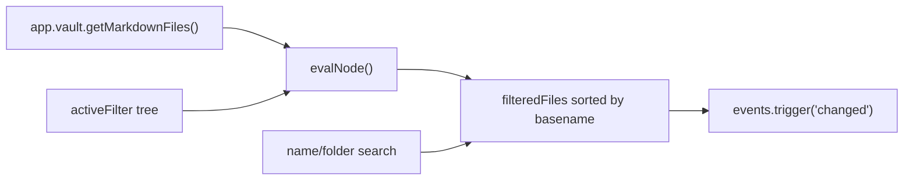
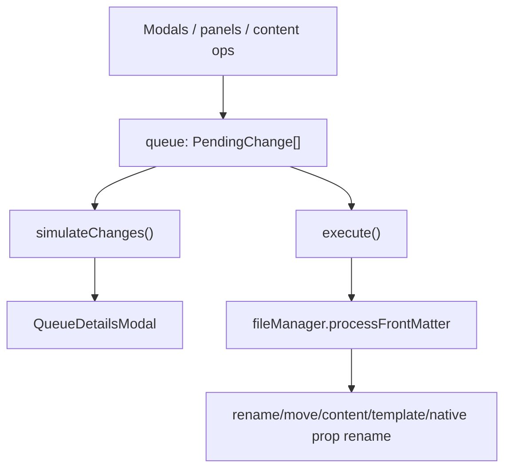
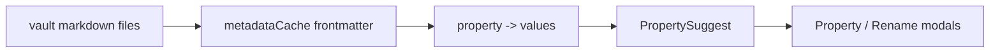
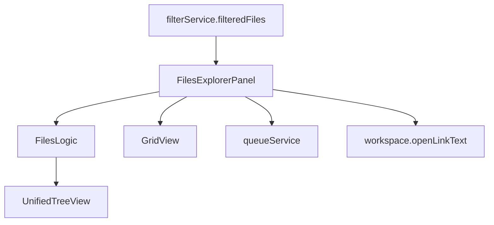

# 02 - Stable Stream Vertical Read

This shard analyzes the stable stream. In this workspace, the source-backed stable baseline is `origin/main` plus tag `1.0.1`, not the local `main` branch and not tag `1.1.0`.

The stable stream is smaller, more conservative, and more directly coupled than the current canary stream. It has a coherent user product: one Obsidian view, three main pages, filters over files/properties/tags, a queue for many operations, context-menu actions, settings, and Obsidian-native metadata access.
It does not yet have the later reconstruction vocabulary: providers, data-plane snapshots, shared render-runtime, PlatformAdapter, detached tab leaves, service theme tokens, view-host contracts, public API, or the larger Bases/interop spine.

## Sources Read

Stable refs and metadata:

- `origin/main:manifest.json`
- `origin/main:package.json`
- `origin/main:versions.json`
- `1.0.0:manifest.json`
- `1.0.1:manifest.json`
- `1.1.0:manifest.json`
- `git diff --stat 1.0.0..origin/main`
- `git diff --stat origin/main..1.1.0`

Stable product source:

- `origin/main:src/main.ts`
- `origin/main:src/VaultmanFrame.ts`
- `origin/main:src/VaultmanFrame.svelte`
- `origin/main:src/VaultmanSettings.ts`
- `origin/main:src/types/typeSettings.ts`
- `origin/main:src/types/typeFilter.ts`
- `origin/main:src/types/typeOps.ts`
- `origin/main:src/types/typeTree.ts`
- `origin/main:src/types/typeUI.ts`
- `origin/main:src/types/typeCMenu.ts`
- `origin/main:src/services/serviceFilter.ts`
- `origin/main:src/services/serviceOperationQueue.ts`
- `origin/main:src/services/servicePropertyIndex.ts`
- `origin/main:src/services/serviceContextMenu.ts`
- `origin/main:src/services/serviceIcons.ts`
- `origin/main:src/services/servicePropertyType.ts`
- `origin/main:src/logic/logicsFiles.ts`
- `origin/main:src/logic/logicProps.ts`
- `origin/main:src/logic/logicTags.ts`
- `origin/main:src/utils/filter-evaluator.ts`
- `origin/main:src/utils/autocomplete.ts`
- `origin/main:src/utils/inputModal.ts`
- `origin/main:src/components/componentStatusBar.ts`
- `origin/main:src/components/containers/explorerFiles.ts`
- `origin/main:src/components/containers/explorerProps.ts`
- `origin/main:src/components/containers/explorerTags.ts`
- `origin/main:src/components/containers/panelCurator.ts`
- `origin/main:src/components/containers/panelContent.svelte`
- `origin/main:src/components/pages/pageFilters.svelte`
- `origin/main:src/components/pages/pageOps.svelte`
- `origin/main:src/components/pages/pageStatistics.svelte`
- `origin/main:src/components/pages/tabContent.svelte`
- `origin/main:src/components/pages/tabFiles.svelte`
- `origin/main:src/components/pages/tabLinter.svelte`
- `origin/main:src/components/pages/tabProps.svelte`
- `origin/main:src/components/pages/tabTags.svelte`
- `origin/main:src/components/layout/viewTree.ts`
- `origin/main:src/components/layout/viewGrid.ts`
- `origin/main:src/components/layout/navbarPillFab.svelte`
- `origin/main:src/components/layout/navbarTabs.svelte`
- `origin/main:src/components/layout/navbarFilters.svelte`
- `origin/main:src/components/layout/PopupOverlay.svelte`
- `origin/main:src/components/layout/popupFilters.svelte`
- `origin/main:src/components/layout/popupMove.svelte`
- `origin/main:src/components/layout/popupScope.svelte`
- `origin/main:src/components/layout/popupSearch.svelte`
- `origin/main:src/components/layout/popupSort.svelte`
- `origin/main:src/components/layout/popupView.svelte`
- `origin/main:src/components/layout/islandQueue.ts`
- `origin/main:src/components/layout/islandActiveFilters.ts`
- `origin/main:src/components/componentQueueList.ts`
- `origin/main:src/modals/modalAddFilter.ts`
- `origin/main:src/modals/modalPropertyManager.ts`
- `origin/main:src/modals/modalFileRename.ts`
- `origin/main:src/modals/modalFileMove.ts`
- `origin/main:src/modals/modalLinter.ts`
- `origin/main:src/modals/modalQueueDetails.ts`
- `origin/main:src/modals/modalSaveTemplate.ts`
- `origin/main:styles.css` first 260 lines sampled

Not read in detail in this shard:

- all i18n strings;
- all old/deprecated ops/sidebar files;
- every line of `styles.css`;
- every modal not listed above.

These are not needed to state the stable-stream shape, but they remain pending if a later exact stable UI inventory is needed.

## Stable Stream Ground Truth

### Metadata

`origin/main` reports:

```json
{
  "id": "vaultman",
  "name": "Vaultman",
  "version": "1.0.1",
  "minAppVersion": "1.12.0",
  "isDesktopOnly": false
}
```

Tag metadata confirms:

```text
1.0.0 -> manifest version 1.0.0
1.0.1 -> manifest version 1.0.1
1.1.0 -> manifest version 1.1.0
```

`1.0.0..origin/main` is a small patch delta: 26 files, 126 insertions, 66 deletions across metadata, README/CHANGELOG, and targeted product fixes.
That makes `origin/main` a true continuation of `1.0.0`, not a rewritten branch.

By contrast, `origin/main..1.1.0` is a huge product delta:

```text
297 files changed, 43828 insertions(+), 12327 deletions(-)
```

That is the practical reason stable cannot be reconciled by just saying "1.1.0 is the next stable". It is a different product shape.

### Inventory

Stable product source under `src/`, excluding tests/spec files:

```text
origin/main files=66
origin/main product_src_loc=9809
components=32
services=6
providers=0
types=6
```

The zero-provider count matters. Stable does not have the later provider/data plane architecture. It reads Obsidian APIs directly from services, logic, and component-backed panels.

## Stable Stream Product Model



Stable is "single-frame, service-backed, imperative-panel Vaultman". The frame is not yet a Scene/Panel/Surface architecture. The product works by putting several Obsidian-aware classes under one mounted Svelte shell.

## Stable Stream User Product

The stable user experience, as implemented in the inspected source, is:

1. Ribbon icon opens one Vaultman view.
2. The view has bottom navigation for `ops`, `statistics`, and `filters`.
3. Filters page has tabs for `props`, `files`, and `tags`.
4. Files can render as grid or tree.
5. Props and tags are tree-first, with a small grid mode for props.
6. Filter rules are held in `FilterService.activeFilter`.
7. Queue operations accumulate in `OperationQueueService.queue`.
8. Queue details modal previews frontmatter and file path changes.
9. Many mutations are queued before execution.
10. Some actions still mutate directly.
11. Content find/replace has a real preview-and-queue workflow.
12. Linter, menu-curation, move/search/scope popups, and filter-template modals exist as practical stable product surfaces, not only settings.
13. A bottom status bar summarizes total, filtered, selected, queued, property, and value counts.
14. Settings expose language, property defaults, explorer behavior, operations scope, open mode, view labels, context menu settings, and several Bases settings that are not wired into a Bases runtime in stable.

## [origin/main:src/main.ts] - Stable Plugin Bootstrap

### Purpose

`main.ts` is the root composition point. It instantiates all stable services, registers the Vaultman Obsidian view, installs the ribbon icon and commands, loads settings, and wires a simple metadata-resolved refresh.

### Dependencies

- IN: Obsidian `Plugin`, `WorkspaceLeaf`; stable services; settings tab; i18n.
- OUT: public service properties on `VaultmanPlugin`; registered view; commands;
  settings tab; status bar class; CSS custom property for glass blur.

### Data Flow



### Key Code

```ts
this.propertyIndex = new PropertyIndexService(this.app);
this.filterService = new FilterService(this.app);
this.queueService = new OperationQueueService(this.app);
this.iconicService = new IconicService(this.app);
this.propertyTypeService = new PropertyTypeService(this.app);
this.contextMenuService = new ContextMenuService(this);
```

This is stable's service model: no DI container, no provider registry, no capability adapter layer. The plugin instance itself is the shared dependency surface.

```ts
this.registerEvent(
  this.app.metadataCache.on('resolved', () => {
    this.filterService.applyFilters();
  })
);
```

Stable reacts to the metadata cache finishing by reapplying filters. It does not yet expose a revisioned data-plane snapshot or per-provider invalidation model.

### Honest State

- Good: simple and easy to reason about.
- Good: small release surface.
- Risk: root plugin exposes many services directly; components can reach across boundaries freely.
- Risk: refresh model is coarse. There is no stable revision vocabulary.
- Risk: `manifest.json` says mobile-capable, but no `Platform` or mobile gate appears in stable product source.

## [origin/main:src/VaultmanFrame.ts] - Obsidian ItemView Wrapper

### Purpose

This file adapts Svelte into Obsidian's `ItemView`. It creates the content element, assigns the frame class, mounts `VaultmanFrame.svelte`, and unmounts it on close.

### Dependencies

- IN: Obsidian `ItemView`, Svelte `mount`/`unmount`, `VaultmanPlugin`.
- OUT: Obsidian view type `vaultman-frame`; Svelte app lifecycle.

### Code Key

```ts
export const VAULTMAN_FRAME_TYPE = 'vaultman-frame';
```

This is the whole stable surface identity. Unlike canary, stable does not register independent tab-leaf views for each page.

```ts
this.svelteApp = mount(VaultmanFrameSvelte, {
  target: contentEl,
  props: { plugin: this.plugin },
});
```

The Svelte frame receives the entire plugin object, not a narrowed contract.

### Honest State

Stable's Obsidian integration is conservative and clean. The coupling is pushed into the Svelte frame and panels.

## [origin/main:src/VaultmanFrame.svelte] - Stable Frame Orchestrator

### Purpose

This is the main stable UI composition file. It owns page order, active page, bottom nav behavior, FAB actions, queue/filter islands, popup routing, selected counts, filtered counts, search routing, move popup state, queue stats, and connections to imperative explorer panels.

### Dependencies

- IN: `VaultmanPlugin`, Obsidian `setIcon`, Svelte runes, pages, popup overlay, queue/filter island classes, modals, autocomplete utilities, queue types.
- OUT: renders three pages; mutates plugin settings; opens modals; calls service methods; instantiates imperative island classes.

### Svelte Shape

Stable already uses Svelte 5 runes:

```svelte
let pageOrder = $state(initialPageOrder);
let pageRenderKey = $state(0);
const pageFabs = $derived.by(() => ({ ... }));
let activePage = $state(initialPageOrder[0] ?? "ops");
```

But it also holds many unrelated responsibilities in one component. This is not wrong for stable, but it is why canary later decomposed frame logic into `frameNavigation`, `frameOverlays`, `framePopups`, `framePages`, and shells.

### Frame-Owned Product State

The stable frame owns:

- page order and active page;
- long-press page reordering;
- viewport width measurement and nav collapse;
- popup open/close state;
- queue island lifecycle;
- active filters island lifecycle;
- selected count;
- filtered count;
- queued count;
- filter rule count;
- file/prop/tag explorer handles;
- per-filter-tab search;
- move popup target files and folder;
- active filter popup rule projection.

### Data Flow



### Key Code - Search Routing

```svelte
$effect(() => {
  const term = filtersSearch;
  const tab = filtersActiveTab;
  const catMode = filtersSearchCategory[tab] ?? 0;

  switch (tab) {
    case "props":
      propExplorer?.setSearchTerm(term);
      break;
    case "tags":
      tagsExplorer?.setSearchTerm(term, catMode === 0 ? "all" : "leaf");
      break;
    case "files":
      if (catMode === 0) {
        fileList?.setSearchFilter(term, "");
      } else {
        fileList?.setSearchFilter("", term);
      }
      break;
  }
});
```

This shows the stable style: UI state directly calls panel methods. There is no central search/source controller.

### Key Code - Queue/Filter Subscriptions

```svelte
plugin.filterService.on("changed", onFilterChanged);
plugin.queueService.on("changed", onQueueChanged);
plugin.app.metadataCache.on("resolved", onVaultResolved);
```

Stable uses event subscriptions directly inside the frame. Later canary separates this into more dedicated services and component contracts.

### Honest State

- Good: one file shows the whole stable UX.
- Good: no hidden orchestration layer.
- Risk: this file is a god component.
- Risk: Svelte effects cause imperative panel calls; if handles are stale, behavior depends on mount order.
- Risk: multiple state concerns share one component; small changes can affect navigation, popups, filtering, queue state, and selection at once.

## [origin/main:src/VaultmanSettings.ts] - Stable Settings UI

### Purpose

The settings tab exposes product switches and persists them through `plugin.saveSettings()`.

### Dependencies

- IN: Obsidian `PluginSettingTab`, `Setting`, i18n, stable `iVaultmanPlugin`.
- OUT: mutates `VaultmanSettings`; updates language; calls `updateGlassBlur`;
  toggles one body class for Bases column separators.

### Settings Surface

`typeSettings.ts` defines stable settings for:

- language;
- default property type;
- filter templates;
- explorer content search;
- queue preview;
- operation scope;
- operations panel position;
- Bases-looking settings;
- open mode;
- page order;
- glass blur intensity;
- separate panes;
- file list view mode;
- filter tab labels;
- context menu visibility/hide rules.

### Important Mismatch

Stable exposes Bases settings:

```ts
basesLastUsedPath: string;
basesOpenMode: 'last-used' | 'picker';
basesOpsPanelSide: 'left' | 'right';
basesExplorerSide: 'left' | 'right';
basesAutoAttach: boolean;
basesInjectCheckboxes: boolean;
basesShowColumnSeparators: boolean;
```

But `git grep "bases"` in `origin/main -- src` only finds these settings and their UI. No stable source read showed a Bases runtime, `.base` parser, Bases registration, or attach mechanism.

### Honest State

- Stable settings include future-facing placeholders.
- That is acceptable for a stable patch only if the controls are harmless.
- It also means stable has a promise-shape mismatch: settings mention Bases behavior that is not implemented in the stable product path.

## [origin/main:src/services/serviceFilter.ts] - Filter State And Evaluation

### Purpose

`FilterService` owns the active filter tree and the current filtered file list.
It emits `changed` when results update.

### Dependencies

- IN: Obsidian `App`, `TFile`, `Events`; `FilterGroup`; `evalNode`.
- OUT: `activeFilter`, `filteredFiles`, `selectedFiles`, event notifications.

### Data Flow



### Key Code

```ts
activeFilter: FilterGroup = {
  type: 'group',
  logic: 'all',
  children: [],
  id: 'root',
  enabled: true
};
```

The stable filter tree is simple and compatible with the later FilterGroup concept, but it is stored directly in the service with mutable child arrays.

```ts
const matchingPaths = evalNode(this.activeFilter, allFiles, getMeta);
base = allFiles.filter((f) => matchingPaths.has(f.path));
```

The filter evaluator is pure-ish: it receives the file universe and a metadata getter.

### Issues / Improvements

- Mutable `activeFilter` is shared directly across UI code.
- Search filters are state inside the filter service, but tab-specific search state lives in the frame.
- `selectedFiles` exists here but selection ownership is not authoritative;
  files panel owns selected rows and frame passes selected count separately.
- Later canary's selection service/data-plane direction is a real improvement, not just extra abstraction.

## [origin/main:src/utils/filter-evaluator.ts] - Pure Filter Tree Semantics

### Purpose

This module implements the actual predicate semantics for stable filters.

### Dependencies

- IN: Obsidian `getAllTags`, `TFile`, `CachedMetadata`; filter types.
- OUT: `Set<string>` of matching file paths.

### Supported Rules

- `has_property`
- `missing_property`
- `specific_value`
- `multiple_values`
- `folder`
- `folder_exclude`
- `file_name`
- `file_name_exclude`
- `file_folder`
- `has_tag`

### Group Logic

```ts
case 'all': intersection
case 'any': union
case 'none': universe minus union
```

### Honest State

This module is a stable asset worth preserving. It is already close to the future `logic*` extraction direction because it is DOM-free and App-free except for Obsidian metadata types.

## [origin/main:src/services/serviceOperationQueue.ts] - Stable Mutation Queue

### Purpose

`OperationQueueService` stores queued changes and applies them in chunks. It is the stable stream's strongest safety mechanism.

### Dependencies

- IN: Obsidian `App`, `Notice`, `TFile`, `FileManager`; `PendingChange` and special operation keys.
- OUT: queued operations, execution notices, file/frontmatter/content writes, diff simulation.

### Data Flow



### Key Code - Batched Add

```ts
addBatch(changes: PendingChange[]): void {
  if (changes.length === 0) return;
  this.queue.push(...changes);
  this.events.trigger('changed');
}
```

This stable patch already recognizes render-thrash risk: batch operations emit one event instead of one event per file.

### Key Code - Chunked Execution

```ts
const CHUNK = 20;
...
if ((i + 1) % CHUNK === 0) {
  await new Promise<void>((r) => window.setTimeout(r, 0));
}
```

Stable yields during large queue execution. It is basic but practical.

### Key Code - Fresh Frontmatter

```ts
await this.app.fileManager.processFrontMatter(file, (fm) => {
  const updates = change.logicFunc(file, fm);
  ...
});
```

This is a good stable invariant: apply against the current frontmatter buffer, not stale metadata cache snapshots.

### Honest State

- Good: queue-first design is real for many operations.
- Good: diff simulation exists.
- Good: execution yields to the UI thread.
- Risk: a single `PendingChange` object carries both operation metadata and executable logic closure; this makes serialization, replay, and agent/API integration harder.
- Risk: content replace reads/modifies whole files directly; no chunk-acceptance beyond the preview.
- Risk: not all product mutations use the queue.

## Stable Mutation Boundary - Queued vs Direct

This is important enough to name separately.

Queued examples:

- property set/rename/delete/clean/change/add through `PropertyManagerModal`;
- file rename through `FileRenameModal`;
- file move through `FileMoveModal`;
- content find/replace through `pageOps.svelte`;
- add tag/property from add mode in panel clicks.

Direct mutation examples found:

```ts
// explorerFiles.ts
return this.plugin.app.fileManager.trashFile(meta.file);
```

```ts
// explorerTags.ts
await this.plugin.app.fileManager.processFrontMatter(file, ...);
```

Tag rename, tag delete, inline-to-frontmatter, and file delete do not go through the same queue preview path in stable.

### Honest State

Stable's "mass-action safely" promise is partially implemented, not universal.
The canary goal of a unified mutation pipeline is justified by stable code.

## [origin/main:src/services/servicePropertyIndex.ts] - Frontmatter Property Index

### Purpose

This service builds a property-name/value index from Obsidian metadata.

### Dependencies

- IN: Obsidian `App`, metadata cache, vault events.
- OUT: `index: Map<string, Set<string>>`, `fileCount`, autocomplete inputs.

### Data Flow



### Key Code

```ts
this.registerEvent(
  this.app.metadataCache.on('changed', (file) => {
    this.pendingFiles.add(file.path);
    this.scheduleFlush();
  })
);
```

Stable already does incremental updates with a debounce.

### Honest State

- Good: small and useful.
- Risk: `removeFile()` deletes file contribution bookkeeping but does not remove values from the index; values can grow stale until rebuild.
- Risk: index uses stringified values and has no schema/source revision model.

## [origin/main:src/services/serviceContextMenu.ts] - Menu Injection And Hiding

### Purpose

Stable has a registry of actions and injects them into panel menus, file menus, editor menus, and more-options menus.

### Dependencies

- IN: Obsidian `Menu`, `MenuItem`, workspace menu events, action defs.
- OUT: menu items, action execution, menu hide-rule side effects.

### Key Code

```ts
this.plugin.app.workspace.on('file-menu', (menu, file, source) => { ... });
this.plugin.app.workspace.on('editor-menu', (menu) => { ... });
```

Stable hooks Obsidian menu events directly.

```ts
(menu as unknown as { items: MenuItem[] }).items.splice(matchedIdx, 1);
```

Menu hiding reaches into internal menu item arrays.

### Honest State

- Good: a registry already exists; this is the ancestor of ActionNode/menu curator thinking.
- Risk: menu internals are fragile.
- Risk: action definitions are local and imperative, not a cross-surface ActionNode contract yet.

## [origin/main:src/services/serviceIcons.ts] - Iconic Bridge

### Purpose

Reads Iconic plugin data from `.obsidian/plugins/iconic/data.json` and exposes property/tag icon lookups.

### Dependencies

- IN: Obsidian vault adapter, Iconic plugin file layout.
- OUT: property/tag icon maps.

### Honest State

This is a useful bridge but fragile:

- it assumes Iconic's data path and JSON shape;
- failures are swallowed;
- no capability probe / Fragility Registry exists;
- no unload/revert is needed because it only reads, but it is still a foreign plugin coupling.

## [origin/main:src/services/servicePropertyType.ts] - Property Type Bridge

### Purpose

Reads and writes `.obsidian/types.json` for property type assignments.

### Honest State

This is another direct Obsidian-file bridge. It is small, stable-like, and useful, but it is not protected by adapter boundaries.

## [origin/main:src/components/containers/explorerFiles.ts] - Files Panel

### Purpose

The files panel renders filtered files as a grid or tree, owns file selection in grid mode, registers file context actions, handles add-mode property editing, and opens files in the workspace.

### Dependencies

- IN: `VaultmanPlugin`, `FilesLogic`, `GridView`, `UnifiedTreeView`, modals, context menu service.
- OUT: rendered file UI, selected file list, queued file/property changes, direct trash action, workspace open-link side effect.

### Data Flow



### Honest State

- Stable files panel is a practical product surface.
- It directly combines data transformation, render selection, action registration, modal opening, and context-menu actions.
- It has no virtualization; `GridView` and `UnifiedTreeView` both use a 200-item default display limit with "Show all".
- It can immediately trash files via context menu, bypassing queue preview.

## [origin/main:src/components/containers/explorerProps.ts] - Props Panel

### Purpose

Props panel renders property names and values, toggles filter rules, registers property/value actions, shows queue badges, supports warning badges for type incompatibility, and can queue property mutations.

### Dependencies

- IN: Obsidian app, `PropsLogic`, filter service, Iconic service, context menu, queue service, tree view, input modal.
- OUT: tree/grid DOM, queue changes, filter changes, context menu actions.

### Important Behaviors

- Property node click toggles `has_property`.
- Value node click toggles `specific_value`.
- Add mode queues add-property operations across filtered files.
- Context menu actions queue rename/delete/change-type/convert actions.
- Queue badges can be double-clicked to remove a queued operation.

### Honest State

This is one of stable's richest files. It also shows why future logic extraction is needed: rendering, action policy, queue badge projection, filter matching, icon resolution, sorting, and mutation building all live in one class.

## [origin/main:src/components/containers/explorerTags.ts] - Tags Panel

### Purpose

Tags panel renders Obsidian tag hierarchy, toggles tag filters, supports search, sorting, Iconic tag icons, queue badges, and direct tag operations.

### Dependencies

- IN: `TagsLogic`, filter service, Iconic service, context menu service, queue service, `UnifiedTreeView`.
- OUT: rendered tag tree, filter changes, queued add-tag operations, direct frontmatter rewrites.

### Important Difference From Props

Tag add-mode queues operations, but tag rename/delete/frontmatter conversion mutate files immediately with `processFrontMatter`.

### Honest State

Stable tag UX is useful, but it violates the future unified mutation invariant.
This is a concrete system to reconcile before promotion.

## [origin/main:src/logic/logicsFiles.ts] - Files Data Shape

### Purpose

Builds file hierarchy and does flat file search.

### Honest State

It is straightforward and stable. The main limitation is that it builds a full tree from input files each render path and has no revision/cache contract.

## [origin/main:src/logic/logicProps.ts] - Properties Data Shape

### Purpose

Builds property/value trees from Obsidian metadata and detects type incompatibility.

### Honest State

It caches until invalidated, which is good. It also recomputes by walking all markdown files when stale. It is DOM-free enough to be a candidate for future `logicProps`, but the stable panel still owns too much around it.

## [origin/main:src/logic/logicTags.ts] - Tags Data Shape

### Purpose

Builds hierarchical tag nodes from `metadataCache.getTags()`.

### Honest State

It is compact and DOM-free. It likely survives reconstruction as a logic module or seed for one.

## [origin/main:src/components/layout/viewTree.ts] - Stable Tree Renderer

### Purpose

Imperatively renders `TreeNode[]` into DOM rows. Handles expansion, badges, count display, editing input, click, context menu, search highlight, warnings, and show-more.

### Dependencies

- IN: container element, tree options, Obsidian `setIcon`.
- OUT: DOM rows, event callbacks.

### Key Code

```ts
const RENDER_LIMIT = 200;
...
if (opts.nodes.length > limit) {
  this._renderShowMore(opts);
}
```

Stable avoids full render by limiting output, not by virtualizing.

### Honest State

- Good: simple DOM renderer and predictable.
- Risk: not enough for 50k/100k explorer targets.
- Risk: renderer knows badge semantics and editing semantics, so it is not a pure renderer in the future ADR 0002 sense.

## [origin/main:src/components/layout/viewGrid.ts] - Stable File Grid

### Purpose

Imperatively renders files into a sortable/selectable grid with checkbox selection and "Show all".

### Honest State

It is stable-user friendly for small/medium vaults. It is not a scalable render runtime. Selection ownership is local to `GridView.selectedFiles`, which is why later selection unification is necessary.

## [origin/main:src/components/pages/pageFilters.svelte] - Filters Page

### Purpose

Composes filter tab navigation, filter toolbar, and the three filter tabs:
props, files, tags.

### Dependencies

- IN: plugin, bound search/tab state, panel handles, nav/filter components.
- OUT: mounted panel tabs and selected count updates.

### Honest State

This page is a thin Svelte composition layer. Most logic lives above it in `VaultmanFrame.svelte` or below it in panel classes.

## [origin/main:src/components/pages/pageOps.svelte] - Operations Page

### Purpose

Provides content find/replace preview and queueing, plus a layout curator mount.

### Key Code

```ts
const files = (scope === "selected" || (scope === "auto" && selected.length > 0))
  ? selected
  : plugin.filterService.filteredFiles;
```

Stable operation scope is selected-first if configured or if `auto` sees selected files.

### Honest State

The content replacement preview is useful but direct and local. The operation payload is a closure returning special operation keys, not a serializable plan.

## [origin/main:src/components/containers/panelContent.svelte + tabContent.svelte] - Stable Content Find/Replace UI

### Purpose

These two files show that stable's operations page is not only a generic queue page. It has a concrete content find/replace workflow:

- find input;
- replace input;
- case-sensitive toggle;
- regex toggle;
- scope hint;
- preview action;
- queue-replace action;
- collapsible preview result;
- per-file match count;
- snippets with highlighted matches;
- "more files" disclosure when the preview is truncated.

### Key Code Shape

```svelte
<button
  class="vaultman-btn"
  disabled={!contentFind || contentPreviewing}
  onclick={() => {
    void previewContentReplace();
  }}>{contentPreviewing ? "..." : translate("content.preview")}</button>
```

```svelte
<button
  class="vaultman-btn mod-cta"
  disabled={!contentFind}
  onclick={queueContentReplace}
  >{translate("content.queue_replace")}</button>
```

The practical difference from canary is not "stable has no FnR". Stable already has content replacement. The difference is ownership and breadth: stable's content replacement is an ops-page-local workflow, while canary later turns FnR into a cross-explorer command island and rename handoff system.

### Honest State

This is more user-facing than the first pass implied. Stable users can inspect matches before queueing replacement, and the UI supports plain and regex-like workflows. It is still local and narrow:

- it is not a full syntax-aware FnR engine;
- it does not unify prop/value/tag/file rename handoffs;
- its queued operation is still closure-backed;
- it belongs to the operations page rather than a shared command island.

## [origin/main:src/components/pages/tabLinter.svelte + modals/modalLinter.ts] - External Linter Bridge

### Purpose

Stable includes a linter tab and modal that integrate with the community `obsidian-linter` plugin. The modal is specifically oriented around the linter's `yaml-key-sort` rule and lets the user edit the property priority order before applying linting to the target file set.

### Practical Behavior

- It checks whether the `obsidian-linter` plugin is installed.
- It reads the linter plugin's in-memory `settings.ruleConfigs`.
- It targets the `yaml-key-sort` config key `yaml-key-priority-sort-order`.
- It lets users add/remove/reorder properties with property autosuggest.
- It writes the priority order back through the linter plugin's `saveSettings` function if available.
- It opens each target file in a tab leaf and executes `obsidian-linter:lint-file`.
- It reports progress with notices.

### Honest State

This is useful, but it is one of stable's clearest fragility bridges. It touches another plugin's internal settings shape and then calls Obsidian's internal command registry:

```ts
(this.app as unknown as { commands: { executeCommandById: (id: string) => boolean } })
  .commands.executeCommandById(commandId);
```

That does not make the feature bad. It means stable has already crossed into external-plugin orchestration before canary's later PlatformAdapter/Fragility Registry vocabulary. Any promotion story should treat this as an adapter candidate, not as harmless modal code.

## [origin/main:src/components/containers/panelCurator.ts] - Stable Context Menu Curator

### Purpose

Stable has a concrete "context menu curator" panel. It is not only a hidden settings flag. It lets users add, enable/disable, and delete rules that hide items from Obsidian workspace context menus.

### Practical Behavior

The supported surfaces are:

- `file-menu`;
- `editor-menu`;
- `more-options`.

Rules are simple substring matches:

```ts
const newRule: MenuHideRule = {
  surface: surfaceSelect.value as Surface,
  titleMatch: title,
  enabled: true,
};
```

The panel writes directly to `plugin.settings.contextMenuHideRules` and saves settings after mutation.

### Honest State

This expands stable's product scope beyond Vaultman's own panels. Stable already tries to curate Obsidian-native menus. That reinforces two facts:

- stable is not purely a metadata explorer;
- stable already depends on internal/native Obsidian surface assumptions.

Canary's native-surface binding work is broader, but the product impulse already exists in stable.

## [origin/main:src/components/layout/popupScope.svelte + popupSearch.svelte + popupMove.svelte] - Stable Popup Command Trio

### Purpose

The first pass captured `PopupOverlay.svelte` as a router, but the individual popups matter because they are stable's command-surface proof:

- scope popup chooses operation scope;
- search popup separates file-name and folder search;
- move popup previews selected-file path changes and queues move operations.

### Practical Behavior

`popupScope.svelte` writes through `setScope` and compares each option against `plugin.settings.explorerOperationScope`. `popupSearch.svelte` owns separate `searchName` and `searchFolder` bindings. `popupMove.svelte` shows old/new path previews before calling `queueMoves`.

### Honest State

Stable has smaller command surfaces than canary, but they are real. The difference is centralization: stable popups are parent-frame callback surfaces, while canary later grows dedicated overlay/frame services and command host contracts.

## [origin/main:src/modals/modalAddFilter.ts + modalSaveTemplate.ts] - Stable Filter Authoring And Template Persistence

### Purpose

Stable filters are not only toggles over preexisting data. Users can author rules/groups and save the current filter tree as a named template.

### Practical Behavior

`modalAddFilter.ts` supports:

- rule vs group mode;
- group logic `all`, `any`, `none`;
- property filters;
- missing-property filters;
- specific-value filters;
- multiple-value filters;
- folder include/exclude filters;
- file-name include/exclude filters;
- property autosuggest;
- value autosuggest when the property is known.

`modalSaveTemplate.ts` deep-clones the current filter root and stores it in `plugin.settings.filterTemplates`, replacing an existing template with the same name or appending a new one.

### Honest State

This makes filter template persistence a stable product truth, not just a settings artifact. Canary must preserve the user contract even if it replaces the filter runtime with active filter indexes and provider projections.

## [origin/main:src/components/componentStatusBar.ts] - Stable Bottom Count Ledger

### Purpose

Stable has a bottom status bar with practical count feedback:

- total files;
- filtered files;
- selected files;
- pending queued operations;
- property count;
- value count.

### Honest State

This is not architecturally large, but it matters to the user model. It gives the stable interface a compact operational ledger. Canary's dashboards and badges are broader; they should not regress this simple count affordance.

## [origin/main:src/components/pages/pageStatistics.svelte] - Statistics Page

### Purpose

Shows counts for folders, files, properties, values, tags, and approximate link stats.

### Honest State

It is a lightweight dashboard. It explicitly defers word count because reading content is heavy. Its `selected` scope depends on `filterService.selectedFiles`, but stable selection is actually local to file grid; this is an ownership gap.

## [origin/main:src/components/layout/navbarFilters.svelte] - Filter Toolbar

### Purpose

Owns the filter-page search pill, category switch, sort popup, view-mode popup, and add-mode toggle.

### Honest State

This toolbar is Filters-page-specific. It directly calls panel methods:

```ts
if (activeTab === "files") fileList?.setSortBy(sortBy, direction);
if (activeTab === "props") propExplorer?.setSortBy(sortBy, direction);
if (activeTab === "tags") tagsExplorer?.setSortBy(sortBy, direction);
```

This supports the existing docs saying the current toolbar is not yet tab-agnostic primitive ordering.

## [origin/main:src/components/layout/navbarPillFab.svelte] - Bottom Navigation

### Purpose

Renders the bottom glass navigation bar with left/right FABs, page icons, queue/filter badges, collapsed mode, and long-press reorder hooks supplied by the frame.

### Honest State

This is a stable visual signature: bottom pill nav plus floating FABs. It is less architectural than canary's later toolbar/dock/frame split, but it is important stable UX context.

## [origin/main:src/components/layout/PopupOverlay.svelte] - Popup Router

### Purpose

Routes one overlay shell to active-filters, scope, search, and move popups.

### Honest State

It is clean enough for stable, but the parent frame owns almost all popup state and passes many callbacks. Canary's overlay controller split is an understandable response to this prop/callback density.

## [origin/main:src/components/layout/islandQueue.ts] - Queue Island

### Purpose

Imperatively renders the floating queue island above the bottom nav.

### Honest State

It gives stable users quick apply/details/clear access. It also can execute the queue directly, closing the island:

```ts
void this.queueService.execute();
this.onClose();
```

That is stable-simple, but later chunk-acceptance/diff workflow wants a more uniform operation gate.

## [origin/main:src/components/layout/islandActiveFilters.ts] - Active Filters Island

### Purpose

Imperatively renders active filter rules with clear, templates, enable/disable, delete, and save-reserved controls.

### Honest State

It mirrors queue island and uses `FilterService.getFlatRules()`. It is useful but duplicates some active-filter popup behavior.

## [origin/main:src/modals/modalQueueDetails.ts] - Stable Diff Preview

### Purpose

Shows queued operations, simulated frontmatter diffs, file rename/move headers, content replacement snippets, and applies the queue.

### Honest State

This is one of stable's strongest user-safety surfaces. The limitation is that it is operation-queue-specific and not yet the future universal diffview / chunk-acceptance system.

## [origin/main:src/modals/modalPropertyManager.ts] - Property Operation Builder

### Purpose

Builds queued property operations from a modal form: set, rename, delete, clean-empty, change-type, add.

### Honest State

This is stable's most concrete mutation builder. It also exposes how operations are currently represented: closures over modal state rather than serializable operation descriptions.

## [origin/main:styles.css] - Stable Visual Layer

### Purpose

The stable style layer is a single root stylesheet. The sampled beginning shows Obsidian-compatible CSS variables:

```css
.vaultman-view,
.vaultman-frame,
.vaultman-main-view {
  --vaultman-accent: var(--interactive-accent);
  --vaultman-bg-section: var(--background-secondary);
  --vaultman-bg-hover: var(--background-modifier-hover);
  --vaultman-border: var(--background-modifier-border);
}
```

### Honest State

Stable uses Obsidian theme variables and a compact CSS surface. It does not yet have canary's SCSS sharding, token service, elastic UI, or preset split.

## Stable Theory vs Practice

| Topic | Theory for stable | Practice in `origin/main` |
|---|---|---|
| Channel role | curated, must work | small `1.0.1` continuation line |
| AI files | none on main | analysis did not inspect root guard here, but product ref excludes `.agents` |
| Product scope | stable user experience | one frame, filters, ops, stats, queue |
| Architecture | conservative | direct services and imperative panels |
| Data plane | should be safe and predictable | no provider/snapshot plane; direct Obsidian reads |
| Mutations | safe queue ideal | many queued, but file delete and tag ops direct |
| Content operations | simple replacement support | preview-and-queue content replacement exists, but local to ops page |
| External bridges | should be cautious | Iconic, context menu, and linter bridges touch external/internal shapes |
| Mobile | manifest says supported | no `Platform` gate found |
| Bases | future interop goal | settings exist; runtime not found |
| Performance | must not regress stable users | render limit 200; no virtualizer |
| Style | respect Obsidian theme | uses Obsidian CSS vars; simple glass blur body var |

## Main Stable Strengths

1. Small surface area.
2. Clear boot path.
3. Obsidian-native metadata and frontmatter operations.
4. Useful filter tree semantics.
5. Queue and diff preview exist.
6. Property/tag/file panels are understandable.
7. No provider/data-plane complexity for stable users.
8. `1.0.1` is a small patch from `1.0.0`.
9. Content find/replace already has preview before queueing.
10. Filter authoring and template persistence are implemented.
11. Bottom status bar gives compact operational feedback.
12. Linter and menu curator prove stable has practical adjacent-workflow value.

## Main Stable Weaknesses

1. The frame is a god component.
2. Panels mix data logic, render policy, context actions, queue projection, and mutation building.
3. Selection ownership is fragmented.
4. Some destructive operations bypass the queue.
5. No virtualization; render limits substitute for runtime scalability.
6. No mobile/platform gate despite `isDesktopOnly:false`.
7. Bases settings exist without stable runtime implementation.
8. Iconic and context-menu bridges touch fragile external/internal shapes without PlatformAdapter/Fragility Registry.
9. Operations are closures, not serializable action plans.
10. Settings and CSS are pre-token-layer stable code.
11. The linter bridge depends on another plugin's internal settings and command IDs.
12. Popup command surfaces are useful but parent-frame callback-heavy.

## What Stable Must Contribute Upward

Stable is not obsolete junk. It has product truths that canary must preserve:

- user trust: stable should not auto-ship canary breadth;
- simple open path: ribbon icon and `open` command must remain reliable;
- queue-first mental model;
- frontmatter-safe `processFrontMatter` execution;
- diff preview before applying many changes;
- content replacement preview before queueing replacement;
- Obsidian-theme respect;
- compact status/count feedback;
- small vault and normal-user ergonomics;
- property/tag/file explorer basics;
- filter template persistence.

## What Stable Should Not Dictate

Stable should not force canary/future architecture to keep:

- god frame/component boundaries;
- direct panel method calls from toolbar/frame;
- direct mutations for tags/delete;
- local selection state;
- `Show all` as scalability strategy;
- foreign-plugin access without adapter boundaries;
- linter/internal command access without an explicit adapter contract;
- Bases placeholder settings as proof of Bases support.

## Stable Stream Current State

Stable is a functional v1.0.x product line. It is the user-protecting line, not the architecture-leading line.

In practical terms:

```text
stable = conservative Obsidian plugin with one frame, filter/ops/stats pages,
direct services, and a partial queue safety model.
```

It is reliable because it is smaller. It is limited because it is smaller and more coupled.

That is the central difference from canary: canary contains the reconstruction surface; stable contains the known-user baseline that must not be broken while the reconstruction is distilled.

## Coverage Notes For Next Shard

Shard 03 should not repeat stable. It should read current `sandbox` product source and answer:

- which stable systems were replaced;
- which stable systems were preserved and renamed;
- which stable risks were actually fixed;
- which new risks canary introduced;
- whether canary code genuinely matches the goal architecture or only contains more files.
