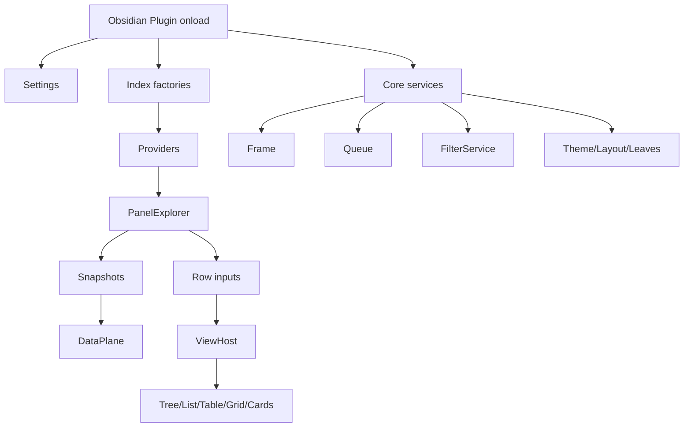
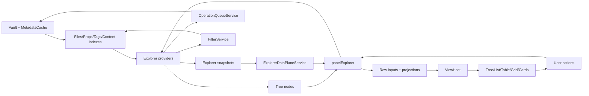

# 03 - Canary stream vertical read

## 001. Shard status

- Stream covered: current workspace `sandbox`.
- Product label observed in metadata: `1.1.0-beta.1`.
- Practical stream name used in this shard: canary.
- Why canary, not beta: the branch is local `sandbox`, ahead of `origin/sandbox`, and it carries beta metadata after the `1.1.0` mis-release repair.
- Code scope: product runtime source under `src/`.
- Excluded scope: tests, specs, build tooling, generated caches, agent docs except as source of stream intent.
- Comparison baseline: stable stream from shard 02, mainly `origin/main` / `1.0.1`.
- This shard is not a promotion recommendation.
- This shard is a factual vertical read of what the canary product actually contains today.

## 002. Executive difference

- Stable is a compact single-frame product.
- Canary is a multi-surface product shell.
- Stable centers on three pages plus direct panel state.
- Canary centers on indexes, services, providers, snapshots, row projections, render hosts, independent leaves, and richer command surfaces.
- Stable is easier to reason about because fewer layers exist.
- Canary is more expressive because the product now has a real intermediate architecture.
- Stable exposes features mostly directly from Svelte components.
- Canary exposes features through services and typed contracts.
- Stable has queue safety, but the queue is smaller and closer to UI closures.
- Canary has a transactional virtual file queue and a secondary immutable VFS chain path.
- Stable has filters as an important feature.
- Canary makes filters a cross-system source: providers, active filter index, badges, snapshots, command surfaces, and service API all depend on it.
- Stable renders file/tag/prop explorers in a mostly direct panel model.
- Canary treats explorers as providers and increasingly routes them through `ViewHost` and view contracts.
- Stable has no full data-plane boundary.
- Canary has a named `ExplorerDataPlaneService`, `ExplorerSnapshot`, row inputs, and projections.
- Stable has limited product interop with native Obsidian surfaces.
- Canary adds native tag/folder click/hover binding, plugin/snippet explorers, binding notes, Bases import, and detached leaves.
- Stable is likely safer as a release line.
- Canary is the stronger architecture direction but still transitional.

## 003. Ground truth inventory

- Current product source files observed: 271.
- Current product source LOC observed: 43,411.
- Current component count observed: 83.
- Current service count observed: 72.
- Current provider count observed: 7.
- Current type file count observed: 24.
- Stable product source files observed in shard 02: 66.
- Stable product source LOC observed in shard 02: 9,809.
- Canary is therefore roughly four times larger by product source LOC.
- The increase is not only UI.
- The increase includes actual service/data/model layers.
- The increase also includes transitional duplication and old settings residue.

## 004. Canary source distribution

- `src/api`: 1 file, 16 LOC.
- `src/badges`: 1 file, 194 LOC.
- `src/components`: 83 files, 14,427 LOC.
- `src/config`: 1 file, 99 LOC.
- `src/dev`: 1 file, 1,212 LOC.
- `src/index`: 14 files, 1,798 LOC.
- `src/logic`: 6 files, 583 LOC.
- `src/main.scss`: 1 file, 66 LOC.
- `src/main.ts`: 1 file, 415 LOC.
- `src/modals`: 5 files, 857 LOC.
- `src/pluginEntry.ts`: 1 file, 3 LOC.
- `src/providers`: 7 files, 2,240 LOC.
- `src/registry`: 2 files, 185 LOC.
- `src/services`: 72 files, 11,556 LOC.
- `src/settingsVM.ts`: 1 file, 26 LOC.
- `src/styles`: 40 files, 6,937 LOC.
- `src/svelte.d.ts`: 1 file, 7 LOC.
- `src/types`: 24 files, 2,168 LOC.
- `src/utils`: 9 files, 622 LOC.

## 005. Practical identity of the stream

- Canary is not simply "stable plus a few features".
- Canary is a different architecture stream.
- The practical shape is now a product platform for multiple explorer surfaces.
- The product appears to be migrating from panel-first UI to provider/data-plane/view-host architecture.
- The stream carries both the new model and old compatibility seams.
- The stream has more advanced internal vocabulary than stable.
- The stream has stronger contracts.
- The stream also has more places where state can drift.
- The stream has more user-facing ambitions.
- The stream has more promotion risk.

## 006. Theoretical stream role

- Canary should be the integration stream for the next product architecture.
- It should accept incomplete architecture slices while they are being reconciled.
- It should not be treated as a release baseline without explicit hardening.
- It should be compared against stable for behavior, not only for file diffs.
- It should be compared against proto for design intent, not copied blindly from proto.
- It should be compared against docs for taxonomy, not assumed to satisfy them.
- It is where new concepts can coexist before consolidation.
- It is also where "half-migrated" concepts are most visible.

## 007. Practical stream role

- Current `sandbox` is the only visible branch carrying the modern system.
- There is no visible local or remote branch named `dev`, `beta`, or `nightly`.
- The metadata says beta.
- The branch name says sandbox.
- The product architecture says canary.
- The honest operational description is:
- `sandbox` is canary code carrying beta metadata after the `1.1.0` mis-release repair.
- A user should not infer release maturity from the `1.1.0-beta.1` label alone.

## 008. Top-level runtime boot

- Canary boot begins in `pluginEntry.ts`.
- `pluginEntry.ts` imports `virtual:uno.css`.
- `pluginEntry.ts` imports `main.scss`.
- `pluginEntry.ts` exports the plugin class from `main.ts`.
- This means the runtime style path is both utility-aware and SCSS-backed.
- This is not an Uno-only product.
- This is not the stable stream's simpler CSS story.
- The plugin class lives in `src/main.ts`.
- `main.ts` is now a service composition root.
- `main.ts` constructs indexes.
- `main.ts` constructs services.
- `main.ts` registers views.
- `main.ts` registers commands.
- `main.ts` wires Obsidian lifecycle events.
- `main.ts` owns settings migration.
- `main.ts` still contains enough orchestration that it is not only a thin injector.

## 009. Boot snippet

```ts
// src/pluginEntry.ts
import 'virtual:uno.css';
import './main.scss';
export { default } from './main';
```

- This three-line entry is small, but it changes the style stream identity.
- Stable should not be described as having this exact utility import unless checked at that stream.
- Canary uses SCSS as the main product style surface while also importing Uno CSS.

## 010. Main service composition

- `main.ts` imports `PropertyIndexService`.
- `main.ts` imports `FilterService`.
- `main.ts` imports `OperationQueueService`.
- `main.ts` imports `ThemeService`.
- `main.ts` imports `ExplorerDataPlaneService`.
- `main.ts` imports `OverlayStateService`.
- `main.ts` imports `DecorationManager`.
- `main.ts` imports `ViewService`.
- `main.ts` imports `OpsLogService`.
- `main.ts` imports `LeafDetachService`.
- `main.ts` imports `NodeBindingService`.
- `main.ts` imports `NativeSurfaceBindingService`.
- `main.ts` imports `PerfMeter`.
- `main.ts` imports index factories for files, tags, props, content, operations, filters, snippets, plugins, templates.
- `main.ts` imports provider classes indirectly through frame/page construction.
- `main.ts` registers the main frame view type.
- `main.ts` registers detachable tab leaves.
- `main.ts` registers commands.
- `main.ts` restores detached leaves after layout readiness.

## 011. Boot implication

- Stable boot primarily opens a Vaultman panel.
- Canary boot constructs a product graph.
- This product graph is closer to a mini app platform inside Obsidian.
- The root plugin object is now a service locator.
- Components still receive `plugin`, but `plugin` now exposes many services.
- This reduces direct component responsibility in some areas.
- It also makes service lifecycle correctness more important.
- A broken service init can now break several surfaces at once.

## 012. Lifecycle shape

- `onload()` loads settings.
- It hydrates the theme service.
- It creates or refreshes indexes.
- It creates filter and queue services.
- It creates view and overlay services.
- It binds native surfaces.
- It registers views and commands.
- It sets command hooks for frame overlays.
- It restores independent leaves.
- `onunload()` disposes theme/perf/ops log and destroys filter service.
- Not every service has an explicit destroy path at the plugin root.
- Some services rely on Obsidian `Component` lifecycle.
- Some providers expose `destroy()`, but provider ownership is inside Svelte surfaces.

## 013. Runtime graph



- This is an inferred diagram from source structure.
- The main point is that canary is no longer a direct UI-only plugin.
- There is now an explicit middle layer between vault data and view renderers.

## 014. Main frame system

- The main item view type remains `vm-frame`.
- `VaultmanFrame` mounts `frameVaultman.svelte`.
- `frameVaultman.svelte` is still a large coordinating component.
- It is not the same kind of god component as stable.
- Its responsibilities are split across service-like helpers.
- It creates a `FrameOverlayController`.
- It creates an `AddonsIslandService`.
- It creates a `FrameNavigationService`.
- It creates a `FrameViewportController`.
- It creates a `FrameNavReorderController`.
- It creates `FramePopupsState`.
- It sets contexts for navigation and popups.
- It subscribes to filter service changes.
- It subscribes to queue service changes.
- It subscribes to leaf detach changes.
- It subscribes to metadata cache changes.
- It renders dashboard or page viewport depending on layout.

## 015. Frame mode difference from stable

- Stable frame had a more direct page switcher.
- Canary frame has two viewport modes.
- Mode one: dashboard shell.
- Mode two: single page viewport.
- Dashboard availability is calculated from viewport kind, width, and theme mode.
- Sidebar cannot show dashboard.
- Main leaf can show dashboard only outside thin mode and at width >= 800.
- This means the same plugin has different product behavior in sidebar vs main pane.
- Stable did not expose such a dashboard gate in the same architectural way.

## 016. Layout gate snippet

```ts
// src/services/serviceLayout.ts
export function resolveDashboardEnabled(input: {
  width: number;
  kind: LayoutViewportKind;
  mode: VaultmanUiMode;
}): boolean {
  if (input.kind !== 'main-leaf') return false;
  if (input.mode === 'thin') return false;
  return input.width >= 800;
}
```

- This is a product rule, not a tooling concern.
- Canary has an explicit responsive product policy.
- The dashboard is intentionally a wide/main-leaf surface.
- The stable stream should not be assumed to have this rule.

## 017. Navigation service

- `FrameNavigationService` owns active page.
- It owns top-level page order.
- It owns active tool tab.
- It owns active filter tab.
- It knows detached tab state.
- It resolves external/detached tab state.
- It handles navigation to pages.
- It exposes `openDiffIntent`.
- It supports entering and exiting Bases import.
- It supports selecting surface items.
- It provides page FAB definitions through `framePages.ts`.
- This is materially more formal than stable navigation.

## 018. Frame pages observed

- Main page: operations.
- Main page: statistics.
- Main page: filters.
- Tool page/tab: page tools.
- Queue tab/leaf.
- Explorer files tab.
- Explorer tags tab.
- Explorer props tab.
- Explorer values tab.
- Content tab.
- Explorer outline tab.
- These are canonicalized in `tabRegistry.ts`.
- Detached leaves use the same canonical `TabId` vocabulary.

## 019. Tab registry snippet

```ts
// src/registry/tabRegistry.ts
export type TabId =
  | 'explorer-files'
  | 'explorer-tags'
  | 'explorer-props'
  | 'explorer-values'
  | 'content'
  | 'explorer-outline'
  | 'page-tools'
  | 'queue';
```

- This is an important product difference.
- Canary has named inner tabs that can become independent workspace leaves.
- Stable did not have this detachable tab registry as a first-class product model.

## 020. Detached leaves

- `VaultmanTabLeafView` mounts `DetachedTabHost.svelte`.
- Each detachable tab has a view type prefix.
- Detach state is persisted through plugin data under `independentLeaves`.
- Restore is idempotent.
- Detach is delegated to host callbacks.
- Attach closes the leaf and updates persisted state.
- Not every tab must be detachable.
- The registry defines the allowable set.
- The service is product runtime, not test harness.
- Detached leaves make Vaultman closer to a workspace-native suite.

## 021. Detached leaf implication

- Stable is one panel.
- Canary can become several Obsidian leaves.
- This changes user workflow.
- It also changes state ownership.
- A filter tab can be inside the frame or detached.
- A queue tab can be inside the frame or detached.
- The frame must know when a tab is detached.
- Detached hosts need enough context to render without the original panel.
- This raises risk around duplicated subscriptions and stale provider state.

## 022. Overlay and popup system

- Canary has a `FrameOverlayController`.
- It manages active popup.
- It tracks popup open state.
- It uses `OverlayStateService` stack.
- It opens queue, filters, search, view menu, sort menu, and diff review.
- It installs command hooks into the plugin host.
- It mediates the connection between Obsidian commands and Svelte surfaces.
- Stable had popups/island concepts, but canary has more explicit controllers.
- The overlay system is one of the key practical differences.

## 023. Popup state

- `FramePopupsState` manages files used by popup actions.
- It handles scope/search/move target files.
- It creates move changes through `createMoveChanges`.
- It syncs active filter rules into popup views.
- It mediates direct UI intent into queue changes.
- This is a product logic layer, even if it lives beside frame components.

## 024. Dashboard shell

- `FrameDashboardShell.svelte` composes a three-column dashboard.
- It supplies snippets for filters, explorer, and addons.
- It reuses the same bound state that the single-page mode uses.
- It passes filter/search/sort/view/add-mode state through to filters page.
- It is not only a visual redesign.
- It reorganizes the product workflow.
- A wide main-leaf user can see multiple work surfaces simultaneously.
- A sidebar user remains in narrow navigation mode.

## 025. Canary explorer model

- Canary introduces `ExplorerProvider<TMeta>`.
- Providers return trees.
- Some providers return structural snapshots.
- Providers handle click, secondary action, context menu, hover badges, search, sort, view mode, add mode.
- The same panel shell can host files, props, tags, content, plugins, snippets, and outline-derived nodes.
- This is the largest theoretical difference from stable.
- Stable's explorer behavior is feature-specific.
- Canary's explorer behavior is provider-shaped.

## 026. Provider contract implication

- Providers are not pure data adapters.
- Providers still contain product action logic.
- Files provider can queue file deletion, append links, rename, move, and open property manager.
- Props provider can queue prop rename/delete/type/set actions and FnR handoff.
- Tags provider can queue tag rename/add/delete/set actions.
- Content provider can open files and queue file delete from content results.
- Plugins provider can toggle community plugin enabled state.
- Snippets provider can toggle CSS snippet enabled state.
- The contract is therefore a domain-controller contract.
- It is not a read-only repository abstraction.

## 027. Provider list

- `explorerFiles.ts`.
- `explorerProps.ts`.
- `explorerTags.ts`.
- `explorerContent.ts`.
- `explorerPlugins.ts`.
- `explorerSnippets.ts`.
- `explorerOutline.ts`.
- These are real canary product surfaces.
- Stable shard 02 did not have this provider family.

## 028. Files provider state

- `explorerFiles` owns search by name.
- It owns search by folder.
- It owns sort key and direction.
- It owns add mode.
- It owns show-selected-only mode.
- It owns hidden file visibility.
- It owns an adopted outline cache.
- It owns a structural cache keyed by files, sort, search, visibility, and index revisions.
- It builds file tree through `FilesLogic`.
- It decorates through `ViewService`.
- It can attach adopted children from markdown outline extraction.

## 029. Files provider action surface

- File open.
- File rename.
- File delete.
- Append links to operation scope.
- File move.
- Folder filter.
- Property manager on selected files when add mode is active.
- Set selected files into filter service.
- Open files through Obsidian workspace.
- Queue actions through `queueService`.
- This provider is a real workflow controller.

## 030. Files provider snapshot path

```ts
// src/providers/explorerFiles.ts
getSnapshot(expandedIds: ReadonlySet<string> = new Set()): ExplorerSnapshot<FileMeta> {
  return buildExplorerSnapshot({
    explorerId: this.id,
    providerKey: this.id,
    tree: this.getStructuralTree(),
    expandedIds,
    revisions: this.getStructuralRevisions(),
    projection: {
      searchTerm: this.searchName,
      searchMode: 'all',
      sortBy: this.sortBy,
      sortDirection: this.sortDir,
      sortTarget: 'top',
    },
  });
}
```

- This snippet is abbreviated to the key shape.
- It shows that files now produce an immutable-ish snapshot object.
- It is not merely returning current UI nodes.
- The provider names source revisions and projection settings.

## 031. Props provider state

- `explorerProps` wraps `PropsLogic`.
- It subscribes to `propsIndex`.
- It caches structural trees.
- It supports search all/leaf.
- It supports sort by name/count.
- It supports sort target top/children.
- It supports add mode.
- It decorates rows through `ViewService`.
- It uses Iconic icons when available.
- It surfaces conflict badges for incompatible types.
- It supports prop and value nodes as distinct node kinds.

## 032. Props provider actions

- Rename property.
- Delete property.
- Change property type.
- Set property on operation-scope files.
- Create/open binding note.
- Rename value.
- Delete value.
- Set value on filtered/selected scope.
- Toggle filter by property.
- Toggle filter by specific value.
- Open content search for a prop/value term.
- Handoff rename to FnR island when option exists.
- This is far beyond stable's direct prop panel behavior.

## 033. Props operation scope

- Props provider uses `resolveOperationScopeFiles`.
- It reads `filterService.filteredFiles`.
- It reads `filterService.selectedFiles`.
- It reads `settings.explorerOperationScope`.
- This means property mutations are scoped by product-level operation policy.
- The provider is not simply mutating all vault files.
- This is an important safety improvement.
- It is also a source of risk if UI communicates the wrong scope to users.

## 034. Tags provider state

- `explorerTags` wraps `TagsLogic`.
- It subscribes to `tagsIndex`.
- It supports leaf mode.
- It supports search.
- It supports sort.
- It supports add mode.
- It decorates through `ViewService`.
- It uses Iconic tag icons when available.
- It reports source revision from `tagsIndex`.
- It can produce an `ExplorerSnapshot`.

## 035. Tags provider actions

- Rename tag.
- Set tag on operation-scope files.
- Create/open binding note.
- Delete tag.
- Toggle tag filter.
- Open content search for tag.
- Add tag in add mode.
- Handoff tag rename to FnR island when option exists.
- It uses `serviceTagQueue` builders.
- This gives canary a more complete tag workflow than stable.

## 036. Content provider state

- `explorerContent` groups `contentIndex` matches by file path.
- Each file result becomes a parent node.
- Each match becomes a child node.
- It subscribes to `contentIndex`.
- It can return files represented by current content matches.
- It decorates file rows through `ViewService`.
- It exposes file context menu actions.
- It can queue file deletes from content search results.
- It opens matches by opening the file, not jumping line-specific in observed code.

## 037. Plugins and snippets providers

- `explorerPlugins` reads `pluginsIndex`.
- It can toggle community plugins through Obsidian internals.
- It prevents Vaultman from disabling itself.
- It supports binding notes for plugins.
- `explorerSnippets` reads `cssSnippetsIndex`.
- It can toggle CSS snippets.
- It supports binding notes for snippets.
- These providers move Vaultman beyond PKM metadata into Obsidian environment management.
- That is a meaningful product expansion.
- It also increases permission/risk expectations.

## 038. Outline provider

- `explorerOutline.ts` builds adopted outline nodes from markdown content.
- It parses headers.
- It parses tasks.
- It parses block IDs.
- It attaches children under headers.
- `explorerFiles` can adopt these children under file nodes when adoption service is enabled.
- This means files can expand into intra-file structure.
- Stable did not have this kind of file-child adoption system.

## 039. Data indexes

- Canary uses generic `createNodeIndex`.
- Indexes expose `nodes`.
- Indexes expose `flatIds`.
- Indexes expose `revision`.
- Indexes support async `refresh`.
- Indexes support subscription.
- Indexes support `byId`.
- Indexes support a normalized search buffer.
- The index layer is a clear canary architectural asset.

## 040. Generic node index snippet

```ts
// src/index/indexNodeCreate.ts
export function createNodeIndex<TNode extends NodeBase>(
  opts: NodeIndexOptions<TNode>,
): INodeIndex<TNode> {
  let _nodes: TNode[] = [];
  let _flatIds: string[] = [];
  let _byId = new Map<string, TNode>();
  let _searchById = new Map<string, string>();
  const subs = new Set<() => void>();
  let refreshVersion = 0;
  let publishedRevision = 0;
}
```

- This is a core difference from stable.
- Canary has revisioned indexes that can feed cache invalidation.
- The presence of `refreshVersion` shows protection against stale async refresh publication.
- Search buffers are precomputed.

## 041. Files index

- Files index maps vault files into `FileNode`.
- It uses `vault.getFiles` when available.
- It falls back to `getMarkdownFiles`.
- This broadens the product beyond markdown-only file lists when Obsidian exposes all files.
- It includes path/basename/extension/stat/file in nodes.
- This is important for images/media/grid/card ambitions.

## 042. Props index

- Props index scans markdown frontmatter.
- It counts property frequencies.
- It extracts value frequencies.
- It marks property types.
- It provides the prop/value basis for explorer props.
- It is still a frontmatter-driven model.
- It is not a full Dataview or Bases runtime.

## 043. Tags index

- Tags index prefers metadata cache tags.
- It has fallback scanning.
- It produces tag nodes with counts.
- It is a source for tags provider.
- Tag operations still route through queue builders rather than direct mutation.

## 044. Content index

- Content index performs async chunked content search.
- It uses `ServiceCache`.
- It tracks status.
- It has refresh version cancellation.
- It uses `cachedRead`.
- It processes chunks of 20.
- It publishes incrementally every 100 files or 250ms.
- It supports active perf probe measurement.
- This is a large product difference.
- Stable did not have this current content-search index design in the observed baseline.

## 045. Operations index

- Operations index derives `QueueChange` nodes from queue transactions.
- This lets the queue become an explorer-like data source.
- Operations can be rendered with the same view/decorations stack.
- This moves queued state into the same index vocabulary as files/tags/props.

## 046. Active filters index

- Active filters index flattens filter tree and search filter rules.
- It produces active filter entries.
- It lets filters be represented as nodes.
- It lets badges and overlays refer to active filters consistently.
- This is important because filters are no longer only UI state.

## 047. Explorer data plane

- `ExplorerDataPlaneService` is small but important.
- It stores snapshots by explorer ID.
- It stamps monotonically increasing revision counters.
- It publishes snapshots.
- It lets subscribers listen per explorer.
- It can clear a snapshot.
- It currently appears primarily wired for files snapshots.
- It is therefore an architecture foundation more than a fully universal data plane.

## 048. Data-plane snippet

```ts
// src/services/serviceExplorerDataPlane.svelte.ts
publish<TMeta = unknown>(explorerId: string, snapshot: ExplorerSnapshot<TMeta>): void {
  const nextRevision = (this.#counters.get(explorerId) ?? 0) + 1;
  this.#counters.set(explorerId, nextRevision);
  const stamped: ExplorerSnapshot<TMeta> = {
    ...snapshot,
    revision: nextRevision,
    structureRevision: nextRevision,
  };
  this.#snapshots.set(explorerId, stamped);
  this.#fire(explorerId);
}
```

- The service overwrites snapshot revision and structure revision with its own counter.
- This is simple and predictable.
- It also means source revisions inside the snapshot are separate from data-plane publication revision.
- Consumers must not confuse `structureRevision` with vault/index revision.

## 049. Explorer snapshot type

- Snapshot rows include stable IDs.
- Snapshot rows include parent ID.
- Snapshot rows include node.
- Snapshot rows include depth.
- Snapshot rows include index.
- Snapshot rows include domain key.
- Snapshot rows include optional path/folder path.
- Snapshot includes `visibleIds`.
- Snapshot includes `byId`.
- Snapshot includes source revisions.
- Snapshot includes projection settings.
- Snapshot includes reveal targets.
- This is a real intermediate product model.

## 050. Projection model

- `serviceExplorerProjection.ts` creates projections from row inputs.
- It supports tree/list/table/grid/card style renderers.
- It creates `visibleIds`.
- It creates `idToIndex`.
- It creates `indexToId`.
- It carries media descriptors.
- It stamps source revision and layout revision.
- It does not itself compute domain filtering.
- It assumes row inputs are already prepared.

## 051. Projection snippet

```ts
// src/services/serviceExplorerProjection.ts
export function createExplorerProjection<TMeta = unknown>({
  providerId,
  viewMode,
  rowInputs,
  sourceRevision,
  layoutRevision = sourceRevision,
}: ExplorerProjectionInput<TMeta>): ExplorerProjection<TMeta> {
  const rowCount = rowInputs.length;
  const rows: ExplorerProjectionRow<TMeta>[] = [];
  const visibleIds: string[] = [];
}
```

- This is not stable stream behavior.
- Canary is building a render-ready projection separate from provider tree.
- The practical value is keyboard, reveal, virtualization, and multiple renderer consistency.
- The practical risk is duplicated paths while old tree renderers remain active.

## 052. PanelExplorer as transitional center

- `panelExplorer.svelte` lives under `src/components/containers`.
- It is still a very large component.
- It receives a provider.
- It receives view mode.
- It receives plugin.
- It derives nodes from provider.
- It publishes files snapshots when provider supports it.
- It creates tree projections.
- It creates list projections.
- It creates table rows and columns.
- It manages selection state.
- It manages keyboard navigation.
- It handles row actions.
- It handles context menus.
- It handles hover badges.
- It handles delete conflict routing through queue service.
- It renders `ViewHost`.
- It is therefore a strangler facade: new data-plane/view architecture is routed through an old large shell.

## 053. PanelExplorer practical reading

- Canary has not finished extracting panel behavior.
- Provider logic is separated.
- View rendering is separated.
- Selection service is separated.
- Keyboard controller is separated.
- Data-plane snapshot service is separated.
- But `panelExplorer.svelte` still coordinates all of them.
- It remains a high-risk integration point.
- Bugs in this file can affect every explorer provider.
- Promotion from canary should treat this file as critical.

## 054. Snapshot publish path in panel

```ts
// src/components/containers/panelExplorer.svelte
if (provider.id !== 'files' || !service || !provider.getSnapshot) return;
const snapshot = provider.getSnapshot(expandedIds);
const key = snapshotPublishKey(snapshot);
if (key === lastSnapshotKey) return;
lastSnapshotKey = key;
service.publish('files', snapshot);
```

- This observed path is files-specific.
- The architecture is general.
- The current implementation is not yet general for every provider.
- This is an honest canary-state gap.

## 055. ViewHost system

- `ViewHost.svelte` is the render switch.
- It owns or inherits `ViewHostService`.
- It sets contexts for preset, view host, and node element mask.
- It normalizes selectable view modes from theme preset capabilities.
- It renders tree.
- It renders list.
- It renders table.
- It renders grid.
- It renders cards.
- It does not render markmap in `ViewHost`.
- Markmap is handled separately in `panelExplorer`.
- This split shows transitional state.

## 056. View modes

- Tree view exists.
- List view exists.
- Table view exists.
- Grid view exists.
- Cards view exists.
- Markmap view exists but is outside the main platform view host path.
- View contract names platform modes separately.
- Theme presets can allow/lock modes.
- Node element visibility can be preset-driven.
- This is a major product expansion over stable.

## 057. ViewHost snippet

```svelte
<!-- src/components/explorer/ViewHost.svelte -->
{#if renderedViewMode === 'tree'}
  <ViewTree ... />
{:else if renderedViewMode === 'list'}
  <ViewNodeList ... />
{:else if renderedViewMode === 'table'}
  <ViewNodeTable ... />
{:else if renderedViewMode === 'grid'}
  <ViewNodeGrid ... />
{:else if renderedViewMode === 'cards'}
  <ViewNodeCards ... />
{/if}
```

- This is the visible manifestation of the new architecture.
- Multiple views consume a common package of row inputs, projections, selection, actions, and theme service.
- Stable did not route product explorers through this kind of host.

## 058. ViewService

- `ViewService` builds render models.
- It owns selection service.
- It tracks view mode per explorer.
- It tracks expanded IDs per explorer.
- It subscribes per explorer.
- It builds operation overlay indexes.
- It builds active filter overlay indexes.
- It caches semantic layers.
- It merges decoration-manager layers with operation/filter layers.
- It emits selection/focus state into rows.
- It has virtualization defaults in render model.
- It is the core semantic decoration service.

## 059. ViewService cache implication

- Canary is responding to performance pressure.
- The semantic layer cache max is 5000 entries.
- Cache keys include explorer ID, mode, revisions, decoration revision, matched-filter flag, node ID, label, and context.
- This is a more mature rendering system than stable.
- It is also more sensitive to revision correctness.
- If a provider omits a revision, stale decoration may occur.
- If a context is unstable, cache churn may occur.

## 060. ViewService snippet

```ts
// src/services/serviceViews.svelte.ts
const rows = input.nodes.map((node) =>
  this.toRow(input, node, selection, opIndex, filterIndex, showMatchedFilterDecorations),
);
```

- The important point is not the loop.
- The important point is that every node is passed through the same operation/filter/decoration projection.
- This is the cross-provider visual consistency layer.

## 061. Selection service

- `NodeSelectionService` stores selection by explorer ID.
- It supports pointer selection.
- It supports additive selection.
- It supports range selection.
- It supports box selection.
- It supports focus movement.
- It supports toggling focused item.
- It supports hovered state.
- It prunes selection against visible IDs.
- It returns snapshots.
- It is implemented with `SvelteMap` and `SvelteSet`.
- It is used by `ViewService` and `panelExplorer`.

## 062. Selection difference from stable

- Stable selection existed but was more localized.
- Canary selection is a service with per-explorer identity.
- This makes multi-view and detached-leaf behavior more feasible.
- It also means provider ID stability matters.
- If provider IDs change, selection state is lost.
- If visible ID sets drift, pruning can drop selection.

## 063. Keyboard navigation

- `createKeyboardNav` supports linear topology.
- It supports planar topology.
- It supports planar-drill topology.
- It supports arrow keys.
- It supports Home and End.
- It supports PageUp and PageDown.
- It supports typeahead.
- It supports Ctrl/Cmd+A selection.
- It supports Shift range selection.
- It supports Enter activation.
- It supports Space toggle selection.
- It supports grid drill/back/forward/up navigation.
- This is a serious product interaction layer.

## 064. Keyboard implication

- Canary is aiming for tool-grade navigation.
- The product is not only mouse-driven.
- The UI should be evaluated for keyboard workflow.
- Promotion criteria must include keyboard behavior across tree/list/table/grid/cards.
- Stable cannot be used as the full interaction baseline for this stream.

## 065. FilterService

- `FilterService` owns an active filter tree.
- It uses Svelte runes state.
- It exposes `selectedFiles`.
- It derives `filteredFiles`.
- It subscribes to `filesIndex`.
- It evaluates filters through `evalNode`.
- It also applies search-name and search-folder filters.
- It can add and remove nodes.
- It can remove by property.
- It can remove by tag.
- It can clear all.
- It can load templates.
- It can produce flat rules for island display.
- It can toggle or delete rules.
- It can set selected-file filters.
- It is central to current product behavior.

## 066. FilterService snippet

```ts
// src/services/serviceFilter.svelte.ts
activeFilter = $state<FilterGroup>({
  type: 'group',
  logic: 'and',
  children: [],
  id: 'root',
  enabled: true,
});
selectedFiles = $state<TFile[]>([]);
filteredFiles = $derived.by(() => this.computeFiltered());
```

- This is the state root for canary filtering.
- Stable has filters, but canary uses this as cross-system service state.

## 067. Filter computation

- All files come from `filesIndex.nodes`.
- If active filter has no children, base is all files.
- If active filter has children, `evalNode` returns matching paths.
- Search name is ANDed with the filter tree result.
- Search folder is ANDed with the filter tree result.
- Output is sorted by basename with base sensitivity.
- This means the search bar can be a filter contributor, not only a visual filter.
- Search filter rules are exposed for active filter display.

## 068. Filter rule vocabulary

- `has_property`.
- `missing_property`.
- `specific_value`.
- `has_tag`.
- `file_name`.
- `file_path`.
- `folder`.
- `file_folder`.
- This vocabulary matters because Bases import and active filter presentation map into it.

## 069. Active filters UX

- Active filters can be flattened for island view.
- Rules can be toggled.
- Rules can be deleted.
- Search filters appear as synthetic rules.
- Selected files can become a synthetic OR group.
- Folder context menu can add a folder rule.
- Prop/tag clicks toggle corresponding rules.
- Canary therefore has a more integrated filter UX than stable.

## 070. Operation queue

- `OperationQueueService` is 950 lines.
- It extends Obsidian `Component`.
- It implements `IOperationQueue`.
- It stores per-file transactions in a `SvelteMap`.
- It stores immutable VFS chains in a second `SvelteMap`.
- It exposes `pending` as a derived snapshot from staged transactions.
- It exposes `queue` as a back-compat shim.
- It supports add, addAsync, addBatch.
- It translates `PendingChange` objects into staged operations.
- It can remove logical ops.
- It can remove per-file ops.
- It can replay transaction ops.
- It can execute all pending changes.
- It can bind ops to UI nodes for delete conflict workflows.
- It can simulate changes.

## 071. Queue theoretical difference

- Stable had a queue safety model.
- Canary has a stronger virtual file transaction model.
- A queued change is not only an item in a list.
- It becomes staged operations against virtual file state.
- The queue can preserve per-file before/after.
- The queue can group logical operations across files.
- The queue can hydrate file body only when necessary.
- This is a product-grade queue architecture.

## 072. Queue VFS snippet

```ts
// src/services/serviceQueue.svelte.ts
readonly transactions = new SvelteMap<string, VirtualFileState>();
readonly chains = new SvelteMap<string, VfsChain>();
```

- `transactions` is the current mutable source of truth.
- `chains` is a parallel immutable path.
- The source comment says the mutable path stays canonical until strangler cutover.
- This is honest evidence of transition.

## 073. Queue staged operation types

- Delete property.
- Reorder properties.
- Rename file.
- Move file.
- Delete file.
- Find/replace content.
- Append links.
- Apply template.
- Native rename property.
- Tag set/delete/add.
- Generic set property.
- These map to `PendingChange` shapes from providers and modals.

## 074. Queue commit behavior

- `execute()` creates a long-lived notice.
- It processes transactions in chunks of 20.
- It calls `commitFile`.
- It clears transactions after processing.
- It emits changed.
- It reports success or errors through `serviceMessage`.
- `commitFile` uses `trashFile` for deleted files.
- `commitFile` uses `vault.process` for content/frontmatter mutation.
- `commitFile` renames file after processing if new path exists.
- This is a much more comprehensive write path than simple immediate frontmatter mutation.

## 075. Queue safety strengths

- Changes are staged before execution.
- Body hydration is lazy.
- Frontmatter split uses Obsidian cache positions when available.
- YAML parse fallback is defensive.
- Queue can drop conflicting ops before delete.
- Queue can simulate changes.
- Queue groups pending logical changes by change ID.
- Queue exposes `processAll` and `clearAll` command vocabulary.

## 076. Queue risks

- `add(change)` is fire-and-forget and catches errors through message service.
- Some provider calls do `void queueService.add(...)`, but `add` itself returns void.
- Consumers may assume queued synchronously when ingestion may still be running.
- Native rename probing calls `logicFunc` against a sample empty frontmatter object.
- Immutable chain path coexists but is not canonical.
- Back-compat `queue` can hide transactional complexity.
- Promotion should inspect race behavior around rapid adds and immediate UI reads.

## 077. Service API

- `ServiceAPI` exposes read, plan, and enqueue.
- It reads index health.
- It summarizes operation scope.
- It validates changes.
- It marks destructive risk.
- It requires confirmation for destructive plans.
- It enqueues through queue service.
- It reports rollback limits.
- It returns counts and affected paths.
- It is product-facing infrastructure for automation or external callers.
- Stable did not have this observed service API layer.

## 078. Service API honesty

- The API is useful but still shallow.
- It counts nodes and queue state.
- It validates file targets.
- It does not deeply validate every operation semantic.
- It reports affected node IDs as empty.
- It cannot rollback after execution beyond manual Obsidian/file history.
- It is a planning/enqueue facade, not a full transaction coordinator.

## 079. Commands

- Canary registers a multifacet command set.
- Command IDs include `open-filters`.
- Command IDs include `open-queue`.
- Command IDs include `process-queue`.
- Command IDs include `open-view-menu`.
- Command IDs include `open-sort-menu`.
- Command IDs include `open`.
- Command IDs include `open-diff`.
- Command IDs include `open-find-replace-active-explorer`.
- Commands use `checkCallback` where availability matters.
- Commands emit performance records through `PerfMeter`.
- This is a concrete product upgrade from stable's simpler command behavior.

## 080. Command host shape

- Commands need `activateView`.
- Commands optionally need `toggleView`.
- Commands need `getVaultmanLeaf`.
- Commands can open filters popup.
- Commands can open queue popup.
- Commands can open view and sort menus.
- Commands can open diff view.
- Commands can resolve active FnR island.
- Commands can focus first panel node after open.
- This is strong evidence that canary is command-palette integrated.

## 081. Theme service

- `ThemeService` owns active preset ID.
- It owns custom presets.
- It owns UI mode.
- It owns identity.
- It owns faint mode.
- It owns reduced motion.
- It owns window focus.
- It owns foul detection.
- It derives active preset.
- It derives root classes.
- It can register/update/unregister custom presets.
- It hydrates from elastic UI settings.
- It injects custom CSS variables into document head.
- Stable did not have this full theme identity system in the observed baseline.

## 082. Theme root classes

```ts
// src/services/serviceTheme.svelte.ts
const out = [
  'vm-root',
  `vm-mode-${this.mode}`,
  `vm-id-${this.identity}`,
  `vm-theme-${this.#cssEscape(this.activePresetId)}`,
];
```

- This makes UI mode and identity runtime classes.
- Product design is now encoded as a theme service.
- This connects directly to layout behavior, because thin mode disables dashboard.

## 083. Settings state

- `typeSettings.ts` is much larger than stable settings.
- It includes toolbar search mode.
- It includes island outside-click behavior.
- It includes faint accent behavior.
- It includes elastic UI settings.
- It includes explorer decorations.
- It includes backgrounds.
- It includes borders.
- It includes content search.
- It includes operation scope.
- It includes hidden files.
- It includes folders first.
- It includes manual drag/drop.
- It includes mouse gestures.
- It includes node mouse actions.
- It includes layout.
- It includes view field visibility.
- It includes independent leaves.
- It includes binding note folder.
- It includes FnR regex defaults.
- It still includes Bases settings.
- It also has a comment that later settings are "not used".

## 084. Settings honesty

- The settings file is both current and historical.
- Some settings are active product behavior.
- Some are compatibility residue.
- The comment marking unused settings is a warning sign.
- Promotion should separate active settings from legacy settings.
- Docs should not imply every setting field is active.

## 085. Bases interop

- `serviceBasesInterop.ts` parses Bases YAML.
- It extracts fenced `bases` code blocks.
- It can find view filters by target view name.
- It converts a subset of Bases filter expressions.
- It supports equality on non-file fields.
- It supports `file.name.contains`.
- It supports `file.folder.contains`.
- It supports `file.path.contains`.
- It supports `file.hasTag`.
- It supports `file.inFolder`.
- It reports unsupported expressions.
- It preserves unsupported expression reports.
- It combines global and view filters.
- This is an importer/preview layer, not a full Bases engine.

## 086. Bases interop honesty

- The canary stream has Bases-facing code.
- It does not implement full Obsidian Bases semantics.
- It supports a deliberately limited expression subset.
- It produces reports for unsupported expressions.
- It maps into Vaultman filter rules.
- Therefore "Bases integration" should be described as import/interop preview, not complete Bases parity.

## 087. Node binding system

- `NodeBindingService` binds non-file nodes to notes.
- It computes alias tokens.
- Prop token format is `[propname]`.
- Tag token format is `#tagname`.
- Snippet token format is `$snippetname`.
- Plugin token format is `%pluginid`.
- Folder/value/template token is label.
- It searches `aliases` frontmatter.
- With zero matches, it creates a note in configured folder.
- With one match, it opens the note.
- With multiple matches, it routes to filter and shows a warning.
- This is a new product capability beyond stable.

## 088. Binding note implications

- Props, values, tags, plugins, snippets, and native surfaces can become note-linked concepts.
- Vaultman is not only managing metadata.
- It is making metadata nodes first-class PKM objects.
- This has strong product value.
- It also requires clear user communication around alias token conventions.
- If users manually create conflicting aliases, binding routes to filter.

## 089. Native surface binding

- `NativeSurfaceBindingService` listens for click, auxclick, and mouseover.
- It recognizes Obsidian tag selectors.
- It recognizes folder selectors.
- Ctrl/meta/alt/middle click can trigger binding.
- Mouseover can trigger hover-link when one alias match exists.
- It registers a hover link source.
- This bridges Vaultman concept notes into native Obsidian UI.
- Stable did not have this observed native binding layer.

## 090. Native binding risk

- Native selectors can break across Obsidian versions.
- The service watches real DOM selectors.
- It is inherently more brittle than plugin-owned Svelte DOM.
- It is valuable, but needs manual verification across Obsidian UI variants.
- This is a canary-grade feature until hardened.

## 091. Addons island

- `AddonsIslandService` has active panes `stats` and `markdown`.
- It can open a note path in markdown pane.
- It can show stats.
- It can launch Obsidian quick switcher.
- It waits for file-open selection with timeout.
- It records quick switcher errors.
- This makes the dashboard/addons area interactive.
- It is another example of canary integrating with Obsidian commands.

## 092. Plugin and snippet management

- Canary can list community plugins.
- Canary can toggle community plugins.
- Canary can list CSS snippets.
- Canary can toggle CSS snippets.
- It protects itself from self-disable.
- This extends product scope beyond vault content.
- The user-facing product now crosses into workspace configuration.
- That should be considered a stream-scope expansion.

## 093. Operation scope system

- Multiple providers call `resolveOperationScopeFiles`.
- The service API calls `resolveVerifiedOperationScopeFiles`.
- Operation scope can be selected, filtered, or automatic.
- This is a safety abstraction.
- It centralizes which files a queued action targets.
- It is one of the canary improvements that should be preserved in future stable promotion.

## 094. View field visibility

- Settings include visible fields.
- Table/card/grid renderers receive `visibleFields`.
- `ViewHostService` computes node element masks from theme preset and overrides.
- Users can toggle node elements unless preset locks visibility.
- This means canary views are configurable at a deeper level than stable.
- It also means renderer consistency depends on shared node element masking.

## 095. Decoration system

- `DecorationManager` decorates nodes using context.
- It adds property type icons.
- It adds tag icons.
- It adds file/folder/image icons.
- It adds highlights for search query.
- It subscribes listeners.
- `ViewService` merges decoration layers with semantic operation/filter layers.
- This is cleaner than each provider manually deciding all visual state.

## 096. Overlay projection

- `ViewService` builds operation overlay indexes.
- It builds active filter overlay indexes.
- It projects overlay layers onto nodes.
- This means queued operations and active filters can be shown consistently as badges/highlights/classes.
- The stable stream had badges/diff indicators, but canary makes this a generalized view-layer model.

## 097. Manual drag/drop

- Settings include manual DnD.
- `ViewHost` accepts `manualDndEnabled`.
- Grid view receives `onManualDrop`.
- Services include `serviceDnd`, `serviceDndAliasAware`, `serviceDndSvelteAdapter`, and `serviceManualDnd`.
- This indicates drag/drop is a product system.
- I did not deep-read every DnD implementation for this shard.
- It remains in the canary coverage ledger for later delta matrix or promotion spec.

## 098. Content/rendering design state

- Canary includes table renderer.
- Canary includes list renderer.
- Canary includes grid renderer.
- Canary includes cards renderer.
- Canary includes tree renderer.
- Canary includes markmap renderer.
- View modes are constrained by presets and contracts.
- The rendering system is significantly more ambitious than stable.
- The product state is not final because markmap sits outside `ViewHost` and provider snapshot publication is files-focused.

## 099. Current vertical data flow

- Obsidian vault and metadata cache feed indexes.
- Indexes feed services and providers.
- Providers produce trees and sometimes snapshots.
- `panelExplorer` refreshes provider trees.
- `panelExplorer` publishes file snapshots.
- Snapshots feed data-plane and projections.
- Row inputs feed `ViewHost`.
- `ViewHost` picks concrete view renderer.
- Renderers dispatch user actions back to `panelExplorer`.
- `panelExplorer` calls provider handlers, queue, selection, keyboard, or context menu.
- Providers and services mutate filter state, queue state, or Obsidian state.
- Queue executes mutations through Obsidian file APIs.

## 100. Canary data flow diagram



- This diagram is source-inferred.
- It captures the current mixed model.
- It intentionally shows both direct tree path and snapshot/data-plane path.

## 101. Product system state matrix

- Boot/composition: advanced but still centralized in `main.ts`.
- Frame/navigation: decomposed but still frame-centric.
- Dashboard: real and responsive, gated by mode/viewport.
- Detachable leaves: implemented with persistent state.
- Providers: implemented for seven domains.
- Data plane: implemented, currently strongest for files.
- View host: implemented for platform modes except markmap split.
- Selection: implemented as per-explorer service.
- Keyboard: implemented with linear/planar/drill topology.
- Filters: implemented as central filter tree service.
- Queue: implemented as transactional VFS staging service.
- Service API: implemented as read/plan/enqueue facade.
- Theme/layout: implemented as runtime identity and preset system.
- Binding notes: implemented for non-file nodes.
- Native surface binding: implemented but selector-brittle.
- Bases interop: implemented as subset importer/preview.
- Plugin/snippet management: implemented as environment-management providers.
- Content search: implemented as async chunked index/provider.
- DnD/manual interactions: present, not deeply covered in this shard.

## 102. Stable-to-canary practical deltas

- LOC and file count increased dramatically.
- Runtime boot moved from page setup to service graph setup.
- Single panel became frame plus detachable leaves.
- Direct explorer panels became providers.
- Simple view rendering became view host plus render contracts.
- Filter state became central service plus active filter index.
- Queue became virtual-file transactional staging.
- Theme became an explicit service with modes, identity, and presets.
- Layout became an explicit product policy.
- Commands became a substantial palette surface.
- Data plane appeared.
- Service API appeared.
- Native surface integration appeared.
- Bases interop appeared.
- Plugin/snippet toggling appeared.
- Binding notes appeared.

## 103. Stable-to-canary theoretical deltas

- Stable theory: small Obsidian-native assistant panel for managing vault metadata.
- Canary theory: Obsidian workspace-native metadata/structure operating system.
- Stable theory: features can live close to components.
- Canary theory: features need durable services and typed contracts.
- Stable theory: a queue can protect risky operations.
- Canary theory: every user intent should be plan/stage/render/reviewable.
- Stable theory: filters and explorers are pages.
- Canary theory: filters, operations, files, tags, props, content, plugins, snippets are node domains.
- Stable theory: UI is a fixed product surface.
- Canary theory: UI is a set of surfaces that can dock, detach, and change renderer.

## 104. Canary strengths

- Much stronger domain vocabulary.
- Real provider abstraction.
- Real service graph.
- Real transactional queue.
- Better operation-scope discipline.
- Better keyboard interaction architecture.
- Better view-mode architecture.
- Better decoration/overlay architecture.
- Better command-palette integration.
- Better Obsidian workspace integration.
- Better path toward future product growth.
- More room to align with proto design without rewriting everything.
- A first-class badge taxonomy and diagnostic ops-log surface.
- A richer FnR model that can bridge content replacement and rename handoffs.
- Diff modes for whole-file, selected-operation, and immutable-snapshot review.

## 105. Canary weaknesses

- Transitional duplication remains.
- `panelExplorer.svelte` is still too central.
- Data-plane publication appears files-first.
- Markmap is not fully inside ViewHost.
- Settings contain active and inactive fields together.
- `main.ts` remains a large composition root.
- Native DOM bindings are brittle.
- Queue has mutable and immutable VFS paths coexisting.
- Provider classes mix data reading, UI action dispatch, and queue construction.
- Some async queue adds can be fire-and-forget.
- Product scope expanded into plugins/snippets without obvious release-tier separation.
- FnR has a broad syntax surface where not every syntax can perform content replacement.
- Diff has both mutable and immutable VFS consumers, which is powerful but transitional.
- Ops log is an in-memory diagnostic surface, not a persistent audit trail.

## 106. Honest canary maturity

- Canary is not a throwaway prototype.
- Canary is not stable either.
- It has many production-grade architectural pieces.
- It also has many in-progress seams.
- It should not be collapsed into "1.1 beta is just the next stable".
- The better label is "modern architecture integration stream".
- Release readiness depends on reconciliation, not on feature presence.

## 107. Promotion risks

- State sync between provider tree, snapshot, projection, and renderer.
- Consistent selection behavior across view modes.
- Detached leaf lifecycle and duplicate subscriptions.
- Queue UI showing changes before async ingestion finishes.
- Context menu action correctness across selected multi-node actions.
- Operation scope clarity for destructive actions.
- Native binding selectors across Obsidian versions.
- Theme preset restrictions hiding available view modes unexpectedly.
- Settings migration from stable users with legacy fields.
- Plugin/snippet toggles changing environment state unexpectedly.
- Bases import overpromising support for expressions it cannot convert.

## 108. Promotion criteria

- Every provider must document whether it supports snapshot/data-plane path.
- `panelExplorer` should have a smaller responsibility set or explicit ownership map.
- Markmap should either enter the ViewHost contract or be documented as special.
- Settings should mark active/legacy fields explicitly.
- Queue async add semantics should be audited.
- Native surface binding should be feature-gated or version-tested.
- Operation-scope UX should be explicit before destructive queue actions.
- Service API should define affected node IDs or document that they are unavailable.
- Detached leaves should be verified for restore, attach, close, and state persistence.
- Plugin/snippet management should have user-risk framing.

## 109. Systems that should be preserved from canary

- Revisioned node indexes.
- Provider contract.
- Operation scope resolver.
- Transactional queue model.
- Active filter tree service.
- View service decoration layers.
- Selection service.
- Keyboard navigation controller.
- Theme service.
- Layout service.
- Detached leaf service.
- Binding note service.
- Bases unsupported-expression reporting.
- Service API plan/enqueue shape.
- FnR syntax/options model, after clarifying which syntaxes can mutate content.
- Badge taxonomy and contradiction detection.
- Diff view shape shared by mutable queue and immutable snapshot paths.
- Ops log as a diagnostic view, with honest non-persistent framing.

## 110. Systems that should be simplified before promotion

- `panelExplorer.svelte` orchestration.
- Mixed snapshot/direct tree rendering path.
- Old settings residue.
- Queue mutable/immutable dual path.
- Providers as action/data mega-controllers.
- FnR service and FnR island service ownership split.
- Frame component state binding density.
- Popups state entanglement with frame.
- Native DOM selector assumptions.
- Plugin/snippet provider risk boundary.

## 111. System-by-system current state

- Files explorer: advanced, high-value, central, snapshot-aware.
- Tags explorer: advanced, providerized, queue-aware.
- Props explorer: advanced, providerized, FnR-aware, action-heavy.
- Content explorer: useful, index-driven, less interaction-complete.
- Plugins explorer: implemented, product-scope expanding.
- Snippets explorer: implemented, product-scope expanding.
- Outline/adoption: implemented as parser/adopted children, likely still experimental.
- Queue page: backed by strong service, UI not deep-read in this shard.
- Filters page: backed by strong service, integrated into frame/dashboard.
- Operations/statistics pages: present, not the central focus of this shard.
- Page tools: present as detachable tool tab, not deep-read here.

## 112. User-facing consequence

- In stable, a user learns one panel.
- In canary, a user learns a workspace suite.
- In stable, changing a prop/tag/file feels like a panel action.
- In canary, changing a prop/tag/file is an operation-scope, queue, badge, filter, and view-layer action.
- In stable, UI mode is mostly visual.
- In canary, UI mode changes available surfaces.
- In stable, command palette support is simpler.
- In canary, command palette becomes a workflow entry point.

## 113. Design-adjacent consequence

- Proto design cannot be copied into stable directly.
- Proto design maps better to canary because canary has dashboard, multiple views, tabs, detached leaves, and theme identity.
- However proto design must respect current provider/data-plane constraints.
- The canary stream is the place where design and systems can meet.
- The stable stream is the place where proven behavior should remain clean.

## 114. Code smell ledger

- `typeSettings.ts` contains an explicit "not used" boundary.
- `panelExplorer.svelte` remains very large.
- Snapshot publishing is files-specific despite generic data-plane types.
- Markmap is outside `ViewHost`.
- Providers own both read model and mutations.
- Native surface binding uses selector lists.
- Queue has two VFS models.
- `main.ts` performs broad orchestration.
- Some provider methods call queue add without awaiting ingestion.
- Some product areas are named as future phases in comments.

## 115. Good architecture ledger

- Index revision counters.
- Provider snapshots.
- Row projections.
- Central selection service.
- Central keyboard controller.
- Semantic layer cache.
- Operation/filter overlay projection.
- Transactional queue.
- Scope resolver.
- Detached leaf service.
- Theme root classes.
- Layout rule functions.
- Commands host contract.
- Service API risk classification.
- Bases unsupported reporting.

## 116. Canary vs tag `1.1.0`

- Tag `1.1.0` is not the same as current canary.
- Current canary metadata is `1.1.0-beta.1`.
- Tag `1.1.0` was identified in earlier stream docs as incident/mis-release related.
- Current canary includes post-repair beta metadata.
- Therefore do not treat tag `1.1.0` as the clean canary head.
- Do not treat current canary as proven release only because its architecture is richer.

## 117. Canary vs stable release branch

- Stable release branch is much smaller.
- Stable release branch is easier to audit.
- Stable release branch is the likely user-safe line.
- Canary is where systems are being reconciled.
- Stable should receive only carefully promoted slices.
- Canary should retain source detail until slices are proven.

## 118. Practical naming recommendation

- Call `origin/main` / `1.0.1`: stable v1.0.x stream.
- Call tag `1.1.0`: incident/mis-release artifact unless release docs prove otherwise.
- Call current `sandbox`: canary architecture stream.
- Call metadata `1.1.0-beta.1`: beta label carried by canary code.
- Avoid calling current `sandbox` simply "beta" without explaining the branch mismatch.

## 119. What this shard did not cover deeply

- Concrete visual CSS of every view renderer.
- Every DnD service implementation.
- Every modal implementation.
- Every queue page component.
- Every filters page component.
- Every operation/statistics page detail.
- Every style token.
- Tests and tooling, intentionally excluded by user request.

## 120. What shard 05 should compare

- Stable files panel vs canary files provider.
- Stable props panel vs canary props provider.
- Stable tags panel vs canary tags provider.
- Stable filters page vs canary filter service/page/island.
- Stable queue vs canary VFS queue.
- Stable rendering vs canary ViewHost.
- Stable settings vs canary settings.
- Stable commands vs canary commands.
- Stable single frame vs canary detachable leaves.
- Stable direct UI state vs canary services/data-plane.

## 121. Source anchors

- `src/pluginEntry.ts`.
- `src/main.ts`.
- `src/types/typeFrame.ts`.
- `src/types/typeTabLeaf.ts`.
- `src/registry/tabRegistry.ts`.
- `src/types/typeSettings.ts`.
- `src/components/frame/frameVaultman.svelte`.
- `src/components/frame/frameNavigation.svelte.ts`.
- `src/components/frame/framePages.ts`.
- `src/components/frame/frameOverlays.svelte.ts`.
- `src/components/frame/framePopups.svelte.ts`.
- `src/components/frame/FrameNavbarShell.svelte`.
- `src/components/frame/FrameDashboardShell.svelte`.
- `src/components/frame/DetachedTabHost.svelte`.
- `src/components/containers/panelExplorer.svelte`.
- `src/components/explorer/ViewHost.svelte`.
- `src/services/serviceFilter.svelte.ts`.
- `src/services/serviceQueue.svelte.ts`.
- `src/services/serviceFnR.ts`.
- `src/services/serviceFnRIsland.svelte.ts`.
- `src/services/serviceDiff.ts`.
- `src/services/serviceDiffSnapshot.ts`.
- `src/services/serviceOpsLog.svelte.ts`.
- `src/services/serviceExplorerDataPlane.svelte.ts`.
- `src/services/serviceExplorerProjection.ts`.
- `src/services/serviceViews.svelte.ts`.
- `src/services/serviceViewHost.svelte.ts`.
- `src/services/serviceSelection.svelte.ts`.
- `src/services/serviceKeyboardNav.ts`.
- `src/services/serviceTheme.svelte.ts`.
- `src/services/serviceLayout.ts`.
- `src/services/serviceLeafDetach.ts`.
- `src/services/serviceCommands.ts`.
- `src/services/serviceAPI.ts`.
- `src/services/serviceBasesInterop.ts`.
- `src/services/serviceNativeSurfaceBinding.ts`.
- `src/services/serviceNodeBinding.ts`.
- `src/services/serviceDecorate.ts`.
- `src/services/badgeRegistry.ts`.
- `src/badges/serviceBadge.ts`.
- `src/types/typeFnR.ts`.
- `src/components/views/viewDiff.svelte`.
- `src/components/pages/pageToolsOpsLog.svelte`.
- `src/providers/explorerFiles.ts`.
- `src/providers/explorerProps.ts`.
- `src/providers/explorerTags.ts`.
- `src/providers/explorerContent.ts`.
- `src/providers/explorerPlugins.ts`.
- `src/providers/explorerSnippets.ts`.
- `src/providers/explorerOutline.ts`.
- `src/index/indexNodeCreate.ts`.
- `src/index/indexFiles.ts`.
- `src/index/indexProps.ts`.
- `src/index/indexTags.ts`.
- `src/index/indexContent.ts`.
- `src/index/indexOperations.ts`.
- `src/index/indexActiveFilters.ts`.

## 122. Final canary read

- The canary stream is the living product architecture stream.
- It contains enough implementation to be taken seriously.
- It contains enough transitional state to avoid release claims.
- It is where the product's future systems are being assembled.
- It should be compared to stable as architecture, not merely as features.
- It should be compared to proto as implementation capacity, not visual parity.
- It should be reconciled before promotion.
- Its strongest systems are queue, provider architecture, filter service, view service, and theme/layout.
- Its riskiest seams are panel orchestration, partial data-plane adoption, settings residue, native DOM binding, and queue dual-path transition.

## 123. Second-pass additions - FnR, Diff, Ops Log, Badges

This addendum records systems that were present in source but underweighted in the first pass. They do not change the main conclusion that canary is the architecture stream. They make that conclusion sharper: canary is not only more files and more UI. It also has concrete command, review, observability, and semantic overlay systems.

### FnR system

`src/services/serviceFnR.ts`, `src/services/serviceFnRIsland.svelte.ts`, and `src/types/typeFnR.ts` show two related but distinct FnR layers:

- a typed state/building layer for content replacement and rename handoffs;
- a rune-state toolbar island for command entry, token validation, regex validation, mode switching, and dispatch.

The syntax list is broader than stable:

- `plain`;
- `regex`;
- `obsidian-search`;
- `obsidian-bases`;
- `dataview-dql`;
- `ant-renamer`.

The honest constraint is encoded in source: not every syntax can replace content. `obsidian-search`, `obsidian-bases`, and `dataview-dql` are discovery syntaxes in this service shape, while `plain`, `regex`, and `ant-renamer` can feed replacement.

The rename handoff layer covers:

- prop rename;
- prop value rename;
- tag rename;
- file rename.

The practical canary difference from stable is therefore not "canary has find and replace, stable does not". Stable has content find/replace. Canary turns find/replace into a cross-domain command substrate that can receive explorer handoffs and produce queued changes.

### FnR risk

The risk is ownership split. `serviceFnR.ts` owns syntax options, rename handoff state, and queued change builders. `serviceFnRIsland.svelte.ts` owns the toolbar state, mode, token validation, regex validation, and dispatch payload. That is reasonable during canary integration, but promotion should document which layer is canonical for user intent:

- syntax capability;
- scope;
- replaceability;
- rename handoff lifecycle;
- query validation;
- resolved template payload.

Without that contract, a future UI can accidentally accept a syntax that cannot perform the requested mutation.

### Diff system

`src/services/serviceDiff.ts`, `src/services/serviceDiffSnapshot.ts`, and `src/components/views/viewDiff.svelte` show a fuller review system than the first pass described.

There are three practical diff modes:

- file-focused diff over the mutable queue transaction map;
- operation-focused diff for a selected queued operation;
- snapshot-focused diff over immutable `VfsChain` snapshots.

The shared shape is `FileDiff`: path/newPath, frontmatter before/after, body before/after, body change flag, and operation summaries. `viewDiff.svelte` selects the active diff source based on mode, then renders frontmatter deltas, line hunks, and optionally the full document.

This is a meaningful canary upgrade over stable's modal queue preview. Stable's preview is useful and should be preserved, but canary has the foundation for a proper reusable review view.

### Diff risk

The diff surface also confirms a transition seam. `serviceDiff.ts` reads mutable `VirtualFileState` transactions, while `serviceDiffSnapshot.ts` reads immutable `VfsChain` snapshots. They share `FileDiff`, but they do not share storage ownership.

That is a good canary bridge and a bad long-term ambiguity. Before promotion, the product should decide whether mutable transactions, immutable chains, or a documented two-layer model is the canonical review path.

### Ops log system

`src/services/serviceOpsLog.svelte.ts` and `src/components/pages/pageToolsOpsLog.svelte` define a bounded diagnostic log.
It subscribes to `PerfMeter` records and queue change events, stores a ring buffer with default retention `1000`, and exposes filtering by kind and label.

Kinds shown in the UI are:

- `queue`;
- `plugin`;
- `command`;
- `service`;
- `mark`.

The practical value is high for canary: it gives product/development operators a visible way to inspect performance and queue lifecycle events without reading console output. The honest limitation is equally important: this is in-memory observability, not durable audit history.

### Badge system

`src/badges/serviceBadge.ts` and `src/services/badgeRegistry.ts` define a small semantic badge taxonomy:

- `set`;
- `rename`;
- `convert`;
- `delete`;
- `filter`;
- `node-note`.

The service can describe badge icons/labels/order, decide hover badges, decide active badges, build FAB badges for queue/filter counts, map operation kinds to badge kinds, and detect the `delete-with-mutation` contradiction.

This matters because badges are not just decoration. They are the visible language by which canary communicates queued mutations, filters, and binding state on nodes. Stable had scattered count/diff/status indicators; canary has a named semantic overlay vocabulary.

### Addendum conclusion

The second pass strengthens the canary reading:

- FnR makes canary a cross-domain command system, not only an explorer suite.
- Diff makes canary a reusable review system, not only a queue executor.
- Ops log makes canary inspectable during complex operations.
- Badges make canary's operation/filter state visible as semantic node overlays.

The corresponding promotion questions are:

- Which FnR layer owns canonical user intent?
- Which VFS/diff path is canonical for review?
- Should ops log remain diagnostic-only or become a persistent audit feature?
- Are badge contradictions enforced only visually or also at queue execution boundaries?
