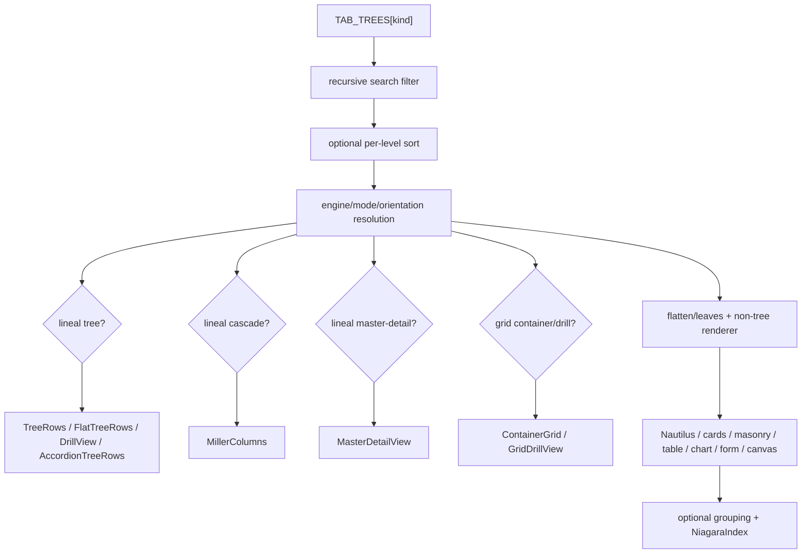

# Shard 04 - Proto Design v12 Vertical Read

## 00. Shard contract

- Shard: `04-proto-design-v12-vertical-read`.
- Stream covered: proto design.
- Canon for this shard: v12.
- Canon source target: `C:/Users/vic_A/AppData/Roaming/Open Design/namespaces/release-stable-win/data/projects/cc18d191-72b5-453c-8f57-04b86a230f66/`.
- Canon source folder: `.../proto-v12/`.
- Canon HTML shell: `.../Vaultman Prototype v12.html`.
- Historical shard archived before this rewrite: `archive/04-proto-design-v7-vertical-read.superseded-by-v12.2026-06-05.md`.
- The old v7 shard remains historical evidence.
- The old v7 shard is no longer the active proto-design canon.
- The current `C:/Users/vic_A/Downloads/Vaultman` path is a junction.
- The junction target is the Open Design project path above.
- This shard uses the target path directly to avoid missing-file false negatives.
- Product tests are excluded by user request.
- Tooling deep dives are excluded by user request.
- Local diff commands are used only to compare proto version deltas.
- Runtime product code is not re-read in this shard except as prior stream context.
- Stable and canary product streams remain covered by shards 02 and 03.
- This shard is not a migration plan.
- This shard is not a visual QA report.
- This shard is not a test plan.
- This shard is a vertical product/design read of the canonical proto design stream.
- This shard intentionally treats design-adjacent notes as evidence.
- Design-adjacent notes include view taxonomy, icon-system migration, icon-pack research, and workspace split regression notes.
- The phrase "current product" in this shard means "current proto design artifact", not "current Obsidian plugin runtime".

## 01. Direct answer

- The canonical proto design stream is now v12.
- v7 is superseded as design canon.
- v7 remains valuable as historical design evidence.
- v12 is not a tiny addendum over v7.
- v12 changes the ViewMenu taxonomy.
- v12 changes lineal modes.
- v12 changes tree orientations.
- v12 adds view scoping.
- v12 adds parent-focused scoping.
- v12 adds master-detail as a lineal mode.
- v12 clarifies cascade as its own lineal mode.
- v12 keeps grid drill as a grid orientation.
- v12 preserves the React/Babel/global-script prototype style.
- v12 does not become Svelte.
- v12 does not become Obsidian-integrated runtime code.
- v12 still exports most contracts through `window.*`.
- v12 uses a single HTML shell with ordered Babel script tags.
- v12 has 13 JSX source files in `proto-v12/`.
- v12 has about 8,329 physical source lines by newline split.
- v12 has one large HTML/CSS shell with script load order at the bottom.
- v12's HTML shell correctly loads `proto-v12/*.jsx`.
- v12's HTML title still says `Vaultman v11 - Nautilus Grid`.
- That title mismatch is real evidence of copy-forward drift.
- The title mismatch does not invalidate the v12 bundle because the script tags point to v12.
- The strongest v12 delta is not visual skinning.
- The strongest v12 delta is the explicit contract of `engine`, `mode`, `orientation`, and `viewScope`.
- The practical implementation delta from v11 to v12 is concentrated in `explorer.jsx`, `stack-island.jsx`, and `nautilus.jsx`.
- The practical implementation delta from v10 to v11 was broader and touched 10 files.
- Therefore v12 should replace shard 04 as the active proto-design read.
- The honest phrase is now: `v12 is canonical proto design, implemented as a React/Babel global prototype with a new view taxonomy and scoped ViewMenu behavior, but it remains non-runtime design evidence rather than mergeable Obsidian/Svelte product code`.

## 02. Evidence inventory

| Path | Status | Physical lines | Bytes | SHA256 prefix | Role |
|---|---:|---:|---:|---|---|
| `Vaultman Prototype v12.html` | targeted read | HTML shell | 206008 | `8CF2ECA2DD2C3F8F` | CSS shell, root mount, script load order |
| `proto-v12/app.jsx` | read | 189 | 8608 | `3F5A3D06F7A4D747` | root state, panel split helpers, app mount |
| `proto-v12/control-island.jsx` | read | 769 | 38795 | `2CAA4BD9732DB5B2` | control FAB, theme/accent/layout/workspace controls |
| `proto-v12/data.jsx` | read | 476 | 25366 | `911C926BAA23E439` | mock vault, operators, recursive tree builders |
| `proto-v12/desktop.jsx` | read | 253 | 11210 | `4FAEDC85FB6135D2` | monitor desktop shell, Nautilus integration, legacy desktop table |
| `proto-v12/explorer.jsx` | read | 1260 | 66952 | `12765E1765B683B1` | TabExplorer, tree/grid/cascade/master-detail/drill renderers |
| `proto-v12/icons.jsx` | read | 517 | 27554 | `2E66C16E9A2F8231` | semantic icon resolver, pack registry, node override model |
| `proto-v12/nautilus.jsx` | read | 304 | 13286 | `12AAF2EB3D5969E3` | Nautilus icons/tiles and node-size scaling |
| `proto-v12/pages.jsx` | read | 833 | 37666 | `AC7E65A35E7A4070` | StatsPage, FiltersPage, ToolsPage, panel rendering |
| `proto-v12/popups.jsx` | read | 343 | 17248 | `49E5C146F29027DE` | legacy popovers, context menu, icon picker |
| `proto-v12/search-island.jsx` | read | 427 | 19124 | `51D0568D546B96EF` | search/create/replace overlay and chip suggestions |
| `proto-v12/sidebar.jsx` | read | 762 | 35972 | `FFC7A2B213C59F79` | mobile shell, nav, islands, event bridge, icon picker host |
| `proto-v12/stack-island.jsx` | read | 1629 | 81282 | `3DDFC6F680E148C2` | StackIsland, filters, queue, ViewIsland, SortIsland, settings |
| `proto-v12/views.jsx` | read | 567 | 28225 | `193D9C2CE9D4B455` | non-tree engine renderers and canvas viewport |
| `view-taxonomy-v12-implementation-notes.md` | read | 28 | 1880 | not hashed | explicit v12 view taxonomy intent |
| `workspace-split-single-tile-regression.md` | read | 24 | 1305 | not hashed | single-panel fill regression and CSS fix |
| `icon-system-v10-to-v11-migration-spec.md` | read | 225 | 8000 | not hashed | icon system migration intent carried into v12 |
| `icon-pack-scene-surface-research.md` | read | 183 | 7453 | not hashed | scene/surface/island routing vocabulary |

## 03. Canon path and junction correction

- Earlier research used `C:/Users/vic_A/Downloads/vaultman`.
- The user reported that path had become a junction.
- Local inspection confirmed the active junction target is under `AppData/Roaming/Open Design/.../projects/cc18d191-...`.
- That target contains `proto-v10`, `proto-v11`, `proto-v12`, older proto folders, screenshots, scraps, tests, and HTML shells.
- The target does not currently expose `proto-v7/`.
- Therefore this shard cannot honestly run a code diff from v7 source to v12 source.
- The v7 comparison in this shard is based on the archived v7 shard and known shard evidence.
- The v10/v11/v12 comparison is based on local folders available in the Open Design target.
- The active HTML shell is `Vaultman Prototype v12.html`.
- The active source folder is `proto-v12/`.
- The v12 HTML load order is explicit.
- The v12 HTML load order proves the shell is trying to execute v12 files.
- The v12 HTML title still says v11.
- That is a shell metadata drift, not a script-load drift.
- Future agents should search the junction target directly before concluding files are missing.

## 04. HTML shell and load order

### Purpose

- The HTML shell is the prototype runtime host.
- It owns the root `<div id="root">`.
- It owns CSS tokens and visual classes.
- It loads React/Babel dependencies through script tags outside the JSX folder.
- It then loads local JSX files in dependency order.
- It is the closest thing v12 has to a runtime bootstrap file.

### Evidence

- The HTML title at line 5 is `Vaultman v11 - Nautilus Grid`.
- The root mount node appears near line 4085 as `<div id="root" class="stage"></div>`.
- The v12 script tags appear at lines 4090 through 4102.
- The shell loads `proto-v12/data.jsx` first.
- The shell loads `proto-v12/icons.jsx` second.
- The shell loads `proto-v12/control-island.jsx` third.
- The shell loads popups/search/stack/views/explorer/pages/nautilus/sidebar/desktop next.
- The shell loads `proto-v12/app.jsx` last.
- This order matches the global dependency model.
- Data and icons must exist before component renderers use globals.
- `app.jsx` must load last because it calls `ReactDOM.createRoot(...).render(<AppV4 />)`.

### Load order snippet

```html
<script type="text/babel" src="proto-v12/data.jsx"></script>
<script type="text/babel" src="proto-v12/icons.jsx"></script>
<script type="text/babel" src="proto-v12/control-island.jsx"></script>
<script type="text/babel" src="proto-v12/popups.jsx"></script>
<script type="text/babel" src="proto-v12/search-island.jsx"></script>
<script type="text/babel" src="proto-v12/stack-island.jsx"></script>
<script type="text/babel" src="proto-v12/views.jsx"></script>
<script type="text/babel" src="proto-v12/explorer.jsx"></script>
<script type="text/babel" src="proto-v12/pages.jsx"></script>
<script type="text/babel" src="proto-v12/nautilus.jsx"></script>
<script type="text/babel" src="proto-v12/sidebar.jsx"></script>
<script type="text/babel" src="proto-v12/desktop.jsx"></script>
<script type="text/babel" src="proto-v12/app.jsx"></script>
```

### Practical state

- The shell is executable in browser terms if Babel/React dependencies load.
- The shell is not product code.
- The shell does not express Obsidian plugin lifecycle.
- The shell does not express persistence.
- The shell does not express plugin APIs.
- The shell is valuable because it fixes the dependency order of the prototype.
- The shell mismatch on title should be documented as drift.
- The shell mismatch should not be used to downgrade v12 to v11.

## 05. V12 dependency model

```mermaid
flowchart TD
  HTML["Vaultman Prototype v12.html"] --> Data["proto-v12/data.jsx"]
  HTML --> Icons["proto-v12/icons.jsx"]
  HTML --> Control["proto-v12/control-island.jsx"]
  HTML --> Popups["proto-v12/popups.jsx"]
  HTML --> Search["proto-v12/search-island.jsx"]
  HTML --> Stack["proto-v12/stack-island.jsx"]
  HTML --> Views["proto-v12/views.jsx"]
  HTML --> Explorer["proto-v12/explorer.jsx"]
  HTML --> Pages["proto-v12/pages.jsx"]
  HTML --> Nautilus["proto-v12/nautilus.jsx"]
  HTML --> Sidebar["proto-v12/sidebar.jsx"]
  HTML --> Desktop["proto-v12/desktop.jsx"]
  HTML --> App["proto-v12/app.jsx"]
  Data --> WindowData["window.VAULT_* / TAB_TREES / flattenTree / leavesOf"]
  Icons --> WindowIcon["window.Icon / resolver globals"]
  Stack --> WindowStack["window.StackIsland / FiltersIslandV4 / QueueIslandV4 / ViewIslandV4 / SortIslandV4"]
  Views --> WindowViews["window.ManualMasonry / CanvasViewport / DataTable / GraphCanvas / etc"]
  Explorer --> WindowExplorer["window.TabExplorer / NiagaraIndex / grouping helpers"]
  Pages --> WindowPages["window.StatsPage / FiltersPage / ToolsPage"]
  Sidebar --> WindowSidebar["window.SidebarV4"]
  App --> Mount["ReactDOM root render"]
```



### Dependency facts

- `data.jsx` exports mock domain globals.
- `icons.jsx` exports the semantic icon component and resolver helpers.
- `control-island.jsx` exports `ControlFab`, `ControlIsland`, palettes, and `resolveAccent`.
- `popups.jsx` exports legacy V2 popovers and `IconPickerIsland`.
- `search-island.jsx` exports `SearchIsland`.
- `stack-island.jsx` exports stack shell and island systems.
- `views.jsx` exports non-tree renderers and canvas primitives.
- `explorer.jsx` exports `TabExplorer` and tree/grid render helpers.
- `pages.jsx` exports page-level surfaces.
- `nautilus.jsx` exports file-manager renderers.
- `sidebar.jsx` exports the main shell.
- `desktop.jsx` exports the desktop shell.
- `app.jsx` mounts the app.
- There is no module import graph.
- There is no bundler module scope.
- Every source file assumes previous script globals exist.
- This design is intentionally prototype-simple.
- The runtime translation cannot copy this dependency shape directly.

## 06. Version delta summary

### V10 to v11

- Local diff source: `proto-v10/` vs `proto-v11/`.
- Diff touched 10 files.
- Diff stat showed 418 insertions and 89 deletions.
- Changed files: `app.jsx`, `control-island.jsx`, `data.jsx`, `explorer.jsx`, `nautilus.jsx`, `pages.jsx`, `search-island.jsx`, `sidebar.jsx`, `stack-island.jsx`, `views.jsx`.
- The v10 to v11 step was broad.
- The v10 to v11 step added workspace split, icon system porting, toolbar/search refinements, and root/control changes.
- The v10 to v11 step is the broad structural predecessor to v12.

### V11 to v12

- Local diff source: `proto-v11/` vs `proto-v12/`.
- Diff touched 3 files.
- Diff stat showed 403 insertions and 71 deletions.
- Changed files: `explorer.jsx`, `nautilus.jsx`, `stack-island.jsx`.
- `explorer.jsx` changed most by line count.
- `stack-island.jsx` changed the ViewMenu contract.
- `nautilus.jsx` changed size constants and related scaling.
- The v11 to v12 step is focused.
- The v11 to v12 step is architecturally significant despite touching fewer files.
- The reason is that `stack-island.jsx` owns the view taxonomy and `explorer.jsx` owns renderer dispatch.

### V7 to v12

- Direct code diff is not available from the current junction target because `proto-v7/` is not present there.
- The historical v7 shard says v7 was canonical at that time.
- The v7 shard covered root/control once the missing files were added.
- The v7 shard described lineal/tree/grid/matrix/canvas ambition.
- v12 supersedes that by making the view contract more explicit.
- v12 adds scoped ViewMenu application.
- v12 adds parent-focus eventing.
- v12 adds master-detail.
- v12 adds flatter and accordion tree variants.
- v12 fixes lineal "side" ambiguity by naming cascade as a mode.
- v12 keeps React/Babel prototype constraints.

## 07. V12 view taxonomy intent

### Source note

- `view-taxonomy-v12-implementation-notes.md` is authoritative design intent.
- It states v12 separates the view contract into four axes.
- Axis 1 is `engine`.
- Axis 2 is `mode`.
- Axis 3 is `orientation`.
- Axis 4 is `viewScope`.
- This is the conceptual center of v12.

### Axes

- `engine` is renderer family.
- `mode` is composition inside the engine.
- `orientation` is layout/navigation inside that mode.
- `viewScope` decides where the ViewMenu config applies.
- The old "linear drill" ambiguity is resolved by keeping drill as an orientation, not as a universal engine behavior.
- The old "side/Miller" ambiguity is resolved by making cascade a lineal mode.

### Implemented taxonomy

| Engine | Modes | Orientation behavior |
|---|---|---|
| `lineal` | `tree`, `cascade`, `master-detail` | tree has `indent`, `flat`, `drill`, `accordion`; cascade owns side; master-detail owns direct/recursive |
| `grid` | `matrix`, `cards`, `masonry`, `table` | grid has `columns`, `rows`, `container`, `drill` |
| `matrix` | `chart`, `form` | orientation mostly not applicable |
| `canvas` | `graph`, `mindmap`, `json-canvas` | graph has fixed/radial/dynamic; mindmap has lateral/bilateral/radial |

### Scope behavior

- `viewScope: off` means one global view config.
- `viewScope: per-level` means apply a ViewMenu snapshot to a chosen depth.
- `viewScope: per-parent` means apply a ViewMenu snapshot to children of a focused parent node.
- Parent focus is emitted with `vm-focused-parent`.
- Parent overrides live in `view.parentViews`.
- Level overrides live in `view.levelViews`.
- `viewSnapshot()` strips internal scope metadata before storing an override.

### Cautions from source note

- Existing lineal `DrillView` was preserved.
- v12 is a first architecture pass.
- `flat`, `accordion`, and `master-detail` need visual tuning after preview review.
- This means v12 is canonical design direction, not final polish.

## 08. `app.jsx` - root app and workspace split

### Purpose

- `app.jsx` is the root state owner.
- It initializes mode, theme, accent, control island open state, both-mode sidebar state, and product scene state.
- It defines i3-style panel helpers.
- It connects `ControlIsland` to live view/settings state.
- It mounts `SidebarV4` in mobile, desktop-monitor, or both modes.
- It applies theme and accent side effects to `document.body`.
- It renders the global toast.
- It calls `ReactDOM.createRoot`.

### Key state

- `mode` defaults to `sidebar`.
- `theme` defaults to `catppuccin-dark`.
- `accent` defaults to `mauve`.
- `customAccent` defaults to `#cba6f7`.
- `controlOpen` defaults false.
- `bothOpen` defaults true.
- `state.page` defaults to `filters`.
- `state.pageOrder` defaults to `stats`, `filters`, `tools`.
- `state.filterTab` defaults to `tags`.
- `state.toolsTab` defaults to `curator`.
- `state.topIsland` controls top islands: search, view, sort.
- `state.bottomIsland` controls bottom islands: filters, queue.
- `state.focusedIsland` controls z-order between top and bottom islands.
- `state.filterStack` owns grouped filter rows.
- `state.queueStack` owns operation queue rows and groups.
- `state.sort` owns multi-level sort and group-by config.
- `state.view` owns the live ViewMenu contract.
- `state.settings` owns nav, toolbar, island, blur, and layout options.
- `state.panels` defaults to a single leaf `{ id: 'p1' }`.
- `state.focusedPanel` defaults to `p1`.
- `state.panelCfg` stores inactive panel snapshots.

### Workspace helpers

```jsx
const vmLeafIds = (node, acc = []) => { ... };
const vmSplitLeaf = (node, leafId, dir, newId) => { ... };
const vmCloseLeaf = (node, leafId) => { ... };
const vmNewPanelId = () => 'p' + (++vmPanelSeq);
```

### Workspace behavior

- A panel tree leaf is an explorer panel.
- Splitting a focused leaf creates a parent node with `dir` and two children.
- Closing a leaf collapses the split to the surviving sibling.
- The app never closes the last panel.
- New sibling panels inherit the focused panel's current tab/view/sort snapshot.
- Focusing a panel saves the old live config into `panelCfg`.
- Focusing a panel loads the selected panel config into live `filterTab`, `view`, and `sort`.
- This means View/Sort/Search tools mutate the last-focused panel.
- This model is practical design evidence for a workspace layout system.
- It is not yet an Obsidian workspace adapter.

### Theme/accent side effects

- `document.body.dataset.theme = theme`.
- `--color-accent` is set on body.
- `--interactive-accent` is set on body.
- `resolveAccent` comes from `control-island.jsx`.
- Toast auto-clears after 1800 ms.

### Theory

- Root state in v12 treats the app as one scene with multiple surfaces.
- `SidebarV4` is the main scene shell.
- `ControlIsland` is a global settings/control surface.
- `panels` models local scene tiling.
- `mode` models frame choice: mobile, monitor, or both.

### Practice

- The state is a single React object, not split stores.
- There is no persistence.
- There is no undo.
- There is no stable panel schema outside this file.
- Inactive panels store only `tab`, `view`, and `sort`.
- Search text belongs to `FiltersPage`, not panel snapshots.
- This is enough for design behavior but not enough for product persistence.

### Mismatch

- The file header still says `App root v5`.
- The app is in `proto-v12/`, so the header is ancestry, not canon.
- `state.view` in `app.jsx` does not include all v12 DEFAULT_VIEW keys from `stack-island.jsx`.
- Missing defaults are filled in practice by ViewIsland behavior or undefined fallbacks.
- Product implementation should centralize defaults to avoid split-brain.

## 09. `control-island.jsx` - global personalization and workspace controls

### Purpose

- `control-island.jsx` defines the top-left global control surface.
- It owns frame mode selection.
- It owns theme selection.
- It owns accent selection.
- It owns layout personalization controls.
- It owns behavior controls.
- It owns floating index controls.
- It owns workspace tile controls.
- It exports `resolveAccent`.

### Exports

- `window.ControlFab`.
- `window.ControlIsland`.
- `window.THEMES`.
- `window.ACCENT_PRESETS`.
- `window.resolveAccent`.

### Frame modes

- `sidebar` is labeled Mobile.
- `desktop` is labeled Monitor 16:9.
- `both` is labeled Both.
- The global FAB displays frame mode and theme family.

### Theme inventory

- Catppuccin Mocha.
- Catppuccin Latte.
- Gruvbox Dark.
- Gruvbox Light.
- Dracula.
- Nord.
- Each theme includes a swatch triplet.

### Accent inventory

- Mauve.
- Blue.
- Teal.
- Green.
- Yellow.
- Peach.
- Pink.
- Red.
- Orange.
- Purple.
- Custom is supported indirectly by `customAccent`.

### Control surfacebar

- The control island hosts toolbar action nodes in the center.
- It maps `view`, `sort`, `search`, `locate`, `expand`, `filters`, and `queue` to icons/labels.
- It dispatches `vm-surface-action` with `{ detail: { id } }`.
- The comment says the control island is a surface.
- The event does not include full surface/scene metadata.
- The older icon-pack research wanted richer routing metadata.
- v12 still uses a simple event bridge.

### Workspace section

- `ControlWorkspaceSection` is the fifth column.
- It shows current panel count.
- It exposes horizontal split.
- It exposes vertical split.
- It exposes close focused panel.
- It says toolbar menus change the last-focused panel.
- It exposes dock blur toggle.
- It exposes pill blur toggle.
- It relies on `panelOps` passed from `app.jsx`.

### Behavior section

- `ControlBehaviorSection` toggles sticky parent rows.
- It toggles compact density.
- It toggles counts.
- It toggles resizable islands.
- It toggles non-modal island backdrop.
- It is a global control for view and settings behavior.

### Index section

- `ControlIndexSection` configures floating index cells.
- It configures glyph mode: Letter, Icon, Full.
- It configures label mode: Off, Selected, Scrub, Always.
- It toggles hard jump.
- It toggles gradient glow.
- It configures reveal range: One, +/-1, +/-2, All.
- It configures label write direction: top-down, bottom-up, flat.
- It toggles pill background.
- These settings feed `NiagaraIndex` in `explorer.jsx`.

### Layout section

- `ControlLayoutSection` configures bottom nav layout.
- It supports pill, dual FAB, and drawer.
- It configures pill style.
- It configures drawer corner and direction.
- It configures island action button position.
- It configures suggestion row cap.
- It configures toolbar and tabs.
- It toggles tabs-as-chip.
- It toggles search-as-button.
- It configures toolbar alignment.
- It configures tab-chip style.
- It exposes hidden bar/item restore chips.
- It explains redesign mode through a control note.

### Theory

- Control Island is the prototype's global personalization command center.
- It bundles frame, theme, view behavior, index behavior, workspace tiling, island chrome, nav layout, toolbar layout, and blur.
- This is a design surface, not a product settings architecture.

### Practice

- It receives `settings`, `setSettings`, `view`, and `setView` from `AppV4`.
- It mutates the large root state object indirectly.
- It dispatches window events for toolbar actions.
- It does not own persistent preferences.
- It does not validate combinations.
- It does not serialize layout profiles.

### Mismatch

- The control island says "surface", but routing still sends only `{ id }`.
- The icon-pack research wanted `{ island, sceneId, surfaceId, anchorRect }`.
- v12 partially adopts the vocabulary but not the full routing contract.
- This is a key translation gap for runtime implementation.

## 10. `data.jsx` - mock vault, operators, and recursive node model

### Purpose

- `data.jsx` provides the prototype domain.
- It seeds tags.
- It seeds properties.
- It seeds base files.
- It synthesizes extra files.
- It defines operator vocabularies.
- It builds recursive trees for all tabs.
- It exports tree helper functions.

### Primary globals

- `window.VAULT_TAGS`.
- `window.VAULT_PROPS`.
- `window.VAULT_FILES`.
- `window.OPERATORS`.
- `window.TAB_TREES`.
- `window.flattenTree`.
- `window.leavesOf`.

### Mock domain categories

- Tags include project, area, status, type, and priority.
- Properties include tags, status, priority, dateCreated, dateModified, author, related, wordCount, published, and others.
- Files are synthesized across folders such as projects, daily, docs, inbox, meetings, tasks, areas, and people.
- Files carry status, priority, author, modified, daysAgo, wordCount, media, and content.
- These fields feed tree cells, grouping, sorting, cards, table, chart, and forms.

### Operators

- Tag operators include has and has-not.
- List operators include has, has-not, exactly, and count greater than.
- Select operators include is, is-not, and in.
- Text operators include contains, not-contains, equals, starts, and regex.
- Number operators include equals, not equals, greater than, less than, and range.
- Date operators include on, before, after, and range.
- Checkbox operators include true and false variants.
- Folder operators include in and not-in.
- Link operators include links-to and linked-by.

### Recursive builders

- `buildFileTree()` turns flat file folders into recursive folder/file nodes.
- `buildTagTree()` turns tags into parent/child/grandchild nodes.
- `buildPropTree()` turns properties into prop/value/refinement nodes.
- `buildContentTree()` turns files into content match trees.
- `buildDeepBranch(kind)` prepends a 10-level deep branch to every tab.
- `TAB_TREES` contains `files`, `tags`, `props`, and `content`.

### Node shape

- Nodes use `id`.
- Nodes use `name`.
- Nodes use `kind`.
- Nodes use `icon`.
- Nodes optionally use `children`.
- Nodes optionally use `count`.
- Nodes optionally use `status`.
- Nodes optionally use `priority`.
- Nodes optionally use `author`.
- Nodes optionally use `modified`.
- Nodes optionally use `daysAgo`.
- Nodes optionally use `wordCount`.
- Nodes optionally use `folder`.
- Nodes optionally use `media`.
- Nodes optionally use `content`.
- Nodes optionally use `_filter`.
- Deep branch nodes use `_deep`.

### Theory

- The design model treats every tab as a recursive node tree.
- Files, tags, properties, and content matches all feed the same renderer contract.
- This is important because ViewMenu modes are not file-only.
- It pushes Vaultman toward a generalized explorer model.

### Practice

- The data is synthetic.
- Counts are mock counts.
- Operators are static.
- Tree builders run in-browser at load time.
- No Obsidian metadata is read.
- No vault index is queried.
- No provider abstraction exists here.
- The runtime translation must replace data globals with provider/index services.

### Mismatch

- The prototype uses `kind`, `type`, `_filter`, and `meta` loosely.
- Runtime code needs stricter discriminated types.
- The deep branch is a UI stress fixture, not product data.
- `leavesOf()` discards parent containers for some engines, which may not match real provider semantics.

## 11. `sidebar.jsx` - main mobile shell and scene surface

### Purpose

- `sidebar.jsx` defines `SidebarV4`.
- It is the main application shell in `sidebar`, `desktop embedded`, and `both` modes.
- It renders pages.
- It renders bottom navigation.
- It hosts top and bottom stack islands.
- It hosts the context menu.
- It hosts the icon picker.
- It bridges global surface actions.

### Key exports

- `window.SidebarV4`.

### Inputs

- `state`.
- `setState`.
- `panelApi`.
- `embedded` is passed by app in desktop modes, though not shown in the signature excerpt read.
- `companion` is passed by app in both mode, though not shown in the signature excerpt read.

### Event bridge

- It listens for `vm-queue-replace`.
- It listens for `vm-search-submit`.
- It listens for `vm-surface-action`.
- It dispatches `vm-toggle-collapse-all` for expand/collapse.
- It opens top islands for view/sort/search.
- It opens bottom islands for filters/queue.
- It scrolls to top for locate.

### Navigation model

- Page icons map stats, filters, and tools.
- `pageOrder` is reorderable.
- Long-press enters reorder mode.
- Reorder mode affects dock, tabs, and toolbar together.
- Escape exits reorder mode.
- Clicking outside exits reorder mode.
- Bottom nav supports pill layout.
- Bottom nav supports dual FAB layout.
- Bottom nav supports drawer layout.
- Dock can receive toolbar action nodes.
- Dock rejects tabs and search as relocated action nodes.

### Filter integration

- `addFilter(f)` converts a legacy filter object into a stack row.
- It inserts into the latest filter group.
- It uses `OPERATORS` to choose the first operator label.
- It pulses FAB state.
- It can clear filters from double-click.
- It can apply filters from long-press.
- It computes active filters as a flat list.

### Queue integration

- Queue replace operations are created from `vm-queue-replace`.
- The queued row uses `op: rename`, `opType: text`, and a `find -> replace` value string.
- Queue can be cleared.
- Queue groups can be executed.
- Executing auto groups removes executed orphan rows.
- Executing custom groups clears rows inside that group.
- Applying queue clears all rows and closes the bottom island.

### Island integration

- `FiltersIslandV4` receives filter stack state.
- `QueueIslandV4` receives queue stack state.
- `ViewIslandV4` receives `state.view`.
- `SortIslandV4` receives `state.sort`.
- `SearchIsland` is rendered from `FiltersPage`, not directly in the sidebar island list.
- `ContextMenuV2` handles node actions.
- `IconPickerIsland` opens for context action `icon`.
- `vm-redesign-cells` opens for context action `cells`.

### Theory

- Sidebar is the scene host.
- Bottom nav and toolbar are surface controls over that scene.
- Top/bottom islands are scene tools.
- Icon picker is a node-scoped island.
- The shell already encodes surface/scene/island vocabulary in practice.

### Practice

- The shell relies on root state and window events.
- It has many inline state mutations through `setS`.
- It does not isolate page state from shell state.
- It does not route with a formal command bus.
- It does not include runtime persistence.
- It does not include keyboard accessibility beyond a few Escape handlers.

### Mismatch

- The icon-pack research wants an `IslandRouter`.
- v12 still distributes routing across Sidebar, FiltersPage, ControlIsland, and window events.
- Runtime implementation should not copy the event scatter directly.

## 12. `pages.jsx` - pages, toolbar, search host, and panel render tree

### Purpose

- `pages.jsx` defines high-level page bodies.
- It defines `StatsPage`.
- It defines `FiltersPage`.
- It defines `ToolsPage`.
- It exports page components through `window`.
- It is where the live explorer panel tree is rendered.

### StatsPage

- Shows vault summary cards.
- Shows mock words-per-day data.
- Shows most-linked hubs.
- Shows orphans.
- Shows stale notes.
- Shows top tags.
- Shows activity heatmap.
- Shows graph density.
- Shows reading/writing ratio.
- This is dashboard design evidence.
- It is not backed by real vault analytics.

### FiltersPage state

- Owns search text.
- Owns tab menu open state.
- Derives `searchOpen` from `openIsland === 'search'`.
- Owns submitting animation state.
- Mirrors global selection mode by listening to `vm-selmode`.
- Owns per-tab `expandedMap`.
- Provides expand/collapse all over recursive parents.
- Listens for `vm-toggle-expand-all`.

### Toolbar model

- `toolbar.order` defaults to tabs, view, sort, search, locate, expand.
- Hidden tool items come from `toolbar.hiddenItems`.
- Hidden bars come from `toolbar.hiddenBars`.
- Toolbar reorder mode is global.
- Toolbar alignment can be left, center, or right.
- Toolbar items can nest inside the search box.
- Toolbar items can move to the dock.
- Toolbar supports double-click/right-click menu while in reorder mode.
- Search can render as full inline box or button.
- Tabs can render as tab bar or dropdown chip.
- Select action cycles global selection mode.

### Search host

- The inline search box writes search text.
- Enter creates a query chip.
- Enter dispatches `vm-search-submit`.
- Escape clears search text.
- The search island is rendered below the panel root.
- `SearchIsland` receives active tab, search state, chips, suggestion row count, and search-as-button mode.

### Panel rendering

- `FiltersPage` receives `panels`, `focusedPanel`, `panelCfg`, and `onFocusPanel`.
- It counts leaves to determine whether split mode is active.
- It renders a direct `.vm-panel` for single-panel mode.
- It renders nested `.vm-panelsplit` nodes for splits.
- Focused panel uses live `activeTab`, `view`, and `sort`.
- Non-focused panels use `panelCfg`.
- Split panels show a panel tag.
- Clicking a split panel focuses it.
- Each panel renders `TabExplorer`.

### Workspace split regression note

- The adjacent note says v11 introduced an i3-style panel tree.
- The initial tree remains a single leaf.
- The regression was not state shape.
- The regression was that the single `.vm-panel` did not fill `.vm-panels-root`.
- The CSS fix is `.vm-panels-root > .vm-panel { flex: 1 1 0; width: 100%; height: 100%; }`.
- The v12 shell contains CSS around `.vm-panels-root` and direct child panel fill.
- This is a good example of source-adjacent design evidence.

### Theory

- Pages are not just routes.
- `FiltersPage` is the core workspace scene.
- Toolbar, search, tabs, panels, and explorer are one interactive composition.
- The page is already closer to a workspace editor than a static filter screen.

### Practice

- Panel focus, toolbar state, and search state are only local React state.
- Per-panel search is not persisted.
- Panel config stores only tab/view/sort.
- Toolbar config is global.
- There is no stable serialized layout profile.

### Mismatch

- Product runtime needs separate concepts for workspace layout, scene config, panel config, and transient interaction state.
- v12 mixes them in root/page state for speed of prototyping.

## 13. `stack-island.jsx` - shared island shell

### Purpose

- `stack-island.jsx` is the largest v12 file.
- It defines the shared `StackIsland` surface.
- It defines filter stack UI.
- It defines queue stack UI.
- It defines ViewIsland.
- It defines SortIsland.
- It defines settings panel.
- It defines A-Z overlay.
- It exports core island components through `window`.

### Shared shell

- `StackIsland` can anchor top or bottom.
- It can show backdrop.
- It can be non-modal.
- It can be resizable by edge handle.
- It can be floating.
- Floating mode can move by a three-dot handle.
- Floating mode can resize from bottom corners.
- Floating mode can collapse into a thumbnail below a threshold.
- Tapping the thumbnail restores base size.
- Floating reset restores position, size, and mini state.
- The shell supports center or side action buttons.
- The shell supports a subbar.
- The shell handles outside close through backdrop.

### Shell constants

- `FL_MIN_W = 240`.
- `FL_MIN_H = 200`.
- `FL_MINI_W = 188`.
- `FL_MINI_H = 150`.
- These mirror the comments about One UI and HyperOS pop-up behavior.

### Theory

- StackIsland is not a simple modal.
- It is a reusable surface primitive.
- It experiments with mobile OS windowing metaphors.
- It separates shell chrome from island body.

### Practice

- The shell is local React state.
- Position and size are not persisted.
- It uses `window.addEventListener` for drag/resize.
- It does not account for reduced motion.
- It does not have focus trapping.
- It does not have formal accessibility contracts beyond `role="dialog"` and `aria-modal`.

## 14. Filter stack system

### Purpose

- FiltersIslandV4 turns filters into nested groups and rows.
- Filter rows are structured with operators, property names, values, and suggestions.
- Groups can be AND, OR, or NONE.
- Groups can contain rows and subgroups.
- Rows can be dragged.
- Groups can be dragged.
- A composer creates new rows.

### State shape

- Stack state contains `groups`.
- Stack state contains `orphans`.
- Groups contain `id`.
- Groups contain `op`.
- Groups contain `rows`.
- Groups contain `subgroups`.
- Rows contain `id`.
- Rows contain `op`.
- Rows contain `opType`.
- Rows contain `icon`.
- Rows contain `name`.
- Rows contain `value`.
- Rows contain `suggestions`.
- Rows may contain `tab`.
- Rows may contain `meta`.

### Engine helpers

- `useStackEngine` clones stack state.
- It can update rows.
- It can remove rows.
- It can add rows.
- It can add subgroups.
- It can remove groups.
- It can update groups.
- It can cycle group operators.
- It can enforce a root invariant for filters.

### Interaction

- `StackRow` has operator menu state.
- `StackRow` has name menu state.
- `StackRow` supports inline editing.
- `StackRow` supports drag start, drag end, drag over, and drop.
- `RecursiveGroup` renders nested groups.
- `FilterComposer` can add rows.
- The group renderer is recursive.

### Theory

- Filters are not flat chips.
- Filters are composable boolean trees.
- This aligns with advanced search/filter grammar.
- It also aligns with future templateable filter sets.

### Practice

- The filter stack is purely client state.
- It does not actually query a vault.
- Applying filters mostly updates UI state/toasts.
- Operators are labels more than executable predicates in the prototype.
- The recursive UI is richer than the execution model.

### Mismatch

- Runtime product needs an executable predicate AST.
- Runtime product needs validation by property type.
- Runtime product needs provider-specific query strategy.
- Runtime product needs persistence and templates.
- v12 supplies the interaction grammar, not the backend contract.

## 15. Queue stack system

### Purpose

- QueueIslandV4 turns operations into grouped executable sets.
- Queue rows can come from search replace.
- Queue groups can be action-specific or custom.
- Queue supports clear, apply, and group execution.

### Action model

- The file contains action metadata for queue groups.
- Queue rows share stack row mechanics with filters.
- Queue groups use colors and icons.
- Custom groups can be renamed.
- Auto groups can remove executed rows.

### Search integration

- `SearchIsland` dispatches `vm-queue-replace`.
- `SidebarV4` listens and inserts a rename queue row.
- The queue row value encodes `find -> replace`.
- Replace next and replace all dispatch different details.
- Pattern tokens can append to replace text.

### Theory

- Queue is the operational side of the same stack grammar.
- Filters select targets.
- Queue stores pending transformations.
- The design anticipates batch operations.

### Practice

- Queue execution is simulated.
- Applying queue clears state and shows toast.
- Operation rows are not run against files.
- There is no undo.
- There is no conflict preview.
- There is no dry-run output.

### Mismatch

- Runtime product needs an operation engine.
- Runtime product needs preview, transaction, undo, and error handling.
- Runtime product needs separation between queued commands and executed results.
- v12 supplies interaction language and grouping UI.

## 16. ViewIslandV4 - canonical v12 view contract

### Purpose

- `ViewIslandV4` is the most important v12 design surface.
- It exposes engine selection.
- It exposes mode selection.
- It exposes orientation selection.
- It exposes node size.
- It exposes scope.
- It exposes cell visibility.
- It exposes per-level presets.
- It exposes section customization.

### Exports and defaults

- `window.ViewIslandV4` exports the component.
- `DEFAULT_VIEW` defines v12 defaults.
- Defaults include engine, mode, orientation, icon size, visibility flags, index flags, view scope, level views, parent views, cascade options, master-detail scope, mindmap side, spin, and hidden/collapsed sections.
- `DEFAULT_VIEW` is more complete than `app.jsx` initial `state.view`.
- This split is practical drift.

### Engine matrix

```jsx
const VM_ENGINES = [
  { id: 'lineal', modes: ['tree', 'cascade', 'master-detail'] },
  { id: 'grid', modes: ['matrix', 'cards', 'masonry', 'table'] },
  { id: 'matrix', modes: ['chart', 'form'] },
  { id: 'canvas', modes: ['graph', 'mindmap', 'json-canvas'] },
];
```

### Orientation matrix

- Grid orientations: columns, rows, container, drill.
- Mindmap orientations: lateral, bilateral, radial.
- Graph orientations: fixed, radial, dynamic.
- Master-detail orientations: direct, recursive.
- Tree orientations: indent, flat, drill, accordion.
- Old `down` normalizes to `indent`.
- Old `side` normalizes to `cascade`.

### Node size

- Presets are XS, S, M, XL.
- Physical values are 38, 56, 80, and 136 px.
- Custom slider range is 38 through 180 px.
- Node size is now generic.
- It applies to every engine/tab through `--node-scale`.
- It is not limited to Nautilus icons.

### Cell toggles

- Label toggle.
- Icon toggle.
- Media toggle.
- Content toggle.
- Counters toggle.
- Level chip toggle.
- Folder column toggle.
- Status column toggle.
- Priority column toggle.
- Tags column toggle.
- Modified column toggle.
- Author column toggle.
- Invariant: label and icon cannot both be hidden.

### Scope

- `scopeModes` are off, per-level, per-parent.
- `setViewScope(scope)` sets `viewScope` and legacy `perLevel`.
- `focusedParent` listens to `vm-focused-parent`.
- `viewSnapshot()` removes `levelViews`, `parentViews`, scope target fields, and section UI fields.
- `applyScopeToLevel()` stores a view snapshot into `levelViews[level]`.
- `applyScopeToParent()` stores a view snapshot into `parentViews[parent.id]`.
- Parent scoping depends on explorer rows calling `markFocusedParent`.

### Per-level presets

- Presets are inherit, grid, cards, and table.
- Presets are offered for levels 0 through 5.
- The note says a parent at level L opens children using the L+1 view.
- The implementation in `TreeRows` uses `levelViews[depth + 1]`.
- Parent-specific overrides take precedence over level overrides.

### Cascade controls

- Cascade has its own section only when lineal cascade mode is active.
- It supports left and right side.
- It supports breadcrumbs on/off.
- It maps to `view.cascadeSide`.
- It maps to `view.cascadeBreadcrumbs`.

### Section customization

- `useMenuSections` stores hidden sections in `_hiddenSecs`.
- It stores collapsed sections in `_collapsedSecs`.
- It has editing mode to reveal hidden sections.
- It listens to `vm-toggle-collapse-all` when focused.
- It sets `window.__vmCollapseHandled = true` when it handles collapse.

### Theory

- ViewIslandV4 is a view contract editor.
- It treats view as a compositional object.
- It treats node identity cells as first-class.
- It treats view settings as scopeable, not only global.
- It is a design spec for future view-builder architecture.

### Practice

- It mutates one `view` object.
- It stores view snapshots directly inside that same object.
- It lacks schema validation.
- It lacks migration handling for older view objects.
- It has compatibility normalization for `down` and `side`.
- It keeps legacy `perLevel` compatibility.

### Mismatch

- Runtime product needs a formal `ViewConfig` schema.
- Runtime product needs explicit scope resolution order.
- Runtime product needs persistent scope targets.
- Runtime product needs UI-state separation from view-state.
- The prototype stores `_hiddenSecs` and `_collapsedSecs` inside the view object.
- That is acceptable for prototype speed but should not define product domain schema.

## 17. SortIslandV4 - sort and grouping contract

### Purpose

- `SortIslandV4` defines sorting controls.
- It supports multi-level sorting.
- It supports group-by.
- It supports manual sort.
- It supports per-level sort.
- It can trigger side index.

### Sort defaults

- `DEFAULT_SORT.levels` defaults to modified descending.
- `DEFAULT_SORT.groupBy` defaults to none.
- `DEFAULT_SORT.manual` defaults false.
- `DEFAULT_SORT.perLevel` defaults false.
- `DEFAULT_SORT.levelSorts` defaults empty.

### Fields

- name.
- modified.
- created.
- size.
- priority.
- author.
- wordCount.

### Group-by options

- none.
- folder.
- status.
- priority.
- author.
- kind/extension.
- first letter.
- first number.
- modified bucket.

### Interaction

- Sort levels can be added.
- Sort levels can be removed.
- Direction toggles between ascending and descending.
- Manual sort toggles with a grip action.
- Per-level sort toggles from subbar and footer.
- A-Z index action toggles side index through parent callback.

### Theory

- Sort is multi-dimensional.
- Sort can be global or per-level.
- Grouping feeds the floating index.
- Manual sort switches renderer behavior into a home-screen masonry mode.

### Practice

- Per-level sort is only implemented in `TabExplorer` tree filtering/sorting.
- Manual sort is used by `renderBodyVW()` for certain list-like renderers.
- Grouping is computed from flattened or leaf lists.
- Grouping does not mutate the underlying tree.

### Mismatch

- Runtime product needs stable sort specs.
- Runtime product needs provider-specific field comparators.
- Runtime product needs consistent manual order persistence.
- v12 is a UI grammar and partial behavior demo.

## 18. `explorer.jsx` - engine dispatch and generic tab explorer

### Purpose

- `explorer.jsx` is the renderer core.
- It consumes `TAB_TREES[kind]`.
- It filters tree data by search query.
- It applies per-level sort.
- It manages selection.
- It manages marquee/lasso selection.
- It manages expand/collapse state through props.
- It resolves view engine and mode into renderer calls.
- It hosts the Niagara side index.
- It hosts tree, cascade, master-detail, drill, grid drill, and container grid.

### Top-level helpers

- `vmFirstChar` extracts a grouping character.
- `vmGroupKey` maps a node to a group key.
- `vmGroupList` groups items.
- `vmIndexGlyph` maps group keys to rail glyphs.
- `NODE_PX` maps size keys to pixel values.
- `NiagaraIndex` renders the floating index.
- `NodeGlyph` passes node context and icon overrides to `Icon`.
- `CellMedia` renders deterministic media thumbnails.
- `CellContent` renders text snippets.
- `TREE_CELL_DEFS` defines node cells.
- `TREE_CELL_ORDER` defines default cell order.
- `getCellOrder` reads global cell order.
- `setCellOrder` updates global cell order and dispatches `vm-cell-order`.
- `markFocusedParent` updates `window.__vmFocusedParent` and dispatches `vm-focused-parent`.

### Node cell model

- Cell `media` renders media only for leaf nodes.
- Cell `icon` renders semantic icon.
- Cell `label` renders name.
- Cell `content` renders snippet when enabled.
- Cell `level` renders deep level or meta chip.
- Cell `folder` renders folder value.
- Cell `status` renders status.
- Cell `priority` renders priority.
- Cell `author` renders author.
- Cell `modified` renders modified.
- Cell `count` renders count.
- Redesign mode wraps cells as draggable slots.
- Redesign mode is toggled by `vm-redesign-cells`.
- Cell order is global in `window.__vmCellOrder`.

### TabExplorer pipeline



### Search filtering

- Search query is lowercased.
- A node matches if its name contains the query.
- Parent nodes are kept if a descendant matches.
- Filtered child arrays are copied into matching parents.
- This preserves hierarchy during search.

### Per-level sort

- Applies only when `sort.perLevel` and `sort.levelSorts` exist.
- Recurses by depth.
- Each depth can choose a field and direction.
- `name` uses lowercase comparison.
- `priority` uses numeric fallback.
- `size` and `wordCount` use wordCount/count fallback.
- `modified` and `created` use modified string fallback.
- Other fields stringify.

### Selection

- `selected` is a Set.
- Global `window.__vmSelMode` controls none/box/lasso.
- `vm-selmode` events update selection mode.
- Ctrl/Cmd toggles selection.
- Shift extends selection.
- Plain click replaces selection.
- Box selection hit-tests node centers inside a rectangle.
- Lasso selection uses point-in-polygon.
- Selection uses `[data-node-id]` elements.

### Grouping and side index

- `wantLeaves` is true for icons, tiles, cards, widgets, graph, mindmap, and jsoncanvas.
- Leaf-oriented engines use `leavesOf(tree)`.
- Other engines use `flattenTree(tree)`.
- If sideIndex is on and groupBy is none, groupBy falls back to first-char.
- `NiagaraIndex` can jump to group headers.
- If a group header is unavailable, it jumps to the first node in that group.
- Hard jump uses `behavior: auto`.
- Smooth jump uses `behavior: smooth`.

### Theory

- TabExplorer is engine-agnostic.
- TabExplorer treats every tab as recursive nodes.
- TabExplorer decouples tab kind from view renderer.
- This is the strongest bridge from design prototype to product architecture.

### Practice

- It still uses browser DOM query selectors for jump and selection.
- It stores several global flags on `window`.
- It uses React local state for selection and focused surface.
- It expects `window.TAB_TREES`.
- It expects `leavesOf` and `flattenTree`.
- It expects renderers from `views.jsx` and `nautilus.jsx`.

### Mismatch

- Runtime product should not rely on `window.__vm*` globals.
- Runtime product should not hit-test DOM as its only selection model.
- Runtime product needs virtualized selection models.
- Runtime product needs stable node identity across providers.
- v12 proves the UX contract, not the performance architecture.

## 19. Tree renderers and scoped view behavior

### TreeRows

- `TreeRows` renders indented recursive rows.
- It uses CSS variables for depth and indent.
- It marks parent rows sticky when enabled.
- It calls `markFocusedParent(n)` when opening a parent.
- It toggles expansion for parent rows.
- It adds filter rows when leaf nodes with `_filter` are clicked.
- It opens context menu on double-click or context menu.
- It calculates `childView` from `view.parentViews[n.id]` first.
- It falls back to `levelViews[depth + 1]`.
- If childView has a non-lineal engine, it calls `renderEmbedded`.
- Otherwise it recurses with `childView || view`.
- This is the implementation of per-parent and per-level scoped view behavior.

### FlatTreeRows

- `FlatTreeRows` is a visually flatter recursive tree.
- It uses only one shallow indent unit.
- It still supports sticky parent rows.
- It still calls `markFocusedParent`.
- It still supports filter leaf clicks.
- It still supports context menu.
- It uses `vm-tree-row-flat` classes.
- It does not use per-level embedded renderer in the excerpt read.

### AccordionTreeRows

- `AccordionTreeRows` keeps only one branch open per depth.
- State is `accordionOpen[depth]`.
- Toggling a parent replaces the open id at that depth.
- It still marks focused parent.
- It still supports sticky rows.
- It recurses while preserving accordion state.
- It uses `vm-tree-row-accordion` classes.

### DrillView

- `DrillView` opens one hierarchy level at a time.
- It stores a breadcrumb stack.
- It renders current level rows.
- Clicking a parent pushes onto stack.
- Clicking a leaf adds filter if `_filter` exists.
- Breadcrumbs can return to root or prior levels.
- This was preserved from earlier versions.

### Theory

- Tree is no longer one mode with a side/down toggle.
- Tree is a mode with multiple orientations.
- Indent, flat, drill, and accordion are separate behaviors.
- Per-level and per-parent scoping are tree-centric but not globally limited by data shape.

### Practice

- Scope behavior is implemented in `TreeRows`.
- Flat and accordion do not appear to honor `levelViews` or `parentViews` in the same way as `TreeRows`.
- Master-detail uses `markFocusedParent` for parent selection but does not apply `parentViews`.
- This means scoped views are strongest in indent tree.
- The UI presents scope more broadly than every renderer fully implements.

### Mismatch

- Runtime product needs a clear scope support matrix.
- If all tree orientations expose scope, all should resolve scopes consistently.
- If only indent supports embedded scoped views, UI should say so.

## 20. Cascade, master-detail, grid drill, and container grid

### Cascade

- Cascade is implemented by `MillerColumns`.
- It is lineal mode `cascade`.
- It owns former side/Miller behavior.
- It stores selected path as ids per column.
- It builds columns from root through selected child paths.
- It builds breadcrumbs from selected nodes.
- It auto-scrolls to the newest column.
- It supports `cascadeSide` left/right through CSS class.
- It supports breadcrumbs on/off.
- Clicking a parent opens the next column.
- Re-clicking an already-open node collapses that level.
- Clicking a leaf adds filter if `_filter` exists.

### Master-detail

- `MasterDetailView` creates a synthetic root node.
- It renders parent-only tree on the left.
- It renders leaf nodes on the right.
- It stores selected parent id.
- It computes parent tree through `parentsOnly`.
- It finds selected parent through `findNodeById`.
- It computes direct leaves or recursive leaves through `leafDescendants`.
- `masterDetailScope` controls direct vs recursive.
- Parent clicks call `markFocusedParent`.
- Leaf clicks add filters.
- Context menu works on parents and leaves.

### Grid drill

- `GridDrillView` keeps one-level navigation.
- It renders the active level using `NautilusIconsGrid`.
- It builds entries directly from current level nodes.
- It marks parents as folders.
- Opening a parent pushes to breadcrumb stack.
- Opening a leaf adds filter.
- Context menu maps back to the original node by id.

### Container grid

- `ContainerGrid` is grid orientation `container`.
- Parent nodes render as folder boxes.
- Leaf nodes render as direct boxes.
- Folder boxes preview up to nine children.
- Opening a folder shows an overlay.
- The overlay renders children as full-size boxes.
- The overlay can be closed.
- This is Android-home-screen folder behavior translated to Vaultman nodes.

### Theory

- V12 separates navigation composition from renderer family.
- Cascade is not just orientation.
- Master-detail is not just a skin.
- Grid drill is grid-native drill, not lineal drill reused.
- Container grid is parent-as-container composition.

### Practice

- These renderers are functional prototype components.
- They are not virtualized.
- They do not persist navigation path.
- They do not share one navigation state model.
- Each owns local stack/path/open state.

### Mismatch

- Runtime product needs common navigation contracts for breadcrumbs, focused parent, and path persistence.
- Runtime product needs virtualization or bounded rendering for large vaults.
- V12 provides interaction patterns and naming.

## 21. Non-tree renderers in `views.jsx`

### Purpose

- `views.jsx` provides renderer bodies for non-tree engines.
- It is imported by script order before `explorer.jsx`.
- `TabExplorer` calls these renderers from `renderBodyVW`.

### CanvasViewport

- Shared pan, zoom, rotate, and minimap container.
- Centers content on first measure.
- Uses ResizeObserver with requestAnimationFrame to avoid feedback loops.
- Uses a non-passive wheel listener to allow preventDefault.
- Supports rotate mode by toolbar toggle or Ctrl/Cmd drag.
- Supports minimap.
- Supports reset view.
- This is a reusable canvas surface primitive.

### ManualMasonry

- Used when manual sort is on for list-like renderers.
- Owns item sizes.
- Owns item order.
- Supports drag reorder.
- Supports per-axis resize.
- Uses a rigid four-column grid.
- Node cells can grow in width and height.

### FlatList

- Renders rows with icon, name, folder, and modified.
- Uses `ViewNodeIcon`.
- Supports context menu.
- It remains simple and not central in v12.

### WidgetsGrid

- Groups files by folder.
- Owns sizes and order.
- Supports drag reorder and resize.
- Represents home-screen widgets.
- Uses dense grid packing.

### DataTable

- Renders a table from visible columns.
- Column visibility follows view flags.
- Name column always renders.
- Folder/status/priority/author/wordCount/modified are conditional.
- It is a matrix-style data surface.

### DataChart

- Counts files by status or folder.
- Chooses status if `showStatus` is not false.
- Otherwise chooses top folder.
- Renders bar chart rows.
- It is an analytics preview, not a chart engine.

### RecordForm

- Shows one record at a time.
- Lets user navigate previous/next.
- Displays fields as labels.
- It is a matrix/form mode preview.

### GraphCanvas

- Groups by top-level folder.
- Creates a root node.
- Creates folder nodes.
- Creates file nodes under folder nodes.
- Supports fixed, radial, and dynamic orientation.
- Uses `CanvasViewport`.
- Context menu maps file nodes back to source files.

### MindmapCanvas

- Groups by top-level folder.
- Uses lateral, bilateral, or radial layout.
- Uses `mmSide` for left/right lateral.
- Uses `spin` for radial direction.
- Uses `CanvasViewport`.
- Represents vault map design more than graph computation.

### JsonCanvas

- Groups by top-level folder.
- Places groups in a 3-column card grid.
- Draws edges from first card to others.
- Uses `CanvasViewport`.
- Supports context menu on representative files.

### MasonryGrid

- Renders horizontal masonry when no rich media/content is active.
- Renders vertical CSS-column masonry when media/content exists.
- Uses node size to set column width.
- Supports media thumbnails.
- Supports content snippets.
- Supports filters and context menu.

### Theory

- V12's engines are a palette of renderer families.
- Canvas modes share one viewport primitive.
- Grid/masonry modes share cell-size and node-cell vocabulary.
- Matrix modes translate nodes into tabular/chart/form representations.

### Practice

- These renderers are deterministic demos.
- They use synthetic data.
- They do not share virtualization.
- They do not share selection deeply.
- Some renderers accept context menu but not selection.
- Some renderers ignore parts of `view`.

### Mismatch

- Runtime product needs renderer capability declarations.
- Runtime product needs to know which view flags each renderer supports.
- Runtime product should not expose controls that a renderer silently ignores.

## 22. `nautilus.jsx` - file-manager visual grammar

### Purpose

- `nautilus.jsx` defines GNOME Files inspired icons and tiles.
- It renders folders and files.
- It handles node size scaling.
- It passes semantic icon context into `Icon`.

### Size constants

- Icon sizes are mini 38, small 56, medium 80, big 136.
- Tile sizes are mini 34, small 48, medium 68, big 104.
- These align with v12's larger node-size presets.
- The v11 to v12 diff touched Nautilus mostly to adjust these values.

### Icon art

- `FolderIconAdwaita` is vector folder art.
- `FileIconAdwaita` is vector file art.
- `detectKind` maps file names to kind.
- `folderAccent` maps top-level folders to colors.
- `nautPackArt` delegates to `Icon`.
- `nautPackArt` passes `node`, `kind`, `ext`, pack override, and per-node override.

### NautilusIconsGrid

- Computes pixel size from preset or custom size.
- Computes cell minimum width from icon size.
- Computes gap and padding from icon size.
- Bounds label width.
- Clamps label lines.
- Adds `data-node-id`.
- Supports selected state.
- Supports click toggle.
- Supports context menu.
- Shows status meta if enabled.

### NautilusTilesList

- Computes tile icon size.
- Renders horizontal rows.
- Adds `data-node-id`.
- Supports selected state.
- Supports click toggle.
- Supports context menu.
- Shows folder/status/priority/modified based on view flags.
- Shows check indicator when selected.

### NautilusPathBar

- Renders back/forward buttons.
- Renders path breadcrumbs.
- Renders counts.
- Used by desktop shell and other file-manager flows.

### buildNautilusEntries

- Builds top-level folder pseudo entries from flat files.
- Returns folders first, then files.
- Folder ids are `folder:<top>`.
- Counts are accumulated per top folder.

### Theory

- Nautilus is the design source for file-manager ergonomics.
- It is also the visual basis for grid matrix mode.
- It validates that node size must affect labels, gaps, and density, not only SVG size.

### Practice

- It uses synthetic entries.
- Folder opening is not implemented here.
- Selection is Set-based from parent.
- It delegates semantic icon rendering.
- It is reusable by grid drill and desktop.

### Mismatch

- Runtime product needs file/folder open actions.
- Runtime product needs keyboard selection.
- Runtime product needs virtualization for large grids.
- Runtime product needs consistent node identity between folder pseudo entries and provider nodes.

## 23. `icons.jsx` - semantic icon system

### Purpose

- `icons.jsx` defines the icon resolver.
- It supports Lucide-style inline icons.
- It supports local Adwaita-like icons.
- It supports emoji pack.
- It supports remote packs.
- It supports semantic node role resolution.
- It supports node overrides.

### Pack registry

- Remote `adwaita-remote`.
- Remote `reversal`.
- Remote `papirus`.
- Alias `adwaita` maps to `adwaita-remote` for source registry.
- Local packs are `lucide`, `adwaita-v10`, and `emoji`.

### Semantic role inputs

- Explicit `kind`.
- `node.kind`.
- `node.isFolder`.
- `node.children`.
- `name`.
- `node.icon`.
- `node.type`.
- `node.nodeType`.
- `node.fileType`.
- File name extension.
- Explicit `ext`.

### Roles

- folder.
- file.
- md.
- txt.
- json.
- img.
- code.
- sheet.
- canvas.
- base.
- pdf.
- tag.
- prop.
- value.
- content.
- match.

### Resolver priority

- Folder kind wins as folder.
- Tag/prop/value/content/match kind wins as that role.
- File kind checks node type, extension, then icon name.
- Special node icons handle canvas and base.
- Legacy icon names are normalized.
- Remote packs use source URLs when available.
- Remote packs fall back to file/folder sources and then Lucide-like fallback.

### Override model

- Legacy string overrides still work.
- `emoji:<char>` maps to manual emoji.
- `adw:<kind>` maps to manual local Adwaita.
- `pack:icon` maps to manual pack/icon.
- Plain string maps to manual Lucide.
- Object overrides support `mode`.
- Object overrides support `packId`.
- Object overrides support `iconId`.
- Auto override forces a pack while preserving semantic role.
- Manual override chooses explicit pack/icon.

### Key component

```jsx
const Icon = ({ name, size = 14, node, kind, fileName, ext, packOverride, override }) => {
  const iconOverride = normalizeIconOverride(override);
  const packKey = resolveIconPackKey({ name, node, kind, fileName, ext });
  ...
};
```

### Theory

- Icon choice is scene-owned and node-aware.
- Node context matters more than a flat icon name.
- Scene icon pack gives global style.
- Per-node override can be semantic-auto or exact-manual.
- This supports visual identity without destroying role semantics.

### Practice

- Overrides live in `window.__vmIconOverrides`.
- Icon override updates dispatch `vm-icon-override`.
- Renderers listen and force rerender.
- No persistence exists.
- Remote icons depend on network URL availability.
- Failed remote URLs are not cached in the code excerpt read.

### Mismatch

- The adjacent research proposed caching failed remote URLs.
- v12 resolver has fallback behavior but no explicit failed-url cache in the read excerpt.
- Runtime product should turn this into an `IconService` or equivalent provider.
- Runtime product should persist overrides in scene/profile settings.

## 24. `popups.jsx` - context menu and icon picker

### Purpose

- `popups.jsx` contains legacy V2 popovers and current icon picker.
- It exports `SortPopoverV2`, `ViewPopoverV2`, `QueueIslandV2`, `FiltersIslandV2`, `ContextMenuV2`, and `IconPickerIsland`.
- Some V2 popovers remain for desktop legacy areas.
- The icon picker is the important v12-adjacent surface.

### Context menu

- Context menu clamps x/y to viewport.
- It includes Open.
- It includes Rename.
- It includes Change icon.
- It includes Rearrange cells.
- It includes Move to folder.
- It includes Add tag.
- It includes Set property.
- It includes Duplicate.
- It includes Queue operation.
- It includes Delete.
- It dispatches action ids through `onAction`.

### Icon picker packs

- Lucide.
- Adwaita.
- Emoji.
- Papirus.
- Reversal.
- Adwaita remote.

### Icon picker modes

- Auto.
- Auto with pack.
- Manual icon.
- Reset to scene.

### Icon picker behavior

- `pick(val)` writes to `window.__vmIconOverrides[nodeId]`.
- It dispatches `vm-icon-override`.
- It closes after picking.
- `clear()` deletes the override.
- Auto tab resets to scene pack.
- Pack tab sets `{ mode: 'auto', packId }`.
- Manual Lucide chooses explicit Lucide name.
- Manual emoji chooses explicit emoji.
- Manual remote/local role chooses role id.
- Preview uses runtime `Icon`, not fake static art.

### Theory

- Context menu is node action entry.
- Icon picker is node-scoped scene customization.
- Cell rearrange is also node-context initiated but affects global cell order.

### Practice

- The context menu does not receive the target prop in the read path used by sidebar.
- Sidebar passes node through state, not directly into `ContextMenuV2`.
- Icon picker stores overrides globally.
- There is no anchored island router.
- The picker appears as a modal overlay.

### Mismatch

- Icon-pack research proposed router-level command shape.
- v12 still routes icon picker through sidebar context state.
- Runtime product needs a command and surface router to avoid special cases.

## 25. `search-island.jsx` - search, create, replace, and chips

### Purpose

- `SearchIsland` is the full-page search overlay.
- It can also act as create overlay.
- It works against active tab scope.
- It receives search text and chips from parent.
- It can host the full search input when toolbar search is collapsed.
- It supports replace text and advanced options.
- It supports rename pattern tokens.

### Inputs

- `open`.
- `onClose`.
- `activeTab`.
- `setActiveTab`.
- `search`.
- `setSearch`.
- `chips`.
- `setChips`.
- `mode`.
- `activeFilters`.
- `onCommitCreate`.
- `suggestRows`.
- `showInlineInput`.

### Suggestions

- Tags suggestions flatten parent and child tags.
- Props suggestions map `VAULT_PROPS`.
- Files suggestions include folders and files.
- Content suggestions include recent/common saved searches.
- Query filters use simple string match.
- Suggestions are capped in some file cases.
- Suggestion rows are controlled by CSS var `--suggest-rows`.

### Chips

- Chips preserve selection order.
- `toggleChip` adds or removes by id.
- Freeform submit creates `q:<query>` chip.
- Create mode shows ordered chips as properties.
- Search mode leaves chips mostly in parent/filter context.

### Replace

- Replace state is local.
- Advanced options include regex, caseSensitive, wholeWord, and fuzzy.
- Replace Enter dispatches `vm-queue-replace`.
- Replace next dispatches scope `next`.
- Replace all dispatches scope `all`.
- Replace can be paired with pattern tokens.

### Pattern mode

- Pattern tokens include base, name, ext, date, number, counter, parent, upper, and lower.
- Tokens append to replace text.
- This is batch rename design evidence.

### Theory

- Search is also a creation and operation launcher.
- Search chips are reusable parameters.
- Replace flows into queue rather than mutating immediately.
- This supports a command-composition design.

### Practice

- Search does not query real files.
- Replace does not inspect content.
- Advanced options are carried in event detail but not executed.
- Create mode is mostly a UI path.
- The queue bridge is the strongest real behavior.

### Mismatch

- Runtime product needs search provider/index integration.
- Runtime product needs query grammar.
- Runtime product needs replace preview and safety.
- Runtime product needs create command routing.

## 26. `desktop.jsx` - monitor shell and legacy desktop explorer

### Purpose

- `desktop.jsx` defines `Desktop`.
- It is the big-picture monitor/file-manager shell.
- It uses Nautilus entries.
- It renders ribbon tabs.
- It renders grid toolbar.
- It renders legacy table fallback.
- It renders properties column.
- It renders V2 popovers and islands.

### View modes

- If `view.mode === 'icons'`, it renders Nautilus icon grid.
- If `view.mode === 'tiles'`, it renders Nautilus tile list.
- Otherwise it renders legacy table.
- This desktop logic still uses old `view.mode` values.
- That creates taxonomy drift with v12 `engine/mode`.

### Legacy table

- Maps `VAULT_FILES`.
- Shows checkbox.
- Shows semantic icon.
- Shows name.
- Shows folder/status/priority/modified based on view flags.
- Opens context menu on row context.

### Ribbon

- Ribbon tabs are props, files, tags, and content.
- Curate opens queue.
- Settings button is present.
- Grid toolbar can open filters, sort, view, search, and queue.
- Sort and View popovers are V2 popovers.

### Properties column

- Shows common properties for selected files.
- Uses `VAULT_PROPS`.
- Is mock data.

### Theory

- Desktop shell preserves a monitor-style Obsidian frame.
- It validates that the product may need multiple frame presentations.
- It is less advanced than the sidebar FiltersPage path.

### Practice

- Desktop view mode is behind the v12 view taxonomy.
- It still uses old popovers.
- It uses local selected state.
- It does not render the v12 panel tree.
- It is design-adjacent evidence, not the central current path.

### Mismatch

- Runtime product should not maintain separate stale view taxonomies per shell.
- If desktop remains, it should consume the same engine/mode/orientation contract as `TabExplorer`.

## 27. Adjacent design notes and their status

### View taxonomy notes

- Status: implemented as first architecture pass in v12.
- Strongly reflected in `stack-island.jsx`.
- Strongly reflected in `explorer.jsx`.
- Partially reflected in `nautilus.jsx`.
- Not fully reflected in `desktop.jsx`.

### Workspace split regression note

- Status: practical CSS regression analysis.
- It explains why single-tile split wrapper needed direct child fill.
- The fix preserves split model.
- This note should remain linked as evidence for workspace tile behavior.

### Icon system migration spec

- Status: v10 to v11 migration document, carried forward into v12 because v12 copied v11 and includes `icons.jsx`.
- The spec says v11 now loads local `proto-v11/icons.jsx`.
- V12 analogously loads local `proto-v12/icons.jsx`.
- The spec warns not to overwrite v11 modules wholesale from v10.
- For v12, the same discipline applies: patch locally, preserve newer view behavior.

### Icon-pack scene/surface research

- Status: design architecture research.
- It defines Surface, Scene, and Island.
- It identifies broken routing when control island dispatches only `{ id }`.
- It proposes richer `open-island` command payload.
- V12 still dispatches only `{ id }` for `vm-surface-action`.
- Therefore the research is not fully implemented.
- It remains relevant for runtime routing design.

## 28. Theory vs practice matrix

| System | Theory in v12 | Practice in v12 | Translation risk |
|---|---|---|---|
| Root app | one scene with frame modes and workspace panels | single React object and global mount | state schema split needed |
| Workspace split | i3-like panel tree | panel tree with live/inactive config snapshots | persistence and focus model needed |
| Control island | global personalization surface | mutates root state, dispatches simple events | command router needed |
| View taxonomy | engine/mode/orientation/scope | implemented in ViewIsland and TabExplorer | capability matrix needed |
| Scoped view | global/per-level/per-parent | strongest in indent tree | renderer support matrix needed |
| Tree renderers | multiple tree orientations | indent/flat/drill/accordion exist | consistent scope behavior needed |
| Cascade | lineal mode for Miller columns | local path state | path persistence needed |
| Master-detail | Apple-style parent/detail | direct/recursive leaf detail | shared selection/path needed |
| Grid drill | one level at a time in matrix slots | uses Nautilus grid | selection semantics need unification |
| Container grid | parent as folder box | overlay children grid | modal/focus behavior needed |
| Filters | boolean stack grammar | UI stack without real predicates | executable AST needed |
| Queue | grouped operations | simulated apply/execute | operation engine needed |
| Search | query/create/replace launcher | chips and events over mock data | provider/query engine needed |
| Icons | semantic scene/node icon service | global overrides and runtime Icon component | service and persistence needed |
| Desktop | monitor frame | older view taxonomy remains | taxonomy drift must be reconciled |
| Canvas | pan/zoom/rotate/minimap | deterministic demo renderers | graph/canvas data model needed |
| Sort | multi-level/group/manual/per-level | partial tree and renderer integration | persistent ordering needed |
| Side index | Niagara-style scrubber | DOM jump and wave UI | virtualized index integration needed |

## 29. Product-system implications

### Adopt as vocabulary

- `engine`.
- `mode`.
- `orientation`.
- `viewScope`.
- `lineal`.
- `cascade`.
- `master-detail`.
- `grid drill`.
- `container`.
- `parentViews`.
- `levelViews`.
- `node cells`.
- `semantic icon`.
- `scene icon pack`.
- `surface action`.
- `workspace tile`.

### Reshape for runtime

- Root state should become typed stores/services.
- `window.__vm*` globals should become scoped services or stores.
- `ViewConfig` needs a schema.
- View UI state should be separated from view domain state.
- `panelCfg` needs a serializable layout schema.
- `FilterStack` needs an executable predicate AST.
- `QueueStack` needs operation previews and transactions.
- Icon overrides need persistence and scene scoping.
- Surface routing needs a command/router contract.
- Selection needs data model support beyond DOM hit tests.

### Do not copy directly

- Do not copy global script order into product architecture.
- Do not copy `window.*` as the runtime integration pattern.
- Do not copy synthetic data builders as provider logic.
- Do not copy DOM query jumping as virtualized explorer navigation.
- Do not copy `_hiddenSecs` into view domain schema without separating UI state.
- Do not copy the stale desktop view taxonomy.

### Preserve as design evidence

- The shell visual classes and CSS tokens.
- The Control Island layout grouping.
- The ViewMenu taxonomy.
- The StackIsland windowing behavior.
- The panel tree concept.
- The Niagara side index behavior.
- The semantic icon pack behavior.
- The search/replace-to-queue flow.
- The toolbar redesign interactions.
- The cell rearrange interaction.

## 30. Current-state coverage ledger

| Area | Coverage in this shard | Notes |
|---|---|---|
| HTML shell | targeted complete for title/root/script order | CSS classes not fully enumerated |
| `app.jsx` | vertical read complete | root state and panel helpers covered |
| `control-island.jsx` | vertical read complete | all major sections covered |
| `data.jsx` | vertical read complete | source snippets focused on builders/operators |
| `sidebar.jsx` | vertical read complete | central event and island wiring covered |
| `pages.jsx` | vertical read complete for core pages/panel path | ToolsPage details lightly covered |
| `stack-island.jsx` | vertical read complete for shell/filter/queue/view/sort | low-level DnD details summarized |
| `explorer.jsx` | vertical read complete for renderer contract | Niagara math summarized, not line-by-line |
| `views.jsx` | vertical read complete for exported renderers | individual CSS behavior not covered |
| `nautilus.jsx` | vertical read complete | SVG art details summarized |
| `icons.jsx` | vertical read complete | Lucide path inventory not repeated |
| `popups.jsx` | vertical read complete | legacy V2 popovers summarized |
| `search-island.jsx` | vertical read complete | middle replace UI summarized from source |
| `desktop.jsx` | vertical read complete | marked as stale taxonomy area |
| Adjacent design notes | read and integrated | view taxonomy, split regression, icon notes |
| Tests/tooling | excluded | user requested exclusion |

## 31. Open questions for later shards

- Whether v12 taxonomy should become the canonical product `ViewConfig` vocabulary.
- Whether desktop shell should be preserved or retired in favor of one shared scene renderer.
- Whether ViewMenu scoped configs should support every renderer or only tree descendants.
- Whether per-parent scoped view should key by persistent node identity or provider occurrence.
- Whether `parentViews` should store full snapshots or references to named presets.
- Whether toolbar redesign mode belongs to user settings, workspace layout, or surface customization.
- Whether icon pack belongs to scene, workspace, or global profile.
- Whether context-menu node actions should route through a single command bus.
- Whether search chips and filter stack rows should share one query AST.
- Whether queue rows should be generated only from explicit commands or also from filter/search state.
- Whether Niagara side index should be a renderer feature or a surface overlay service.
- Whether cell order should be global, view-scoped, renderer-scoped, or node-kind-scoped.

## 32. Summary claim

- v12 is the active proto-design canon.
- v12 supersedes shard 04's v7 conclusion.
- v12 should be read as the product's latest design vocabulary.
- v12 should not be treated as mergeable runtime code.
- v12's biggest contribution is the view taxonomy and scope model.
- v12's second biggest contribution is workspace tiling as scene composition.
- v12's third biggest contribution is semantic icon service plus node overrides.
- v12's fourth biggest contribution is toolbar/search/selection/cell redesign as surface-level interaction grammar.
- v12 still has honest drift: HTML title says v11, desktop uses older view modes, routing remains event-scattered, and scoped views are not uniformly implemented across every renderer.
- The correct next shard should compare stable/canary/proto systems using v12 as the design reference, not v7.
