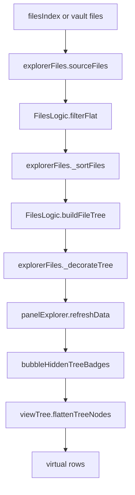

# Wave 2 Files Tree Vertical Spec

## Evidence Read

- Docs: `AGENTS.md`, `docs/current/status`, `docs/current/handoff`, `docs/current/engineering-context`, this taxonomy index, structural taxonomy, and the Explorer data-plane transition PRD.
- Source: `src/index/indexFiles.ts`, `src/providers/explorerFiles.ts`, `src/components/containers/explorerFiles.ts`, `src/components/pages/tabFiles.svelte`, `src/components/containers/panelExplorer.svelte`, `src/services/serviceExplorer.svelte.ts`, `src/services/serviceViews.svelte.ts`, `src/services/serviceSelection.svelte.ts`, `src/services/serviceScroll.ts`, `src/components/views/viewTree.svelte`, `src/logic/logicsFiles.ts`, `src/utils/utilBadgeBubbling.ts`, `src/utils/utilExplorerExpansion.ts`, `src/index/indexNodeCreate.ts`, `src/types/typeContracts.ts`, `src/types/typeNode.ts`, `src/types/typeExplorer.ts`, and `src/types/typeViews.ts`.
- Tests fully read: `test/unit/components/explorerFiles.test.ts`, `test/unit/services/serviceExplorer.test.ts`.
- Tests heading-scanned: `test/component/panelExplorer*.test.ts`, `test/component/viewTree*.test.ts`, `test/unit/services/serviceViews.test.ts`, `test/unit/services/serviceSelection.test.ts`, `test/unit/services/serviceScroll.test.ts`.

## Current Responsibilities

`createFilesIndex` is the flat source index. It publishes `FileNode` records from `vault.getFiles()` or markdown fallback and normalizes basename, path, and extension search text.

`explorerFiles` is more than a provider adapter. It owns file source selection, hidden-file filtering, search, sorting, folder tree construction, per-node decoration, adopted children, context-menu actions, queue actions, rename handoff, and selected-file writes.

`FilesLogic` owns the path-to-folder-tree transform. It computes folder/file ids, depth, prop counts, extension labels, and file/folder parentage.

`panelExplorer` is the current Files surface coordinator and coupling hub. It reads provider trees, manages expansion, selection projection, grid/table/cards routing, scroll reveal commands, badge bubbling, queue hover actions, context menus, keyboard navigation, and view adapter props.

`ViewService` owns the render-layer vocabulary and queue/active-filter semantic matching, but Files still calls it one node at a time during recursive provider decoration. `viewTree` then owns flattening, virtual rows, fallback virtual rows, scroll target consumption, badge rendering, row gestures, box selection, and ARIA tree projection.

## Data Flow

Selection runs separately: view events go through `panelExplorer` into `NodeSelectionService`, then `panelExplorer.commitSelection()` mirrors current selection into `ViewService` and `filterService.setSelectedFiles()` for Files.

Scroll reveal currently travels as `{ id, serial }` from `panelExplorer` to view adapters. `viewTree` resolves the id by scanning the current flat array.

## Target Seams

- Extract a Files structural snapshot before decoration. It should own file source selection, hidden filtering, search, sort, folder tree shape, visible row ids, and lookup maps.
- Replace provider `_decorateTree()` with batched `ViewService.getModel()` over the visible node set or snapshot rows.
- Move badge bubbling out of `panelExplorer` into overlay or snapshot projection so collapsed child state is layer data, not panel-local tree rewriting.
- Add snapshot lookup maps for `nodeId -> row/index`, `path -> nodeId`, and `folderPath -> nodeId`. These maps should support selection pruning and reveal without repeated recursive scans.
- Keep provider action hooks during migration: file open, context menus, rename, delete, move, set/filter hover actions, and queue/FnR command construction.

## Risks

- `explorerFiles` mixes structural and decorative invalidation because `_decorateTree()` consumes queue/filter revisions and writes display fields after structural tree construction.
- `panelExplorer` has repeated recursive scans such as find-by-id, visible ids, parent lookup, and path lookup that should become snapshot maps.
- Selection authority is split: `NodeSelectionService` is canonical, while `ViewService` keeps mirrored selection for render models.
- `TreeNode` is both source hierarchy and render row carrier through `icon`, `badges`, `cls`, `highlights`, and provider `meta`.

## Test Gates

- Snapshot contract: stable ids, visible row order, parent/child maps, path lookup, folder lookup, and revision metadata.
- Invalidation split: queue/filter changes update layers without rebuilding source tree; file/source/search/sort/hidden changes rebuild structure.
- Batch layer parity: new batched `ViewService` output matches old per-node Files decoration.
- Reveal gate: stale id-to-index maps are rejected by revision.
- Collapsed child badges are tested as overlay data, not only panel tree mutation.
- Component compatibility: Files tree renders from a snapshot-backed adapter while existing provider actions and selection still work.

