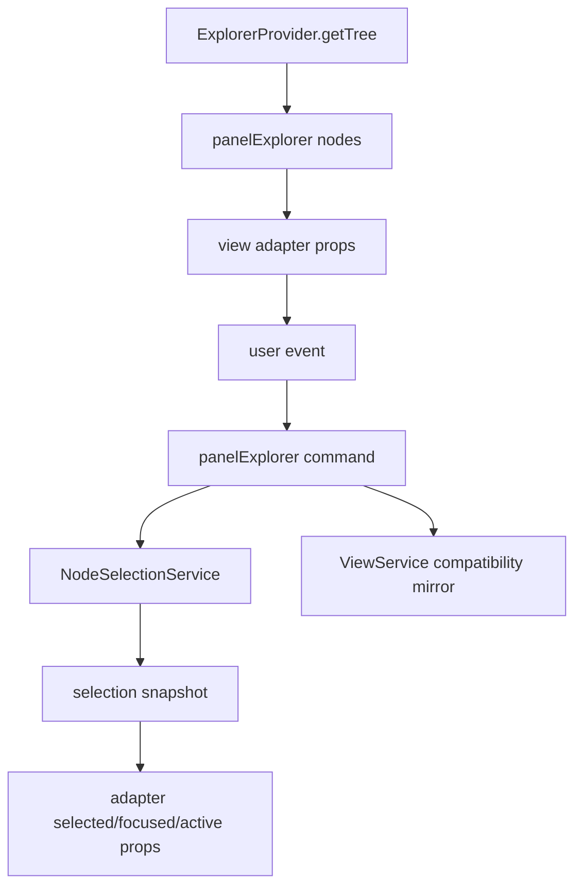

# Wave 2 Selection And Control State Spec

## Evidence Read

- Source fully read: `src/services/serviceSelection.svelte.ts`, `src/types/typeSelection.ts`, `src/services/serviceViews.svelte.ts`, `src/services/serviceNavigation.svelte.ts`, `src/services/serviceMouse.ts`, `src/services/serviceManualDnd.ts`, `src/services/serviceDnd.ts`, `src/services/serviceDndSvelteAdapter.ts`, `src/services/serviceDndAliasAware.ts`, `src/utils/utilExplorerExpansion.ts`, `src/types/typeViews.ts`, `src/types/typeExplorer.ts`, and `src/types/typeNode.ts`.
- Source partially inspected: `panelExplorer.svelte`, `viewTree.svelte`, `ViewNodeGrid.svelte`, `ViewNodeTable.svelte`, `ViewNodeCards.svelte`, `serviceViewTableAdapter.ts`, `utilBadgeBubbling.ts`, `serviceVirtualizer.svelte.ts`, and `typeContracts.ts`.
- Tests scanned: selection, service views, expansion, panel selection, tree, grid, table, and node-selection granularity tests.

## Current Responsibilities

`NodeSelectionService` is the real control-state authority. It owns per-explorer selected ids, live selected map, anchor, focused id, hovered id, and derived active id. It implements pointer, box, arrow, space/range, clear, and prune semantics.

`panelExplorer` is both surface coordinator and control bridge. It reads provider trees, derives visible ids, owns expansion state, grid folder navigation, scroll reveal commands, context selection scoping, provider action dispatch, and selection mirroring into `ViewService`.

`ViewService` owns render models and semantic layers, but it still has legacy per-explorer `selections`, `focused`, and `expanded` stores. That overlaps with `NodeSelectionService`.

View adapters are mostly controlled render/event adapters: they receive selected/focused/active ids and emit semantic events. They also own virtualization, measurement, box selection geometry, scroll-to-id, and local gesture handling.

DnD state is separate. `DndService` owns source/candidate/drop state;
`ManualDndService` wraps it for manual node/workspace behavior; grid currently hosts manual DnD UI state.

## Data Flow

Reveal is also control state: keyboard/page commands create `panelExplorer.scrollTarget { id, serial }`, then adapters find the row, tile, or card index and drive their virtualizer.

## Target Seams

- Create a `SelectionProjection` seam from `NodeSelectionSnapshot` to adapter props: `selectedIds`, `selectedMap`, `focusedId`, and `activeId`.
- Move `visibleNodeIds()` and id lookup maps into the data-plane snapshot so selection range, prune, and reveal use snapshot order instead of panel recomputation.
- Keep adapter-owned virtualization and measurement local, but feed adapters stable row-id-to-index and virtual target maps.
- Replace `ViewService` selection/focus stores with either a read adapter over `NodeSelectionService` or an explicitly deprecated compatibility mirror.
- Treat expansion, grid location, and reveal as control snapshot inputs distinct from structural node data.
- Keep DnD source/candidate state outside structural snapshots; project only `dragging` and `dropTarget` row state into adapters.

## Risks

- Double selection authority can drift between `NodeSelectionService` and `ViewService`.
- `panelExplorer` owns too many responsibilities: source refresh, control state, selection side effects, grid navigation, provider action dispatch, and badge bubbling.
- Control changes can trigger data refresh paths indirectly through `showSelectedOnly`, provider subscriptions, and selection mirroring.
- `activeId = focusedId ?? hoveredId` exists in the service, but hover is not consistently wired across inspected adapters.
- Table has local sorting state separate from data-plane/snapshot sort metadata.
- Grid manual DnD mutates local `nodes` order after drop; this is not durable provider or data-plane structure.

## Test Gates

- Gate that `ViewService` compatibility mirror cannot diverge from `NodeSelectionService`, or remove the mirror behind an adapter.
- Snapshot-order tests for range selection after search, sort, expansion, and view-mode changes.
- Reveal-by-id stale-index tests using revisioned snapshot maps.
- Hover/active-id component tests across tree, grid, table, and cards.
- DnD control projection tests for dragging/drop-target state independent from structural rows.
- Grid manual reorder persistence and data-plane boundary tests.
- Cross-view selection persistence gate: tree to grid to table to cards with the same ids, focus, and active node preserved.

