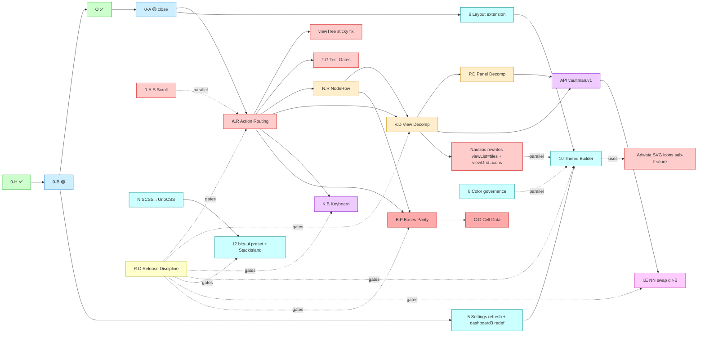

# Dependency Graph

Mermaid diagram + per-edge rationale. Reads como la versión visual del release pipeline.

## Diagram



## Per-edge rationale

### Phase 0 chain (locked)
- `0-H → 0-B → O → 0-A`: locked en roadmap. 0-A close = prereq de TODO downstream porque
  define ViewHost shell + NodeElementMask + View Feature Contract que el merge consume.

### v1.1.0 cluster (Explorer Hardening)
- `0-A → A.R`: A.R consumes el View Feature Contract extendido por 0-A
- `A.R → Tree sticky fix`: tree sticky-parent + caret + kbd consume action routing
- `0-A.S parallel`: sibling, no bloquea A.R; corre concurrente con otro agente
- `A.R → T.G`: T.G testea el contract definido por A.R; TDD red-green durante A.R

### v1.2.0 cluster (Architecture cleanup)
- `A.R → N.R`: N.R primitive incorporates action handlers from A.R via context
- `A.R + N.R → V.D`: view shells delegan a action routing + embed NodeRow primitive
- `V.D → P.D`: panel orchestrator extraction post-decomposition de views

### v1.3.0 cluster (Keyboard + Public API)
- `V.D + P.D → API`: clean architecture pre-req antes de exposar public surface
- `A.R → K.B`: row keyboard contract delega a workspace-wide keyboard provider

### v1.4.0 cluster (Nautilus rewrites)
- `V.D → Nautilus`: views as shells permite swap del implementation interno sin tocar A.R
- `Adwata sub-feature of 10`: Adwata SVG icons son sub-feature del Theme Builder (acceso via
  Settings). Adwata standalone NO ships en v1.4.0 — solo Nautilus rewrites usan icons que el
  Theme Builder gestionará en v1.5.0.

### v1.5.0 cluster (Theme Builder + Layout)
- `0-A + 0-B → L5/L6`: 5 + 6 son consumers de la theme token layer (0-B) y del view-host (0-A)
- `L5 + L6 → 10 (Theme Builder)`: Theme Builder access vía Settings refresh (5) y consumes
  Layout extension primitives (6)
- `8 parallel`: color governance es independent, can ship en v1.5.0 sin bloquear 10
- `Nautilus parallel`: ya en v1.4.0, en v1.5.0 solo si extensions needed

### v1.6.0 cluster (Design system migration)
- `N → 12`: SCSS→UnoCSS migración prereq de bits-ui adoption (roadmap line 58)
- `12 includes StackIsland adoption`

### v1.7.0 cluster (NN Interop)
- `API → I.E`: I.E requires stable public API exposed first

### v2.0.0 cluster (Bases Parity BREAKING)
- `A.R + N.R → B.P`: B.P refactor viewTable + viewCards depende de behaviors unified + row primitive
- `B.P → C.D`: cell data semantics depende de namespaced property IDs de B.P
- ⚠️ BREAKING: property IDs `prop:area → prop.note.area` — requires migration shim para
  user-saved bases/filters

### Cross-cutting R.D
- R.D gates every release. Each version bump requires:
  - CHANGELOG section moved from `[Unreleased]` to `[vX.Y.0]`
  - SemVer tag created via `npm run version`
  - manifest.json + versions.json bump
  - sandbox pushed to origin/sandbox antes del merge
  - main merge via AI-files-strip pipeline
  - GitHub Release published

## Critical path

The longest chain (cannot parallelize):

```
0-A (close, in-flight) → A.R → V.D → API → I.E
                            ↘ B.P → C.D (v2.0.0 BREAKING)
```

That's 6 sequential sub-systems. Estimated effort:
- 0-A: ~14-20 sessions (per its own plan)
- A.R: 8-12 commits, ~6-10 sessions
- V.D: 12-18 commits, ~10-14 sessions
- API: 4-6 commits, ~3-5 sessions
- I.E: 6-10 commits, ~5-7 sessions
- B.P → C.D: 18-27 commits combined, ~14-20 sessions

Parallel opportunities:
- 0-A.S can run concurrent con A.R (different files)
- T.G can run concurrent con A.R (TDD red-green)
- N.R can start once A.R contract is defined (not finished)
- P.D can start once V.D milestone 1 lands (panel host extraction)
- K.B + API can overlap (API delivers namespace, K.B delivers content)
- N + 12 prep can begin once V.D lands (independent of API/I.E track)
- L5 + L6 + 8 + 10 mostly independent of refactor track

## Bottlenecks

1. **A.R is THE critical bottleneck** — bloquea V.D, K.B, B.P, T.G. First detail spec target.
2. **V.D 12-18 commits** — largest sub-system. Slice por view (viewTree → viewList → viewTable → viewGrid → viewCards) recomendado.
3. **B.P breaking property IDs** — requires user-data migration shim. v2.0.0 release con
   careful changelog + breaking notice.

## Parallel agent strategy

Per AGENTS.md "agent dispatch reference" pattern: cada sub-system puede ser ejecutado por
un agente IA dedicado con pre-reads suficientes. Sugerencia post-umbrella:

- **Agente W — A.R**: spec + plan + impl (v1.1.0)
- **Agente X — 0-A.S**: existing scroll repair + harness (paralelo con W)
- **Agente Y — T.G**: write invariant tests primero (TDD red), W los hace verde
- **Agente Z — viewTree sticky fix**: focused fix paralelo a W

Post-v1.1.0:
- **Agente A — V.D**: cinco slices, una per view, secuencial o paralelo por view
- **Agente B — P.D**: post-V.D milestone 1
- **Agente C — N.R primitive**: una vez A.R contract defined
