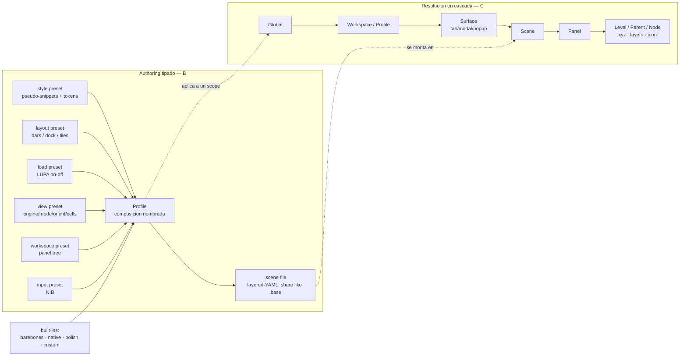
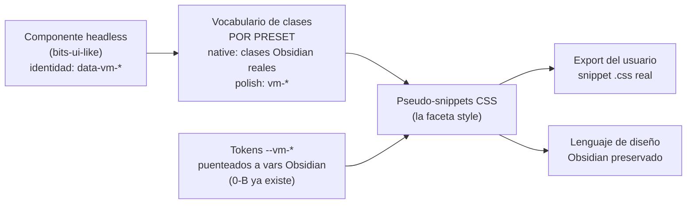

# PSS — Modelo en discusión (grill 2026-06-10, EN CURSO)

Snapshot visual del PSS grill. NO es decisión final: registra el estado de la conversación dev ↔ agente. Fuente de las decisiones cerradas:
[[../01-locked-decisions-grill|shard 01]] (se actualizará al cerrar el grill).

## Sources

- [megadump MD-L3/G1 (PSS=presets+queued batcher; .scene)](../../../../work/draft/2026-06-03-onenote-companion-architecture-megadump/01-triage-classification.md)
- [CR-2 (.scene = layered-YAML; payload pendiente de PSS)](../../../../work/draft/2026-06-03-onenote-companion-architecture-megadump/decisions/CR-2-scene-format.md)
- [glossary — Presets/PSS terms + barebones/native/polish + Workspace-profile](../../../../architecture/glossary.md)
- [whiteboard Node Distribution (xyz/layers persistence)](../02-node-distribution-presentation-model.md)
- [proto v12 shard 04 (viewSnapshot/panelCfg/parentViews)](../../../research/2026-05-29-version-streams-vertical-codebase-analysis/04-proto-design-v12-vertical-read.md)

## Modelo: authoring tipado (B) + resolución en cascada (C)

Decisión del dev (2026-06-10): B con la razón de C — facetas tipadas para autoría y validación; la RESOLUCIÓN entre scopes es una cascada de overrides (el más específico gana), como CSS. "C dentro de B".

## Pipeline de estilo (bits-ui headless + pseudo-snippets)

Requisito del dev: componentes/primitives se comportan como bits-ui (mínimo o cero estilo propio); TODO el estilo = pseudo-snippets (CSS exportable a snippets reales del usuario) → se preserva el lenguaje de diseño de Obsidian y se evita que agentes IA generen UI fuera de lenguaje.

## Estrategias de clases (en evaluación — pregunta abierta)

| # | Estrategia | Evidencia | Estado |
| --- | --- | --- | --- |
| 1 | Prefijo propio `vm-` en todo (`vaultman-` legacy en stable) | sandbox actual | statu quo |
| 2 | Clases nativas Obsidian directas | stable 1.1 (bases-*, nav-*; SDF-011) | probada en producción; frágil sin registry |
| 3 | Dual-class por preset (vm-* siempre + vocabulario inyectado) | 0-A native class emission | parcialmente existente |
| 4 | data-attrs identidad (`data-vm-*`, estilo bits-ui) + clases solo de vocabulario | bits-ui data-attrs | propuesta recomendada (4+3) |

## Estado del grill

| Punto | Estado | Registro |
| --- | --- | --- |
| Modelo composición B+C ("C dentro de B") | confirmado dev | pendiente de volcar a shard 01 al cierre |
| bits-ui headless + pseudo-snippets como ley de estilo | confirmado dev | idem |
| shadcn: componentes deseados en versión no-opinionada para UPV | confirmado dev | idem |
| Estrategia de clases (4+3 + índice vs app.css web-lab) | propuesta, sin confirmar | pregunta en curso |
| Matriz faceta × scope | borrador, sin confirmar | pregunta siguiente |
| Payload `.scene` (CR-2) | pendiente | post-matriz |
| Queued batcher semantics | pendiente | post-matriz |
